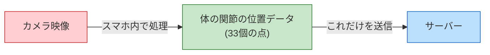

# プロジェクト概要 v1.0

**バージョン**: 1.0
**最終更新日**: 2025年12月9日
**対象**: AIフィットネスアプリ（共通仕様）
**基準**: Expo版要件定義書 v1.0

---

## 目次

1. [プロジェクト概要](#1-プロジェクト概要)
2. [ターゲットユーザー](#2-ターゲットユーザー)
3. [市場分析](#3-市場分析)
4. [差別化ポイント](#4-差別化ポイント)
5. [対象種目](#5-対象種目)

---

## 1. プロジェクト概要

### 1.1 プロジェクト名

**AIフィットネスアプリ（仮称）**

### 1.2 アプリの目的

**AIフィットネスアプリ**は、スマートフォンのカメラを使って、トレーニングフォーム（体の動かし方）が正しいかどうかをチェックしてくれるアプリです。

#### なぜこのアプリが必要なのか？

自宅でトレーニングをする人が増えていますが、以下のような問題があります：

| 問題 | このアプリでの解決方法 |
|-----|---------------------|
| フォームが正しいかわからない | カメラでリアルタイムにチェック |
| パーソナルトレーナーは高い | 月額500円で利用可能 |
| ジムに通う時間がない | いつでもどこでもスマホ1台で |
| 続けるモチベーションが保てない | 記録が残ってグラフで見える |

#### このアプリでできること

- スマホのカメラで体の動きをチェック
- 音声で「もう少し深くしゃがんでみて」などのアドバイス
- トレーニングの記録を保存
- カレンダーやグラフで自分の成長を確認

#### このアプリでできないこと（大事な注意点）

| できないこと | 理由 |
|------------|------|
| 病気やケガの診断 | お医者さんではありません |
| 絶対にケガしない保証 | あくまで参考情報です |
| 必ず痩せる・筋肉がつく保証 | 効果は人それぞれです |
| リハビリのサポート | 医療行為はできません |

**大切なこと**: このアプリはあくまで「参考情報」を提供するものです。体に不安がある場合は、必ずお医者さんや専門家に相談してください。

### 1.3 技術的特徴

#### オンデバイス処理によるプライバシー保護



**安心ポイント**: カメラで撮った映像そのものは、スマートフォンの外には一切出ません。AIが検出した「体の関節の位置（点のデータ）」だけがサーバーに送られます。

---

## 2. ターゲットユーザー

### 2.1 メインターゲット

| 対象 | 特徴 |
|-----|------|
| 年齢 | 13歳以上（日本）、16歳以上（ヨーロッパ） |
| 運動経験 | 初心者〜中級者 |
| 目的 | 健康維持、ダイエット、筋トレ |
| 場所 | 自宅でトレーニングしたい人 |

### 2.2 18歳未満の人へ

18歳未満の方がこのアプリを使う場合は、保護者（お父さん、お母さんなど）の同意が必要です。

### 2.3 こんな人におすすめ

- ジムに通う時間やお金がない人
- 正しいフォームを知りたい初心者
- トレーニングの記録を残したい人
- 自分のペースで運動したい人

---

## 3. 市場分析

### 3.1 市場概要

#### フィットネスアプリ市場の現状と将来予測

フィットネスアプリ市場は、スマートフォンの普及と健康意識の高まりにより、急速に成長しています。

| 年度 | 市場規模 | 備考 |
|------|---------|------|
| **2024年** | 約1.5兆円 | 現在の市場規模 |
| **2034年予測** | 約7兆円 | 10年後の予測 |
| **年間成長率** | 16.8% | CAGR（年平均成長率） |

#### 市場成長の要因

1. **コロナ後の健康意識の高まり**
   - 自宅でのトレーニング需要が増加
   - ジムに通えない人向けの代替手段として人気

2. **スマートフォンの高性能化**
   - カメラ性能の向上により、姿勢検出が可能に
   - AI処理がスマホ上で実行できるように

3. **AIテクノロジーの進化**
   - 機械学習モデルの軽量化
   - リアルタイム処理の実現

4. **サブスクリプションモデルの浸透**
   - 月額課金への抵抗感の低下
   - 継続利用しやすい価格設定

#### 日本市場の特徴

- 健康・フィットネスへの関心が高い
- プライバシーへの意識が強い
- 日本語対応アプリへのニーズが大きい
- 品質や使いやすさを重視する傾向

### 3.2 主要競合アプリ

#### 競合比較表

| アプリ名 | 姿勢検出 | 価格 | 日本語対応 | 主な特徴 |
|----------|---------|------|-----------|---------|
| **Tempo Studio** | あり（3Dセンサー） | 30万円以上（機器代） | なし | 専用機器が必要 |
| **Kaia Health** | あり（カメラ） | 基本無料 | なし | 医療向け、腰痛対策 |
| **Freeletics** | 限定的 | 月額1,200円 | 一部あり | AI コーチング |
| **Nike Training Club** | なし | 無料 | あり | 動画ガイド中心 |
| **Sportip Pro** | あり | 月額6,800円〜 | あり | B2B向け（法人向け） |

---

## 4. 差別化ポイント

本アプリが競合と差別化できる4つの強みを説明します。

### 4.1 差別化ポイント一覧

| No. | 差別化ポイント | 説明 |
|-----|--------------|------|
| 1 | 日本語完全対応のリアルタイム姿勢検出 | 日本市場向けに最適化 |
| 2 | スマホだけで完結（低コスト） | 専用機器不要 |
| 3 | 5種目特化で高精度 | 広く浅くではなく狭く深く |
| 4 | プライバシー最優先（オンデバイス処理） | カメラ映像をサーバーに送らない |

### 4.2 詳細説明

#### 1. 日本語完全対応のリアルタイム姿勢検出

**競合との比較**:
- Tempo Studio、Kaia Health、Freeletics は日本語非対応または一部対応
- Nike Training Club は日本語対応だが姿勢検出機能がない
- Sportip Pro は日本語対応＋姿勢検出だがB2B向け

**本アプリの強み**:
- UI（画面表示）が完全日本語
- 音声ガイダンスも日本語
- エラーメッセージや説明も日本語
- リアルタイムで姿勢をチェックして参考情報を提供

**なぜ重要か**:
日本のユーザーは、英語のアプリを避ける傾向があります。特にトレーニング中は、日本語での音声ガイダンスがあると理解しやすく、安心して続けられます。

#### 2. スマホだけで完結（低コスト）

**競合との比較**:
| アプリ | 必要なもの | 初期費用 |
|--------|----------|---------|
| Tempo Studio | 専用ミラー＋センサー | 30万円以上 |
| 本アプリ | スマートフォンのみ | 0円（アプリは月額500円） |

**本アプリの強み**:
- すでに持っているスマホのカメラを使用
- 追加の機器購入は不要
- 月額500円と手軽な価格設定
- 1週間の無料トライアル付き

**なぜ重要か**:
高額な機器を買わなくても、お手持ちのスマホで始められます。「ちょっと試してみたい」という気軽な気持ちで始められるので、フィットネス初心者にもおすすめです。

#### 3. 5種目特化で高精度

**対象種目**:
1. スクワット
2. プッシュアップ
3. アームカール
4. サイドレイズ
5. ショルダープレス

**競合との比較**:
| アプリ | 種目数 | 精度 |
|--------|-------|------|
| Freeletics | 100種目以上 | 姿勢検出なし |
| 本アプリ | 5種目 | 高精度な姿勢検出 |

**本アプリの強み**:
- 5種目それぞれに専用のアルゴリズムを開発
- 種目ごとの細かいポイントをチェック
- 例：スクワットでは膝の角度、背中の傾き、重心位置などを確認

**なぜ重要か**:
「広く浅く」ではなく「狭く深く」というアプローチです。5種目に絞ることで、それぞれの種目で本当に大切なポイントを正確にチェックできます。この5種目は筋トレの基本となる重要な種目です。

#### 4. プライバシー最優先（オンデバイス処理）

**技術的な仕組み**:

```
[従来のアプリ]
カメラ映像 → インターネット → サーバーで処理 → 結果を返す
（映像がサーバーに送られる = プライバシーリスク）

[本アプリ]
カメラ映像 → スマホ内で処理 → 結果を表示
（映像がスマホから出ない = プライバシー安全）
```

**競合との比較**:
| アプリ | 処理方式 | カメラ映像の扱い |
|--------|---------|----------------|
| 一部の競合アプリ | サーバー処理 | サーバーに送信される可能性 |
| 本アプリ | オンデバイス処理 | スマホから一切出ない |

**本アプリの強み**:
- MediaPipeという技術を使い、スマホ上だけで姿勢を検出
- カメラで撮影した映像はサーバーに送信されない
- 骨格データ（体の関節の位置情報のみ）だけを保存
- GDPR（ヨーロッパのプライバシー法）にも完全対応

**なぜ重要か**:
自宅でトレーニングする映像は、とてもプライベートなものです。その映像がインターネットを通じてどこかに送られるのは不安ですよね。本アプリでは、カメラ映像は一切外部に送られません。安心してトレーニングに集中できます。

---

## 5. 対象種目

### 5.1 MVP版で提供する5種目

本アプリでは、MediaPipe（体の動きを検出するAI）で測りやすい5種目に特化しています。ダンベルあり・なし両方の種目を含め、他のサービスとの差別化を図っています。

| 種目名 | ダンベル | 難易度 | 主に鍛える部位 | カメラ向き |
|--------|----------|--------|----------------|-----------|
| スクワット | なし | 初級 | 太もも、お尻 | 横向き |
| プッシュアップ | なし | 初級 | 胸、腕 | 横向き |
| アームカール | あり | 初級 | 腕（上腕二頭筋） | 正面 |
| サイドレイズ | あり | 中級 | 肩 | 正面 |
| ショルダープレス | あり | 中級 | 肩、腕 | 正面 |

### 5.2 種目選定の理由

1. **MediaPipeで高精度に検出可能**: 骨格検出がしやすい動き
2. **基本的な筋トレ種目**: 初心者から中級者まで幅広く使える
3. **ダンベルあり・なしの両方**: 器具の有無に関わらず利用可能
4. **差別化ポイント**: ダンベル種目を含むことで他サービスとの違いを明確化

---

## 変更履歴

| バージョン | 日付 | 変更内容 |
|-----------|------|----------|
| 1.0 | 2025年12月9日 | 初版作成（Expo版要件定義書v1.0をベースに共通仕様書として統合） |

---

**作成者**: Documentation Engineer
**最終確認日**: 2025年12月9日
