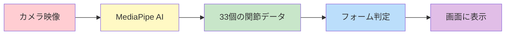
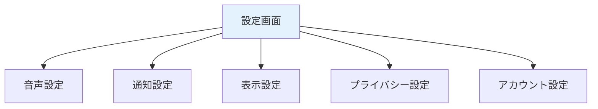

# 機能要件 v1.0

**バージョン**: 1.0
**最終更新日**: 2025年12月9日
**対象**: AIフィットネスアプリ（共通仕様）
**基準**: Expo版要件定義書 v1.0

---

## 目次

1. [機能要件概要](#1-機能要件概要)
2. [Phase構成](#2-phase構成)
3. [認証機能](#3-認証機能)
4. [プロフィール機能](#4-プロフィール機能)
5. [トレーニング機能](#5-トレーニング機能)
6. [記録・履歴機能](#6-記録履歴機能)
7. [設定機能](#7-設定機能)
8. [通知機能](#8-通知機能)
9. [ヘルプ機能](#9-ヘルプ機能)
10. [GDPR対応機能](#10-gdpr対応機能)
11. [データ収集機能](#11-データ収集機能)
12. [サポート機能](#12-サポート機能)
13. [課金機能](#13-課金機能)
14. [管理者機能](#14-管理者機能)

---

## 1. 機能要件概要

### 1.1 機能要件とは

このアプリが「何ができるか」を定義したものです。全部で38の機能要件（FR-001〜FR-038）があります。

### 1.2 機能カテゴリ

| カテゴリ | 説明 | 主な機能 |
|---------|------|----------|
| 認証 | アカウントの作成・ログイン | メール認証、Google認証、Apple認証 |
| プロフィール | 自分の情報を管理 | 運動経験、性別、目標、生年月日、身長・体重 |
| トレーニング | 実際に運動する | カメラでフォームチェック、音声アドバイス |
| 記録・履歴 | 運動の記録を見る | カレンダー、グラフ、詳細履歴 |
| 設定 | アプリの設定を変える | 通知、音声、プライバシー設定 |
| 通知 | お知らせを受け取る | トレーニングのリマインダー |
| GDPR対応 | データ保護 | 同意管理、データ削除、データダウンロード |
| 課金 | 有料プランの購入 | サブスクリプション管理、決済 |
| 管理者 | 運営者向け機能 | ユーザー管理、利用状況集計 |

---

## 2. Phase構成

このアプリは段階的に開発されます：

| フェーズ | 期間 | 内容 |
|---------|------|------|
| Phase 1 | 0〜2ヶ月目 | 基盤作り（認証、プロフィール）※無料トライアル終了後の課金導線を見越して設計 |
| Phase 2 | 2〜7ヶ月目 | メイン機能（トレーニング、記録、設定） |
| Phase 3 | 8ヶ月目以降 | Apple認証・課金機能（Stripe）の実装 |
| Phase 4 | 将来 | 管理者・運用者機能、多言語対応など |

---

## 3. 認証機能

ログインやアカウント作成に関する機能です。

### FR-001: メールアドレス/パスワード認証

| 項目 | 内容 |
|------|------|
| **ID** | FR-001 |
| **カテゴリ** | 認証 |
| **機能名** | メールアドレス/パスワード認証 |
| **説明** | メールアドレスとパスワードでアカウントを作成し、ログインできる機能。パスワードは8文字以上128文字以下で、英字・数字を混ぜる必要があります（記号は不要）。 |
| **実装状況** | 実装済み |
| **Phase** | Phase 1 |

**もっと詳しく**:
- 新しくアカウントを作る時は、メールアドレスとパスワードを入力します
- パスワードは8文字以上128文字以下で、英字・数字を混ぜる必要があります
- 登録したメールアドレスに確認メールが届きます
- 確認メールをクリックしなくてもアプリを利用できます（メール認証は任意）

**メール確認が必要な操作**:
ただし、以下の操作にはメールアドレスの確認が必要です:
- パスワードのリセット
- 有料プランへの課金（Stripe決済）
- データのダウンロード（GDPR対応）

これらの操作を行おうとした際に、メールが未確認の場合は「メールアドレスを確認してください」という案内が表示され、確認メールを再送信できます。

---

### FR-015: Google認証

| 項目 | 内容 |
|------|------|
| **ID** | FR-015 |
| **カテゴリ** | 認証 |
| **機能名** | Google認証 |
| **説明** | Googleのアカウントでログインできる機能。 |
| **実装状況** | 一部実装 |
| **Phase** | Phase 1 |

**もっと詳しく**:
- すでに持っているGoogleアカウントでログインできます
- 新しいパスワードを覚える必要がありません
- ワンタップで簡単にログインできます

---

### FR-015-1: Apple認証

| 項目 | 内容 |
|------|------|
| **ID** | FR-015-1 |
| **カテゴリ** | 認証 |
| **機能名** | Apple認証 |
| **説明** | Apple IDでログインできる機能。 |
| **実装状況** | 未実装 |
| **Phase** | Phase 3 |

**もっと詳しく**:
- すでに持っているApple IDでログインできます
- iPhoneユーザーにとって便利なログイン方法です
- この機能はPhase 3で課金機能と同時に実装予定です
- App Storeの審査要件として、ソーシャルログインを提供する場合はApple認証も必須となるため、課金機能と同時実装が効率的です

---

## 4. プロフィール機能

自分の情報を管理する機能です。

### FR-002: プロフィール管理

| 項目 | 内容 |
|------|------|
| **ID** | FR-002 |
| **カテゴリ** | プロフィール |
| **機能名** | プロフィール管理 |
| **説明** | 運動経験、性別、目標、生年月日、身長・体重などの情報を登録・編集できる機能。 |
| **実装状況** | 一部実装 |
| **Phase** | Phase 1 |

**もっと詳しく**:

登録できる項目:
| 項目 | 説明 |
|------|------|
| 運動経験 | 初心者、中級者、上級者など |
| 性別 | 男性、女性、その他、回答しない |
| 目標 | ダイエット、筋力アップ、健康維持など |
| 生年月日 | 年齢に合わせたアドバイスのため |
| 身長・体重 | より正確なフォームチェックのため |

- これらの情報はいつでも変更できます
- 入力は任意の項目もあります

---

### FR-002-1: 同意状態管理機能

| 項目 | 内容 |
|------|------|
| **ID** | FR-002-1 |
| **カテゴリ** | プロフィール |
| **機能名** | 同意状態管理機能 |
| **説明** | 利用規約やプライバシーポリシーに同意したかどうかを確認・管理できる機能。同意を取り消すとログアウトされる。 |
| **実装状況** | 一部実装 |
| **Phase** | Phase 1 |

**もっと詳しく**:
- アプリを使うには、利用規約とプライバシーポリシーへの同意が必要です
- 同意した内容はいつでも確認できます
- もし同意を取り消したい場合は、アプリからログアウトされます

---

## 5. トレーニング機能

実際にトレーニングを行う時の機能です。

### FR-003: 種目選択

| 項目 | 内容 |
|------|------|
| **ID** | FR-003 |
| **カテゴリ** | トレーニング |
| **機能名** | 種目選択 |
| **説明** | MVP版では5種目から選べる機能。他のサービスとの違いを出すためにダンベル種目も含め、MediaPipeで計測しやすい種目を選んでいます。 |
| **実装状況** | 未実装 |
| **Phase** | Phase 2 |

**もっと詳しく**:

選べる5つの種目（ダンベルあり・なし両方含む）:
| 種目名 | ダンベル | 難易度 | 主に鍛える部位 |
|--------|----------|--------|----------------|
| スクワット | なし | 初級 | 太もも、お尻 |
| プッシュアップ | なし | 初級 | 胸、腕 |
| アームカール | あり | 初級 | 腕（上腕二頭筋） |
| サイドレイズ | あり | 中級 | 肩 |
| ショルダープレス | あり | 中級 | 肩、腕 |

**ポイント**: MediaPipe（体の動きを検出するAI）で測りやすい種目をピックアップしています。

---

### FR-003-1: 種目詳細画面

| 項目 | 内容 |
|------|------|
| **ID** | FR-003-1 |
| **カテゴリ** | トレーニング |
| **機能名** | 種目詳細画面 |
| **説明** | 選んだ種目の詳しい情報、おすすめのカメラの向き、前回の記録、目標設定を表示する画面。 |
| **実装状況** | 未実装 |
| **Phase** | Phase 2 |

**もっと詳しく**:
- 種目を選ぶと、その種目の詳しい情報が表示されます
- カメラをどの角度に置くと良いかのアドバイスがあります
- 前回トレーニングした時の記録も確認できます
- 今日の目標（回数や時間）を設定できます

---

### FR-004: フォーム確認補助（MediaPipe）

| 項目 | 内容 |
|------|------|
| **ID** | FR-004 |
| **カテゴリ** | トレーニング |
| **機能名** | フォーム確認補助（MediaPipe） |
| **説明** | スマホのカメラで体の動きをリアルタイムで検出し、フォームが正しいか確認を手伝う機能。カメラ映像は外部に送られず、スマホの中だけで処理される。 |
| **実装状況** | 未実装 |
| **Phase** | Phase 2 |

**もっと詳しく**:
- カメラで撮影しながら、AIが体の33個の関節の位置を検出します
- リアルタイムで画面に骨格（棒人間のような線）が表示されます
- フォームが正しいかどうかを判定して、アドバイスを表示します
- **プライバシー保護**: 映像はスマホの外には一切送信されません

**技術検証（PoC）について**:
MediaPipeのExpo/React Native環境での統合は技術的な課題があるため、Phase 2の開始前に技術検証（PoC: Proof of Concept）を実施します。この検証では以下を確認します:
- Development Buildでの動作確認
- 30fps以上のフレームレートが達成できるか
- iOS/Android両方での動作確認

もしMediaPipeが期待通り動作しない場合は、TensorFlow.jsを代替手段として検討します。

---

### FR-004-1: カメラ設定自動開始機能

| 項目 | 内容 |
|------|------|
| **ID** | FR-004-1 |
| **カテゴリ** | トレーニング |
| **機能名** | カメラ設定自動開始機能 |
| **説明** | カメラの位置を合わせたら、「3...2...1...スタート!」と自動でトレーニングが始まる便利機能。 |
| **実装状況** | 未実装 |
| **Phase** | Phase 2 |

**もっと詳しく**:
- カメラの位置を合わせたら、「3...2...1...スタート!」と自動で始まります
- 準備ができたらボタンを押すだけでOK
- カウントダウン中に位置を調整する時間があります

**追加機能**:
- トレーニング中にカメラで体が認識できなくなった場合、一時停止となり、再度体が認識されると自動的に再開します。一定時間（30秒）認識できない場合は、セッションを終了するかどうかの確認ダイアログが表示されます。

---

### FR-005: 音声フィードバック

| 項目 | 内容 |
|------|------|
| **ID** | FR-005 |
| **カテゴリ** | トレーニング |
| **機能名** | 音声フィードバック |
| **説明** | トレーニング中に音声で参考情報を教えてくれる機能。「参考:もう少し深くしゃがんでみてください」など。 |
| **実装状況** | 未実装 |
| **Phase** | Phase 2 |

**もっと詳しく**:
- 画面を見なくても、音声でアドバイスを聞けます
- 「参考:膝がつま先より前に出ています」などのアドバイス
- 回数のカウントも音声で教えてくれます
- 音量や読み上げ速度は設定で変更できます

---

### FR-005-1: トレーニング進捗表示

| 項目 | 内容 |
|------|------|
| **ID** | FR-005-1 |
| **カテゴリ** | トレーニング |
| **機能名** | トレーニング進捗表示 |
| **説明** | トレーニング中に回数、時間、進捗バーを表示する機能。YouTubeの動画再生バーのように全体の進捗がひと目でわかり、リアルタイムで更新されます。 |
| **実装状況** | 未実装 |
| **Phase** | Phase 2 |

**もっと詳しく**:

表示される情報:
| 表示項目 | 説明 |
|----------|------|
| 回数 | 今何回目かをリアルタイムで表示 |
| 時間 | 経過時間または残り時間を表示 |
| 進捗バー | YouTube風の全体進捗バー |

- 進捗バーはリアルタイムで更新されます
- 目標に対してどれくらい進んでいるかがひと目でわかります

---

## 6. 記録・履歴機能

トレーニングの記録を保存・確認する機能です。

### FR-007: トレーニング記録保存

| 項目 | 内容 |
|------|------|
| **ID** | FR-007 |
| **カテゴリ** | 記録 |
| **機能名** | トレーニング記録保存 |
| **説明** | トレーニングの記録（種目、回数、時間など）をデータベースに保存する機能。トレーニング終了時に結果が表示され、メモも入力できます。 |
| **実装状況** | 未実装 |
| **Phase** | Phase 2 |

**もっと詳しく**:

保存される情報:
- やった種目（スクワットなど）
- 回数（何回やったか）
- 時間（何分間やったか）
- 日時（いつやったか）
- メモ（自分で入力した感想など）

**トレーニング終了時の画面**:
- 上記の記録が表示されます
- 感想や気づいたことをメモとして入力できます
- 保存ボタンを押すと記録が保存されます

---

### FR-008: カレンダー表示

| 項目 | 内容 |
|------|------|
| **ID** | FR-008 |
| **カテゴリ** | 履歴 |
| **機能名** | カレンダー表示 |
| **説明** | トレーニング履歴をカレンダー形式で表示し、運動した日にマークがつく機能。 |
| **実装状況** | 未実装 |
| **Phase** | Phase 2 |

**もっと詳しく**:
- カレンダーを見れば、どの日に運動したかが一目でわかります
- 運動した日にはマーク（点や色）がつきます
- 連続して運動した日数も確認できます

---

### FR-009: グラフ表示

| 項目 | 内容 |
|------|------|
| **ID** | FR-009 |
| **カテゴリ** | 履歴 |
| **機能名** | グラフ表示 |
| **説明** | 過去7日間のトレーニング時間や、30日間の頻度をグラフで表示する機能。 |
| **実装状況** | 未実装 |
| **Phase** | Phase 2 |

**もっと詳しく**:

表示されるグラフ:
| グラフの種類 | 内容 |
|--------------|------|
| 7日間の運動時間 | 1週間でどれくらい運動したか |
| 30日間の運動頻度 | 1ヶ月間で何日運動したか |

---

### FR-010: セッション詳細表示

| 項目 | 内容 |
|------|------|
| **ID** | FR-010 |
| **カテゴリ** | 履歴 |
| **機能名** | セッション詳細表示 |
| **説明** | 過去のトレーニングの詳細（種目、日時、時間、回数、メモなど）を見られる機能。 |
| **実装状況** | 未実装 |
| **Phase** | Phase 2 |

**もっと詳しく**:
- 過去のトレーニング1つ1つの詳しい情報を見られます
- どの種目を何回やったかがわかります
- トレーニング終了時に入力したメモも確認できます
- 良かった点や改善点も確認できます

---

## 7. 設定機能

アプリの動作を自分好みに変える機能です。

### FR-011: 通知設定

| 項目 | 内容 |
|------|------|
| **ID** | FR-011 |
| **カテゴリ** | 設定 |
| **機能名** | 通知設定 |
| **説明** | リマインダー通知のON/OFF、時刻、頻度を設定できる機能。 |
| **実装状況** | 未実装 |
| **Phase** | Phase 2 |

**もっと詳しく**:
- トレーニングの時間になったらお知らせを受け取るかどうかを選べます
- 何時にお知らせが欲しいかを設定できます
- 毎日、週に何回などの頻度を選べます

---

### FR-012: 音声設定

| 項目 | 内容 |
|------|------|
| **ID** | FR-012 |
| **カテゴリ** | 設定 |
| **機能名** | 音声設定 |
| **説明** | 音声フィードバックのON/OFF、音量、読み上げ速度を調整できる機能。 |
| **実装状況** | 未実装 |
| **Phase** | Phase 2 |

**もっと詳しく**:
- 音声アドバイスをON/OFFできます
- 音量を調整できます
- 読み上げの速さを変えられます（ゆっくり〜速め）

---

### FR-013: 言語設定

| 項目 | 内容 |
|------|------|
| **ID** | FR-013 |
| **カテゴリ** | 設定 |
| **機能名** | 言語設定 |
| **説明** | MVP版は日本語のみ対応。将来の多言語対応に備えて、拡張しやすい作りにしています。 |
| **実装状況** | 未実装 |
| **Phase** | Phase 4 |

**もっと詳しく**:
- MVP版は日本語のみです
- 今後、英語などに対応できるように設計しています
- この機能はPhase 4（将来）で追加予定です

---

### FR-014: プライバシー設定

| 項目 | 内容 |
|------|------|
| **ID** | FR-014 |
| **カテゴリ** | 設定 |
| **機能名** | プライバシー設定 |
| **説明** | データ収集の同意状態の確認、同意の取り消し、データダウンロード（PDF形式）、アカウント削除ができる機能。 |
| **実装状況** | 一部実装 |
| **Phase** | Phase 1 |

**もっと詳しく**:

できること:
| 機能 | 説明 |
|------|------|
| 同意状態の確認 | どんなデータ収集に同意しているか確認 |
| 同意の取り消し | データ収集への同意を取り消せる |
| データダウンロード | 自分のデータをPDF形式でダウンロードできる |
| アカウント削除 | アカウントと全データを削除できる |

**データダウンロードについて**:
- PDFファイル形式でダウンロードできます
- 画面のボタンを押すと、スマホに直接ダウンロードされます

**注意**: アカウント削除をリクエストすると、30日間の猶予期間の後に完全に削除されます。

---

### FR-016: 設定管理機能

| 項目 | 内容 |
|------|------|
| **ID** | FR-016 |
| **カテゴリ** | 設定 |
| **機能名** | 設定管理機能 |
| **説明** | 音声、通知、表示、プライバシー、アカウントの設定を一括管理できる機能。 |
| **実装状況** | 未実装 |
| **Phase** | Phase 2 |

**もっと詳しく**:
- すべての設定を1つの画面からアクセスできます
- カテゴリごとに整理されていて見やすいです

設定カテゴリ:

---

## 8. 通知機能

お知らせに関する機能です。

### FR-017: リマインダー通知

| 項目 | 内容 |
|------|------|
| **ID** | FR-017 |
| **カテゴリ** | 通知 |
| **機能名** | リマインダー通知 |
| **説明** | 設定した時刻にトレーニングのリマインダーをプッシュ通知で送る機能。 |
| **実装状況** | 未実装 |
| **Phase** | Phase 2 |

**もっと詳しく**:
- 設定した時刻になると「トレーニングの時間です!」とお知らせが届きます
- 通知をタップするとアプリが開きます
- 通知が不要な場合はOFFにできます

---

## 9. ヘルプ機能

アプリの使い方を学ぶための機能です。

### FR-023: チュートリアル

| 項目 | 内容 |
|------|------|
| **ID** | FR-023 |
| **カテゴリ** | ヘルプ |
| **機能名** | チュートリアル |
| **説明** | 初めてアプリを使う人向けの「使い方ガイド」です。画面をスワイプしながら、トレーニングの始め方やカメラの設置方法など、基本的な操作を学べます。 |
| **実装状況** | 未実装 |
| **Phase** | Phase 2 |

---

## 10. GDPR対応機能

GDPR（ヨーロッパの個人情報保護ルール）に対応する機能です。日本のユーザーも含めて、全員の大切な情報を守るために用意しています。

### FR-024: 同意管理

| 項目 | 内容 |
|------|------|
| **ID** | FR-024 |
| **カテゴリ** | GDPR対応 |
| **機能名** | 同意管理 |
| **説明** | アプリを使う前に「利用規約」と「プライバシーポリシー」を読んで、同意（「はい、わかりました」と承諾すること）する機能です。いつ同意したかも記録されます。 |
| **実装状況** | 一部実装 |
| **Phase** | Phase 1 |

**もっと詳しく**:
- アプリを使うには、利用規約とプライバシーポリシーへの同意が必要です
- 同意した内容はいつでも確認できます
- 同意を取り消す場合は、プライバシー設定から行えます

---

### FR-024-1: ログイン時同意確認機能

| 項目 | 内容 |
|------|------|
| **ID** | FR-024-1 |
| **カテゴリ** | GDPR対応 |
| **機能名** | ログイン時同意確認機能 |
| **説明** | ログインした時に、利用規約などに同意しているかチェックします。もし同意していなければ、同意画面が表示され、同意しないとアプリを使えません。 |
| **実装状況** | 一部実装 |
| **Phase** | Phase 1 |

---

### FR-025: データ削除権

| 項目 | 内容 |
|------|------|
| **ID** | FR-025 |
| **カテゴリ** | GDPR対応 |
| **機能名** | データ削除権 |
| **説明** | 自分のアカウントと、これまで記録したすべてのデータを削除できる機能です。削除をお願いすると、30日間の猶予期間（「やっぱりやめたい」と思った時のための待ち時間）の後、完全に消去されます。 |
| **実装状況** | 一部実装 |
| **Phase** | Phase 1 |

**30日間の猶予期間とは？**

削除をお願いしてからすぐには消えません。これは「やっぱり消したくない！」と思った時に、元に戻せるようにするためです。30日以内なら、削除をキャンセルできます。

---

### FR-025-1: 削除猶予期間のアクセス制御

| 項目 | 内容 |
|------|------|
| **ID** | FR-025-1 |
| **カテゴリ** | GDPR対応 |
| **機能名** | 削除猶予期間のアクセス制御 |
| **説明** | 削除をお願いした後の30日間は、データを見ることはできますが、新しいトレーニングの記録や変更はできなくなります。これは間違って削除した場合に備えるためです。 |
| **実装状況** | 一部実装 |
| **Phase** | Phase 1 |

---

### FR-026: データ訂正権

| 項目 | 内容 |
|------|------|
| **ID** | FR-026 |
| **カテゴリ** | GDPR対応 |
| **機能名** | データ訂正権 |
| **説明** | 自分の情報（名前や身長など）が間違っていたら、いつでも直せる機能です。プロフィール画面から編集できます。 |
| **実装状況** | 一部実装 |
| **Phase** | Phase 1 |

---

### FR-027: データアクセス権

| 項目 | 内容 |
|------|------|
| **ID** | FR-027 |
| **カテゴリ** | GDPR対応 |
| **機能名** | データアクセス権 |
| **説明** | 自分のデータ（トレーニング記録など）をダウンロードできる機能です。ユーザー向けにはPDF形式（スマホで見やすい形式）で、管理者向けにはJSON形式やCSV形式（コンピュータが読みやすい形式）で保存できます。なお、データダウンロードにはメールアドレスの確認が必要です。 |
| **実装状況** | 未実装 |
| **Phase** | Phase 1 |

---

## 11. データ収集機能

アプリをより良くするために、いくつかのデータを集めています。カメラの映像自体は保存されず、スマホの中だけで処理されます。

### FR-028: 骨格座標データ収集

| 項目 | 内容 |
|------|------|
| **ID** | FR-028 |
| **カテゴリ** | データ収集 |
| **機能名** | 骨格座標データ収集 |
| **説明** | カメラで検出した33箇所の関節の位置データ（骨格座標）を保存します。これは数字の羅列で、映像ではありません。フォーム確認の精度を上げるために使います。 |
| **実装状況** | 未実装 |
| **Phase** | Phase 2 |

**プライバシーについて**:
- カメラで撮った映像は、スマホの外に出ることはありません
- 保存されるのは「関節の位置を表す数字」だけです
- 誰のデータかわからないように処理しています

---

### FR-028-1: ML移行準備データ収集

| 項目 | 内容 |
|------|------|
| **ID** | FR-028-1 |
| **カテゴリ** | データ収集 |
| **機能名** | ML移行準備データ収集 |
| **説明** | 将来、より賢いAI（機械学習モデル）を作るために、トレーニングの品質や環境の情報を集めます。これは任意（スキップ可能）で、同意した人だけが対象です。 |
| **実装状況** | 未実装 |
| **Phase** | Phase 2 |

---

### FR-029: セッションメタデータ収集

| 項目 | 内容 |
|------|------|
| **ID** | FR-029 |
| **カテゴリ** | データ収集 |
| **機能名** | セッションメタデータ収集 |
| **説明** | 種目、回数、時間、スコア、使っているスマホの種類などの統計データを集めます。個人を特定できないようにユーザーIDは匿名化（誰のデータかわからなくすること）されます。 |
| **実装状況** | 未実装 |
| **Phase** | Phase 2 |

---

## 12. サポート機能

困った時に助けを求められる機能です。

### FR-030: ヘルプセンター

| 項目 | 内容 |
|------|------|
| **ID** | FR-030 |
| **カテゴリ** | サポート |
| **機能名** | ヘルプセンター |
| **説明** | よくある質問（FAQ）や使い方の説明を見られるページです。「支払い方法を変えたい」「トレーニングが記録されない」などの疑問に対する答えが載っています。 |
| **実装状況** | 未実装 |
| **Phase** | Phase 2 |

---

### FR-031: お問い合わせフォーム

| 項目 | 内容 |
|------|------|
| **ID** | FR-031 |
| **カテゴリ** | サポート |
| **機能名** | お問い合わせフォーム |
| **説明** | ヘルプセンターを見ても解決しない場合に、運営チームに直接質問できるフォームです。名前、メールアドレス、質問内容を入力して送信します。 |
| **実装状況** | 未実装 |
| **Phase** | Phase 2 |

---

## 13. 課金機能

有料プランに関する機能です。**決済にはStripeを使用し、RevenueCatは代替手段として位置づけます。**

### 課金機能の設計方針

Phase 1から課金導線を見越した設計を行い、Phase 3で実装します:

| 設計段階 | 内容 |
|---------|------|
| Phase 1 | UIで「Premium」バッジ表示エリアを確保、課金フローのモック画面作成 |
| Phase 2 | 無料トライアル期間の管理ロジック準備、課金API呼び出し箇所の設計 |
| Phase 3 | Stripe決済の実装・テスト・リリース |

### FR-019: 無料トライアル（1週間）

| 項目 | 内容 |
|------|------|
| **ID** | FR-019 |
| **カテゴリ** | 課金 |
| **機能名** | 無料トライアル（1週間） |
| **説明** | アプリに新しく登録した人は、最初の7日間は無料ですべての機能を使えます。トライアル終了の3日前に「あと3日で無料期間が終わります」という通知が届くので、続けるかどうか決められます。 |
| **実装状況** | 未実装 |
| **Phase** | Phase 3 |

---

### FR-020: 月額課金（500円）

| 項目 | 内容 |
|------|------|
| **ID** | FR-020 |
| **カテゴリ** | 課金 |
| **機能名** | 月額課金（500円） |
| **説明** | 月額500円（税込）の定額プランに加入できます。毎月同じ日に自動で支払いが行われるサブスクリプション（定額課金）の仕組みです。 |
| **実装状況** | 未実装 |
| **Phase** | Phase 3 |

---

### FR-021: サブスクリプション管理

| 項目 | 内容 |
|------|------|
| **ID** | FR-021 |
| **カテゴリ** | 課金 |
| **機能名** | サブスクリプション管理 |
| **説明** | 自分が今どんなプランに入っているか、次にいつ課金されるか確認できます。また、いつでもキャンセル（解約）することができます。 |
| **実装状況** | 未実装 |
| **Phase** | Phase 3 |

---

### FR-022: 決済（Stripe）

| 項目 | 内容 |
|------|------|
| **ID** | FR-022 |
| **カテゴリ** | 課金 |
| **機能名** | 決済（Stripe） |
| **説明** | Stripeを通じて安全に支払いができます。クレジットカードやデビットカードなど、普段使っている方法で払えます。 |
| **実装状況** | 未実装 |
| **Phase** | Phase 3 |

**Stripeについて**:
- Stripe（ストライプ）は世界中で使われている安全な決済サービスです
- クレジットカード情報はStripeが安全に管理するので、アプリには保存されません
- PCI DSS（カード情報のセキュリティ基準）に準拠しています

**決済サービスの選定理由**:
| サービス | 役割 | 理由 |
|---------|------|------|
| **Stripe（メイン）** | 主要な決済手段 | Web版との統一、柔軟な価格設定、日本での豊富な実績 |
| **RevenueCat（代替）** | バックアップ | Stripe導入に問題が生じた場合の代替手段として準備 |

---

### FR-022-1: 課金エラーハンドリング

| 項目 | 内容 |
|------|------|
| **ID** | FR-022-1 |
| **カテゴリ** | 課金 |
| **機能名** | 課金エラーハンドリング |
| **説明** | 支払いがうまくいかなかった時（カードの残高不足、ネットワークエラーなど）に、何が起きたかわかりやすく表示し、どうすればいいか案内する機能です。 |
| **実装状況** | 未実装 |
| **Phase** | Phase 3 |

**課金エラーの種類と対処法**:

| エラーの種類 | 何が起きたか | どうすればいいか |
|-------------|-------------|-----------------|
| カード残高不足 | 支払いに使うカードにお金が足りない | 別のカードを登録するか、残高をチャージする |
| カード期限切れ | 使っているカードの有効期限が切れている | 新しいカードを登録する |
| ネットワークエラー | インターネット接続が不安定 | 電波の良い場所でもう一度試す |
| サーバーエラー | システム側の問題 | しばらく待ってから再試行するか、お問い合わせする |

**課金前の確認事項**:
- 有料プランへの加入には、メールアドレスの確認が必要です
- メールが未確認の場合は、確認メールを再送信する案内が表示されます
- これはセキュリティと本人確認のために必要な手順です

---

## 14. 管理者機能

アプリの運営者・管理者がサービスを管理するための機能です。これらの機能は管理者専用の画面（管理コンソール）で使います。

### FR-ADM-001: ユーザーアカウント管理

| 項目 | 内容 |
|------|------|
| **ID** | FR-ADM-001 |
| **カテゴリ** | 管理者 |
| **機能名** | ユーザーアカウント管理 |
| **説明** | ユーザーアカウントの一覧を確認し、必要に応じてアカウントの有効／停止などの状態を変更できる機能です。不正利用の対応や、問い合わせ対応で使います。 |
| **実装状況** | 未実装 |
| **Phase** | Phase 4 |

---

### FR-ADM-002: 利用状況集計

| 項目 | 内容 |
|------|------|
| **ID** | FR-ADM-002 |
| **カテゴリ** | 管理者 |
| **機能名** | 利用状況集計 |
| **説明** | 期間やトレーニング種目ごとに利用状況（ユーザー数、トレーニング回数、継続日数など）を集計し、サービス改善やコンテンツ見直しの判断材料として活用できる機能です。 |
| **実装状況** | 未実装 |
| **Phase** | Phase 4 |

---

### FR-ADM-003: コンテンツ管理

| 項目 | 内容 |
|------|------|
| **ID** | FR-ADM-003 |
| **カテゴリ** | 管理者 |
| **機能名** | コンテンツ管理 |
| **説明** | トレーニングメニューや3Dモデル・動画アセットを登録・更新・削除し、ユーザーへ提供するメニューの品質を管理できる機能です。 |
| **実装状況** | 未実装 |
| **Phase** | Phase 4 |

---

### FR-ADM-004: データエクスポート

| 項目 | 内容 |
|------|------|
| **ID** | FR-ADM-004 |
| **カテゴリ** | 管理者 |
| **機能名** | データエクスポート |
| **説明** | 利用状況や姿勢解析データをCSV／JSON形式で出力し、個人を特定できないように匿名化したうえで分析や監査に利用できる機能です。 |
| **実装状況** | 未実装 |
| **Phase** | Phase 4 |

---

### FR-ADM-005: 通知管理

| 項目 | 内容 |
|------|------|
| **ID** | FR-ADM-005 |
| **カテゴリ** | 管理者 |
| **機能名** | 通知管理 |
| **説明** | 通知履歴を参照し、条件に応じて再送を指示できる機能です。通知の送信処理自体はクラウドの通知サービスを用いて行います。 |
| **実装状況** | 未実装 |
| **Phase** | Phase 4 |

---

### FR-ADM-006: マスタデータ管理

| 項目 | 内容 |
|------|------|
| **ID** | FR-ADM-006 |
| **カテゴリ** | 管理者 |
| **機能名** | マスタデータ管理 |
| **説明** | 各種マスタデータ（カテゴリーや難易度など）の登録・参照・更新・論理削除ができる機能です。トレーニング種目の追加や難易度の変更などに使います。 |
| **実装状況** | 未実装 |
| **Phase** | Phase 4 |

---

### FR-ADM-007: 監査ログ検索

| 項目 | 内容 |
|------|------|
| **ID** | FR-ADM-007 |
| **カテゴリ** | 管理者 |
| **機能名** | 監査ログ検索 |
| **説明** | 監査ログを期間や条件で検索し、不正操作の有無を確認できる機能です。セキュリティインシデントの調査などに使います。 |
| **実装状況** | 未実装 |
| **Phase** | Phase 4 |

---

### FR-ADM-008: 端末情報管理

| 項目 | 内容 |
|------|------|
| **ID** | FR-ADM-008 |
| **カテゴリ** | 管理者 |
| **機能名** | 端末情報管理 |
| **説明** | 利用状況や姿勢解析データ、監査ログとあわせて、ユーザーが利用する端末情報も確認できる機能です。端末情報は、新規登録時およびセッション開始時に取得・更新します。 |
| **実装状況** | 未実装 |
| **Phase** | Phase 4 |

---

### FR-ADM-009: セキュリティ監視

| 項目 | 内容 |
|------|------|
| **ID** | FR-ADM-009 |
| **カテゴリ** | 管理者 |
| **機能名** | セキュリティ監視 |
| **説明** | 監査ログを確認し、不正アクセスや情報漏えいにつながる異常なアクセスパターンを検知する機能です。Firebaseなどクラウドの監視機能を活用します。 |
| **実装状況** | 未実装 |
| **Phase** | Phase 4 |

**管理者機能について**:
- これらの機能は一般ユーザーは使えません
- 管理者としてログインした人だけがアクセスできます
- 個人情報を扱うため、厳しいアクセス制限がかけられています

---

## 変更履歴

| バージョン | 日付 | 変更内容 |
|-----------|------|----------|
| 1.0 | 2025年12月9日 | 初版作成（Expo版要件定義書v1.0をベースに共通仕様書として統合） |

---

**作成者**: Documentation Engineer
**最終確認日**: 2025年12月9日
