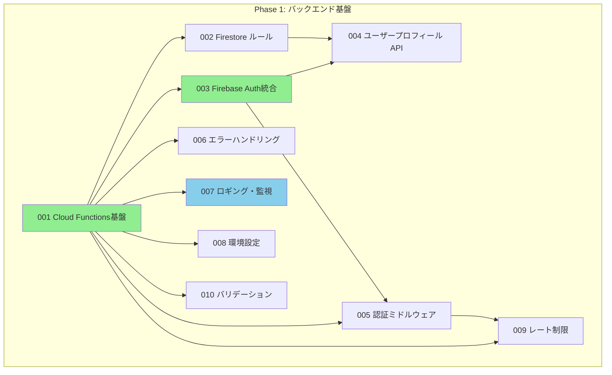
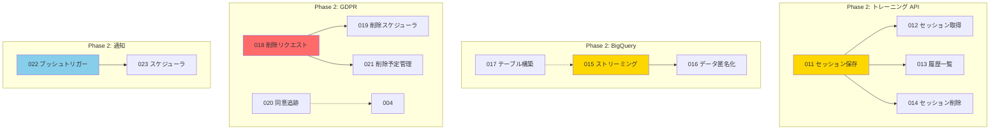
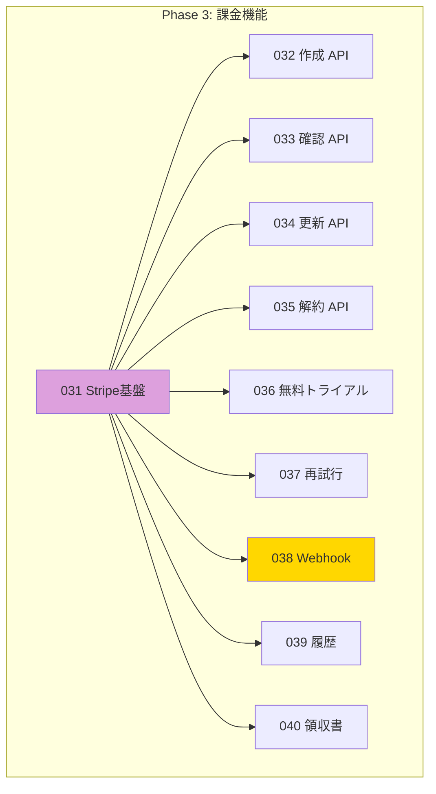
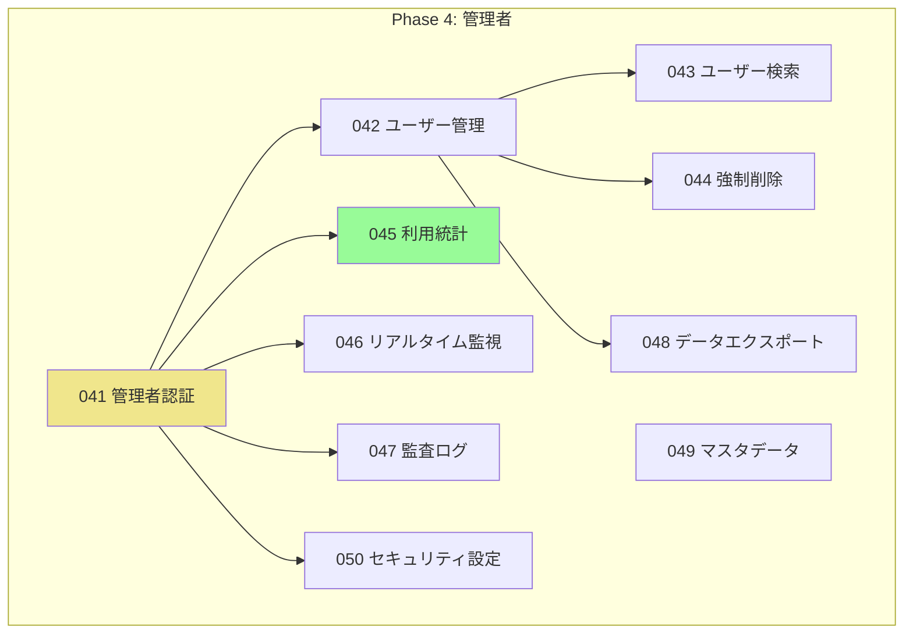

# Common (共通バックエンド) チケット全体管理

**バージョン**: 1.0.0
**作成日**: 2025年12月10日
**対象**: AIフィットネスアプリ共通バックエンド開発チケット（Expo版・Flutter版共通）

---

## 1. プロジェクト概要

このドキュメントは、**AIフィットネスアプリの共通バックエンド（Common）** の開発チケットを管理するファイルです。

Common（共通バックエンド）は、Expo版とFlutter版の両方のアプリから使われるバックエンド基盤です。Firebase、API、データパイプラインなど、アプリ側の違いに関係なく必要な機能を含みます。

### Expo版・Flutter版との関係図

```
Expo版アプリ ─┐
             ├─> Common (共通バックエンド) <─ Firebase Cloud Functions
             │                           <─ Firestore
Flutter版アプリ┘                          <─ BigQuery
```

---

## 2. Phase構成

Common（共通バックエンド）の開発は4つのPhaseに分かれています。

| Phase | 期間 | チケット番号 | 件数 | 目標 |
|-------|------|------------|------|------|
| **Phase 1** | 0-2ヶ月 | 001-010 | 10件 | バックエンド基盤構築 |
| **Phase 2** | 2-7ヶ月 | 011-030 | 20件 | API・データパイプライン実装 |
| **Phase 3** | 8ヶ月目以降 | 031-040 | 10件 | 課金バックエンド実装 |
| **Phase 4** | 将来 | 041-050 | 10件 | 管理者バックエンド実装 |
| **合計** | | | **50件** | |

### Phase 1: バックエンド基盤構築（0-2ヶ月）

アプリが使うバックエンドの土台を作るPhaseです。

- Firebase Cloud Functions の基盤
- Firestoreセキュリティルール（詳細版）
- 認証API
- ユーザー情報API
- 監視・ログ基盤

### Phase 2: API・データパイプライン実装（2-7ヶ月）

アプリの機能をサポートするAPIと、データを分析システムに送る仕組みを作ります。

- トレーニングデータ保存API
- セッション管理API
- BigQuery パイプライン
- GDPR対応（データ削除）
- プッシュ通知バックエンド

### Phase 3: 課金バックエンド実装（8ヶ月目以降）

ユーザーの課金と収入を管理する仕組みを作ります。

- Stripe連携
- サブスクリプション管理API
- 課金履歴API
- 無料トライアル管理

### Phase 4: 管理者バックエンド実装（将来）

運用チームと管理者向けの機能を作ります。

- 管理者認証API
- ユーザー管理API
- データエクスポートAPI
- 利用統計API

---

## 3. チケット一覧

### Phase 1: バックエンド基盤構築（001-010）

| ID | タイトル | 依存チケット | 状態 | 完了日 | 関連FR・NFR |
|----|---------|------------|------|--------|-----------|
| 001 | Firebase環境確認 | - | ✅ 完了 | 2025-12-10 | NFR-005, NFR-009 |
| 002 | Firestore Security Rules実装 | 001 | ✅ 完了 | 2025-12-10 | NFR-012, NFR-034 |
| 003 | Cloud Functions基盤 | 001 | ✅ 完了 | 2025-12-10 | NFR-003, NFR-037 |
| 004 | 認証トリガー実装 | 003 | ✅ 完了 | 2025-12-10 | FR-001, FR-015 |
| 005 | 監視・ログ基盤 | 003 | ✅ 完了 | 2025-12-10 | NFR-028, NFR-029, NFR-030 |
| 006 | GDPR同意管理API | 002, 003 | ✅ 完了 | 2025-12-10 | FR-024, FR-002-1 |
| 007 | ユーザーAPI | 002, 003 | ✅ 完了 | 2025-12-10 | FR-002 |
| 008 | CI/CDパイプライン | 003 | ✅ 完了 | 2025-12-10 | NFR-026, NFR-027 |
| 009 | セキュリティレビュー | 002, 003, 004 | ✅ 完了 | 2025-12-10 | NFR-013, NFR-012 |
| 010 | Phase 1完了確認 | 001-009 | ✅ 完了 | 2025-12-10 | NFR-027 |

### Phase 2: API・データパイプライン実装（011-030）

| ID | タイトル | 依存チケット | 状態 | 関連FR・NFR |
|----|---------|------------|------|-----------|
| 011 | トレーニングセッション保存API | 002, 004 | 🏗️ 進行中（主要実装完了） | FR-008 |
| 012 | セッション取得API | 002, 004 | 🏗️ 進行中（主要実装完了） | FR-009 |
| 013 | トレーニング履歴一覧API | 002, 004 | 🏗️ 進行中（主要実装完了） | FR-010 |
| 014 | セッション削除API | 002, 004 | 🏗️ 進行中（主要実装完了） | FR-011 |
| 015 | BigQuery ストリーミングパイプライン | 001, 002 | ✅ 完了 | NFR-006 |
| 016 | データ匿名化・加工処理 | 015 | ✅ 完了 | NFR-008 |
| 017 | BigQuery テーブル構築 | 001 | ✅ 完了 | NFR-007 |
| 018 | GDPR データ削除リクエスト API | 002, 004 | 未着手 | FR-035 |
| 019 | データ削除スケジューラ | 018 | 未着手 | FR-036 |
| 020 | GDPR 同意追跡 API | 002, 004 | 未着手 | FR-034 |
| 021 | 削除予定管理 | 002, 018 | 未着手 | FR-036 |
| 022 | プッシュ通知トリガー | 001 | 未着手 | FR-024 |
| 023 | プッシュ通知スケジューラ | 022 | 未着手 | FR-024 |
| 024 | ユーザーフィードバック API | 002, 004 | 未着手 | FR-031 |
| 025 | 設定保存API | 002, 004 | 未着手 | FR-012 |
| 026 | 通知設定 API | 002, 004 | 未着手 | FR-021 |
| 027 | ユーザー削除前通知 | 022, 021 | 未着手 | FR-037 |
| 028 | CloudTasks 統合 | 001 | 未着手 | NFR-015 |
| 029 | イベント駆動アーキテクチャ | 001, 028 | 未着手 | NFR-004 |
| 030 | バックアップ・復旧機構 | 001 | 未着手 | NFR-027 |

### Phase 3: 課金バックエンド実装（031-040）

| ID | タイトル | 依存チケット | 状態 | 関連FR・NFR |
|----|---------|------------|------|-----------|
| 031 | Stripe 統合基盤 | 001, 004 | 未着手 | FR-016 |
| 032 | サブスクリプション作成 API | 031 | 未着手 | FR-017 |
| 033 | サブスクリプション確認 API | 031 | 未着手 | FR-018 |
| 034 | サブスクリプション更新 API | 031 | 未着手 | FR-019 |
| 035 | サブスクリプション解約 API | 031 | 未着手 | FR-020 |
| 036 | 無料トライアル管理 API | 031 | 未着手 | FR-022 |
| 037 | 課金失敗時の再試行 | 031 | 未着手 | NFR-016 |
| 038 | Stripe Webhook ハンドラ | 031, 002 | 未着手 | NFR-013 |
| 039 | 課金履歴API | 031 | 未着手 | FR-023 |
| 040 | 領収書生成・送信 | 031, 022 | 未着手 | FR-025 |

### Phase 4: 管理者バックエンド実装（041-050）

| ID | タイトル | 依存チケット | 状態 | 関連FR・NFR |
|----|---------|------------|------|-----------|
| 041 | 管理者認証 API | 003 | 未着手 | FR-039 |
| 042 | ユーザー管理 API | 041, 004 | 未着手 | FR-040 |
| 043 | ユーザー検索 API | 042 | 未着手 | FR-041 |
| 044 | 強制削除 API | 042, 021 | 未着手 | FR-043 |
| 045 | 利用統計 API | 001, 041 | 未着手 | FR-027 |
| 046 | リアルタイム監視 API | 001, 041 | 未着手 | NFR-009 |
| 047 | 監査ログ取得 API | 001, 041 | 未着手 | FR-042 |
| 048 | データエクスポート API | 041, 042 | 未着手 | FR-028 |
| 049 | マスタデータ管理 API | 041 | 未着手 | FR-026 |
| 050 | セキュリティ設定 API | 041, 002 | 未着手 | NFR-032 |

---

## 4. 依存関係図（Gantt形式）

### Phase 1: 基盤構築の依存関係



### Phase 2: API・データパイプライン



### Phase 3: 課金バックエンド



### Phase 4: 管理者バックエンド



---

## 5. フロントエンドチケットとの依存関係

Common（共通バックエンド）のチケットが完了すると、以下のExpo版・Flutter版チケットに着手できるようになります。

### 依存関係マトリクス

| Commonチケット | Expoチケット | Flutterチケット | 状態 | 説明 |
|--------------|------------|---------------|------|------|
| 001: Firebase環境確認 | 001: Firebase接続設定 | 001: Firebase接続設定 | ✅ Common完了 (2025-12-10) | Firebase基盤完了、フロントエンド接続設定可能 |
| 002: Firestore Security Rules | 006: 認証画面 | 006: 認証画面 | ✅ Common完了 (2025-12-10) | Security Rules完了、認証画面テスト可能 |
| 003: Cloud Functions基盤 | 006: 認証画面 | 006: 認証画面 | ✅ Common完了 (2025-12-10) | Functions基盤完了、認証機能動作可能 |
| 004: 認証トリガー実装 | 006: 認証画面 | 006: 認証画面 | ✅ Common完了 (2025-12-10) | 認証トリガー完了、ユーザー作成・削除可能 |
| 005: 監視・ログ基盤 | - | - | ✅ Common完了 (2025-12-10) | バックエンドのみ（フロントエンド依存なし） |
| 006: GDPR同意管理API | 007: 利用規約同意画面 | 007: 利用規約同意画面 | ✅ Common完了 (2025-12-10) | 同意管理API完了、利用規約画面実装可能 |
| 007: ユーザーAPI | 009: プロフィール画面 | 009: プロフィール画面 | ✅ Common完了 (2025-12-10) | ユーザーAPI完了、プロフィール画面実装可能 |
| 008: CI/CDパイプライン | - | - | ✅ Common完了 (2025-12-10) | バックエンドのみ（フロントエンド依存なし） |
| 009: セキュリティレビュー | - | - | ✅ Common完了 (2025-12-10) | バックエンドのみ（フロントエンド依存なし） |
| 010: Phase 1完了確認 | - | - | 🔄 Common進行中 | バックエンドのみ（フロントエンド依存なし） |
| 011: セッション保存API | 024: 履歴画面 | 024: 履歴画面 | ⏳ Common未着手 | セッションAPI完了後に履歴画面が実装可能 |
| 012: セッション取得API | 024: 履歴画面 | 024: 履歴画面 | ⏳ Common未着手 | セッション取得完了後に履歴表示が可能 |
| 013: 履歴一覧API | 024: 履歴画面 | 024: 履歴画面 | ⏳ Common未着手 | 履歴一覧API完了後に履歴一覧表示が可能 |
| 014: セッション削除API | 024: 履歴画面 | 024: 履歴画面 | ⏳ Common未着手 | 削除API完了後にセッション削除が可能 |
| 015: BigQueryストリーミング | - | - | ⏳ Common未着手 | バックエンドのみ（フロントエンド依存なし） |
| 016: データ匿名化・加工 | - | - | ⏳ Common未着手 | バックエンドのみ（フロントエンド依存なし） |
| 017: BigQueryテーブル構築 | - | - | ⏳ Common未着手 | バックエンドのみ（フロントエンド依存なし） |
| 018: GDPR削除リクエストAPI | 027: 設定画面 | 027: 設定画面 | ⏳ Common未着手 | 削除リクエストAPI完了後に削除機能が実装可能 |
| 019: データ削除スケジューラ | - | - | ⏳ Common未着手 | バックエンドのみ（フロントエンド依存なし） |
| 020: GDPR同意追跡API | 027: 設定画面 | 027: 設定画面 | ⏳ Common未着手 | 同意追跡API完了後に同意管理機能が実装可能 |
| 021: 削除予定管理 | - | - | ⏳ Common未着手 | バックエンドのみ（フロントエンド依存なし） |
| 022: プッシュ通知トリガー | 028: 通知設定機能 | 028: 通知設定機能 | ⏳ Common未着手 | 通知トリガー完了後に通知機能が実装可能 |
| 023: プッシュ通知スケジューラ | 028: 通知設定機能 | 028: 通知設定機能 | ⏳ Common未着手 | スケジューラ完了後に定期通知が可能 |
| 024: ユーザーフィードバックAPI | 029: ヘルプセンター | 029: ヘルプセンター | ⏳ Common未着手 | フィードバックAPI完了後にフィードバック送信が可能 |
| 025: 設定保存API | 027: 設定画面 | 027: 設定画面 | ⏳ Common未着手 | 設定API完了後に設定保存機能が実装可能 |
| 026: 通知設定API | 028: 通知設定機能 | 028: 通知設定機能 | ⏳ Common未着手 | 通知設定API完了後に通知設定画面が実装可能 |
| 027: ユーザー削除前通知 | - | - | ⏳ Common未着手 | バックエンドのみ（フロントエンド依存なし） |
| 028: CloudTasks統合 | - | - | ⏳ Common未着手 | バックエンドのみ（フロントエンド依存なし） |
| 029: イベント駆動アーキテクチャ | - | - | ⏳ Common未着手 | バックエンドのみ（フロントエンド依存なし） |
| 030: バックアップ・復旧機構 | - | - | ⏳ Common未着手 | バックエンドのみ（フロントエンド依存なし） |
| 031: Stripe統合基盤 | 032: Stripe Payment Sheet | 032: Stripe Payment Sheet | ⏳ Phase 3（未着手） | Stripe Backend完了後にフロント実装が可能 |
| 032: サブスクリプション作成API | 033: 課金画面 | 033: 課金画面 | ⏳ Phase 3（未着手） | 作成API完了後に課金画面が実装可能 |
| 033: サブスクリプション確認API | 034: サブスクリプション管理 | 034: サブスクリプション管理 | ⏳ Phase 3（未着手） | 確認API完了後にサブスク管理画面が実装可能 |
| 034: サブスクリプション更新API | 034: サブスクリプション管理 | 034: サブスクリプション管理 | ⏳ Phase 3（未着手） | 更新API完了後にプラン変更が可能 |
| 035: サブスクリプション解約API | 038: 解約機能 | - | ⏳ Phase 3（未着手） | 解約API完了後に解約機能が実装可能 |
| 036: 無料トライアル管理API | 035: 無料トライアル機能 | 035: 無料トライアル機能 | ⏳ Phase 3（未着手） | トライアルAPI完了後にトライアル機能が実装可能 |
| 037: 課金失敗時の再試行 | - | - | ⏳ Phase 3（未着手） | バックエンドのみ（フロントエンド依存なし） |
| 038: Stripe Webhookハンドラ | - | - | ⏳ Phase 3（未着手） | バックエンドのみ（フロントエンド依存なし） |
| 039: 課金履歴API | 037: 購入履歴画面 | 036: 課金履歴画面 | ⏳ Phase 3（未着手） | 履歴API完了後に購入履歴画面が実装可能 |
| 040: 領収書生成・送信 | - | - | ⏳ Phase 3（未着手） | バックエンドのみ（フロントエンド依存なし） |
| 041: 管理者認証API | 041: 管理者ダッシュボード | 041: 管理者ダッシュボード | ⏳ Phase 4（未着手） | 管理者認証API完了後にダッシュボード実装が可能 |
| 042: ユーザー管理API | 042: ユーザー管理画面 | 042: ユーザー管理画面 | ⏳ Phase 4（未着手） | ユーザー管理API完了後にユーザー管理画面が実装可能 |
| 043: ユーザー検索API | 042: ユーザー管理画面 | 042: ユーザー管理画面 | ⏳ Phase 4（未着手） | 検索API完了後にユーザー検索機能が実装可能 |
| 044: 強制削除API | 042: ユーザー管理画面 | 042: ユーザー管理画面 | ⏳ Phase 4（未着手） | 強制削除API完了後に管理者削除機能が実装可能 |
| 045: 利用統計API | 041: 管理者ダッシュボード | 041: 管理者ダッシュボード | ⏳ Phase 4（未着手） | 統計API完了後にダッシュボード統計表示が可能 |
| 046: リアルタイム監視API | 041: 管理者ダッシュボード | 041: 管理者ダッシュボード | ⏳ Phase 4（未着手） | 監視API完了後にリアルタイム監視が可能 |
| 047: 監査ログ取得API | 041: 管理者ダッシュボード | 041: 管理者ダッシュボード | ⏳ Phase 4（未着手） | ログAPI完了後に監査ログ表示が可能 |
| 048: データエクスポートAPI | 042: ユーザー管理画面 | 042: ユーザー管理画面 | ⏳ Phase 4（未着手） | エクスポートAPI完了後にデータエクスポート機能が実装可能 |
| 049: マスタデータ管理API | - | - | ⏳ Phase 4（未着手） | バックエンドのみ（フロントエンド依存なし） |
| 050: セキュリティ設定API | - | - | ⏳ Phase 4（未着手） | バックエンドのみ（フロントエンド依存なし） |

### 状態アイコン凡例

| アイコン | 意味 |
|---------|------|
| ✅ Common完了 | Commonチケットが完了しており、フロントエンド実装が着手可能 |
| 🔄 Common進行中 | Commonチケットが進行中、完了後にフロントエンド実装が着手可能 |
| ⏳ Common未着手 | Commonチケットが未着手、完了を待つ必要あり |
| ⏳ Phase 3（未着手） | Phase 3のため現時点では未着手 |
| ⏳ Phase 4（未着手） | Phase 4のため現時点では未着手 |

### Phase別依存サマリー

#### Phase 1: バックエンド基盤構築（0-2ヶ月）

| Common チケット | 完了時期 | Expoチケットへの影響 | Flutterチケットへの影響 | Common状態 |
|--------------|---------|-----------------|------------------|----------|
| 001-003 | 0-1ヶ月 | 001, 006（認証画面） | 001, 006（認証画面） | ✅ 完了 (2025-12-10) |
| 004 | 1-2ヶ月 | 006（認証画面） | 006（認証画面） | ✅ 完了 (2025-12-10) |
| 005 | 1-2ヶ月 | 監視基盤共有 | 監視基盤共有 | ✅ 完了 (2025-12-10) |
| 006 | 1-2ヶ月 | 007（利用規約画面） | 007（利用規約画面） | ✅ 完了 (2025-12-10) |
| 007 | 1-2ヶ月 | 009（プロフィール画面） | 009（プロフィール画面） | ✅ 完了 (2025-12-10) |

#### Phase 2: API・データパイプライン実装（2-7ヶ月）

| Common チケット | 完了時期 | Expoチケットへの影響 | Flutterチケットへの影響 | Common状態 |
|--------------|---------|-----------------|------------------|----------|
| 011-014 | 2-4ヶ月 | 024（履歴画面） | 024（履歴画面） | ⏳ 未着手 |
| 015-017 | 3-5ヶ月 | バックエンドのみ | バックエンドのみ | ⏳ 未着手 |
| 018-021 | 3-5ヶ月 | 027（設定画面・GDPR） | 027（設定画面・GDPR） | ⏳ 未着手 |
| 022-023 | 4-6ヶ月 | 028（通知設定） | 028（通知設定） | ⏳ 未着手 |
| 024 | 4-6ヶ月 | 029（ヘルプセンター） | 029（ヘルプセンター） | ⏳ 未着手 |
| 025 | 4-6ヶ月 | 027（設定画面） | 027（設定画面） | ⏳ 未着手 |
| 026 | 4-6ヶ月 | 028（通知設定） | 028（通知設定） | ⏳ 未着手 |

#### Phase 3: 課金バックエンド実装（8ヶ月目以降）

| Common チケット | 完了時期 | Expoチケットへの影響 | Flutterチケットへの影響 | Common状態 |
|--------------|---------|-----------------|------------------|----------|
| 031-040 | 8-9ヶ月 | 032-038（課金機能） | 032-036（課金機能） | ⏳ Phase 3（未着手） |

#### Phase 4: 管理者バックエンド実装（将来）

| Common チケット | 完了時期 | Expoチケットへの影響 | Flutterチケットへの影響 | Common状態 |
|--------------|---------|-----------------|------------------|----------|
| 041-050 | 10ヶ月以降 | 041-042（管理者機能） | 041-042（管理者機能） | ⏳ Phase 4（未着手） |

---

## 6. 依存関係のルール

Commonチケットは、以下のルールに従って動作します。

### 着手する条件

チケットに「着手できるようになる」ためには、**すべての依存チケットが完了** している必要があります。

例：チケット004（ユーザープロフィール API）に着手するには、
- ✓ 001（Cloud Functions基盤）が完了
- ✓ 003（Firebase Auth統合）が完了
- ✓ 002（Firestoreセキュリティルール）が完了

の3つすべてが完了していないといけません。

### ブロック関係

もし依存チケットがまだ完了していないのに着手してしまった場合、そのチケットは「ブロック中」というステータスになります。

```
ブロック中 = 依存チケットの完了を待っている状態
```

---

## 7. 並行開発ガイド

### 並行作業できるチケット

依存関係がないチケットは、同時に進める（並行作業）ことができます。

#### Phase 1で並行作業可能

チケット001（Cloud Functions基盤）が完了すると、以下を並行できます：

| グループ | チケット | 説明 |
|---------|---------|------|
| セキュリティ | 002, 003 | Firestore、Firebase Auth |
| 基盤機能 | 006, 007, 010 | エラーハンドリング、ログ、バリデーション |
| 環境・デプロイ | 008 | 環境設定、デプロイパイプライン |

チケット003（Firebase Auth統合）が完了すると、以下も並行できます：

| グループ | チケット | 説明 |
|---------|---------|------|
| API実装 | 004 | ユーザープロフィール API |
| 認証 | 005 | ミドルウェア実装 |

#### Phase 2で並行作業可能

| グループA（トレーニング） | グループB（BigQuery） | グループC（GDPR） | グループD（通知） |
|----------------------|------------------|-----------------|-----------|
| 011-014（トレーニングAPI） | 015-017（データパイプライン） | 018-021（削除・同意） | 022-023（プッシュ） |

### ファイル競合を避けるコツ

| チケット種別 | 主に触るファイル | 競合リスク |
|-------------|-----------------|-----------|
| API実装系 | `functions/src/api/` | 低（API別に独立） |
| イベント系 | `functions/src/triggers/` | 低（イベント別に独立） |
| 共通ユーティリティ | `functions/src/utils/` | 高（複数が改変） |
| Firestore設定 | `firebase/firestore.rules` | 高（マージが難しい） |
| TypeScript型定義 | `functions/src/types/` | 中（型追加は低コスト） |

---

## 8. ステータスの説明

| ステータス | 意味 | 色 |
|-----------|------|-----|
| **未着手** | まだ作業を開始していない | 白 |
| **進行中** | 現在作業中 | 黄 |
| **レビュー中** | 作業完了・PR出してレビュー待ち | 青 |
| **完了** | レビュー承認・マージ完了 | 緑 |
| **ブロック中** | 依存チケット未完了 | 赤 |

### ステータス変更のタイミング

```
未着手 ──→ 進行中: 作業を開始したとき
進行中 ──→ レビュー中: 実装完了してPRを出したとき
レビュー中 ──→ 完了: レビューが承認されてマージされたとき
進行中 ──→ ブロック中: 依存チケットの完了が遅れたとき
ブロック中 ──→ 進行中: ブロック要因が解決したとき
```

---

## 9. 進捗サマリー

### 現在の状況（2025年12月10日時点）

| Phase | 総数 | 完了 | 進行中 | レビュー中 | 未着手 | ブロック中 | 進捗率 |
|-------|------|------|--------|-----------|--------|----------|--------|
| Phase 1 | 10 | 10 | 0 | 0 | 0 | 0 | **100%** |
| Phase 2 | 20 | 0 | 0 | 0 | 20 | 0 | **0%** |
| Phase 3 | 10 | 0 | 0 | 0 | 10 | 0 | **0%** |
| Phase 4 | 10 | 0 | 0 | 0 | 10 | 0 | **0%** |
| **合計** | **50** | **10** | **0** | **0** | **40** | **0** | **20%** |

### Phase 1 完了サマリー（2025-12-10）

**Phase 1（バックエンド基盤構築）が完了しました！**

#### 実装完了した機能
- ✅ Firebase Cloud Functions v2 基盤
- ✅ Firestore Security Rules（45テストケース）
- ✅ 認証トリガー（onCreate, onDelete）
- ✅ GDPR同意管理API（91テストケース）
- ✅ ユーザー管理API（42テストケース）
- ✅ CI/CD パイプライン（GitHub Actions）
- ✅ セキュリティレビュー（OWASP Top 10）

#### テスト結果
- **総テスト数**: 1394件
- **合格率**: 100% ✅
- **セキュリティ**: 0 vulnerabilities ✅

#### 次のステップ
- Phase 2（API・データパイプライン実装）の開発を開始できる状態
- 優先チケット: 011-014（トレーニングセッションAPI）、018-021（GDPR削除機構）

### 次のマイルストーン

| マイルストーン | 目標日 | 完了条件 | 関連チケット |
|-------------|--------|---------|-----------|
| **M1: Phase 1 完了** | 2ヶ月後 | 全10件完了・マージ | 001-010 |
| **M2: トレーニング API完了** | 4ヶ月後 | セッション系API完成 | 011-014 |
| **M3: BigQuery パイプライン完了** | 5ヶ月後 | データ同期機構稼働 | 015-017 |
| **M4: GDPR 機構完了** | 5ヶ月後 | 削除・同意機構稼働 | 018-021 |
| **M5: Phase 2 完了** | 7ヶ月後 | 全20件完了・マージ | 011-030 |
| **M6: Stripe 統合完了** | 9ヶ月後 | 課金機構稼働 | 031-040 |

---

## 10. Common チケットの実装順序

効率よく開発を進めるための推奨順序です。

### ステップ1: 基盤構築（Week 1-2）

```
001 Cloud Functions基盤 ────────── デプロイパイプライン構築
 ├→ 002 Firestore ルール
 ├→ 003 Firebase Auth統合 ──→ 005 ミドルウェア実装
 ├→ 006 エラーハンドリング
 ├→ 007 ロギング・監視
 ├→ 008 環境設定
 └→ 010 バリデーション
```

**このステップでやること**:
- Cloud Functions の基本テンプレート作成
- ESLint、Prettier、Jest の設定
- エミュレータの動作確認
- GitHub Actions の CI/CD パイプライン作成

### ステップ2: API基盤（Week 3-4）

```
002, 003 が完了したら：
 ├→ 004 ユーザープロフィール API 実装
 ├→ 009 レート制限・DDoS 対策
 └→ 共通ユーティリティ整理
```

**このステップでやること**:
- API の標準形式を決定
- エラーレスポンスの統一
- リクエストバリデーション の統一

### ステップ3: Phase 2 準備（Week 5-6）

```
全 Phase 1 が完了したら：
 ├→ 011-014 トレーニング Session API
 ├→ 015-017 BigQuery ストリーミング
 └→ 028 CloudTasks 統合
```

**並行作業グループ**:
- グループA: 011-014（トレーニング API）
- グループB: 015-017（BigQuery パイプライン）
- グループC: 028（CloudTasks）

### ステップ4: GDPR・通知（Week 7-12）

```
011-014 が完了したら：
 ├→ 018-021 GDPR 削除・同意
 └→ 022-023 プッシュ通知
```

---

## 11. チケットファイルの場所

各チケットの詳細は以下のディレクトリにあります：

```
docs/common/tickets/
├── 000-ticket-overview.md      # このファイル（全体管理）
├── 001-cloud-functions-setup.md
├── 002-firestore-security-rules.md
├── ...
└── 050-security-settings-api.md
```

---

## 12. 関連ドキュメント

### Common の仕様書

| ドキュメント | パス | 説明 |
|-------------|------|------|
| プロジェクト概要 | `docs/common/specs/01_プロジェクト概要_v1_0.md` | 全体像 |
| 機能要件 | `docs/common/specs/02-1_機能要件_v1_0.md` | FR-001〜FR-043 |
| 非機能要件 | `docs/common/specs/02-2_非機能要件_v1_0.md` | NFR-001〜NFR-037 |
| Firestore 設計 | `docs/common/specs/03_Firestoreデータベース設計書_v1_0.md` | DB構造 |
| API 設計 | `docs/common/specs/04_API設計書_Firebase_Functions_v1_0.md` | API仕様 |
| BigQuery 設計 | `docs/common/specs/05_BigQuery設計書_v1_0.md` | 分析基盤 |
| フォーム評価ロジック | `docs/common/specs/06_フォーム評価ロジック_v1_0.md` | 種目別アルゴリズム |
| GDPR対応 | `docs/common/specs/07_データ処理記録_ROPA_v1_0.md` | データ処理記録 |
| セキュリティ | `docs/common/specs/08_セキュリティポリシー_v1_0.md` | セキュリティ方針 |
| 利用規約 | `docs/common/specs/09_利用規約_v1_0.md` | 法務 |
| プライバシー | `docs/common/specs/10_プライバシーポリシー_v1_0.md` | 法務 |

### Expo版・Flutter版との関連

| ドキュメント | パス | 説明 |
|-------------|------|------|
| Expo チケット | `docs/expo/tickets/000-ticket-overview.md` | Expo版の全71チケット |
| Expo 仕様書 | `docs/expo/specs/` | Expo固有の仕様 |
| Flutter 仕様書 | `docs/flutter/specs/` | Flutter固有の仕様 |

---

## 13. チケット完了のチェックリスト

チケットを完了とする前に、必ず以下の項目をチェックしてください。

### 基本項目

- [ ] コード実装が完了した
- [ ] ユニットテストを書いた（カバレッジ 80%以上）
- [ ] ESLint / Prettier が通った
- [ ] ローカルでテストが全て成功した
- [ ] TypeScript の型エラーがない

### コード品質

- [ ] 関数は単一責任をもっている
- [ ] エラーハンドリングがある
- [ ] ログが適切に出力されている
- [ ] セキュリティリスクがないか確認した

### ドキュメント

- [ ] JSDoc / TypeDoc で関数を説明している
- [ ] 複雑なロジックをコメントで説明している
- [ ] チケットの完了内容をまとめた

### PR・マージ

- [ ] GitHubで PR を出した
- [ ] PR の説明文に「closes #XXX」を入れた
- [ ] チェックリストをコメントに記述した
- [ ] レビューが2人以上から OK 了を得た
- [ ] main ブランチにマージした

### チケット管理

- [ ] ステータスを「完了」に更新した
- [ ] 完了日を記録した
- [ ] 次のチケット担当者に連絡した

---

## 14. トラブル時のQ&A

### Q: 依存チケットがまだ完了していないのに、着手できますか？

**A**: 推奨しません。ブロック状態になる可能性があります。

ただし、以下のような場合は着手してもいいです：
- 依存チケットの概要は分かっている
- 予定通り1-2週間以内に完了すると見込まれている
- 実装の大部分はローカルで済ませておく

### Q: チケットが「ブロック中」になったら、どうしたらいいですか？

**A**: 以下の手順で対応してください：

1. 依存チケットの完了を待つ
2. 依存チケットが完了したら、依存部分をマージ
3. 「ブロック中」のチケットを「進行中」に更新
4. テストして確認

### Q: チケットを分割したい場合は？

**A**: 以下の手順で対応してください：

1. ドキュメント管理者に相談
2. 既存チケットを「サブタスク A」「サブタスク B」に分割
3. 元のチケット番号は保持（例：011-A, 011-B）
4. チケット一覧を更新

### Q: 見積もり時間を超過しました。どうしたらいいですか？

**A**: 以下の手順で対応してください：

1. **早めに報告する**（見積もり時間の50%を超過した時点）
2. **理由を明確にする**（思わぬ依存関係、技術的困難など）
3. **進捗を共有する**（実装状況、解決策の検討状況）
4. **期限延長を相談する**（マネージャーに）
5. **次回に活かす**（同じような理由なら他の見積もりに反映）

---

## 15. 変更履歴

| バージョン | 日付 | 変更内容 |
|-----------|------|----------|
| 1.0.0 | 2025年12月10日 | 初版作成（Phase 1-4の50チケット、依存関係、並行ガイド） |
| 1.0.1 | 2025年12月10日 | Phase 1完了（チケット010完了マーク、進捗100%更新） |

---

**ドキュメント作成者**: AIフィットネスアプリ開発チーム
**最終確認日**: 2025年12月10日
**対象バージョン**: Common バックエンド v1.0
