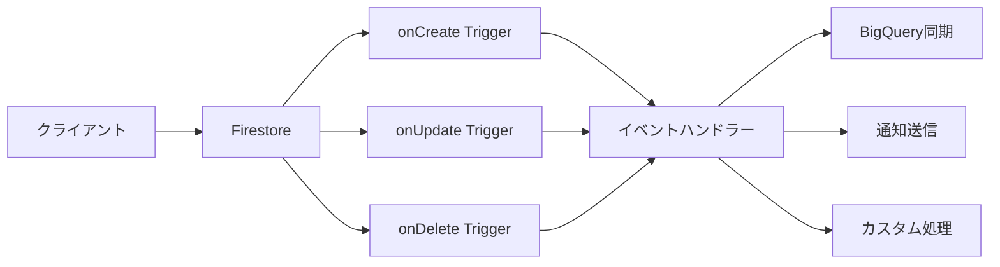

# 029 イベント駆動アーキテクチャ

## 概要

Firestoreのトリガー（onCreate, onUpdate, onDelete）を使用したイベント駆動アーキテクチャを実装するチケットです。データの変更を検知して自動的に処理を実行する仕組みを構築します。

## Phase

Phase 2（API・データパイプライン実装）

## プラットフォーム

common（バックエンド共通）

## 依存チケット

- 001: Cloud Functions 基盤構築
- 028: CloudTasks 統合

## 要件

### 機能要件

- なし（非機能要件のみ）

### 非機能要件

- NFR-004: イベント駆動アーキテクチャ
- NFR-015: 非同期処理

## 受け入れ条件（Todo）

- [x] ユーザー作成トリガーを実装（`users/{userId}`のonCreate）
- [x] ユーザー削除トリガーを実装（`users/{userId}`のonDelete）
- [x] セッション作成トリガーを実装（`sessions/{sessionId}`のonCreate）
- [x] セッション完了トリガーを実装（`sessions/{sessionId}`のonUpdate）
- [x] 同意記録トリガーを実装（`consents/{consentId}`のonCreate）
- [x] 削除リクエストトリガーを実装（`dataDeletionRequests/{requestId}`のonCreate）
- [x] イベントハンドラーのエラーハンドリング
- [x] イベント処理のログ記録
- [x] ユニットテストを作成（カバレッジ80%以上）
- [ ] エミュレータでの動作確認（オプション）

## 参照ドキュメント

- `docs/common/specs/02-2_非機能要件_v1_0.md` - NFR-004, NFR-015
- `docs/common/specs/03_Firestoreデータベース設計書_v1_0.md` - コレクション構造
- `docs/common/specs/04_API設計書_Firebase_Functions_v1_0.md` - API設計

## 技術詳細

### イベント駆動アーキテクチャの概念図



### 実装例: ユーザー作成トリガー

```typescript
import { onDocumentCreated } from 'firebase-functions/v2/firestore';
import { logger } from 'firebase-functions/v2';

export const user_onCreate = onDocumentCreated({
  document: 'users/{userId}',
  region: 'asia-northeast1'
}, async (event) => {
  const userId = event.params.userId;
  const userData = event.data?.data();

  if (!userData) {
    logger.error('ユーザーデータが取得できませんでした', { userId });
    return;
  }

  logger.info('新規ユーザー作成検知', { userId, email: userData.email });

  try {
    // 1. ウェルカムメール送信（Cloud Tasksで非同期）
    await enqueueTask({
      queueName: 'email-queue',
      functionName: 'internal_sendWelcomeEmail',
      payload: {
        userId,
        email: userData.email,
        displayName: userData.displayName
      }
    });

    // 2. BigQueryに初期レコードを作成
    await syncToBigQueryWithRetry('users', {
      user_id: userId,
      created_at: userData.createdAt,
      subscription_status: userData.subscriptionStatus
    });

    // 3. 初期設定の作成（デフォルト設定を追加）
    await admin.firestore().collection('users').doc(userId).update({
      settings: DEFAULT_SETTINGS,
      notificationSettings: DEFAULT_NOTIFICATION_SETTINGS
    });

    logger.info('ユーザー作成後処理完了', { userId });
  } catch (error) {
    logger.error('ユーザー作成後処理でエラー', { userId, error });
    // エラーが発生してもユーザー作成自体は成功しているので、ログのみ記録
  }
});
```

### 実装例: セッション作成トリガー

```typescript
export const session_onCreate = onDocumentCreated({
  document: 'sessions/{sessionId}',
  region: 'asia-northeast1'
}, async (event) => {
  const sessionId = event.params.sessionId;
  const sessionData = event.data?.data();

  if (!sessionData) {
    logger.error('セッションデータが取得できませんでした', { sessionId });
    return;
  }

  logger.info('新規セッション作成検知', { sessionId, userId: sessionData.userId });

  try {
    // セッション統計を更新
    await updateUserStats(sessionData.userId, {
      totalSessions: admin.firestore.FieldValue.increment(1),
      lastSessionAt: sessionData.startTime
    });

    logger.info('セッション作成後処理完了', { sessionId });
  } catch (error) {
    logger.error('セッション作成後処理でエラー', { sessionId, error });
  }
});
```

### 実装例: セッション完了トリガー

```typescript
import { onDocumentUpdated } from 'firebase-functions/v2/firestore';

export const session_onComplete = onDocumentUpdated({
  document: 'sessions/{sessionId}',
  region: 'asia-northeast1'
}, async (event) => {
  const sessionId = event.params.sessionId;
  const beforeData = event.data?.before.data();
  const afterData = event.data?.after.data();

  if (!beforeData || !afterData) {
    return;
  }

  // ステータスが'active'から'completed'に変わった場合のみ処理
  if (beforeData.status === 'active' && afterData.status === 'completed') {
    logger.info('セッション完了検知', { sessionId, userId: afterData.userId });

    try {
      // 1. BigQueryにセッションデータを同期（匿名化）
      await syncToBigQueryWithRetry('sessions', {
        session_id: sessionId,
        anonymous_user_id: await getAnonymousUserId(afterData.userId),
        exercise_type: afterData.exerciseType,
        rep_count: afterData.repCount,
        set_count: afterData.setCount,
        duration_seconds: afterData.duration,
        overall_score: afterData.formFeedback?.overallScore,
        device_platform: afterData.sessionMetadata?.deviceInfo?.platform,
        completed_at: afterData.completedAt
      });

      // 2. ユーザー統計を更新
      await updateUserStats(afterData.userId, {
        totalCompletedSessions: admin.firestore.FieldValue.increment(1),
        totalReps: admin.firestore.FieldValue.increment(afterData.repCount || 0),
        totalDuration: admin.firestore.FieldValue.increment(afterData.duration || 0)
      });

      // 3. 達成バッジの確認と付与
      await checkAndAwardBadges(afterData.userId);

      logger.info('セッション完了後処理完了', { sessionId });
    } catch (error) {
      logger.error('セッション完了後処理でエラー', { sessionId, error });
    }
  }
});

async function updateUserStats(userId: string, updates: any): Promise<void> {
  await admin.firestore().collection('users').doc(userId).update(updates);
}

async function getAnonymousUserId(userId: string): Promise<string> {
  // SHA-256ハッシュで匿名化
  const crypto = await import('crypto');
  return crypto.createHash('sha256').update(userId).digest('hex');
}

async function checkAndAwardBadges(userId: string): Promise<void> {
  // バッジ付与ロジック（Phase 3で実装予定）
  logger.info('バッジチェック（未実装）', { userId });
}
```

### 実装例: ユーザー削除トリガー

```typescript
import { onDocumentDeleted } from 'firebase-functions/v2/firestore';

export const user_onDelete = onDocumentDeleted({
  document: 'users/{userId}',
  region: 'asia-northeast1'
}, async (event) => {
  const userId = event.params.userId;
  const userData = event.data?.data();

  logger.info('ユーザー削除検知', { userId });

  try {
    // 1. 関連データをすべて削除
    await deleteUserRelatedData(userId);

    // 2. BigQueryの匿名化データも削除
    await deleteFromBigQuery('users', { user_id: userId });

    // 3. Stripe顧客情報を削除（課金機能がある場合）
    if (userData?.stripeCustomerId) {
      await deleteStripeCustomer(userData.stripeCustomerId);
    }

    logger.info('ユーザー削除後処理完了', { userId });
  } catch (error) {
    logger.error('ユーザー削除後処理でエラー', { userId, error });
    // エラーログを記録し、後で手動対応
    await saveToDLQ('user_deletion_failure', { userId, userData, error });
  }
});

async function deleteUserRelatedData(userId: string): Promise<void> {
  const batch = admin.firestore().batch();

  // セッションを削除
  const sessionsSnapshot = await admin.firestore()
    .collection('sessions')
    .where('userId', '==', userId)
    .get();

  sessionsSnapshot.docs.forEach(doc => {
    batch.delete(doc.ref);
  });

  // 同意記録を削除
  const consentsSnapshot = await admin.firestore()
    .collection('consents')
    .where('userId', '==', userId)
    .get();

  consentsSnapshot.docs.forEach(doc => {
    batch.delete(doc.ref);
  });

  // フィードバックを削除
  const feedbacksSnapshot = await admin.firestore()
    .collection('feedbacks')
    .where('userId', '==', userId)
    .get();

  feedbacksSnapshot.docs.forEach(doc => {
    batch.delete(doc.ref);
  });

  await batch.commit();
}
```

### イベントハンドラーのエラーハンドリングパターン

```typescript
async function safeEventHandler(handler: () => Promise<void>, context: any): Promise<void> {
  try {
    await handler();
  } catch (error) {
    logger.error('イベントハンドラーでエラー', { context, error });

    // 重要なイベントの場合、DLQに保存
    await saveToDLQ('event_handler_failure', { context, error });

    // アラート通知
    if (isCriticalError(error)) {
      await sendAdminAlert({
        type: 'event_handler_error',
        message: `イベントハンドラーで重大なエラーが発生しました: ${error}`,
        severity: 'critical'
      });
    }
  }
}

function isCriticalError(error: any): boolean {
  // データ整合性に関わるエラーかどうかを判定
  return error instanceof DataIntegrityError;
}
```

## テスト観点

- ユーザー作成時にトリガーが実行されること
- セッション完了時にBigQueryに同期されること
- ユーザー削除時に関連データがすべて削除されること
- エラーが発生してもメインの処理が失敗しないこと
- エラーログが正しく記録されること
- DLQに失敗したイベントが保存されること

## 見積もり

- 工数: 3日
- 難易度: 高

## 進捗

- [x] 完了

## 完了日

2025-12-10

## 実装ファイル

- `functions/src/auth/onCreate.ts` - ユーザー作成トリガー
- `functions/src/auth/onDelete.ts` - ユーザー削除トリガー
- `functions/src/triggers/sessions.ts` - セッション作成・完了トリガー
- `functions/src/triggers/consents.ts` - 同意トリガー
- `functions/src/triggers/dataDeletionRequests.ts` - 削除リクエストトリガー
- `functions/src/triggers/index.ts` - エクスポート

## 備考

- イベント駆動アーキテクチャは、システムの拡張性と保守性を高めます
- Firestoreトリガーは、ドキュメントの変更を検知して自動的に実行されます
- Cloud Tasksとの組み合わせで、非同期処理を実現します

## 変更履歴

| 日付 | 変更内容 |
|------|----------|
| 2025-12-10 | 初版作成 |
