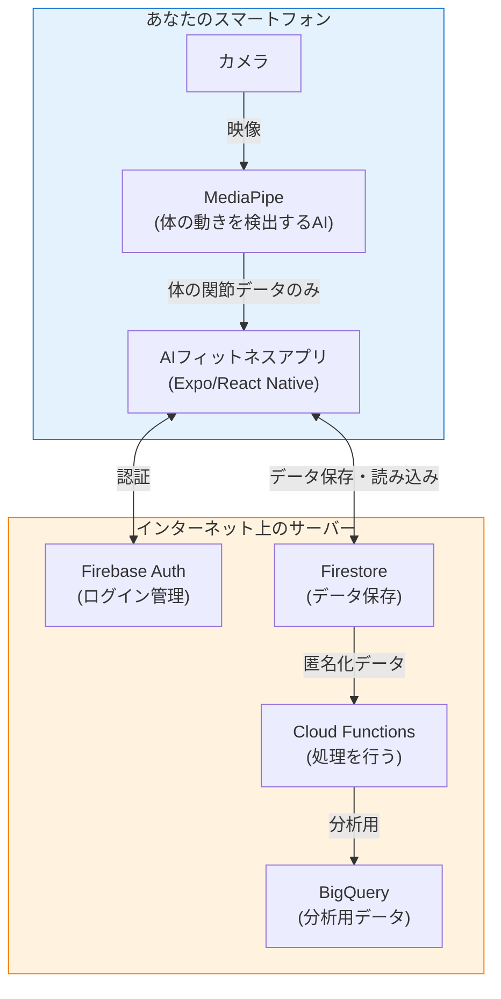
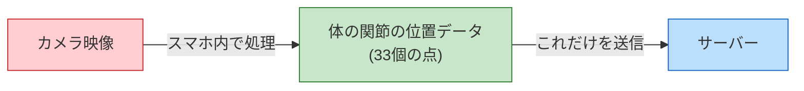
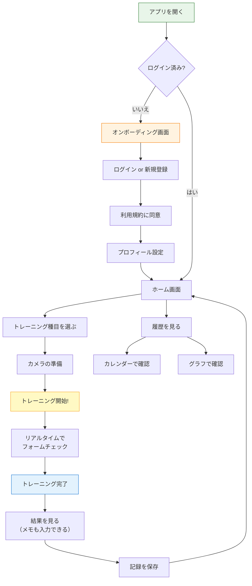
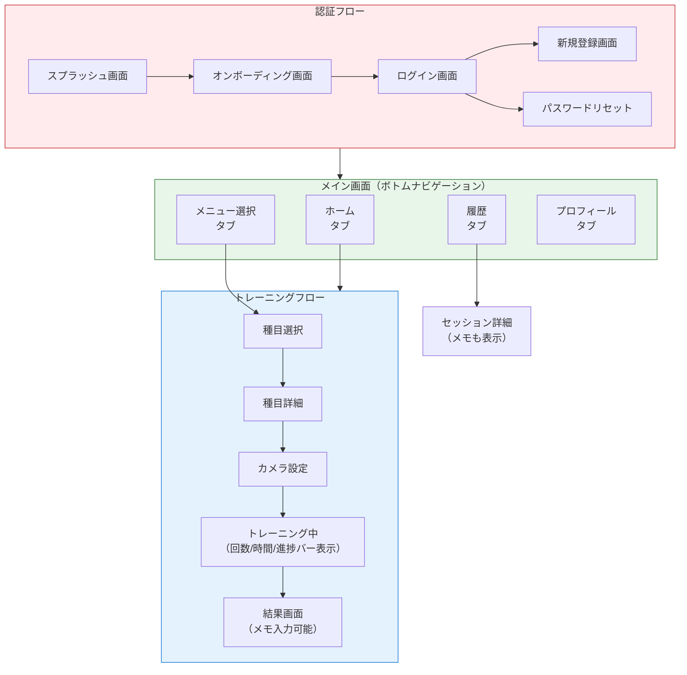
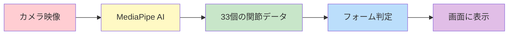
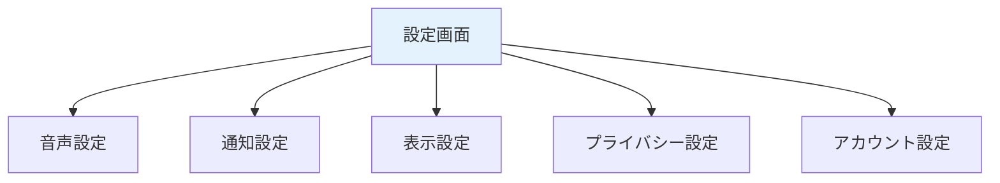
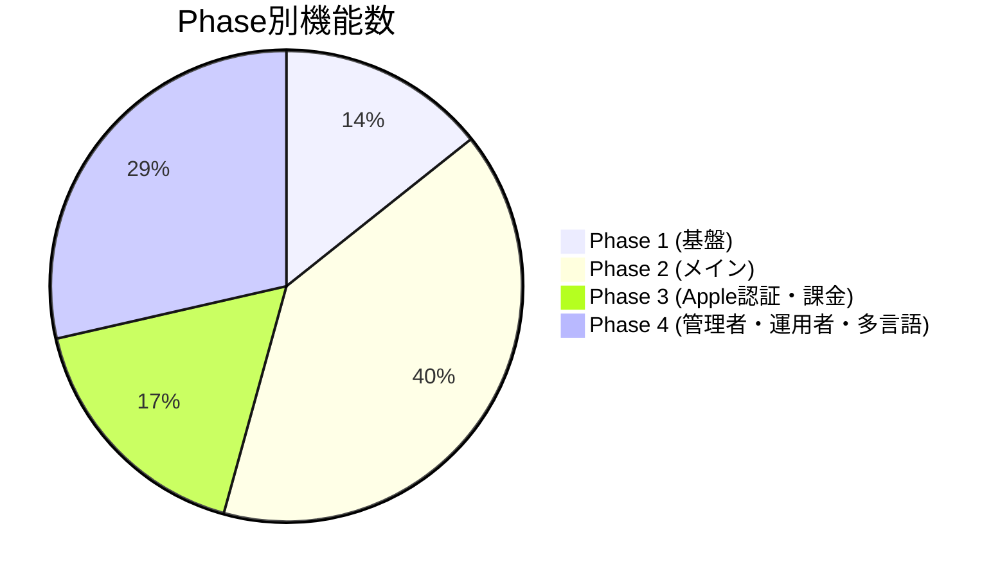

# 要件定義書 Expo版 v1.0 - Part 1

**プロジェクト名**: AIフィットネスアプリ (Expo版)
**バージョン**: 1.0.6 (MVP)
**最終更新日**: 2025年12月9日
**対象範囲**: Part 1 - プロジェクト概要と機能要件 (FR-001〜FR-017)

---

## 目次

### Part 1: プロジェクト概要〜機能要件
1. [プロジェクト概要](#1-プロジェクト概要)
   - 1.1 [アプリの目的](#11-アプリの目的)
   - 1.2 [ターゲットユーザー](#12-ターゲットユーザー)
   - 1.3 [主要機能の概要](#13-主要機能の概要)
2. [アプリの概要図](#2-アプリの概要図)
   - 2.1 [システム全体図](#21-システム全体図)
   - 2.2 [ユーザーの使い方の流れ](#22-ユーザーの使い方の流れ)
   - 2.3 [画面遷移の概要](#23-画面遷移の概要)
3. [機能要件一覧](#3-機能要件一覧)
   - 3.1 [認証機能](#31-認証機能)
   - 3.2 [プロフィール機能](#32-プロフィール機能)
   - 3.3 [トレーニング機能](#33-トレーニング機能)
   - 3.4 [記録・履歴機能](#34-記録履歴機能)
   - 3.5 [設定機能](#35-設定機能)
   - 3.6 [通知機能](#36-通知機能)

---

## 1. プロジェクト概要

### 1.1 アプリの目的

#### このアプリは何をするの?

**AIフィットネスアプリ**は、スマートフォンのカメラを使って、あなたのトレーニングフォーム（体の動かし方）が正しいかどうかをチェックしてくれるアプリです。

#### なぜこのアプリが必要なの?

自宅でトレーニングをする人が増えていますが、こんな問題があります:

| 問題 | このアプリでの解決方法 |
|-----|---------------------|
| フォームが正しいかわからない | カメラでリアルタイムにチェック |
| パーソナルトレーナーは高い | 月額500円で利用可能 |
| ジムに通う時間がない | いつでもどこでもスマホ1台で |
| 続けるモチベーションが保てない | 記録が残ってグラフで見える |

#### このアプリでできること

- スマホのカメラで体の動きをチェック
- 音声で「もう少し深くしゃがんでみて」などのアドバイス
- トレーニングの記録を保存
- カレンダーやグラフで自分の成長を確認

#### このアプリでできないこと（大事な注意点）

| できないこと | 理由 |
|------------|------|
| 病気やケガの診断 | お医者さんではありません |
| 絶対にケガしない保証 | あくまで参考情報です |
| 必ず痩せる・筋肉がつく保証 | 効果は人それぞれです |
| リハビリのサポート | 医療行為はできません |

**大切なこと**: このアプリはあくまで「参考情報」を提供するものです。体に不安がある場合は、必ずお医者さんや専門家に相談してください。

---

### 1.2 ターゲットユーザー

#### メインターゲット

| 対象 | 特徴 |
|-----|------|
| 年齢 | 13歳以上（日本）、16歳以上（ヨーロッパ） |
| 運動経験 | 初心者〜中級者 |
| 目的 | 健康維持、ダイエット、筋トレ |
| 場所 | 自宅でトレーニングしたい人 |

#### 18歳未満の人へ

18歳未満の方がこのアプリを使う場合は、保護者（お父さん、お母さんなど）の同意が必要です。

#### こんな人におすすめ

- ジムに通う時間やお金がない人
- 正しいフォームを知りたい初心者
- トレーニングの記録を残したい人
- 自分のペースで運動したい人

---

### 1.3 主要機能の概要

このアプリには、大きく分けて6つの機能があります。

#### 機能カテゴリ一覧

| カテゴリ | 説明 | 主な機能 |
|---------|------|----------|
| 認証 | アカウントの作成・ログイン | メール認証、Google認証（Apple認証はPhase 3で実装） |
| プロフィール | 自分の情報を管理 | 運動経験、性別、目標、生年月日、身長・体重 |
| トレーニング | 実際に運動する | カメラでフォームチェック、音声アドバイス |
| 記録・履歴 | 運動の記録を見る | カレンダー、グラフ、詳細履歴 |
| 設定 | アプリの設定を変える | 通知、音声、プライバシー設定 |
| 通知 | お知らせを受け取る | トレーニングのリマインダー |

#### 開発フェーズについて

このアプリは段階的に開発されます:

| フェーズ | 期間 | 内容 |
|---------|------|------|
| Phase 1 | 0〜2ヶ月目 | 基盤作り（認証、プロフィール）※無料トライアル終了後の課金導線を見越して設計 |
| Phase 2 | 2〜7ヶ月目 | メイン機能（トレーニング、記録、設定） |
| Phase 3 | 8ヶ月目以降 | Apple認証・課金機能（Stripe）の実装 |
| Phase 4 | 将来 | 管理者・運用者機能、多言語対応など |

#### プラットフォーム対応について

本アプリはExpo（React Native）を使用し、iOS/Android両方のプラットフォームに対応することを目標としています。

| 対応方針 | 説明 |
|---------|------|
| **通常** | Expoで両プラットフォーム同時開発 |
| **代替案** | 万が一の場合、AndroidはFlutter版、iOSはExpo版で分離開発 |

**注意**: プラットフォーム分離開発は最終手段です。可能な限りExpoでの統一開発を優先します。

---

## 2. アプリの概要図

### 2.1 システム全体図

このアプリがどのように動いているかを図で説明します。

#### 大事なポイント: プライバシー保護

**安心ポイント**: カメラで撮った映像そのものは、スマートフォンの外には一切出ません。AIが検出した「体の関節の位置（点のデータ）」だけがサーバーに送られます。

---

### 2.2 ユーザーの使い方の流れ

アプリを使う時の流れを説明します。

---

### 2.3 画面遷移の概要

アプリの画面構成を図で説明します。

---

## 3. 機能要件一覧

ここでは、このアプリが持つ機能を詳しく説明します。各機能には以下の情報があります:

- **ID**: 機能を識別するための番号
- **カテゴリ**: 機能の種類
- **機能名**: 機能の名前
- **説明**: その機能が何をするか
- **実装状況**: 作られているかどうか
- **Phase**: いつ作られるか

---

### 3.1 認証機能

ログインやアカウント作成に関する機能です。

#### FR-001: メールアドレス/パスワード認証

| 項目 | 内容 |
|------|------|
| **ID** | FR-001 |
| **カテゴリ** | 認証 |
| **機能名** | メールアドレス/パスワード認証 |
| **説明** | メールアドレスとパスワードでアカウントを作成し、ログインできる機能。パスワードは8文字以上128文字以下で、英字・数字を混ぜる必要があります（記号は不要）。 |
| **実装状況** | 実装済み |
| **Phase** | Phase 1 |

**もっと詳しく**:
- 新しくアカウントを作る時は、メールアドレスとパスワードを入力します
- パスワードは8文字以上128文字以下で、英字・数字を混ぜる必要があります
- 登録したメールアドレスに確認メールが届きます
- 確認メールをクリックしなくてもアプリを利用できます（メール認証は任意）

**メール確認が必要な操作**:
ただし、以下の操作にはメールアドレスの確認が必要です:
- パスワードのリセット
- 有料プランへの課金（Stripe決済）
- データのダウンロード（GDPR対応）

これらの操作を行おうとした際に、メールが未確認の場合は「メールアドレスを確認してください」という案内が表示され、確認メールを再送信できます。

---

#### FR-015: Google認証

| 項目 | 内容 |
|------|------|
| **ID** | FR-015 |
| **カテゴリ** | 認証 |
| **機能名** | Google認証 |
| **説明** | Googleのアカウントでログインできる機能。 |
| **実装状況** | 一部実装 |
| **Phase** | Phase 1 |

**もっと詳しく**:
- すでに持っているGoogleアカウントでログインできます
- 新しいパスワードを覚える必要がありません
- ワンタップで簡単にログインできます

---

#### FR-015-1: Apple認証

| 項目 | 内容 |
|------|------|
| **ID** | FR-015-1 |
| **カテゴリ** | 認証 |
| **機能名** | Apple認証 |
| **説明** | Apple IDでログインできる機能。 |
| **実装状況** | 未実装 |
| **Phase** | Phase 3 |

**もっと詳しく**:
- すでに持っているApple IDでログインできます
- iPhoneユーザーにとって便利なログイン方法です
- この機能はPhase 3で課金機能と同時に実装予定です
- App Storeの審査要件として、ソーシャルログインを提供する場合はApple認証も必須となるため、課金機能と同時実装が効率的です

---

### 3.2 プロフィール機能

自分の情報を管理する機能です。

#### FR-002: プロフィール管理

| 項目 | 内容 |
|------|------|
| **ID** | FR-002 |
| **カテゴリ** | プロフィール |
| **機能名** | プロフィール管理 |
| **説明** | 運動経験、性別、目標、生年月日、身長・体重などの情報を登録・編集できる機能。 |
| **実装状況** | 一部実装 |
| **Phase** | Phase 1 |

**もっと詳しく**:

登録できる項目:
| 項目 | 説明 |
|------|------|
| 運動経験 | 初心者、中級者、上級者など |
| 性別 | 男性、女性、その他、回答しない |
| 目標 | ダイエット、筋力アップ、健康維持など |
| 生年月日 | 年齢に合わせたアドバイスのため |
| 身長・体重 | より正確なフォームチェックのため |

- これらの情報はいつでも変更できます
- 入力は任意の項目もあります

---

#### FR-002-1: 同意状態管理機能

| 項目 | 内容 |
|------|------|
| **ID** | FR-002-1 |
| **カテゴリ** | プロフィール |
| **機能名** | 同意状態管理機能 |
| **説明** | 利用規約やプライバシーポリシーに同意したかどうかを確認・管理できる機能。同意を取り消すとログアウトされる。 |
| **実装状況** | 一部実装 |
| **Phase** | Phase 1 |

**もっと詳しく**:
- アプリを使うには、利用規約とプライバシーポリシーへの同意が必要です
- 同意した内容はいつでも確認できます
- もし同意を取り消したい場合は、アプリからログアウトされます

---

### 3.3 トレーニング機能

実際にトレーニングを行う時の機能です。

#### FR-003: 種目選択

| 項目 | 内容 |
|------|------|
| **ID** | FR-003 |
| **カテゴリ** | トレーニング |
| **機能名** | 種目選択 |
| **説明** | MVP版では5種目から選べる機能。他のサービスとの違いを出すためにダンベル種目も含め、MediaPipeで計測しやすい種目を選んでいます。 |
| **実装状況** | 未実装 |
| **Phase** | Phase 2 |

**もっと詳しく**:

選べる5つの種目（ダンベルあり・なし両方含む）:
| 種目名 | ダンベル | 難易度 | 主に鍛える部位 |
|--------|----------|--------|----------------|
| スクワット | なし | 初級 | 太もも、お尻 |
| プッシュアップ | なし | 中級 | 胸、腕 |
| アームカール | あり | 初級 | 腕（上腕二頭筋） |
| サイドレイズ | あり | 初級 | 肩 |
| ショルダープレス | あり | 中級 | 肩、腕 |

**ポイント**: MediaPipe（体の動きを検出するAI）で測りやすい種目をピックアップしています。

---

#### FR-003-1: 種目詳細画面

| 項目 | 内容 |
|------|------|
| **ID** | FR-003-1 |
| **カテゴリ** | トレーニング |
| **機能名** | 種目詳細画面 |
| **説明** | 選んだ種目の詳しい情報、おすすめのカメラの向き、前回の記録、目標設定を表示する画面。 |
| **実装状況** | 未実装 |
| **Phase** | Phase 2 |

**もっと詳しく**:
- 種目を選ぶと、その種目の詳しい情報が表示されます
- カメラをどの角度に置くと良いかのアドバイスがあります
- 前回トレーニングした時の記録も確認できます
- 今日の目標（回数や時間）を設定できます

---

#### FR-004: フォーム確認補助（MediaPipe）

| 項目 | 内容 |
|------|------|
| **ID** | FR-004 |
| **カテゴリ** | トレーニング |
| **機能名** | フォーム確認補助（MediaPipe） |
| **説明** | スマホのカメラで体の動きをリアルタイムで検出し、フォームが正しいか確認を手伝う機能。カメラ映像は外部に送られず、スマホの中だけで処理される。 |
| **実装状況** | 未実装 |
| **Phase** | Phase 2 |

**もっと詳しく**:
- カメラで撮影しながら、AIが体の33個の関節の位置を検出します
- リアルタイムで画面に骨格（棒人間のような線）が表示されます
- フォームが正しいかどうかを判定して、アドバイスを表示します
- **プライバシー保護**: 映像はスマホの外には一切送信されません

**技術検証（PoC）について**:
MediaPipeのExpo/React Native環境での統合は技術的な課題があるため、Phase 2の開始前に技術検証（PoC: Proof of Concept）を実施します。この検証では以下を確認します:
- Development Buildでの動作確認
- 30fps以上のフレームレートが達成できるか
- iOS/Android両方での動作確認

もしMediaPipeが期待通り動作しない場合は、TensorFlow.jsを代替手段として検討します。

---

#### FR-004-1: カメラ設定自動開始機能

| 項目 | 内容 |
|------|------|
| **ID** | FR-004-1 |
| **カテゴリ** | トレーニング |
| **機能名** | カメラ設定自動開始機能 |
| **説明** | カメラの位置を合わせたら、「3...2...1...スタート!」と自動でトレーニングが始まる便利機能。 |
| **実装状況** | 未実装 |
| **Phase** | Phase 2 |

**もっと詳しく**:
- カメラの位置を合わせたら、「3...2...1...スタート!」と自動で始まります
- 準備ができたらボタンを押すだけでOK
- カウントダウン中に位置を調整する時間があります

**追加機能**:
- トレーニング中にカメラで体が認識できなくなった場合、一時停止となり、再度体が認識されると自動的に再開します。一定時間（30秒）認識できない場合は、セッションを終了するかどうかの確認ダイアログが表示されます。

---

#### FR-005: 音声フィードバック

| 項目 | 内容 |
|------|------|
| **ID** | FR-005 |
| **カテゴリ** | トレーニング |
| **機能名** | 音声フィードバック |
| **説明** | トレーニング中に音声で参考情報を教えてくれる機能。「参考:もう少し深くしゃがんでみてください」など。 |
| **実装状況** | 未実装 |
| **Phase** | Phase 2 |

**もっと詳しく**:
- 画面を見なくても、音声でアドバイスを聞けます
- 「参考:膝がつま先より前に出ています」などのアドバイス
- 回数のカウントも音声で教えてくれます
- 音量や読み上げ速度は設定で変更できます

---

#### FR-005-1: トレーニング進捗表示

| 項目 | 内容 |
|------|------|
| **ID** | FR-005-1 |
| **カテゴリ** | トレーニング |
| **機能名** | トレーニング進捗表示 |
| **説明** | トレーニング中に回数、時間、進捗バーを表示する機能。YouTubeの動画再生バーのように全体の進捗がひと目でわかり、リアルタイムで更新されます。 |
| **実装状況** | 未実装 |
| **Phase** | Phase 2 |

**もっと詳しく**:

表示される情報:
| 表示項目 | 説明 |
|----------|------|
| 回数 | 今何回目かをリアルタイムで表示 |
| 時間 | 経過時間または残り時間を表示 |
| 進捗バー | YouTube風の全体進捗バー |

- 進捗バーはリアルタイムで更新されます
- 目標に対してどれくらい進んでいるかがひと目でわかります

---

### 3.4 記録・履歴機能

トレーニングの記録を保存・確認する機能です。

#### FR-007: トレーニング記録保存

| 項目 | 内容 |
|------|------|
| **ID** | FR-007 |
| **カテゴリ** | 記録 |
| **機能名** | トレーニング記録保存 |
| **説明** | トレーニングの記録（種目、回数、時間など）をデータベースに保存する機能。トレーニング終了時に結果が表示され、メモも入力できます。 |
| **実装状況** | 未実装 |
| **Phase** | Phase 2 |

**もっと詳しく**:

保存される情報:
- やった種目（スクワットなど）
- 回数（何回やったか）
- 時間（何分間やったか）
- 日時（いつやったか）
- メモ（自分で入力した感想など）

**トレーニング終了時の画面**:
- 上記の記録が表示されます
- 感想や気づいたことをメモとして入力できます
- 保存ボタンを押すと記録が保存されます

---

#### FR-008: カレンダー表示

| 項目 | 内容 |
|------|------|
| **ID** | FR-008 |
| **カテゴリ** | 履歴 |
| **機能名** | カレンダー表示 |
| **説明** | トレーニング履歴をカレンダー形式で表示し、運動した日にマークがつく機能。 |
| **実装状況** | 未実装 |
| **Phase** | Phase 2 |

**もっと詳しく**:
- カレンダーを見れば、どの日に運動したかが一目でわかります
- 運動した日にはマーク（点や色）がつきます
- 連続して運動した日数も確認できます

---

#### FR-009: グラフ表示

| 項目 | 内容 |
|------|------|
| **ID** | FR-009 |
| **カテゴリ** | 履歴 |
| **機能名** | グラフ表示 |
| **説明** | 過去7日間のトレーニング時間や、30日間の頻度をグラフで表示する機能。 |
| **実装状況** | 未実装 |
| **Phase** | Phase 2 |

**もっと詳しく**:

表示されるグラフ:
| グラフの種類 | 内容 |
|--------------|------|
| 7日間の運動時間 | 1週間でどれくらい運動したか |
| 30日間の運動頻度 | 1ヶ月間で何日運動したか |

---

#### FR-010: セッション詳細表示

| 項目 | 内容 |
|------|------|
| **ID** | FR-010 |
| **カテゴリ** | 履歴 |
| **機能名** | セッション詳細表示 |
| **説明** | 過去のトレーニングの詳細（種目、日時、時間、回数、メモなど）を見られる機能。 |
| **実装状況** | 未実装 |
| **Phase** | Phase 2 |

**もっと詳しく**:
- 過去のトレーニング1つ1つの詳しい情報を見られます
- どの種目を何回やったかがわかります
- トレーニング終了時に入力したメモも確認できます
- 良かった点や改善点も確認できます

---

### 3.5 設定機能

アプリの動作を自分好みに変える機能です。

#### FR-011: 通知設定

| 項目 | 内容 |
|------|------|
| **ID** | FR-011 |
| **カテゴリ** | 設定 |
| **機能名** | 通知設定 |
| **説明** | リマインダー通知のON/OFF、時刻、頻度を設定できる機能。 |
| **実装状況** | 未実装 |
| **Phase** | Phase 2 |

**もっと詳しく**:
- トレーニングの時間になったらお知らせを受け取るかどうかを選べます
- 何時にお知らせが欲しいかを設定できます
- 毎日、週に何回などの頻度を選べます

---

#### FR-012: 音声設定

| 項目 | 内容 |
|------|------|
| **ID** | FR-012 |
| **カテゴリ** | 設定 |
| **機能名** | 音声設定 |
| **説明** | 音声フィードバックのON/OFF、音量、読み上げ速度を調整できる機能。 |
| **実装状況** | 未実装 |
| **Phase** | Phase 2 |

**もっと詳しく**:
- 音声アドバイスをON/OFFできます
- 音量を調整できます
- 読み上げの速さを変えられます（ゆっくり〜速め）

---

#### FR-013: 言語設定

| 項目 | 内容 |
|------|------|
| **ID** | FR-013 |
| **カテゴリ** | 設定 |
| **機能名** | 言語設定 |
| **説明** | MVP版は日本語のみ対応。将来の多言語対応に備えて、拡張しやすい作りにしています。 |
| **実装状況** | 未実装 |
| **Phase** | Phase 4 |

**もっと詳しく**:
- MVP版は日本語のみです
- 今後、英語などに対応できるように設計しています
- この機能はPhase 4（将来）で追加予定です

---

#### FR-014: プライバシー設定

| 項目 | 内容 |
|------|------|
| **ID** | FR-014 |
| **カテゴリ** | 設定 |
| **機能名** | プライバシー設定 |
| **説明** | データ収集の同意状態の確認、同意の取り消し、データダウンロード（PDF形式）、アカウント削除ができる機能。 |
| **実装状況** | 一部実装 |
| **Phase** | Phase 1 |

**もっと詳しく**:

できること:
| 機能 | 説明 |
|------|------|
| 同意状態の確認 | どんなデータ収集に同意しているか確認 |
| 同意の取り消し | データ収集への同意を取り消せる |
| データダウンロード | 自分のデータをPDF形式でダウンロードできる |
| アカウント削除 | アカウントと全データを削除できる |

**データダウンロードについて**:
- PDFファイル形式でダウンロードできます
- 画面のボタンを押すと、スマホに直接ダウンロードされます

**注意**: アカウント削除をリクエストすると、30日間の猶予期間の後に完全に削除されます。

---

#### FR-016: 設定管理機能

| 項目 | 内容 |
|------|------|
| **ID** | FR-016 |
| **カテゴリ** | 設定 |
| **機能名** | 設定管理機能 |
| **説明** | 音声、通知、表示、プライバシー、アカウントの設定を一括管理できる機能。 |
| **実装状況** | 未実装 |
| **Phase** | Phase 2 |

**もっと詳しく**:
- すべての設定を1つの画面からアクセスできます
- カテゴリごとに整理されていて見やすいです

設定カテゴリ:

---

### 3.6 通知機能

お知らせに関する機能です。

#### FR-017: リマインダー通知

| 項目 | 内容 |
|------|------|
| **ID** | FR-017 |
| **カテゴリ** | 通知 |
| **機能名** | リマインダー通知 |
| **説明** | 設定した時刻にトレーニングのリマインダーをプッシュ通知で送る機能。 |
| **実装状況** | 未実装 |
| **Phase** | Phase 2 |

**もっと詳しく**:
- 設定した時刻になると「トレーニングの時間です!」とお知らせが届きます
- 通知をタップするとアプリが開きます
- 通知が不要な場合はOFFにできます

---

### 3.7 課金機能

有料プランに関する機能です。**決済にはStripeを使用し、RevenueCatは代替手段として位置づけます。**

#### 課金機能の設計方針

Phase 1から課金導線を見越した設計を行い、Phase 3で実装します:

| 設計段階 | 内容 |
|---------|------|
| Phase 1 | UIで「Premium」バッジ表示エリアを確保、課金フローのモック画面作成 |
| Phase 2 | 無料トライアル期間の管理ロジック準備、課金API呼び出し箇所の設計 |
| Phase 3 | Stripe決済の実装・テスト・リリース |

#### FR-019: サブスクリプション管理

| 項目 | 内容 |
|------|------|
| **ID** | FR-019 |
| **カテゴリ** | 課金 |
| **機能名** | サブスクリプション管理 |
| **説明** | 月額プランや年額プランの購入・管理ができる機能。決済はStripeを使用（RevenueCatは代替）。 |
| **実装状況** | 未実装 |
| **Phase** | Phase 3 |

**もっと詳しく**:
- 月額500円のプランを購入できます
- 年額プラン（お得）も選べます
- いつでも解約できます

**決済サービスの選定理由**:
- **Stripe（メイン）**: Web版との統一、柔軟な価格設定、日本での実績
- **RevenueCat（代替）**: Stripe導入に問題が生じた場合のバックアップ

---

#### FR-020: 無料/有料機能の切り替え

| 項目 | 内容 |
|------|------|
| **ID** | FR-020 |
| **カテゴリ** | 課金 |
| **機能名** | 無料/有料機能の切り替え |
| **説明** | 無料ユーザーと有料ユーザーで使える機能を切り替える機能。 |
| **実装状況** | 未実装 |
| **Phase** | Phase 3 |

**もっと詳しく**:
- 無料プランでも基本的な機能は使えます
- 有料プランでは全ての機能が使えます

---

#### FR-021: 購入履歴表示

| 項目 | 内容 |
|------|------|
| **ID** | FR-021 |
| **カテゴリ** | 課金 |
| **機能名** | 購入履歴表示 |
| **説明** | 過去の購入履歴を確認できる機能。 |
| **実装状況** | 未実装 |
| **Phase** | Phase 3 |

**もっと詳しく**:
- いつ購入したかを確認できます
- 領収書の確認もできます

---

#### FR-022: 解約機能

| 項目 | 内容 |
|------|------|
| **ID** | FR-022 |
| **カテゴリ** | 課金 |
| **機能名** | 解約機能 |
| **説明** | サブスクリプションを解約できる機能。 |
| **実装状況** | 未実装 |
| **Phase** | Phase 3 |

**もっと詳しく**:
- いつでも解約できます
- 解約後も有効期限までは使えます

---

#### FR-022-1: 決済システム（Stripe）

| 項目 | 内容 |
|------|------|
| **ID** | FR-022-1 |
| **カテゴリ** | 課金 |
| **機能名** | 決済システム（Stripe） |
| **説明** | Stripeを使った安全な決済処理機能。RevenueCatは代替手段として準備。 |
| **実装状況** | 未実装 |
| **Phase** | Phase 3 |

**もっと詳しく**:
- クレジットカードで安全に支払いができます
- Stripeという信頼できる決済サービスを使用します
- カード情報はStripeが安全に管理します
- Apple/Google Playのアプリ内課金にも対応予定

---

## 機能要件サマリー

### 実装状況一覧表

| ID | カテゴリ | 機能名 | 実装状況 | Phase |
|----|----------|--------|----------|-------|
| FR-001 | 認証 | メールアドレス/パスワード認証 | 実装済み | Phase 1 |
| FR-002 | プロフィール | プロフィール管理 | 一部実装 | Phase 1 |
| FR-002-1 | プロフィール | 同意状態管理機能 | 一部実装 | Phase 1 |
| FR-003 | トレーニング | 種目選択 | 未実装 | Phase 2 |
| FR-003-1 | トレーニング | 種目詳細画面 | 未実装 | Phase 2 |
| FR-004 | トレーニング | フォーム確認補助（MediaPipe） | 未実装 | Phase 2 |
| FR-004-1 | トレーニング | カメラ設定自動開始機能 | 未実装 | Phase 2 |
| FR-005 | トレーニング | 音声フィードバック | 未実装 | Phase 2 |
| FR-005-1 | トレーニング | トレーニング進捗表示 | 未実装 | Phase 2 |
| FR-007 | 記録 | トレーニング記録保存 | 未実装 | Phase 2 |
| FR-008 | 履歴 | カレンダー表示 | 未実装 | Phase 2 |
| FR-009 | 履歴 | グラフ表示 | 未実装 | Phase 2 |
| FR-010 | 履歴 | セッション詳細表示 | 未実装 | Phase 2 |
| FR-011 | 設定 | 通知設定 | 未実装 | Phase 2 |
| FR-012 | 設定 | 音声設定 | 未実装 | Phase 2 |
| FR-013 | 設定 | 言語設定 | 未実装 | Phase 4 |
| FR-014 | 設定 | プライバシー設定 | 一部実装 | Phase 1 |
| FR-015 | 認証 | Google認証 | 一部実装 | Phase 1 |
| FR-015-1 | 認証 | Apple認証 | 未実装 | Phase 3 |
| FR-016 | 設定 | 設定管理機能 | 未実装 | Phase 2 |
| FR-017 | 通知 | リマインダー通知 | 未実装 | Phase 2 |
| FR-019 | 課金 | サブスクリプション管理 | 未実装 | Phase 3 |
| FR-020 | 課金 | 無料/有料機能の切り替え | 未実装 | Phase 3 |
| FR-021 | 課金 | 購入履歴表示 | 未実装 | Phase 3 |
| FR-022 | 課金 | 解約機能 | 未実装 | Phase 3 |
| FR-022-1 | 課金 | 決済システム（Stripe） | 未実装 | Phase 3 |

### Phase別の機能数

| Phase | 機能数 | 実装済み | 一部実装 | 未実装 |
|-------|--------|----------|----------|--------|
| Phase 1 | 5 | 1 | 4 | 0 |
| Phase 2 | 14 | 0 | 0 | 14 |
| Phase 3 | 6 | 0 | 0 | 6 |
| Phase 4 | 10 | 0 | 0 | 10 |
| **合計** | **35** | **1** | **4** | **30** |

---

## 次のPart（Part 2）の内容

Part 2では以下の内容を記載予定です:

- 非機能要件一覧（NFR-001〜）
- 制約条件
- 前提条件
- 用語集

---

## 変更履歴

| バージョン | 日付 | 変更内容 |
|-----------|------|----------|
| 1.0 | 2025年12月8日 | 初版作成 |
| 1.0.1 | 2025年12月8日 | FR-001: メール認証任意化、パスワード最大値追加。FR-002: 身長フィールド明記。FR-004-1: カメラ認識中断時の動作を正式仕様化 |
| 1.0.2 | 2025年12月8日 | FR-001: メール確認が必要な操作を追加（課金、パスワードリセット、データダウンロード）。FR-004: MediaPipe技術検証（PoC）の説明を追加 |
| 1.0.4 | 2025年12月9日 | Phase構成変更: Phase 3を「管理者・運用者機能」に、Phase 4を「Apple認証・課金機能・多言語対応」に変更。FR-015-1（Apple認証）、FR-019〜FR-022-1（課金機能）をPhase 4に移動 |
| 1.0.5 | 2025年12月9日 | リスク対応に基づく変更: (1) Phase構成再変更 - Phase 3を「Apple認証・課金機能」、Phase 4を「管理者・運用者・多言語」に変更 (2) Apple認証（FR-015-1）と課金機能（FR-019〜FR-022-1）をPhase 3に移動 (3) Stripe仕様統一、RevenueCat代替化 (4) iOS/Android両対応の代替案追記（Expo優先、最悪時Flutter併用） (5) Phase 1から課金導線を見越した設計方針を追加 |
| 1.0.6 | 2025年12月9日 | Phase別機能数を確認（管理者機能9件をPhase 4に反映済み）。Phase 1: 5件、Phase 2: 14件、Phase 3: 6件、Phase 4: 10件（言語設定1件＋管理者機能9件） |

---

**ドキュメント情報**

| 項目 | 内容 |
|------|------|
| 作成者 | AIフィットネスアプリ開発チーム |
| 作成日 | 2025年12月9日 |
| バージョン | 1.0.6 |
| ファイル名 | 01_要件定義書_Expo版_v1_Part1.md |
