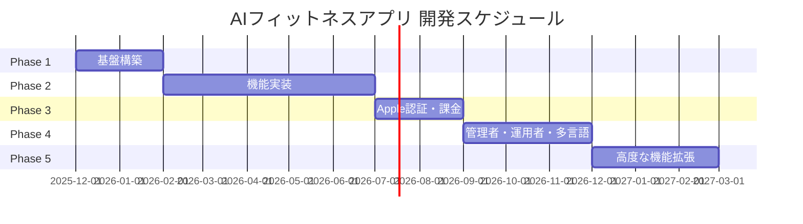

# 開発計画 v1.0 (Expo版)

**プロジェクト名**: AIフィットネスアプリ（Expo版）
**バージョン**: 1.0.0
**作成日**: 2025年12月9日
**最終更新日**: 2025年12月9日
**対象読者**: 開発チーム、プロジェクトマネージャー、ステークホルダー

---

## 目次

1. [開発フェーズ概要](#1-開発フェーズ概要)
2. [Phase 1: 基盤構築（0-2ヶ月）](#2-phase-1-基盤構築0-2ヶ月)
3. [Phase 2: 機能実装（2-7ヶ月）](#3-phase-2-機能実装2-7ヶ月)
4. [Phase 3: Apple認証・課金機能（8ヶ月目以降）](#4-phase-3-apple認証課金機能8ヶ月目以降)
5. [Phase 4: 管理者・運用者・多言語（将来）](#5-phase-4-管理者運用者多言語将来)
6. [Phase 5: 高度な機能拡張（将来）](#6-phase-5-高度な機能拡張将来)
7. [開発スケジュール](#7-開発スケジュール)
8. [マイルストーン](#8-マイルストーン)
9. [リスクとバッファ](#9-リスクとバッファ)
10. [現在の実装状況](#10-現在の実装状況)
11. [変更履歴](#11-変更履歴)

---

## 1. 開発フェーズ概要

### 1.1 フェーズ構成



### 1.2 各フェーズの目標

| フェーズ | 期間 | 目標 | 主要成果物 |
|---------|------|------|-----------|
| **Phase 1** | 0-2ヶ月 | セキュリティとデータ保護を最優先した基盤構築 | Firebase環境、認証基盤、セキュリティルール |
| **Phase 2** | 2-7ヶ月 | MVP完成、リリース可能な製品 | MediaPipe統合、5種目実装、ストア申請 |
| **Phase 3** | 8ヶ月目以降 | 収益化の実現 | Apple認証、Stripe課金 |
| **Phase 4** | 将来 | 運用効率化、グローバル展開準備 | 管理者ダッシュボード、英語対応 |
| **Phase 5** | 将来 | AI高度化、ソーシャル機能 | カスタムMLモデル、友達機能 |

---

## 2. Phase 1: 基盤構築（0-2ヶ月）

### 2.1 概要

| 項目 | 内容 |
|-----|------|
| **期間** | 2ヶ月 |
| **目標** | セキュリティとデータ保護を最優先した基盤構築、課金導線を見越した設計 |
| **チーム** | バックエンドエンジニア2名、フロントエンドエンジニア2名、QA1名 |

### 2.2 主要タスク

| タスク | 担当 | 期間 | 優先度 | 詳細 |
|--------|------|------|--------|------|
| Firebase プロジェクト作成 | バックエンド | 3日 | 最高 | 本番・開発環境の構築 |
| 開発環境セットアップ | 全員 | 5日 | 最高 | Expo、Git、CI/CD環境 |
| Firestore セキュリティルール実装 | バックエンド | 5日 | 最高 | フィールドレベルの制御 |
| Firebase Authentication 設定 | バックエンド | 3日 | 最高 | メール/Google認証 |
| CI/CD パイプライン構築 | バックエンド | 5日 | 高 | GitHub Actions |
| 基本UI実装 | フロントエンド | 10日 | 高 | ログイン、登録、ホーム画面 |
| 監視・ログ基盤構築 | バックエンド | 3日 | 高 | Cloud Logging、Sentry |

### 2.3 タスク詳細

#### 2.3.1 Firebase プロジェクト作成

**目標**: 本番環境と開発環境を分離して作成

**手順**:
1. Firebaseコンソールでプロジェクト作成
   - 本番: `ai-fitness-app-prod`
   - 開発: `ai-fitness-app-dev`
2. iOS/Androidアプリを登録
3. Firestoreを有効化（リージョン: asia-northeast1）
4. Firebase Storageを有効化
5. BigQueryエクスポートを設定

**成果物**:
- Firebase設定ファイル
- `firebase.json`
- `.firebaserc`

#### 2.3.2 開発環境セットアップ

**目標**: チーム全員が開発できる環境を整備

**セットアップ内容**:
- Node.js 20.x LTS
- Expo CLI
- Xcode 15.x（iOS開発者）
- Android Studio 2024.x（Android開発者）
- VS Code + 推奨拡張機能

**推奨VS Code拡張機能**:
- ESLint
- Prettier
- TypeScript
- React Native Tools
- Expo Tools

#### 2.3.3 Firestore セキュリティルール実装

**目標**: フィールドレベルでのアクセス制御を実装

**主要ルール**:

```javascript
rules_version = '2';
service cloud.firestore {
  match /databases/{database}/documents {
    // ヘルパー関数
    function isAuthenticated() {
      return request.auth != null;
    }

    function isOwner(userId) {
      return isAuthenticated() && request.auth.uid == userId;
    }

    function isNotDeleted(userId) {
      return !get(/databases/$(database)/documents/users/$(userId)).data.deletionScheduled;
    }

    // ユーザーコレクション
    match /users/{userId} {
      allow read: if isOwner(userId);
      allow create: if isOwner(userId);
      allow update: if isOwner(userId)
        && !request.resource.data.diff(resource.data).affectedKeys()
           .hasAny(['tosAccepted', 'ppAccepted', 'deletionScheduled']);
      allow delete: if false; // 削除は管理者のみ
    }

    // セッションコレクション
    match /sessions/{sessionId} {
      allow read: if isAuthenticated() && resource.data.userId == request.auth.uid;
      allow create: if isAuthenticated()
        && request.resource.data.userId == request.auth.uid
        && isNotDeleted(request.auth.uid);
      allow update, delete: if false; // セッションは不変
    }
  }
}
```

**テスト**:
- Firestoreエミュレータでテスト
- `@firebase/rules-unit-testing` を使用

#### 2.3.4 Firebase Authentication 設定

**認証方式**:
- メール/パスワード認証
- Googleログイン
- （Phase 3でApple認証を追加）

**実装**:

```typescript
import auth from '@react-native-firebase/auth';

// メール/パスワード登録
async function register(email: string, password: string) {
  const userCredential = await auth().createUserWithEmailAndPassword(email, password);
  return userCredential.user;
}

// Googleログイン
import { GoogleSignin } from '@react-native-google-signin/google-signin';

async function signInWithGoogle() {
  await GoogleSignin.hasPlayServices();
  const { idToken } = await GoogleSignin.signIn();
  const googleCredential = auth.GoogleAuthProvider.credential(idToken);
  return auth().signInWithCredential(googleCredential);
}
```

#### 2.3.5 CI/CD パイプライン構築

**目標**: 自動テスト・デプロイの仕組みを構築

**GitHub Actions ワークフロー**:

```yaml
name: CI/CD

on:
  push:
    branches: [main, develop]
  pull_request:
    branches: [main, develop]

jobs:
  test:
    runs-on: ubuntu-latest
    steps:
      - uses: actions/checkout@v4
      - uses: actions/setup-node@v4
        with:
          node-version: '20'
      - run: npm ci
      - run: npm run lint
      - run: npm test

  deploy-dev:
    needs: test
    if: github.ref == 'refs/heads/develop'
    runs-on: ubuntu-latest
    steps:
      - uses: actions/checkout@v4
      - uses: actions/setup-node@v4
      - run: npm ci
      - run: npx firebase deploy --only functions,firestore:rules --project dev
```

#### 2.3.6 基本UI実装

**実装画面**:
1. スプラッシュ画面
2. オンボーディング画面（3画面）
3. ログイン画面
4. 新規登録画面（2ステップ）
5. 利用規約同意画面
6. ホーム画面

**使用ライブラリ**:
- Expo Router（ルーティング）
- React Native Paper（UIコンポーネント）
- Zustand（状態管理）

#### 2.3.7 監視・ログ基盤構築

**監視ツール**:

| ツール | 用途 | 設定内容 |
|-------|------|---------|
| **Cloud Logging** | サーバーログ | Cloud Functionsのログ収集 |
| **Sentry** | エラートラッキング | クライアントエラーの自動収集 |
| **Firebase Crashlytics** | クラッシュレポート | アプリクラッシュの収集 |

**Sentry設定**:

```typescript
import * as Sentry from '@sentry/react-native';

Sentry.init({
  dsn: 'YOUR_SENTRY_DSN',
  environment: __DEV__ ? 'development' : 'production',
});
```

### 2.4 成果物

1. **Firebase環境**: 本番・開発環境の構築完了
2. **セキュリティルール**: Firestoreセキュリティルール完全実装
3. **認証基盤**: メール/Google認証の実装
4. **基本API**: ユーザー情報取得・更新API
5. **GDPR対応基盤**: 同意管理、データ削除の仕組み
6. **CI/CDパイプライン**: 自動テスト・デプロイ
7. **監視基盤**: ログ・エラートラッキング

### 2.5 リスクバッファ

**期間**: 2週間

**想定リスク**:
- Firebase設定の不具合
- チーム内のスキルギャップ
- ライブラリの互換性問題

---

## 3. Phase 2: 機能実装（2-7ヶ月）

### 3.1 概要

| 項目 | 内容 |
|-----|------|
| **期間** | 5ヶ月 |
| **目標** | MVP（最小限の製品）完成とパフォーマンス最適化 |
| **チーム** | 同上 |

### 3.2 主要タスク

| タスク | 担当 | 期間 | 優先度 | 備考 |
|--------|------|------|--------|------|
| MediaPipe統合 | フロントエンド | 2週間 | 最高 | Development Build必須 |
| 5種目のフォーム確認補助機能 | フロントエンド | 4週間 | 最高 | 種目別アルゴリズム |
| トレーニング記録管理 | バックエンド | 2週間 | 最高 | Firestore保存 |
| 履歴・カレンダー表示 | フロントエンド | 2週間 | 高 | react-native-calendars |
| グラフ・統計表示 | フロントエンド | 2週間 | 高 | react-native-chart-kit |
| BigQuery パイプライン構築 | バックエンド | 2週間 | 高 | 分析基盤 |
| 音声ガイダンス実装 | フロントエンド | 1週間 | 中 | expo-speech |
| プッシュ通知実装 | バックエンド | 1週間 | 中 | Firebase Messaging |
| ストア申請準備 | 全員 | 2週間 | 高 | スクリーンショット、説明文 |

### 3.3 タスク詳細

#### 3.3.1 MediaPipe統合

**目標**: カメラで姿勢を検出する仕組みを実装

**手順**:

1. **Development Buildのセットアップ**
   ```bash
   npx expo install expo-dev-client
   npx expo prebuild
   ```

2. **react-native-vision-cameraのインストール**
   ```bash
   npm install react-native-vision-camera
   ```

3. **カメラ権限の設定**
   ```json
   {
     "expo": {
       "ios": {
         "infoPlist": {
           "NSCameraUsageDescription": "トレーニング中のフォームをチェックするためにカメラを使用します"
         }
       },
       "android": {
         "permissions": ["CAMERA"]
       }
     }
   }
   ```

4. **MediaPipeネイティブモジュールの作成**
   - iOS: Swift + MediaPipe Vision
   - Android: Kotlin + MediaPipe Vision

5. **フレームプロセッサの実装**
   ```typescript
   const frameProcessor = useFrameProcessor((frame) => {
     'worklet';
     const poseData = detectPose(frame);
     runOnJS(handlePoseData)(poseData);
   }, []);
   ```

**性能目標**:
- 通常デバイス: 30fps以上
- 低スペックデバイス: 15fps以上

**代替手段（MediaPipe失敗時）**:
- TensorFlow.js
- TensorFlow Lite
- クラウドAPI（最終手段）

#### 3.3.2 5種目のフォーム確認補助機能

**実装する種目**:

| 種目 | 推奨向き | 評価ポイント |
|-----|---------|------------|
| スクワット | 横向き | 膝角度90-110度、膝がつま先より前に出ない |
| プッシュアップ | 横向き | 体が一直線、肘角度約90度 |
| アームカール | 正面 | 肘角度30-160度、肘を体の横で固定 |
| サイドレイズ | 正面 | 腕挙上角度70-90度、左右対称 |
| ショルダープレス | 正面 | 肘角度90度→伸ばす、垂直軌道 |

**評価アルゴリズム例（スクワット）**:

```typescript
function evaluateSquat(pose: PoseData): EvaluationResult {
  const kneeAngle = calculateKneeAngle(pose);
  const isKneeBehindToe = checkKneeBehindToe(pose);
  const isBackStraight = checkBackStraight(pose);

  let score = 100;

  if (kneeAngle < 90) score -= 10;
  if (kneeAngle > 110) score -= 5;
  if (!isKneeBehindToe) score -= 20;
  if (!isBackStraight) score -= 15;

  return {
    score: Math.max(0, score),
    feedback: generateFeedback(kneeAngle, isKneeBehindToe, isBackStraight),
  };
}
```

**フィードバック生成**:

```typescript
function generateFeedback(kneeAngle: number, isKneeBehindToe: boolean, isBackStraight: boolean): string {
  if (!isKneeBehindToe) {
    return '参考: 膝がつま先より前に出ています';
  }
  if (kneeAngle < 90) {
    return '参考: 膝をもう少し曲げましょう';
  }
  if (!isBackStraight) {
    return '参考: 背中をまっすぐに保ちましょう';
  }
  return '参考: 良いフォームです';
}
```

#### 3.3.3 トレーニング記録管理

**Firestoreスキーマ**:

```typescript
interface Session {
  id: string;
  userId: string;
  exerciseType: 'squat' | 'pushup' | 'armcurl' | 'sideraise' | 'shoulderpress';
  startTime: Timestamp;
  endTime: Timestamp;
  targetReps: number;
  actualReps: number;
  score: number;
  poseData: Array<{
    timestamp: number;
    landmarks: number[][];
  }>;
  notes?: string;
  createdAt: Timestamp;
}
```

**保存処理**:

```typescript
import { collection, addDoc } from 'firebase/firestore';

async function saveSession(sessionData: Session) {
  const docRef = await addDoc(collection(db, 'sessions'), sessionData);
  console.log('セッション保存完了:', docRef.id);
}
```

#### 3.3.4 履歴・カレンダー表示

**react-native-calendarsの使用**:

```typescript
import { Calendar } from 'react-native-calendars';

const markedDates = {
  '2025-12-01': { marked: true, dotColor: '#4CAF50' },
  '2025-12-02': { marked: true, dotColor: '#4CAF50' },
};

<Calendar
  markedDates={markedDates}
  onDayPress={(day) => {
    console.log('選択日:', day.dateString);
  }}
/>
```

#### 3.3.5 グラフ・統計表示

**react-native-chart-kitの使用**:

```typescript
import { LineChart } from 'react-native-chart-kit';

const data = {
  labels: ['月', '火', '水', '木', '金', '土', '日'],
  datasets: [
    {
      data: [3, 5, 2, 8, 6, 4, 7],
    },
  ],
};

<LineChart
  data={data}
  width={350}
  height={220}
  chartConfig={{
    backgroundColor: '#FFFFFF',
    color: (opacity = 1) => `rgba(76, 175, 80, ${opacity})`,
  }}
/>
```

#### 3.3.6 BigQuery パイプライン構築

**データフロー**:

```
Firestore → Cloud Function → BigQuery
```

**Cloud Function実装**:

```typescript
import { onDocumentCreated } from 'firebase-functions/v2/firestore';
import { BigQuery } from '@google-cloud/bigquery';

export const syncToBigQuery = onDocumentCreated('sessions/{sessionId}', async (event) => {
  const session = event.data?.data();
  if (!session) return;

  const bigquery = new BigQuery();
  const dataset = bigquery.dataset('fitness_data');
  const table = dataset.table('sessions');

  await table.insert([
    {
      session_id: event.params.sessionId,
      user_id: session.userId,
      exercise_type: session.exerciseType,
      score: session.score,
      created_at: session.createdAt,
    },
  ]);

  console.log('BigQueryに同期完了');
});
```

#### 3.3.7 音声ガイダンス実装

**expo-speechの使用**:

```typescript
import * as Speech from 'expo-speech';

function speakFeedback(message: string) {
  Speech.speak(`参考: ${message}`, {
    language: 'ja-JP',
    pitch: 1.0,
    rate: 0.9,
  });
}

// 使用例
speakFeedback('膝をもう少し曲げましょう');
```

#### 3.3.8 プッシュ通知実装

**Firebase Messagingの使用**:

```typescript
import messaging from '@react-native-firebase/messaging';

// プッシュ通知の権限リクエスト
async function requestPermission() {
  const authStatus = await messaging().requestPermission();
  const enabled =
    authStatus === messaging.AuthorizationStatus.AUTHORIZED ||
    authStatus === messaging.AuthorizationStatus.PROVISIONAL;

  if (enabled) {
    console.log('通知権限が許可されました');
  }
}

// トークン取得
const token = await messaging().getToken();
console.log('FCMトークン:', token);

// 通知受信
messaging().onMessage(async (remoteMessage) => {
  console.log('通知受信:', remoteMessage);
});
```

#### 3.3.9 ストア申請準備

**必要な素材**:

1. **アプリアイコン**
   - iOS: 1024x1024px
   - Android: 512x512px

2. **スクリーンショット**
   - iPhone 6.7インチ: 5枚以上
   - Android: 5枚以上

3. **説明文**
   - タイトル（30文字以内）
   - 短い説明（80文字以内）
   - 詳細説明（4000文字以内）

4. **プライバシーポリシーURL**
   - Webサイトに公開

5. **利用規約URL**
   - Webサイトに公開

**App Store Connect設定**:
- 年齢制限: 4+（全年齢）
- カテゴリ: ヘルスケア/フィットネス
- 価格: 無料（アプリ内課金あり）

**Google Play Console設定**:
- コンテンツレーティング: 全年齢
- カテゴリ: 健康&フィットネス
- 価格: 無料（アプリ内課金あり）

### 3.4 KPI（目標指標）

| 指標 | 目標値 | 説明 |
|-----|--------|------|
| DAU | 100人 | 1日あたりのアクティブユーザー数 |
| 7日後リテンション | 30% | 1週間後も使い続ける人の割合 |
| MediaPipe FPS | 30fps以上 | 姿勢検出の処理速度 |
| BigQuery同期成功率 | 99.9%以上 | データ同期の成功率 |

### 3.5 成果物

1. **リリース可能なMVPアプリ**
2. **App Store / Google Play 申請**
3. **パフォーマンステストレポート**
4. **セキュリティ診断レポート**
5. **ユーザーマニュアル**

### 3.6 リスクバッファ

**期間**: 3週間

**想定リスク**:
- MediaPipe統合の難航
- パフォーマンス最適化の困難
- ストア審査の遅延

---

## 4. Phase 3: Apple認証・課金機能（8ヶ月目以降）

### 4.1 概要

| 項目 | 内容 |
|-----|------|
| **期間** | 8ヶ月目以降（Phase 2完了後） |
| **目標** | 収益化の実現（Apple認証と課金機能の同時実装） |

**重要**: App Storeの審査要件として、ソーシャルログインを提供する場合はApple認証も必須となるため、課金機能とApple認証を同時に実装します。

### 4.2 予定している機能

| 機能 | 説明 | 優先度 |
|-----|------|--------|
| Apple認証（Sign in with Apple） | iOS向け認証強化 | 高 |
| 課金機能（Stripe） | サブスクリプション課金の実装 | 高 |
| 複数プラン | 無料プラン、プレミアムプラン | 高 |
| 課金管理画面 | サブスクリプションの確認・解約 | 高 |

### 4.3 決済サービスの方針

| サービス | 役割 | 理由 |
|---------|------|------|
| **Stripe（メイン）** | 主要な決済手段 | Web版との統一、柔軟な価格設定、日本での豊富な実績 |
| **RevenueCat（代替）** | バックアップ | Stripe導入に問題が生じた場合の代替手段 |

### 4.4 タスク詳細

#### 4.4.1 Apple認証（Sign in with Apple）

**実装**:

```typescript
import * as AppleAuthentication from 'expo-apple-authentication';

async function signInWithApple() {
  try {
    const credential = await AppleAuthentication.signInAsync({
      requestedScopes: [
        AppleAuthentication.AppleAuthenticationScope.FULL_NAME,
        AppleAuthentication.AppleAuthenticationScope.EMAIL,
      ],
    });

    // Firebaseでサインイン
    const provider = new auth.OAuthProvider('apple.com');
    const authCredential = provider.credential({
      idToken: credential.identityToken,
    });
    await auth().signInWithCredential(authCredential);

  } catch (error) {
    console.error('Apple認証エラー:', error);
  }
}
```

#### 4.4.2 課金機能（Stripe）

**サブスクリプション購入フロー**:

```typescript
import { useStripe } from '@stripe/stripe-react-native';

async function purchaseSubscription() {
  const { initPaymentSheet, presentPaymentSheet } = useStripe();

  // 1. Cloud Functionからclient secretを取得
  const response = await fetch('/api/create-subscription', {
    method: 'POST',
    headers: { 'Content-Type': 'application/json' },
    body: JSON.stringify({ priceId: 'price_premium_monthly' }),
  });
  const { clientSecret } = await response.json();

  // 2. Payment Sheetを初期化
  await initPaymentSheet({
    paymentIntentClientSecret: clientSecret,
    merchantDisplayName: 'AIフィットネスアプリ',
  });

  // 3. Payment Sheetを表示
  const { error } = await presentPaymentSheet();

  if (error) {
    console.error('課金エラー:', error);
  } else {
    console.log('課金成功');
  }
}
```

**Cloud Function（サブスクリプション作成）**:

```typescript
import { onCall } from 'firebase-functions/v2/https';
import Stripe from 'stripe';

const stripe = new Stripe(process.env.STRIPE_SECRET_KEY);

export const createSubscription = onCall(async (request) => {
  if (!request.auth) {
    throw new Error('認証が必要です');
  }

  const { priceId } = request.data;

  // Stripeカスタマーを作成または取得
  const customer = await stripe.customers.create({
    email: request.auth.token.email,
    metadata: {
      firebaseUID: request.auth.uid,
    },
  });

  // サブスクリプションを作成
  const subscription = await stripe.subscriptions.create({
    customer: customer.id,
    items: [{ price: priceId }],
    payment_behavior: 'default_incomplete',
    expand: ['latest_invoice.payment_intent'],
  });

  const invoice = subscription.latest_invoice as Stripe.Invoice;
  const paymentIntent = invoice.payment_intent as Stripe.PaymentIntent;

  return {
    subscriptionId: subscription.id,
    clientSecret: paymentIntent.client_secret,
  };
});
```

#### 4.4.3 課金管理画面

**サブスクリプション確認**:

```typescript
import { useQuery } from '@tanstack/react-query';

function useSubscription(userId: string) {
  return useQuery({
    queryKey: ['subscription', userId],
    queryFn: async () => {
      const response = await fetch(`/api/subscription?userId=${userId}`);
      return response.json();
    },
  });
}

function SubscriptionScreen() {
  const { data: subscription, isLoading } = useSubscription(currentUser.uid);

  if (isLoading) return <LoadingView />;

  return (
    <View>
      <Text>現在のプラン: {subscription.plan}</Text>
      <Text>次回更新日: {subscription.nextBillingDate}</Text>
      <Button onPress={handleCancelSubscription}>
        サブスクリプションをキャンセル
      </Button>
    </View>
  );
}
```

### 4.5 KPI（目標指標）

| 指標 | 目標値 | 説明 |
|-----|--------|------|
| 課金転換率 | 5% | 無料トライアルから有料に切り替える人の割合 |
| ARPU | 300円 | ユーザーあたりの平均収益 |
| MRR | 30,000円 | 月間経常収益 |

---

## 5. Phase 4: 管理者・運用者・多言語（将来）

### 5.1 概要

| 項目 | 内容 |
|-----|------|
| **期間** | Phase 3完了後（将来） |
| **目標** | 管理者・運用者向け機能とグローバル展開の基盤構築 |

### 5.2 予定している機能

| 機能 | 説明 | 優先度 |
|-----|------|--------|
| 管理者ダッシュボード | ユーザー統計、利用状況の可視化 | 高 |
| 運用監視ツール | エラー監視、パフォーマンス監視 | 高 |
| ユーザーサポート機能 | 問い合わせ管理、FAQ管理 | 中 |
| コンテンツ管理 | トレーニングコンテンツの追加・編集 | 中 |
| 追加種目 | 10種目以上に拡大 | 中 |
| 多言語対応 | 英語対応 | 中 |

### 5.3 移行条件

Phase 4への移行には以下の条件を満たす必要があります：

1. Phase 3での収益化成功
2. 一定数のアクティブユーザー獲得（目安: DAU 500以上）
3. ユーザーフィードバックの収集と分析

---

## 6. Phase 5: 高度な機能拡張（将来）

### 6.1 概要

| 項目 | 内容 |
|-----|------|
| **期間** | Phase 4完了後（将来） |
| **目標** | 高度なAI機能とソーシャル機能の実装 |

### 6.2 予定している機能

| 機能 | 説明 | 優先度 |
|-----|------|--------|
| カスタムMLモデル | MediaPipeからの移行 | 高 |
| AIコーチング | より高度なパーソナライズ | 中 |
| ソーシャル機能 | 友達機能、リーダーボード | 中 |

### 6.3 移行条件

カスタムMLモデルへの移行には以下の条件を満たす必要があります：

1. 10,000セッション以上のデータ蓄積
2. 専任MLエンジニアの確保
3. Phase 3-4での収益化成功

---

## 7. 開発スケジュール

### 7.1 全体スケジュール

```
Phase 1: 基盤構築（0-2ヶ月）
  ├── Week 1-2: Firebase環境構築
  ├── Week 3-4: 認証実装
  ├── Week 5-6: セキュリティルール実装
  └── Week 7-8: 基本UI実装

Phase 2: 機能実装（2-7ヶ月）
  ├── Month 3-4: MediaPipe統合
  ├── Month 4-5: 5種目実装
  ├── Month 5-6: 履歴・グラフ実装
  └── Month 6-7: テスト・ストア申請

Phase 3: Apple認証・課金（8ヶ月目以降）
  ├── Month 8-9: Apple認証・Stripe実装
  └── Month 9-10: 課金管理画面実装

Phase 4: 管理者・運用者・多言語（将来）
  └── TBD

Phase 5: 高度な機能拡張（将来）
  └── TBD
```

### 7.2 週次スケジュール例（Phase 1）

| 週 | タスク | 担当 |
|----|--------|------|
| Week 1 | Firebase環境構築、開発環境セットアップ | 全員 |
| Week 2 | Firestoreセキュリティルール設計 | バックエンド |
| Week 3 | Firebase Authentication設定 | バックエンド |
| Week 4 | ログイン画面実装 | フロントエンド |
| Week 5 | 新規登録画面実装 | フロントエンド |
| Week 6 | 利用規約同意画面実装 | フロントエンド |
| Week 7 | ホーム画面実装 | フロントエンド |
| Week 8 | CI/CD構築、監視基盤構築 | バックエンド |

---

## 8. マイルストーン

### 8.1 主要マイルストーン

| マイルストーン | 予定日 | 内容 | 達成条件 |
|-------------|--------|------|---------|
| **M1: 基盤完成** | 2ヶ月後 | Phase 1完了 | 認証・セキュリティルール完成 |
| **M2: MediaPipe統合** | 3ヶ月後 | 姿勢検出機能実装 | 30fps達成 |
| **M3: MVP完成** | 5ヶ月後 | 5種目実装完了 | 全機能動作 |
| **M4: 内部テスト開始** | 5ヶ月後 | QAテスト開始 | テストケース作成完了 |
| **M5: ベータリリース** | 6ヶ月後 | 限定公開 | 50人のテストユーザー |
| **M6: 正式リリース** | 7ヶ月後 | App Store / Google Play 公開 | 審査通過 |
| **M7: 課金機能リリース** | 9ヶ月後 | Stripe課金開始 | 課金システム稼働 |

### 8.2 マイルストーン達成のチェックリスト

**M1: 基盤完成**
- [ ] Firebase環境構築完了
- [ ] Firestoreセキュリティルール実装完了
- [ ] Firebase Authentication設定完了
- [ ] 基本UI実装完了
- [ ] CI/CDパイプライン構築完了

**M2: MediaPipe統合**
- [ ] Development Build構築完了
- [ ] MediaPipeネイティブモジュール実装完了
- [ ] 30fps達成
- [ ] 姿勢検出精度検証完了

**M3: MVP完成**
- [ ] 5種目すべての実装完了
- [ ] フォーム評価アルゴリズム実装完了
- [ ] トレーニング記録機能実装完了
- [ ] 履歴・グラフ機能実装完了

**M6: 正式リリース**
- [ ] App Store審査通過
- [ ] Google Play審査通過
- [ ] プライバシーポリシー公開
- [ ] 利用規約公開
- [ ] ユーザーマニュアル作成

---

## 9. リスクとバッファ

### 9.1 主要リスク

| リスク | 影響度 | 発生確率 | 対策 |
|--------|--------|---------|------|
| MediaPipeが動かない | 致命的 | 中 | 事前に技術検証を行う。代替手段（TensorFlow.js）も検討 |
| 開発期間の超過 | 高 | 高 | バッファ期間を設ける（Phase 1: 2週間、Phase 2: 3週間） |
| パフォーマンス低下 | 中 | 中 | プロファイリングで早期発見、最適化 |
| ライブラリの互換性問題 | 中 | 低 | 事前に全ライブラリの動作確認 |
| ストア審査の遅延 | 中 | 中 | 早めの申請、審査ガイドラインの遵守 |
| チームメンバーの離脱 | 高 | 低 | ドキュメント整備、コードレビューの徹底 |

### 9.2 バッファ期間

| フェーズ | バッファ期間 | 理由 |
|---------|------------|------|
| Phase 1 | 2週間 | Firebase設定の不具合、スキルギャップ |
| Phase 2 | 3週間 | MediaPipe統合の難航、パフォーマンス最適化 |
| Phase 3 | 2週間 | 課金システムの動作確認、審査対応 |

---

## 10. 現在の実装状況

### 10.1 実装状況（2025年12月時点）

| カテゴリ | 状況 | 詳細 |
|---------|------|------|
| **Firebase基盤** | 完了 | プロジェクトセットアップ、エミュレータ設定 |
| **認証機能** | 完了 | メール/パスワード認証、Google認証 |
| **セキュリティルール** | 進行中 | 基本ルール実装済み、詳細ルール作業中 |
| **Cloud Functions** | 完了 | Auth triggers、API基盤、ミドルウェア |
| **React Native UI** | 完了 | ログイン、登録、ホーム画面 |
| **状態管理** | 完了 | Zustand、Expo Router |
| **MediaPipe統合** | 未着手 | Phase 2で実装予定 |
| **課金機能** | 未着手 | Phase 3で実装予定（Stripeメイン、RevenueCat代替） |
| **BigQueryパイプライン** | 未着手 | Phase 2で実装予定 |

### 10.2 進捗率

```
Phase 1 進捗: ████████░░ 80%
Phase 2 進捗: ░░░░░░░░░░ 0%
全体進捗:     ████░░░░░░ 40%
```

### 10.3 残タスク（Phase 1）

1. Firestoreセキュリティルールの完全実装
2. 追加APIエンドポイントの実装
3. セキュリティレビュー

### 10.4 次のマイルストーン

| マイルストーン | 予定日 | 内容 |
|-------------|--------|------|
| Phase 1完了 | 2ヶ月後 | 基盤構築完了 |
| MediaPipe統合完了 | 3ヶ月後 | 姿勢検出機能実装 |
| 内部テスト開始 | 5ヶ月後 | QAテスト開始 |
| ベータリリース | 6ヶ月後 | 限定公開 |
| 正式リリース | 7ヶ月後 | App Store / Google Play 公開 |

---

## 11. 変更履歴

| バージョン | 日付 | 変更内容 | 担当者 |
|-----------|------|---------|--------|
| 1.0.0 | 2025年12月9日 | 初版作成 | 開発チーム |

---

**Document Version**: v1.0.0
**Last Updated**: 2025年12月9日
**Author**: AIフィットネスアプリ開発チーム

---

**以上**
