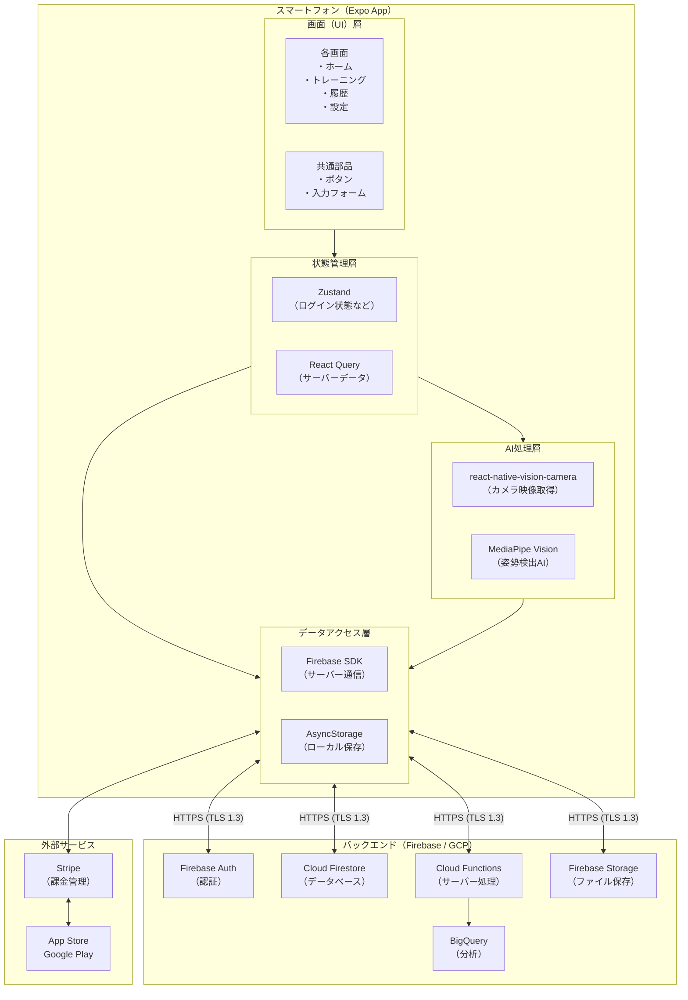
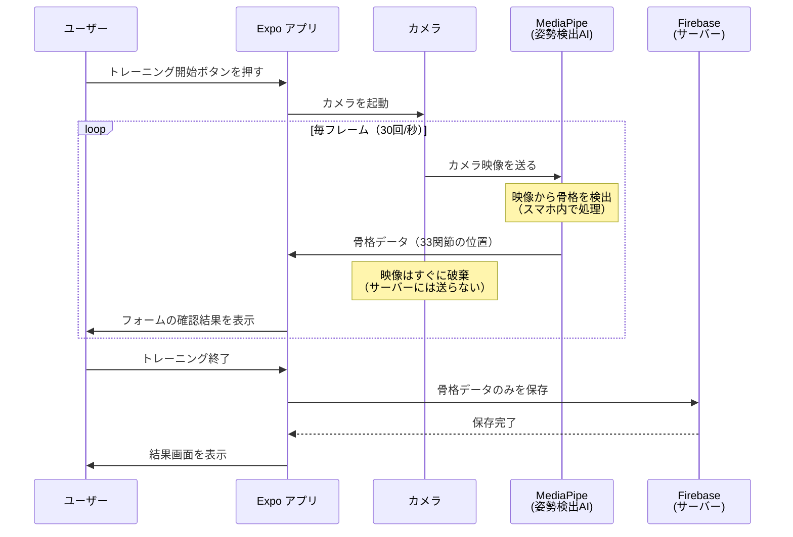
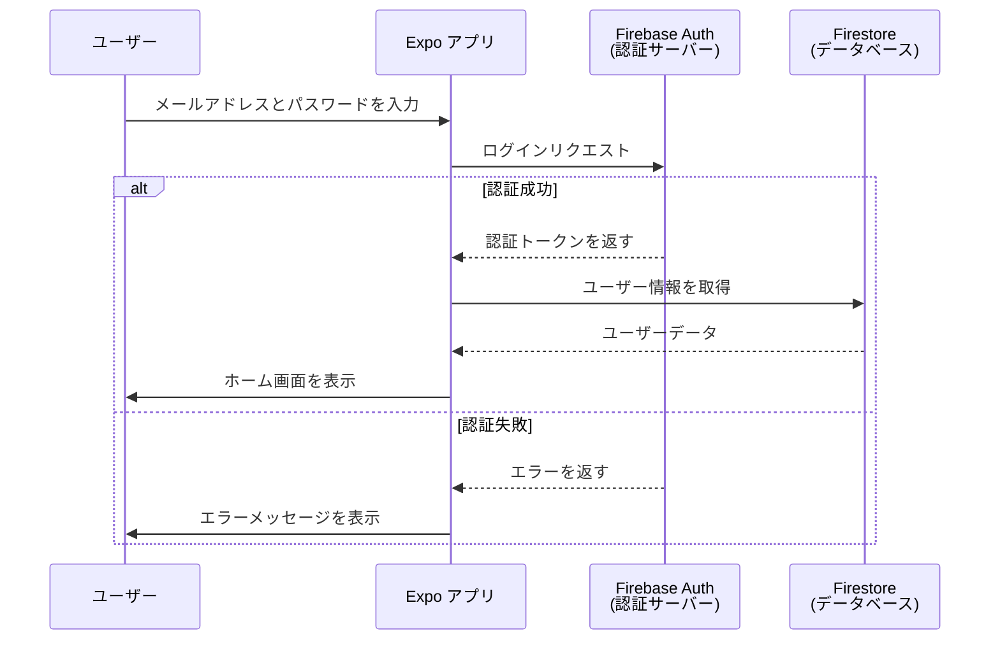
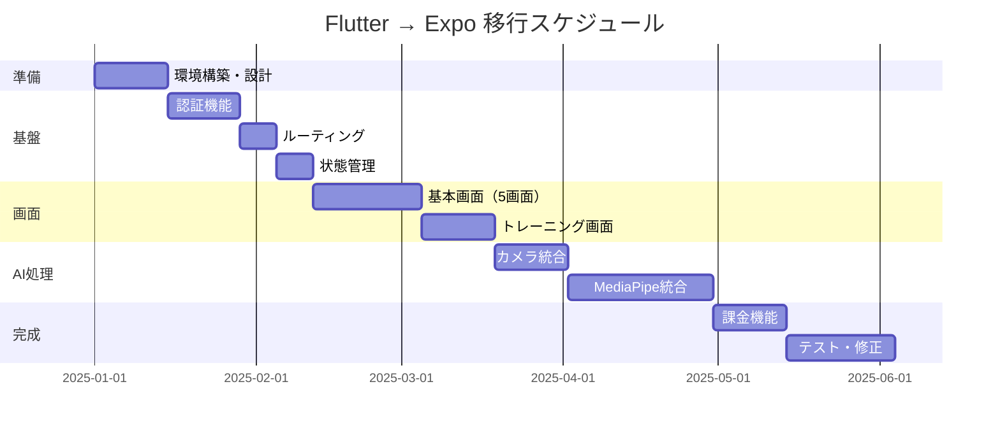
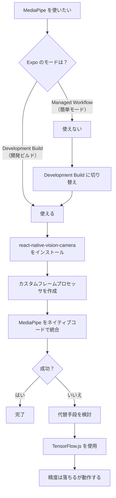
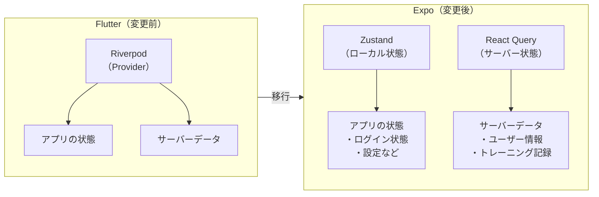
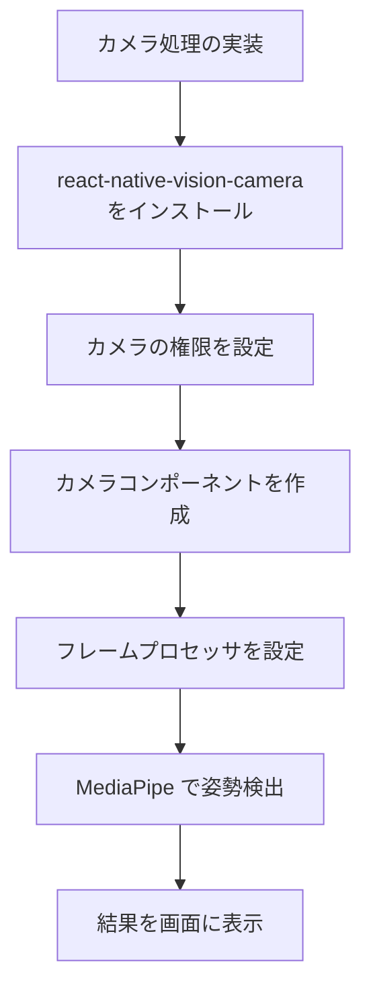
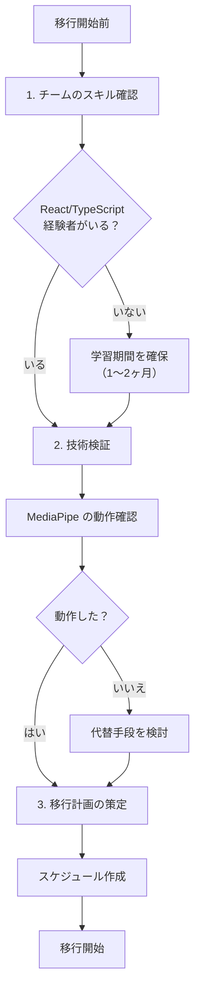
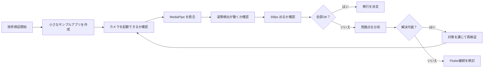

# AI Fitness アプリ 要件定義書（Expo版）v1.0 - Part 3

**プロジェクト名**: AI Fitness アプリ（Expo版）
**バージョン**: 1.0.4
**最終更新日**: 2025年12月9日
**対象**: システムアーキテクチャ / 移行ガイド

---

## 目次

- [1. システムアーキテクチャ](#1-システムアーキテクチャ)
  - [1.1 技術スタック（Expo版）](#11-技術スタックexpo版)
  - [1.2 システム構成図](#12-システム構成図)
  - [1.3 データフロー図](#13-データフロー図)
- [2. Flutter から Expo への移行ガイド](#2-flutter-から-expo-への移行ガイド)
  - [2.1 移行の概要](#21-移行の概要)
  - [2.2 技術的な課題と対策](#22-技術的な課題と対策)
  - [2.3 ライブラリマッピング表](#23-ライブラリマッピング表)
  - [2.4 推奨事項](#24-推奨事項)

---

## 1. システムアーキテクチャ

### 1.1 技術スタック（Expo版）

技術スタックとは、アプリを作るために使う「道具（ツール）」や「材料（ライブラリ）」のセットのことです。
料理に例えると、「包丁」「まな板」「フライパン」といった調理器具のようなものです。

#### 1.1.1 フロントエンド（アプリ側）

フロントエンドとは、ユーザーが直接触れる「見える部分」のことです。
スマホの画面に表示されるボタンや文字、画像などがフロントエンドです。

| 項目 | 技術 | バージョン | 説明 |
|------|------|-----------|------|
| **フレームワーク** | Expo (React Native) | SDK 52+ | アプリの骨組みを作るツール。iOSとAndroid両方のアプリを同時に作れる |
| **言語** | TypeScript | 5.0+ | プログラムを書くための言語。JavaScriptをより安全にしたもの |
| **状態管理** | Zustand | 5.0+ | アプリ内のデータ（ログイン状態など）を管理するツール |
| **サーバー状態管理** | TanStack Query (React Query) | 5.0+ | サーバーから取ってきたデータを賢く管理するツール |
| **ルーティング** | Expo Router | 4.0+ | 画面の切り替えを管理するツール |
| **UIライブラリ** | React Native Paper / NativeBase | 最新 | 見た目の良いボタンやフォームを簡単に作れるツール |

#### 1.1.2 バックエンド（サーバー側）

バックエンドとは、ユーザーには見えない「裏側」で動く部分のことです。
データの保存や計算など、重要な処理を行います。

| 項目 | 技術 | バージョン | 説明 |
|------|------|-----------|------|
| **サーバー処理** | Cloud Functions for Firebase | Node.js 20 | サーバー側のプログラムを動かす場所 |
| **言語** | TypeScript | 5.0+ | サーバー側もTypeScriptで統一 |
| **リージョン** | asia-northeast1 | - | 東京にあるデータセンターを使用（日本のユーザー向けに高速） |

**ポイント**: バックエンドは Flutter 版から変更なしです。これにより、移行の手間を減らせます。

#### 1.1.3 データベース

データベースとは、アプリのデータを保存しておく「倉庫」のようなものです。

| 項目 | 技術 | 説明 |
|------|------|------|
| **メインDB** | Cloud Firestore | リアルタイムでデータを同期できるデータベース |
| **分析用DB** | BigQuery | 大量のデータを分析するためのデータベース |
| **ファイル保存** | Firebase Storage | 画像などのファイルを保存する場所 |
| **リージョン** | asia-northeast1 | すべて東京リージョンに配置 |

**ポイント**: データベースも Flutter 版から変更なしです。

#### 1.1.4 AI処理（姿勢検出）

AI処理とは、カメラで撮った映像から体の動きを読み取る部分のことです。

| 項目 | 技術 | 説明 |
|------|------|------|
| **カメラ処理** | react-native-vision-camera | 高性能なカメラ機能を提供するライブラリ |
| **姿勢検出（iOS）** | MediaPipe Vision | Googleが作った姿勢検出AI |
| **姿勢検出（Android）** | MediaPipe Vision | iOSと同じものを使用 |
| **代替手段** | TensorFlow.js / TensorFlow Lite | MediaPipeが使えない場合の予備手段 |

**重要**: AI処理はすべてスマホの中で行います。カメラの映像がサーバーに送られることはありません（プライバシー保護）。

#### 1.1.5 認証・課金

認証とは、「あなたが本人か確認する」仕組みのことです。
課金とは、お金を払ってサービスを使う仕組みのことです。

| 項目 | 技術 | 説明 | 実装Phase |
|------|------|------|-----------|
| **認証** | Firebase Auth (@react-native-firebase/auth) | ログイン・ログアウトを管理 | Phase 1 |
| **Apple認証** | Sign in with Apple | Apple IDでのログイン | **Phase 3** |
| **課金（メイン）** | Stripe | サブスクリプション（月額課金）を管理 | **Phase 3** |
| **課金（代替）** | RevenueCat (react-native-purchases) | Stripeの代替手段 | **Phase 3** |

**注意**:
- Apple認証と課金機能はPhase 3で実装予定です
- 決済にはStripeを使用し、RevenueCatは代替手段として位置づけます
- Phase 1-2では無料版のみでの運用となりますが、課金導線を見越した設計を行います

---

### 1.2 システム構成図

システム全体がどのようにつながっているかを図で表します。



#### 図の説明

1. **スマートフォン（Expo App）**: ユーザーが使うアプリ本体
   - 画面（UI）層: ユーザーが見える部分
   - 状態管理層: アプリ内のデータを管理
   - AI処理層: カメラで姿勢を検出
   - データアクセス層: サーバーとやり取り

2. **バックエンド（Firebase / GCP）**: サーバー側のサービス群
   - 認証、データベース、ファイル保存、分析など

3. **外部サービス**: 課金やアプリストアとの連携

---

### 1.3 データフロー図

データがどのように流れるかを図で表します。

#### 1.3.1 トレーニング実行時のデータフロー



#### 1.3.2 データの流れの説明

1. **カメラ映像の処理**
   - カメラで撮影した映像は、スマホの中だけで処理されます
   - 映像そのものはサーバーに送られません（プライバシー保護）
   - 処理が終わった映像はすぐに消去されます

2. **保存されるデータ**
   - 骨格データ（体の33箇所の関節の位置情報）
   - トレーニングの種類、回数、時間
   - 参考スコア

3. **保存されないデータ**
   - カメラの映像
   - 顔の画像
   - 位置情報（GPS）

#### 1.3.3 認証フロー



---

## 2. Flutter から Expo への移行ガイド

### 2.1 移行の概要

#### 2.1.1 なぜ移行するのか？

Flutter から Expo（React Native）への移行には、以下のような理由が考えられます：

| 理由 | 説明 |
|------|------|
| **開発者の確保** | React / JavaScript の開発者は Flutter / Dart より多い |
| **Webとの共通化** | React の知識があれば Web アプリも作れる |
| **エコシステム** | npm のパッケージ（ライブラリ）が豊富 |
| **学習コスト** | Web開発経験者なら習得が早い |

#### 2.1.2 移行の規模

| 項目 | 内容 |
|------|------|
| **移行難易度** | **高**（完全な作り直しが必要） |
| **推定期間** | 3〜5ヶ月 |
| **再利用可能** | バックエンド（Firebase）、データベース設計、API設計 |
| **作り直し必要** | フロントエンド（画面、状態管理、AI処理）のほぼ全て |

#### 2.1.3 移行スケジュールの目安



---

### 2.2 技術的な課題と対策

#### 2.2.1 課題一覧

| # | 課題 | 重要度 | 難易度 |
|---|------|--------|--------|
| 1 | MediaPipe の統合 | **最高** | **非常に高い** |
| 2 | 状態管理の変更 | 高 | 中 |
| 3 | 画面遷移の変更 | 中 | 低 |
| 4 | カメラ処理 | 高 | 高 |
| 5 | Firebase 認証 | 中 | 低 |
| 6 | 課金機能 | 中 | 低 |

---

#### 2.2.2 課題1: MediaPipe の統合（最大の課題）

**問題点**:
- MediaPipe は Google が作った姿勢検出 AI ですが、React Native 用の公式ライブラリがありません
- Expo の「Managed Workflow」（簡単モード）では使えません
- ネイティブコード（iOS の Swift、Android の Kotlin）を書く必要があります

**対策**:



**Development Build とは？**

Expo には2つのモードがあります：

| モード | 説明 | MediaPipe |
|--------|------|-----------|
| **Managed Workflow** | Expo が全部管理してくれる簡単モード | 使えない |
| **Development Build** | ネイティブコードも書ける上級モード | **使える** |

**具体的な手順**:

1. Development Build に切り替える
   ```bash
   npx expo install expo-dev-client
   npx expo prebuild
   ```

2. react-native-vision-camera をインストール
   ```bash
   npm install react-native-vision-camera
   ```

3. Frame Processor（フレーム処理）を設定
   - カメラの映像を1フレームずつ処理する仕組み
   - ここで MediaPipe を呼び出す

4. iOS / Android それぞれのネイティブコードを書く
   - iOS: Swift で MediaPipe Vision を統合
   - Android: Kotlin で MediaPipe Vision を統合

**代替手段（MediaPipe がうまく動かない場合）**:

| 代替手段 | メリット | デメリット |
|----------|----------|------------|
| **TensorFlow.js** | JavaScript だけで動く | 精度・速度が劣る |
| **TensorFlow Lite** | 高速 | ネイティブコードが必要 |
| **クラウドAPI** | 高精度 | 通信が必要、コストがかかる |

---

#### 2.2.3 課題2: 状態管理の変更

**Flutter（変更前）**:
- Riverpod を使用
- Provider パターンでデータを管理

**Expo（変更後）**:
- Zustand + React Query を使用
- より軽量でシンプルな設計

**比較図**:



**Zustand の使い方の例**:

```typescript
// ログイン状態を管理するストア
import { create } from 'zustand';

interface AuthState {
  isLoggedIn: boolean;      // ログインしているか
  userId: string | null;    // ユーザーID
  login: (id: string) => void;   // ログイン処理
  logout: () => void;            // ログアウト処理
}

const useAuthStore = create<AuthState>((set) => ({
  isLoggedIn: false,
  userId: null,
  login: (id) => set({ isLoggedIn: true, userId: id }),
  logout: () => set({ isLoggedIn: false, userId: null }),
}));

// 使い方
function LoginButton() {
  const { isLoggedIn, login, logout } = useAuthStore();

  if (isLoggedIn) {
    return <Button onPress={logout}>ログアウト</Button>;
  }
  return <Button onPress={() => login('user123')}>ログイン</Button>;
}
```

---

#### 2.2.4 課題3: 画面遷移の変更

**Flutter（変更前）**:
- GoRouter を使用

**Expo（変更後）**:
- Expo Router を使用
- ファイルベースのルーティング（フォルダ構造 = 画面構造）

**比較**:

| 項目 | Flutter (GoRouter) | Expo (Expo Router) |
|------|-------------------|-------------------|
| 設定方法 | コードで定義 | フォルダ構造で定義 |
| 学習コスト | 中 | 低（直感的） |
| 柔軟性 | 高 | 中 |

**フォルダ構造の例**:

```
app/
├── (auth)/              # 認証関連（ログイン前）
│   ├── login.tsx       # /login
│   └── signup.tsx      # /signup
├── (tabs)/              # タブナビゲーション（ログイン後）
│   ├── home.tsx        # /home
│   ├── training.tsx    # /training
│   ├── history.tsx     # /history
│   └── settings.tsx    # /settings
├── _layout.tsx          # 共通レイアウト
└── index.tsx           # 最初の画面
```

---

#### 2.2.5 課題4: カメラ処理

**使用ライブラリ**: react-native-vision-camera

**特徴**:
- 高性能なカメラ機能
- フレームプロセッサ（映像を1コマずつ処理）に対応
- MediaPipe との連携が可能

**注意点**:
- Expo Managed Workflow では使えない
- Development Build が必須



---

#### 2.2.6 課題5: Firebase 認証

**使用ライブラリ**: @react-native-firebase/auth

**対策**:
- React Native Firebase は成熟したライブラリ
- Flutter 版とほぼ同じ機能が使える
- 移行は比較的簡単

**コード例**:

```typescript
import auth from '@react-native-firebase/auth';

// ログイン
async function login(email: string, password: string) {
  try {
    const result = await auth().signInWithEmailAndPassword(email, password);
    console.log('ログイン成功:', result.user.uid);
  } catch (error) {
    console.error('ログイン失敗:', error);
  }
}

// ログアウト
async function logout() {
  await auth().signOut();
}

// 認証状態の監視
auth().onAuthStateChanged((user) => {
  if (user) {
    console.log('ログイン中:', user.email);
  } else {
    console.log('ログアウト状態');
  }
});
```

---

#### 2.2.7 課題6: 課金機能

**使用ライブラリ（メイン）**: Stripe（@stripe/stripe-react-native）
**使用ライブラリ（代替）**: react-native-purchases (RevenueCat)

**実装予定Phase**: **Phase 3**

**対策**:
- Stripeを主要な決済手段として使用
- RevenueCatは代替手段として準備
- どちらも React Native を公式サポート
- Phase 1-2で課金導線を見越した設計を実施

**決済サービスの選定理由**:
| サービス | 役割 | 理由 |
|---------|------|------|
| **Stripe（メイン）** | 主要な決済手段 | Web版との統一、柔軟な価格設定、日本での豊富な実績 |
| **RevenueCat（代替）** | バックアップ | Stripe導入に問題が生じた場合の代替手段 |

**注意**: Apple認証と課金機能はPhase 3で同時に実装します。App Storeの審査要件として、ソーシャルログインを提供する場合はApple認証も必須となるためです。

---

### 2.3 ライブラリマッピング表

Flutter で使っていたライブラリを、Expo（React Native）ではどのライブラリに置き換えるかの一覧表です。

#### 2.3.1 コア機能

| 機能 | Flutter | Expo (React Native) | 移行難易度 |
|------|---------|---------------------|-----------|
| フレームワーク | Flutter | Expo (React Native) | 高 |
| 言語 | Dart | TypeScript | 中 |
| 状態管理 | Riverpod | Zustand + React Query | 中 |
| ルーティング | GoRouter | Expo Router | 低 |
| 国際化 | intl / flutter_localizations | i18next / expo-localization | 低 |

#### 2.3.2 Firebase 連携

| 機能 | Flutter | Expo (React Native) | 移行難易度 |
|------|---------|---------------------|-----------|
| Firebase 初期化 | firebase_core | @react-native-firebase/app | 低 |
| 認証 | firebase_auth | @react-native-firebase/auth | 低 |
| データベース | cloud_firestore | @react-native-firebase/firestore | 低 |
| ストレージ | firebase_storage | @react-native-firebase/storage | 低 |
| プッシュ通知 | firebase_messaging | @react-native-firebase/messaging | 低 |
| 分析 | firebase_analytics | @react-native-firebase/analytics | 低 |
| クラッシュ | firebase_crashlytics | @react-native-firebase/crashlytics | 低 |

#### 2.3.3 カメラ・AI処理

| 機能 | Flutter | Expo (React Native) | 移行難易度 |
|------|---------|---------------------|-----------|
| カメラ | camera | react-native-vision-camera | 高 |
| 姿勢検出 | google_mlkit_pose_detection | MediaPipe Vision (カスタム統合) | **非常に高い** |
| 画像処理 | image | react-native-image-picker など | 中 |

#### 2.3.4 UI/UX

| 機能 | Flutter | Expo (React Native) | 移行難易度 |
|------|---------|---------------------|-----------|
| UI デザイン | Material Design (built-in) | React Native Paper / NativeBase | 中 |
| カレンダー | table_calendar | react-native-calendars | 低 |
| グラフ | fl_chart | react-native-chart-kit / Victory Native | 中 |
| 音声合成 | flutter_tts | expo-speech | 低 |

#### 2.3.5 課金・その他

| 機能 | Flutter | Expo (React Native) | 移行難易度 |
|------|---------|---------------------|-----------|
| 課金（メイン） | - | @stripe/stripe-react-native | 低 |
| 課金（代替） | purchases_flutter | react-native-purchases | 低 |
| ローカル保存 | shared_preferences | @react-native-async-storage/async-storage | 低 |
| HTTP通信 | dio | axios / fetch | 低 |
| コード生成 | freezed / json_serializable | 手動 / TypeScript の型定義 | 中 |

---

### 2.4 推奨事項

#### 2.4.1 移行前にやるべきこと



#### 2.4.2 移行の優先順位

段階的に移行することで、リスクを減らせます。

| 順番 | 作業内容 | 理由 |
|------|----------|------|
| **1** | 環境構築 + 認証機能 | 基盤となる部分から |
| **2** | 基本画面（ホーム、設定など） | 複雑でない画面から |
| **3** | 状態管理の移行 | データの流れを確立 |
| **4** | カメラ + MediaPipe | 最も難しい部分（時間をかける） |
| **5** | トレーニング機能 | AI処理ができてから |
| **6** | 課金機能 | 最後に収益化部分 |
| **7** | テスト + 最適化 | 品質を確保 |

#### 2.4.3 リスクと対策

| リスク | 影響 | 対策 |
|--------|------|------|
| MediaPipe が動かない | **致命的** | 事前に技術検証を行う。代替手段（TensorFlow.js）も検討 |
| 開発期間の超過 | 高 | バッファ期間（1ヶ月）を設ける |
| パフォーマンス低下 | 中 | プロファイリングで早期発見、最適化 |
| ライブラリの互換性問題 | 中 | 事前に全ライブラリの動作確認 |

#### 2.4.4 移行しないという選択肢

移行には大きなコストがかかります。以下の場合は、Flutter を継続することも検討してください。

**Flutter を継続すべき場合**:
- 現在のチームが Flutter に慣れている
- MediaPipe の統合がすでにうまくいっている
- 開発リソースが限られている
- 早くリリースしたい

**Expo に移行すべき場合**:
- React/TypeScript 経験者が多い
- Web版も同時に作りたい
- Flutter 開発者の確保が難しい
- 長期的なメンテナンス性を重視

#### 2.4.5 技術検証の進め方

移行を決める前に、以下の技術検証（PoC: Proof of Concept）を行うことを強く推奨します。



**検証期間の目安**: 2〜3週間

---

## まとめ

### 技術スタック比較表

| 項目 | Flutter版 | Expo版 |
|------|----------|--------|
| **フレームワーク** | Flutter | Expo (React Native) |
| **言語** | Dart | TypeScript |
| **状態管理** | Riverpod | Zustand + React Query |
| **ルーティング** | GoRouter | Expo Router |
| **カメラ** | camera | react-native-vision-camera |
| **姿勢検出** | google_mlkit_pose_detection | MediaPipe Vision (カスタム統合) |
| **認証** | firebase_auth | @react-native-firebase/auth |
| **Apple認証** | - | Sign in with Apple（Phase 3） |
| **課金（メイン）** | - | @stripe/stripe-react-native |
| **課金（代替）** | purchases_flutter | react-native-purchases |
| **バックエンド** | Cloud Functions + Firestore | **変更なし** |

### 移行の要点

1. **バックエンドは変更なし**: Firebase、Firestore、BigQuery はそのまま使える
2. **フロントエンドは作り直し**: 画面、状態管理、AI処理はほぼ全て書き直し
3. **最大の課題は MediaPipe**: Development Build が必須、ネイティブコードの知識が必要
4. **移行期間は3〜5ヶ月**: 余裕を持ったスケジュールが必要
5. **事前の技術検証が重要**: 特に MediaPipe の動作確認は必須

---

**改訂履歴**

| バージョン | 日付 | 変更内容 |
|-----------|------|----------|
| 1.0 | 2025年12月 | 初版作成 |
| 1.0.2 | 2025年12月9日 | Phase構成変更に伴い、課金機能（RevenueCat）をPhase 4として明記 |
| 1.0.3 | 2025年12月9日 | リスク対応に基づく変更: (1) Apple認証・課金機能をPhase 3に移動 (2) Stripe仕様統一、RevenueCat代替化 (3) ライブラリマッピング表と技術スタック比較表を更新 |
| 1.0.4 | 2025年12月9日 | システム構成図の決済サービスをStripeに変更（RevenueCat削除） |
