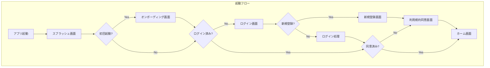
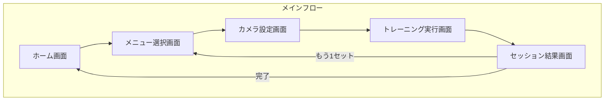
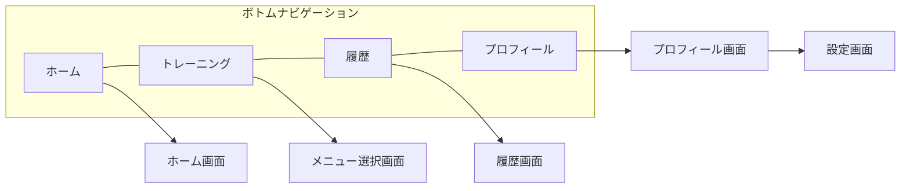
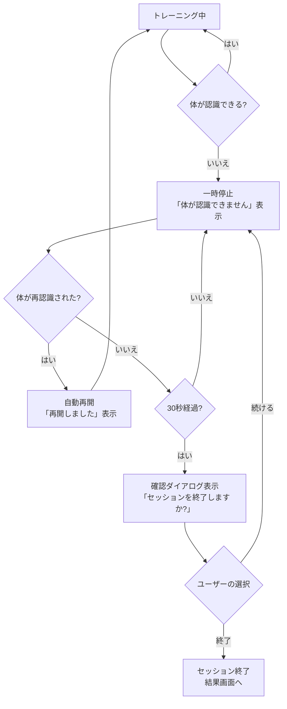

# AI Fitnessアプリ要件定義書（Expo版）Part 4

**バージョン**: 1.0.4
**最終更新日**: 2025年12月9日
**対象**: 画面設計・フォーム評価ロジック

---

## 目次

1. [画面設計](#1-画面設計)
   - 1.1 画面一覧
   - 1.2 画面遷移図
   - 1.3 ボトムナビゲーション
2. [フォーム評価ロジック](#2-フォーム評価ロジック)
   - 2.1 MediaPipeとは
   - 2.2 5種目の評価ポイント
   - 2.3 スコアリング基準

---

## 1. 画面設計

### 1.1 画面一覧

アプリは全部で15画面で構成されています。

| No | 画面名 | カテゴリ | 説明 | 実装Phase |
|----|--------|----------|------|-----------|
| 1 | スプラッシュ画面 | 起動 | アプリ起動時に最初に表示される画面。ロゴとローディングを表示 | Phase 1 |
| 2 | オンボーディング画面 | 起動 | 初回起動時のみ表示。アプリの特徴を3画面で紹介 | Phase 1 |
| 3 | ログイン画面 | 認証 | メールアドレスとパスワードでログイン | Phase 1 |
| 4 | 新規登録画面 | 認証 | アカウントを作成するための2ステップの画面 | Phase 1 |
| 5 | 利用規約同意画面 | 認証 | 利用規約とプライバシーポリシーへの同意を取得 | Phase 1 |
| 6 | ホーム画面 | メイン | 今日のトレーニング状況や週間の進捗を表示 | Phase 1 |
| 7 | メニュー選択画面 | トレーニング | 5種目から行いたい種目を選ぶ画面 | Phase 2 |
| 8 | カメラ設定画面 | トレーニング | カメラの向きや距離を調整する画面 | Phase 2 |
| 9 | トレーニング実行画面 | トレーニング | 実際にトレーニングを行う画面。リアルタイムで参考情報を表示 | Phase 2 |
| 10 | セッション結果画面 | トレーニング | トレーニング終了後の結果を表示 | Phase 2 |
| 11 | 履歴画面 | 記録 | 過去のトレーニング記録をグラフや一覧で確認 | Phase 2 |
| 12 | プロフィール画面 | アカウント | ユーザー情報の表示・編集 | Phase 1 |
| 13 | 設定画面 | アカウント | 音声フィードバックや通知などの設定 | Phase 2 |
| 14 | 課金画面 | 課金 | プレミアムプランの購入 | **Phase 3** |
| 15 | サブスクリプション管理画面 | 課金 | 現在の課金状態の確認とキャンセル | **Phase 3** |

**注意**: 課金画面（No.14）とサブスクリプション管理画面（No.15）はPhase 3で、Apple認証と同時に実装予定です。

### 1.2 画面遷移図

#### 1.2.1 全体の流れ



#### 1.2.2 メイン画面の遷移



**注意**: 課金状態チェックと課金画面への遷移はPhase 3で追加予定です。Phase 1-2ではすべての機能が無料で利用可能なため、課金チェックなしで直接トレーニングに進めます。ただし、Phase 1-2でも課金導線を見越したUIエリア（Premiumバッジ表示など）は確保します。

#### 1.2.3 ボトムナビゲーション



### 1.3 ボトムナビゲーション

ログイン後のすべてのメイン画面で、画面の下に共通のナビゲーションバーが表示されます。

| タブ | アイコン | 遷移先 | 説明 |
|------|----------|--------|------|
| ホーム | 家のアイコン | ホーム画面 | 今日の進捗、週間のグラフ、最近の履歴を表示 |
| トレーニング | 筋肉のアイコン | メニュー選択画面 | 5種目から選んでトレーニングを開始 |
| 履歴 | グラフのアイコン | 履歴画面 | 過去の記録をカレンダーやグラフで確認 |
| プロフィール | 人のアイコン | プロフィール画面 | ユーザー情報の確認・編集、設定へのアクセス |

#### ボトムナビゲーションのデザイン

```
+----------------------------------------------------------+
|   [家]        [筋肉]        [グラフ]        [人]         |
|  ホーム     トレーニング      履歴      プロフィール      |
+----------------------------------------------------------+
```

**仕様**:
- 高さ: 56px
- 選択中のタブ: 緑色で表示
- 選択されていないタブ: グレーで表示

---

## 2. フォーム評価ロジック

### 2.1 MediaPipeとは

#### 2.1.1 MediaPipe Poseの概要

**MediaPipe Pose**は、Googleが開発したAI技術です。スマートフォンのカメラに映った人の体を認識して、体の各部分（関節）の位置を検出します。

**わかりやすく言うと**:
カメラに映った自分の姿から、AIが「頭はここ」「肩はここ」「膝はここ」というように、体の33か所のポイントを見つけてくれます。

#### 2.1.2 検出できる33個の関節

MediaPipe Poseは体の33か所の位置を検出します。

```
          [0] 鼻
         /    \
    [7] 左耳   [8] 右耳
         \    /
      [11] 左肩---[12] 右肩
           |         |
      [13] 左肘   [14] 右肘
           |         |
      [15] 左手首  [16] 右手首

      [23] 左腰---[24] 右腰
           |         |
      [25] 左膝   [26] 右膝
           |         |
      [27] 左足首  [28] 右足首
```

#### 2.1.3 プライバシーへの配慮

**重要なポイント**:
- カメラの映像はスマートフォンの中だけで処理されます
- 映像がインターネットに送信されることはありません
- 保存されるのは関節の位置（数字のデータ）だけです

これにより、プライバシーを守りながらフォームの確認ができます。

#### 2.1.4 パフォーマンス目標

| 項目 | 目標値 | 説明 |
|------|--------|------|
| フレームレート | 30fps | 1秒間に30回の検出（スムーズな動き） |
| 最低フレームレート | 15fps | 遅いスマホでもこれ以上を維持 |
| 信頼度しきい値 | 0.7以上 | 検出の確かさ（0〜1の値） |

### 2.2 5種目の評価ポイント

アプリは5種類のトレーニング種目に対応しています。それぞれの種目で、AIが確認するポイントを説明します。

---

#### 2.2.1 スクワット

**概要**:
- 部位: 下半身（太もも、お尻）
- 難易度: 初級
- 器具: 不要
- 推奨カメラ向き: 横向き

**評価ポイント**:

| チェック項目 | 基準 | なぜ重要? |
|--------------|------|----------|
| 膝の角度 | 90度〜110度 | 深くしゃがみすぎても、浅すぎても効果が減る |
| 膝の位置 | つま先より前に出ない | 膝への負担を軽くするため |
| 背中の角度 | まっすぐを維持 | 腰への負担を軽くするため |
| かかと | 地面についている | バランスを保つため |

```
【良いフォーム】          【注意が必要なフォーム】

      O                        O
     /|\                      /|\
     / \  ← 背中まっすぐ       /  ← 背中が丸まっている
    /   \                    /_
   /     \ ← 膝がつま先と     / \
  /       \    同じ位置      /   \ ← 膝がつま先より前
```

**レップカウント（回数の数え方）**:
1. 立っている状態（膝の角度が160度以上）からスタート
2. しゃがむ（膝の角度が110度以下になったら「下」の位置）
3. 立ち上がる（膝の角度が160度以上に戻ったら1回としてカウント）

---

#### 2.2.2 アームカール

**概要**:
- 部位: 腕（力こぶ）
- 難易度: 初級
- 器具: ダンベル
- 推奨カメラ向き: 正面

**評価ポイント**:

| チェック項目 | 基準 | なぜ重要? |
|--------------|------|----------|
| 肘の角度 | 30度〜160度 | 可動域をしっかり使うため |
| 肘の固定 | 体の横で動かさない | 力こぶに効かせるため |
| 反動の使用 | 体を揺らさない | 正しい筋肉を使うため |
| 手首の角度 | まっすぐを維持 | 手首を痛めないため |

```
【良いフォーム】          【注意が必要なフォーム】

   O                        O
  /|\                      /|\  ← 肘が前に出ている
   |  ← 肘が固定           / |
   |                      /  |  ← 反動を使っている
  / \                    /   \
```

**レップカウント**:
1. 腕を伸ばした状態（肘の角度が150度以上）からスタート
2. ダンベルを持ち上げる（肘の角度が50度以下になったら「上」の位置）
3. 腕を下ろす（肘の角度が150度以上に戻ったら1回としてカウント）

---

#### 2.2.3 サイドレイズ

**概要**:
- 部位: 肩
- 難易度: 中級
- 器具: ダンベル
- 推奨カメラ向き: 正面

**評価ポイント**:

| チェック項目 | 基準 | なぜ重要? |
|--------------|------|----------|
| 腕の挙上角度 | 70度〜90度 | 肩の筋肉に効かせるため |
| 左右の対称性 | 両腕が同じ高さ | バランスよく鍛えるため |
| 体幹の安定 | 体を揺らさない | 肩に集中して効かせるため |
| 肘の角度 | 軽く曲げた状態を維持 | 肘への負担を軽くするため |

```
【良いフォーム】          【注意が必要なフォーム】

    \   O   /                   O
     \  |  / ← 両腕が水平      /|\ ← 肩をすくめている
      \ | /                    / \
       \|/                    /   \ ← 片方だけ上がっている
       / \
```

**レップカウント**:
1. 腕を下ろした状態（腕と体の角度が20度以下）からスタート
2. 腕を上げる（腕と体の角度が70度以上になったら「上」の位置）
3. 腕を下ろす（腕と体の角度が20度以下に戻ったら1回としてカウント）

---

#### 2.2.4 ショルダープレス

**概要**:
- 部位: 肩
- 難易度: 中級
- 器具: ダンベル
- 推奨カメラ向き: 正面

**評価ポイント**:

| チェック項目 | 基準 | なぜ重要? |
|--------------|------|----------|
| 肘の角度 | 90度からスタート、上で伸ばす | 可動域を最大限使うため |
| 軌道の垂直性 | まっすぐ上に押し上げる | 肩に効率よく効かせるため |
| 腰の安定性 | 腰を反らさない | 腰を痛めないため |
| 左右の対称性 | 両腕が同じ高さ | バランスよく鍛えるため |

```
【良いフォーム】          【注意が必要なフォーム】

    |       |                   |   |
    O   O   O                 O   O   O
     \ | /                       \ | /
      \|/  ← 腰がまっすぐ          )|  ← 腰が反っている
      / \                        / \
```

**レップカウント**:
1. 肘を曲げた状態（肘の角度が90度以下）からスタート
2. ダンベルを持ち上げる（肘の角度が160度以上になったら「上」の位置）
3. ダンベルを下ろす（肘の角度が90度以下に戻ったら1回としてカウント）

---

#### 2.2.5 プッシュアップ

**概要**:
- 部位: 胸、腕
- 難易度: 初級
- 器具: 不要
- 推奨カメラ向き: 横向き

**評価ポイント**:

| チェック項目 | 基準 | なぜ重要? |
|--------------|------|----------|
| 体のライン | 頭から足まで一直線 | 正しい姿勢で効かせるため |
| 肘の角度 | 下で約90度 | 十分に下がるため |
| 肘の開き具合 | 体に対して45度程度 | 肩を痛めないため |
| 手の位置 | 肩幅程度 | バランスよく力を使うため |

```
【良いフォーム】

上の位置:  ___________
           O---------    ← 体が一直線
          / \

下の位置:     ___________
           ___O         ← 肘が90度に曲がっている
              / \

【注意が必要なフォーム】

           O
            \_____      ← お尻が上がっている
             / \

           ________
          O_____/       ← お腹が下がっている
          / \
```

**レップカウント**:
1. 腕を伸ばした状態（肘の角度が160度以上）からスタート
2. 体を下げる（肘の角度が100度以下になったら「下」の位置）
3. 体を持ち上げる（肘の角度が160度以上に戻ったら1回としてカウント）

---

### 2.3 スコアリング基準

#### 2.3.1 スコアの計算方法

トレーニング中の各フレーム（1秒間に30回）でフォームを評価し、全体のスコアを計算します。

**スコアの範囲**: 0点〜100点

#### 2.3.2 各種目の評価項目と配点

**スクワットの例**:

| 評価項目 | 配点 | 良い | 普通 | 改善が必要 |
|----------|------|------|------|------------|
| 膝の角度 | 40点 | 90-110度 | 80-120度 | それ以外 |
| 膝の位置 | 30点 | つま先と同じ | 少し前 | 大きく前 |
| 背中の姿勢 | 20点 | まっすぐ | やや丸い | 丸まっている |
| かかと | 10点 | 着地 | やや浮き | 浮いている |

#### 2.3.3 スコアの目安

| スコア | 評価 | フィードバック例 |
|--------|------|------------------|
| 90-100点 | とても良い | 「素晴らしいフォームです！」 |
| 70-89点 | 良い | 「良いフォームです。膝の位置を意識するとさらに良くなります」 |
| 50-69点 | 普通 | 「参考: 背中をもう少しまっすぐにしてみましょう」 |
| 0-49点 | 改善推奨 | 「参考: フォームを確認してみましょう」 |

#### 2.3.4 リアルタイムフィードバック

トレーニング中は、画面と音声で参考情報を提供します。

**表示例**:

```
+----------------------------------+
|  スクワット            [x 終了]  |
|                                  |
|  [カメラプレビュー]              |
|                                  |
|  ============== 60%              |
|  レップ数: 8 / 10回              |
|                                  |
|  参考情報:                       |
|  膝をもう少し曲げてみましょう     |
|                                  |
|  [音声OFF]  [音声ON]             |
+----------------------------------+
```

#### 2.3.5 カメラ認識中断時の動作

トレーニング中にカメラで体が認識できなくなった場合の動作を説明します。

**動作フロー**:



**画面表示例（一時停止時）**:

```
+----------------------------------+
|  スクワット                      |
|                                  |
|  [カメラプレビュー]              |
|                                  |
|  ⚠️ 一時停止中                   |
|  体が認識できません              |
|  カメラに全身が映るように         |
|  位置を調整してください          |
|                                  |
|  [セッションを終了]              |
+----------------------------------+
```

**確認ダイアログ（30秒経過後）**:

```
+----------------------------------+
|        セッションを終了          |
|        しますか？                |
|                                  |
|  30秒間体が認識できません。      |
|  セッションを終了しますか？      |
|                                  |
|  [続ける]     [終了する]         |
+----------------------------------+
```

**仕様詳細**:

| 項目 | 内容 |
|------|------|
| 一時停止のトリガー | カメラで体が認識できなくなった時 |
| 自動再開 | 体が再認識されると即座に再開 |
| 確認ダイアログ表示 | 認識できない状態が30秒継続した場合 |
| ダイアログの選択肢 | 「続ける」または「終了する」 |
| 「続ける」選択時 | 一時停止状態に戻り、体の再認識を待つ |
| 「終了する」選択時 | セッションを終了し、結果画面へ遷移 |

**音声フィードバックの例**:
- 「参考: 良いフォームです」
- 「参考: 膝が前に出すぎているかもしれません」
- 「参考: 背中をまっすぐにしてみましょう」

**重要**: すべてのフィードバックには「参考:」という言葉をつけます。これは、このアプリが医療機器ではなく、あくまで参考情報を提供するものであることを明確にするためです。

---

## まとめ

### 画面設計のポイント

1. **15画面**で構成され、ユーザーの目的に応じた画面遷移
2. **4つのタブ**（ホーム、トレーニング、履歴、プロフィール）で主要機能にすぐアクセス
3. トレーニングの流れ: メニュー選択 → カメラ設定 → 実行 → 結果

### フォーム評価のポイント

1. **MediaPipe Pose**で体の33か所の位置を検出
2. **5種目**に対応（スクワット、アームカール、サイドレイズ、ショルダープレス、プッシュアップ）
3. **0-100点**のスコアで評価
4. **プライバシーを保護**（カメラ映像は端末内でのみ処理）
5. すべてのフィードバックは**参考情報**として提供

---

## 変更履歴

| バージョン | 日付 | 変更内容 |
|------------|------|----------|
| 1.0 | 2025年12月 | 初版作成 |
| 1.0.1 | 2025年12月8日 | FR-004-1に基づき、カメラ認識中断時の動作（一時停止→自動再開→30秒後確認ダイアログ）を追加 |
| 1.0.2 | 2025年12月9日 | Phase構成変更に伴い、画面一覧に実装Phaseを追加。課金画面をPhase 4に変更。メイン画面遷移図から課金チェックを削除（Phase 4で追加予定と注記） |
| 1.0.3 | 2025年12月9日 | リスク対応に基づく変更: 課金画面・サブスクリプション管理画面をPhase 3に移動。課金導線を見越したUI準備（Premiumバッジ表示エリア確保）を追記 |
| 1.0.4 | 2025年12月9日 | バージョン番号をヘッダーと一致させるための更新 |
