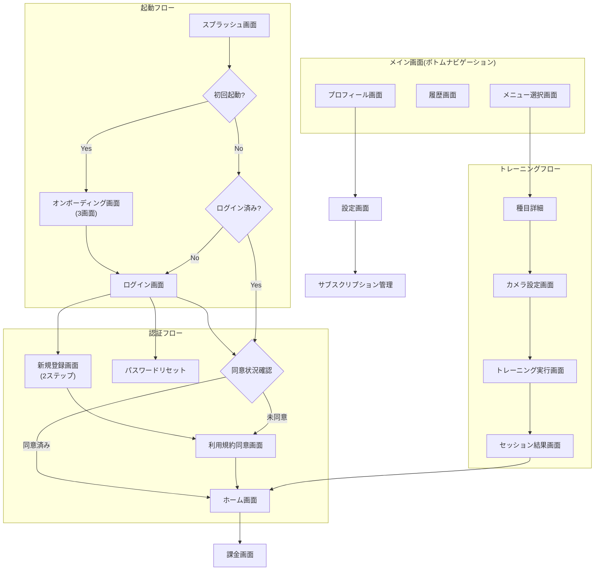
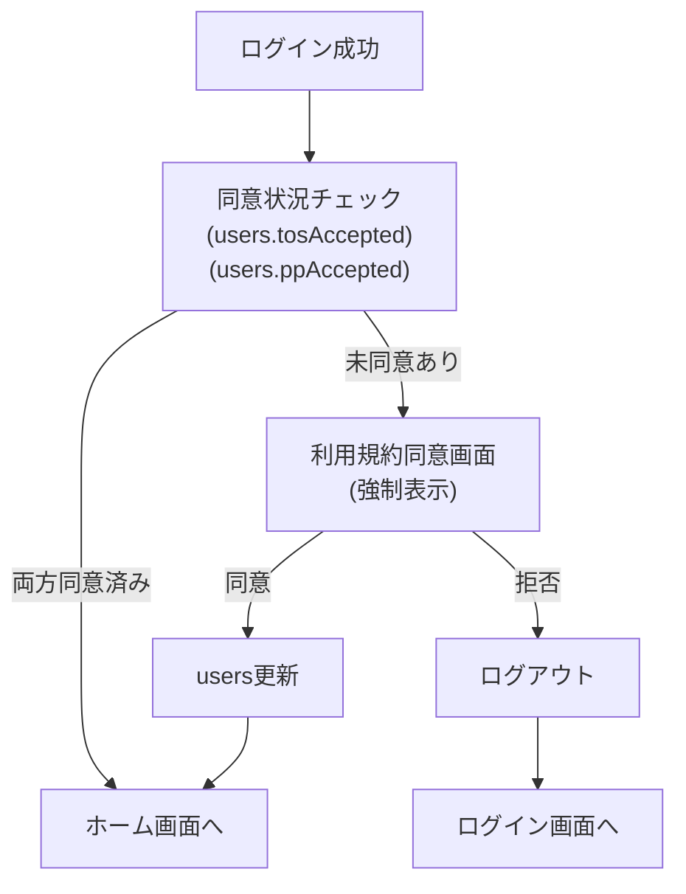
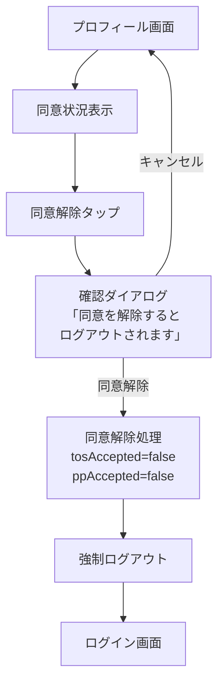

# 画面遷移図 + ワイヤーフレーム(UI設計) Expo版 v1.0

**プロジェクト名**: AIフィットネスアプリ (Expo版)
**バージョン**: 1.0 (MVP)
**作成日**: 2025年12月9日
**最終更新日**: 2025年12月9日
**対象期間**: Phase 1-3 (0-8ヶ月+)

---

## 概要

このドキュメントは、AIフィットネスアプリのExpo(React Native)版における画面設計・UI仕様を定義します。Flutter版(v3.3)をベースに、Expo版固有の技術スタック変更と機能変更を反映しています。

### Flutter版からの主な変更点

| 項目 | Flutter版 | Expo版 |
|-----|----------|--------|
| **フレームワーク** | Flutter | Expo (React Native) SDK 52+ |
| **状態管理** | Riverpod | Zustand |
| **サーバー状態** | - | TanStack Query |
| **ルーティング** | GoRouter | Expo Router |
| **UIライブラリ** | Flutter Widgets | React Native Paper |
| **カメラ** | camera | react-native-vision-camera |
| **姿勢検出** | MediaPipe (Flutter) | MediaPipe Vision |
| **課金** | RevenueCat (Phase 2) | Stripe (Phase 3)、RevenueCat(代替) |
| **5種目** | スクワット、プッシュアップ、ダンベルカール、ショルダープレス、デッドリフト | スクワット、プッシュアップ、**アームカール**、**サイドレイズ**、ショルダープレス |

### 開発フェーズ

| フェーズ | 期間 | 内容 |
|---------|------|------|
| Phase 1 | 0-2ヶ月 | 基盤構築（認証、プロフィール、ホーム画面） |
| Phase 2 | 2-7ヶ月 | コア機能（トレーニング、記録、設定） |
| Phase 3 | 8ヶ月目以降 | Apple認証・課金機能（Stripe） |
| Phase 4 | 将来 | 管理者・運用者機能、多言語対応 |

---

## 目次

1. [画面一覧](#1-画面一覧)
2. [画面遷移図(全体)](#2-画面遷移図全体)
3. [各画面の詳細設計](#3-各画面の詳細設計)
4. [共通コンポーネント](#4-共通コンポーネント)
5. [デザインガイドライン](#5-デザインガイドライン)
6. [技術仕様(Expo Router)](#6-技術仕様expo-router)
7. [5種目の推奨カメラ向き](#7-5種目の推奨カメラ向き)
8. [変更履歴](#8-変更履歴)

---

## 1. 画面一覧

### 1.1 全画面リスト

| No | 画面名 | カテゴリ | 認証 | Phase | Expo Router パス |
|----|--------|---------|------|-------|------------------|
| 1 | スプラッシュ画面 | 起動 | 不要 | Phase 1 | `/(splash)` |
| 2 | オンボーディング画面 | 起動 | 不要 | Phase 1 | `/onboarding` |
| 3 | ログイン画面 | 認証 | 不要 | Phase 1 | `/auth/login` |
| 4 | 新規登録画面 | 認証 | 不要 | Phase 1 | `/auth/register` |
| 5 | 利用規約同意画面 | 認証 | 不要 | Phase 1 | `/auth/agreement` |
| 6 | ホーム画面 | メイン | 必要 | Phase 1 | `/(tabs)/home` |
| 7 | メニュー選択画面 | トレーニング | 必要 | Phase 2 | `/(tabs)/training` |
| 8 | カメラ設定画面 | トレーニング | 必要 | Phase 2 | `/training/setup` |
| 9 | トレーニング実行画面 | トレーニング | 必要 | Phase 2 | `/training/session` |
| 10 | セッション結果画面 | トレーニング | 必要 | Phase 2 | `/training/result` |
| 11 | 履歴画面 | 記録 | 必要 | Phase 2 | `/(tabs)/history` |
| 12 | プロフィール画面 | アカウント | 必要 | Phase 1 | `/(tabs)/profile` |
| 13 | 設定画面 | アカウント | 必要 | Phase 2 | `/settings` |
| 14 | 課金画面 | 課金 | 必要 | Phase 3 | `/subscription/plans` |
| 15 | サブスクリプション管理画面 | 課金 | 必要 | Phase 3 | `/subscription/manage` |

### 1.2 ボトムナビゲーション構成

すべてのメイン画面(ログイン後)で共通のボトムナビゲーションを表示します:

| アイコン | ラベル | 遷移先 | 備考 |
|---------|--------|--------|------|
| Home | ホーム | ホーム画面 | ダッシュボード |
| Dumbbell | トレーニング | メニュー選択画面 | 種目選択 |
| ChartBar | 履歴 | 履歴画面 | 記録・統計 |
| User | プロフィール | プロフィール画面 | アカウント情報 |

**実装**: React Native Paperの`BottomNavigation`コンポーネントを使用

---

## 2. 画面遷移図(全体)



### 2.1 利用規約・プライバシーポリシー同意フロー



### 2.2 同意解除フロー



---

## 3. 各画面の詳細設計

### 3.1 スプラッシュ画面

**目的**:
- アプリ起動中のローディング表示
- ブランドの印象付け

**レイアウト**:

```
+-------------------------------+
|                               |
|                               |
|         [アプリロゴ]            |
|                               |
|       [アプリ名(仮称)]         |
|                               |
|                               |
|     ... (ローディング)        |
|                               |
|                               |
+-------------------------------+
```

**要素**:

| 要素 | 内容 | 実装 |
|-----|------|------|
| ロゴ | アイコン画像 | `<Image source={require('./assets/logo.png')} />` |
| アプリ名 | テキスト | `<Text>` |
| ローディング | アニメーション | `<ActivityIndicator />` |
| 背景色 | 緑(ブランドカラー) | `#4CAF50` |

**表示時間**: 1-2秒(初期化処理完了まで)

**遷移条件**:
- 初回起動 → オンボーディング画面
- 2回目以降・ログイン済み → 同意状況チェック → ホーム画面 or 利用規約同意画面
- 2回目以降・未ログイン → ログイン画面

**Expo Router 実装**:
```typescript
// app/(splash)/index.tsx
import { useEffect } from 'react';
import { router } from 'expo-router';
import AsyncStorage from '@react-native-async-storage/async-storage';

export default function SplashScreen() {
  useEffect(() => {
    const checkInitialRoute = async () => {
      const hasSeenOnboarding = await AsyncStorage.getItem('hasSeenOnboarding');
      // 認証状態チェック後にルーティング
    };
    checkInitialRoute();
  }, []);
  // ...
}
```

---

### 3.2 オンボーディング画面(3画面)

**目的**:
- アプリの特徴を説明
- ユーザーの期待を高める
- 医療機器でない旨の明示(薬機法対応)

**画面1/3: 「医療機器ではありません」**

```
+-------------------------------+
|                       [スキップ]|
|                               |
|     [イラスト: スマホと人]       |
|                               |
|   「本サービスは医療機器では    |
|      ありません」               |
|                               |
|  ・参考情報としてご利用ください  |
|  ・医学的判断は行いません       |
|  ・最終判断はご自身で           |
|                               |
|          * o o               |
|                               |
|          [次へ ->]             |
+-------------------------------+
```

**画面2/3: 「リアルタイムフィードバック」**

```
+-------------------------------+
|                       [スキップ]|
|                               |
|     [イラスト: AIとカメラ]      |
|                               |
|   「AIがあなたのフォームを      |
|      確認補助」                 |
|                               |
|  ・カメラでフォームをチェック    |
|  ・音声で参考情報を提供         |
|  ・映像はデバイス内で処理       |
|                               |
|          o * o               |
|                               |
|          [次へ ->]             |
+-------------------------------+
```

**画面3/3: 「低価格」**

```
+-------------------------------+
|                               |
|                               |
|     [イラスト: コイン]          |
|                               |
|   「月額500円で                |
|      始められる」               |
|                               |
|  ・1週間無料トライアル         |
|  ・いつでもキャンセル可能       |
|                               |
|          o o *               |
|                               |
|       [始める ->]              |
+-------------------------------+
```

**要素**:

| 要素 | 内容 | 動作 |
|-----|------|------|
| スキップボタン | 右上配置 | ログイン画面へ |
| イラスト | 各画面の特徴を視覚化 | - |
| 説明文 | 簡潔な説明(2-3行) | - |
| ページインジケーター | * o o | 現在位置表示 |
| 次へボタン | 緑色の大きなボタン | 次の画面へ |
| 始めるボタン | 最後の画面のみ | ログイン画面へ |

**React Native Paper 実装**:
```typescript
import { Button, Text } from 'react-native-paper';

// ページインジケーターは自作またはライブラリ使用
```

---

### 3.3 ログイン画面

**目的**:
- 既存ユーザーのログイン
- 新規ユーザーを登録画面へ誘導

**レイアウト**:

```
+-------------------------------+
|                               |
|         [アプリロゴ]            |
|                               |
|   +-------------------------+ |
|   | メールアドレス           | |
|   +-------------------------+ |
|                               |
|   +-------------------------+ |
|   | パスワード               | |
|   +-------------------------+ |
|                               |
|   +-------------------------+ |
|   |       ログイン           | |
|   +-------------------------+ |
|                               |
|   -------- または --------    |
|                               |
|   [G] Googleでログイン         |
|   [A] Appleでログイン (Phase 3)|
|                               |
|   パスワードをお忘れですか?      |
|                               |
|   アカウントをお持ちでない方     |
|   [新規登録]                   |
|                               |
+-------------------------------+
```

**要素**:

| 要素 | 内容 | 実装 |
|-----|------|------|
| メール入力 | TextInput | `<TextInput mode="outlined" />` |
| パスワード入力 | SecureTextEntry | `<TextInput secureTextEntry />` |
| ログインボタン | Primary Button | `<Button mode="contained" />` |
| Googleログイン | OAuth認証 | `@react-native-google-signin/google-signin` |
| Appleログイン | OAuth認証 (Phase 3) | `expo-apple-authentication` |
| パスワードリセット | リンク | `<Button mode="text" />` |
| 新規登録リンク | リンク | `router.push('/auth/register')` |

**バリデーション**:

| フィールド | 検証内容 |
|----------|---------|
| メール | 空欄不可、形式チェック |
| パスワード | 空欄不可、8文字以上128文字以下 |

**ログイン成功後の処理**:
1. Firebase Authenticationで認証
2. Firestoreからユーザー情報取得
3. 同意状況チェック:
   - `users.tosAccepted === true` かつ `users.ppAccepted === true` → ホーム画面
   - どちらか `false` → 利用規約同意画面(強制表示)

---

### 3.4 新規登録画面(2ステップ)

**目的**:
- 新規ユーザーのアカウント作成
- 必要最小限の情報を2ステップで収集

**ステップ1: 認証情報**

```
+-------------------------------+
| [<- 戻る]  新規登録 (1/2)       |
|                               |
|   認証情報を入力してください     |
|                               |
|   +-------------------------+ |
|   | メールアドレス           | |
|   +-------------------------+ |
|                               |
|   +-------------------------+ |
|   | パスワード               | |
|   +-------------------------+ |
|                               |
|   +-------------------------+ |
|   | パスワード(確認)         | |
|   +-------------------------+ |
|                               |
|   +-------------------------+ |
|   | 名前(ニックネーム)       | |
|   +-------------------------+ |
|                               |
|   -------- または --------    |
|                               |
|   [G] Googleで登録             |
|   [A] Appleで登録 (Phase 3)    |
|                               |
|   +-------------------------+ |
|   |    次へ (2/2)            | |
|   +-------------------------+ |
|                               |
+-------------------------------+
```

**ステップ2: 身体情報**

```
+-------------------------------+
| [<- 戻る]  新規登録 (2/2)       |
|                               |
|   身体情報を入力してください     |
|   (後から変更可能)              |
|                               |
|   +-------------------------+ |
|   | 生年月日 (必須)          | |
|   | [1990/01/01]            | |
|   +-------------------------+ |
|                               |
|   +-------------------------+ |
|   | 性別 (任意)              | |
|   | [男性] [女性] [その他]   | |
|   | [回答しない]             | |
|   +-------------------------+ |
|                               |
|   +-------------------------+ |
|   | 身長 (cm) (任意)         | |
|   | [  170  ]               | |
|   +-------------------------+ |
|                               |
|   +-------------------------+ |
|   | 体重 (kg) (任意)         | |
|   | [  65   ]               | |
|   +-------------------------+ |
|                               |
|   +-------------------------+ |
|   | 運動経験 (任意)          | |
|   | [初心者] [中級者] [上級者]| |
|   +-------------------------+ |
|                               |
|   +-------------------------+ |
|   | 目標 (任意)              | |
|   | [ダイエット v]           | |
|   +-------------------------+ |
|                               |
|   +-------------------------+ |
|   |      登録完了            | |
|   +-------------------------+ |
|                               |
+-------------------------------+
```

**バリデーション**:

| フィールド | 検証内容 | 必須 |
|----------|---------|------|
| メール | 形式チェック、重複チェック | Yes |
| パスワード | 8文字以上128文字以下、英数字含む | Yes |
| パスワード(確認) | パスワードと一致 | Yes |
| 名前 | 1文字以上、20文字以内 | Yes |
| 生年月日 | 13歳以上(日本)、16歳以上(EEA) | Yes |
| 性別 | male/female/other/prefer_not_to_say | No |
| 身長 | 100-250cm | No |
| 体重 | 30-200kg | No |
| 運動経験 | beginner/intermediate/advanced | No |
| 目標 | 選択肢から選択、最大100文字 | No |

**選択肢**:

性別:
- 男性 (male)
- 女性 (female)
- その他 (other)
- 回答しない (prefer_not_to_say)

運動経験:
- 初心者 (beginner): 運動を始めたばかり
- 中級者 (intermediate): 定期的に運動している
- 上級者 (advanced): 高強度のトレーニングが可能

目標:
- ダイエット
- 筋力アップ
- 健康維持
- 体力向上
- その他

**登録完了後の処理**:
1. Firebase Authenticationでアカウント作成
2. Firestoreに初期データ保存:
   - `users.tosAccepted = false`
   - `users.ppAccepted = false`
3. 利用規約同意画面へ強制遷移

---

### 3.5 利用規約同意画面

**目的**:
- 利用規約・プライバシーポリシーへの同意取得
- GDPR/EDPB Guidelines準拠の同意管理

**レイアウト**:

```
+-------------------------------+
|         利用規約と              |
|      プライバシーポリシー        |
|                               |
|  サービスをご利用いただく前に、  |
|  以下の内容をご確認ください。    |
|                               |
|  ============================  |
|  利用規約                      |
|  ============================  |
|                               |
|  [スクロール可能なテキスト]     |
|  (利用規約v3.2の全文)          |
|                               |
|  ============================  |
|  プライバシーポリシー           |
|  ============================  |
|                               |
|  [スクロール可能なテキスト]     |
|  (プライバシーポリシーv3.1全文) |
|                               |
|  ============================  |
|                               |
|  [ ] 利用規約に同意します       |
|  [ ] プライバシーポリシーに     |
|      同意します                 |
|                               |
|  ! 両方の同意が必要です         |
|                               |
|   +-------------------------+ |
|   |    同意して続ける         | |
|   +-------------------------+ |
|                               |
|  [同意しない(ログアウト)]       |
|                               |
+-------------------------------+
```

**要素**:

| 要素 | 内容 | 実装 |
|-----|------|------|
| 利用規約テキスト | v3.2全文表示 | `<ScrollView>` |
| PPテキスト | v3.1全文表示 | `<ScrollView>` |
| 利用規約チェックボックス | 個別チェック | `<Checkbox />` |
| PPチェックボックス | 個別チェック | `<Checkbox />` |
| 同意ボタン | 緑色ボタン | `<Button mode="contained" disabled={!bothChecked} />` |
| 同意しないリンク | テキストリンク | `<Button mode="text" />` |

**同意処理**:
1. 両方のチェックボックスがONの場合のみ「同意して続ける」ボタンが有効化
2. ボタンタップで以下を実行:
   - `users.tosAccepted = true`
   - `users.ppAccepted = true`
   - `users.tosAcceptedAt = serverTimestamp()`
   - `users.ppAcceptedAt = serverTimestamp()`
3. ホーム画面へ遷移

**GDPR準拠のポイント**:

| 項目 | 対応内容 |
|-----|---------|
| 個別同意 | 利用規約とPPを個別にチェック |
| 明示的同意 | チェックボックスで明示的に取得 |
| 自由意思 | 拒否の選択肢を提供 |
| 同意記録 | タイムスタンプを記録 |
| 撤回可能 | プロフィール画面から撤回可能 |

---

### 3.6 ホーム画面

**目的**:
- トレーニングの開始ポイント
- 今日の進捗確認
- 直近の履歴確認

**レイアウト**:

```
+-------------------------------+
|           ホーム               |
|                               |
|   こんにちは、[名前]さん!       |
|                               |
|  ============================  |
|  今日のセッション              |
|  ============================  |
|                               |
|         [  3回  ]              |
|                               |
|  ============================  |
|  週間の進捗                    |
|  ============================  |
|                               |
|  10+     #                    |
|    |   # #                    |
|   5+ # # # # #                |
|    | # # # # # # #            |
|   0+--------------            |
|    月 火 水 木 金 土 日         |
|                               |
|  ============================  |
|  直近の履歴                    |
|  ============================  |
|                               |
| +---------------------------+ |
| | 15:30 | スクワット         | |
| | スコア: 85点 | 12回        | |
| +---------------------------+ |
|                               |
| +---------------------------+ |
| | 14:00 | アームカール       | |
| | スコア: 78点 | 10回        | |
| +---------------------------+ |
|                               |
|   +-------------------------+ |
|   |  トレーニング開始         | |
|   +-------------------------+ |
|                               |
|  無料プラン: 残り 2回/3回      |
|  [プレミアムにアップグレード]   |
|                               |
+-------------------------------+
| [Home] [Training] [History] [Profile] |
+-------------------------------+
```

**要素**:

| 要素 | 内容 | データソース |
|-----|------|------------|
| 挨拶 | ユーザー名を表示 | users.displayName |
| 今日のセッション数 | 大きく表示 | 今日のsessions数 |
| 週間進捗グラフ | 棒グラフ(7日分) | 過去7日のsessions数 |
| 直近の履歴 | 最新2件 | sessions(limit: 2) |
| トレーニング開始ボタン | 緑色の大きなボタン | メニュー選択画面へ |
| 制限表示 | 無料プランの場合 | users.plan, todaySessions |
| アップグレードリンク | 無料プランの場合 | 課金画面へ |
| ボトムナビゲーション | 4つのタブ | React Native Paper |

**Zustand Store**:
```typescript
interface HomeState {
  todaySessions: number;
  weeklyProgress: number[];
  recentSessions: Session[];
  isLoading: boolean;
}
```

---

### 3.7 メニュー選択画面

**目的**:
- トレーニング種目の選択
- 検索・フィルタ機能

**レイアウト**:

```
+-------------------------------+
| [<- ホームへ]  種目選択         |
|                               |
|   +-------------------------+ |
|   | [Search] 検索...        | |
|   +-------------------------+ |
|                               |
|  フィルタ: [全て v] [自重 v]   |
|                               |
|  ============================  |
|  自重トレーニング              |
|  ============================  |
|                               |
| +---------------------------+ |
| | スクワット                  | |
| | 下半身 | 初級              | |
| +---------------------------+ |
|                               |
| +---------------------------+ |
| | プッシュアップ              | |
| | 胸・腕 | 中級              | |
| +---------------------------+ |
|                               |
|  ============================  |
|  ダンベルトレーニング          |
|  ============================  |
|                               |
| +---------------------------+ |
| | アームカール               | |
| | 腕 | 初級                  | |
| +---------------------------+ |
|                               |
| +---------------------------+ |
| | サイドレイズ               | |
| | 肩 | 初級                  | |
| +---------------------------+ |
|                               |
| +---------------------------+ |
| | ショルダープレス            | |
| | 肩・腕 | 中級              | |
| +---------------------------+ |
|                               |
+-------------------------------+
| [Home] [Training] [History] [Profile] |
+-------------------------------+
```

**5種目一覧(Expo版)**:

| 種目名 | ダンベル | 難易度 | 主に鍛える部位 |
|--------|----------|--------|----------------|
| スクワット | なし | 初級 | 太もも、お尻 |
| プッシュアップ | なし | 中級 | 胸、腕 |
| アームカール | あり | 初級 | 腕(上腕二頭筋) |
| サイドレイズ | あり | 初級 | 肩 |
| ショルダープレス | あり | 中級 | 肩、腕 |

**種目詳細画面(タップ時)**:

```
+-------------------------------+
| [<- 戻る]  スクワット           |
|                               |
|  [大きなGIF: 動作の様子]       |
|                               |
|  ============================  |
|  推奨向き                      |
|  ============================  |
|  ・横向き: 膝の角度確認         |
|  ============================  |
|                               |
|  ============================  |
|  前回の記録                    |
|  ============================  |
|  2025/12/08                   |
|  ・レップ数: 10回              |
|  ・参考スコア: 85点            |
|  ============================  |
|                               |
|  ============================  |
|  今回の目標                    |
|  ============================  |
|   +-------------------------+ |
|   | レップ数 (回)            | |
|   +-------------------------+ |
|  例: 10、15、20               |
|  ============================  |
|                               |
|   +-------------------------+ |
|   |      開始する            | |
|   +-------------------------+ |
+-------------------------------+
| [Home] [Training] [History] [Profile] |
+-------------------------------+
```

---

### 3.8 カメラ設定画面

**目的**:
- カメラの向きと距離を調整
- ユーザーが全身映っているか確認
- チェック完了後3秒で自動開始

**レイアウト(チェック中)**:

```
+-------------------------------+
| [<- 戻る]  カメラ設定           |
|                               |
|  [カメラプレビュー]             |
|                               |
|   +-------------------------+ |
|   |                         | |
|   |   [スケルトン表示]       | |
|   |                         | |
|   +-------------------------+ |
|                               |
|  スクワット | 推奨: 横向き      |
|                               |
|  ============================  |
|  確認事項                      |
|  ============================  |
|                               |
|  [ ] 全身が映っていますか?      |
|  [ ] 明るさは十分ですか?        |
|  [ ] 背景はシンプルですか?      |
|  [ ] カメラから1.5-2.5m離れて   |
|      いますか?                 |
|                               |
|   +-------------------------+ |
|   |        開始              | |
|   +-------------------------+ |
|                               |
+-------------------------------+
```

**レイアウト(チェック完了後)**:

```
+-------------------------------+
| [<- 戻る]  カメラ設定           |
|                               |
|  [カメラプレビュー]             |
|                               |
|   +-------------------------+ |
|   |                         | |
|   |   [スケルトン表示]       | |
|   |                         | |
|   +-------------------------+ |
|                               |
|  スクワット | 推奨: 横向き      |
|                               |
|  ============================  |
|  確認事項                      |
|  ============================  |
|                               |
|  [x] 全身が映っていますか?      |
|  [x] 明るさは十分ですか?        |
|  [x] 背景はシンプルですか?      |
|  [x] カメラから1.5-2.5m離れて   |
|      いますか?                 |
|                               |
|  ============================  |
|                               |
|       3秒後に自動開始...       |
|                               |
|           [ 3 ]               |
|                               |
|   +-------------------------+ |
|   |     すぐに開始            | |
|   +-------------------------+ |
|                               |
+-------------------------------+
```

**チェック項目**:

| 項目 | 確認内容 | 自動検出 |
|-----|---------|---------|
| 全身が映っている | 頭から足まで全身 | Yes (MediaPipeで検出) |
| 明るさは十分 | 顔が明るく映る | Yes (画像の明るさ判定) |
| 背景はシンプル | 余計なものがない | No (手動チェック) |
| 距離は適切 | 1.5-2.5m | Yes (骨格のサイズから推定) |

**自動開始機能**:
1. 4つのチェックボックスが全て完了した瞬間
2. 「3秒後に自動開始...」というメッセージ表示
3. カウントダウン開始: 3...2...1...
4. 0になったら自動的にトレーニング実行画面へ遷移
5. 「すぐに開始」ボタンでカウントダウンをスキップ可能

**react-native-vision-camera 実装**:
```typescript
import { Camera, useCameraDevice } from 'react-native-vision-camera';

function CameraSetupScreen() {
  const device = useCameraDevice('back');

  return (
    <Camera
      device={device}
      isActive={true}
      style={StyleSheet.absoluteFill}
    />
  );
}
```

---

### 3.9 トレーニング実行画面

**目的**:
- リアルタイムでフォームをチェック
- 音声による参考情報提供
- レップ数のカウント
- 進捗の可視化

**レイアウト**:

```
+-------------------------------+
| [スクワット]          [x 終了] |
|                               |
|  [カメラプレビュー + 骨格表示]  |
|                               |
|   +-------------------------+ |
|   |                         | |
|   |   [スケルトン表示]       | |
|   |                         | |
|   +-------------------------+ |
|                               |
|  ==================== 60%    |
|  レップ数: 8 / 10回           |
|  ============================  |
|                               |
|  ! 参考情報                   |
|  ============================  |
|  膝をもう少し曲げましょう       |
|  ============================  |
|                               |
|  [Mute] 音声OFF  [Sound] 音声ON |
|                               |
+-------------------------------+
```

**要素**:

| 要素 | 内容 | データソース |
|-----|------|------------|
| 種目名 | 現在の種目 | exercises.name |
| 終了ボタン | 右上に配置 | 確認ダイアログ → ホーム画面 |
| カメラプレビュー | リアルタイム映像 | react-native-vision-camera |
| 骨格表示 | MediaPipe Pose | リアルタイム検出 |
| 進捗バー | 全体の進捗(YouTube風) | リアルタイム更新 |
| レップ数表示 | 現在の進捗 | リアルタイム更新 |
| 参考情報 | 音声+テキスト | リアルタイムフィードバック |
| 音声トグル | ON/OFF切り替え | ユーザー設定 |

**参考情報の表示**:

| 状態 | 表示内容 | 音声 |
|-----|---------|------|
| 良好 | 「良いフォームです」 | Yes |
| 改善必要 | 「膝をもう少し曲げましょう」 | Yes |
| 危険 | 「! 腰が曲がりすぎています」 | Yes |

**音声フィードバック**:
- expo-speechで再生
- 「参考:」というプレフィックスを付与(薬機法対応)
- 音声トグルでON/OFF可能

---

### 3.10 セッション結果画面

**目的**:
- 今回のトレーニング結果を表示
- メモの入力
- 次のアクションを促す

**レイアウト**:

```
+-------------------------------+
| [<- ホームへ]  セッション結果   |
|                               |
|   ! お疲れ様でした!            |
|                               |
|   +-------------------------+ |
|   | スクワット               | |
|   |                         | |
|   | 参考スコア: 85点         | |
|   |                         | |
|   | 目標: 10回              | |
|   | 実績: 12回 (Check)      | |
|   | 所要時間: 2分30秒        | |
|   +-------------------------+ |
|                               |
|  ! フィードバック             |
|  ============================  |
|  ・良いフォームでした          |
|  ・膝の角度が安定していました   |
|  ・次回はレップ数を増やしても   |
|    良いでしょう                |
|  ============================  |
|                               |
|  メモ                         |
|  ============================  |
|   +-------------------------+ |
|   | [メモを入力]             | |
|   |                         | |
|   +-------------------------+ |
|                               |
|   +-------------------------+ |
|   |    もう1セット           | |
|   +-------------------------+ |
|                               |
|   +-------------------------+ |
|   |       完了               | |
|   +-------------------------+ |
|                               |
+-------------------------------+
```

**要素**:

| 要素 | 内容 | データソース |
|-----|------|------------|
| 種目名 | トレーニング種目 | exercises.name |
| 参考スコア | フォームの評価 | sessions.score |
| 目標回数 | 設定した目標 | sessions.targetReps |
| 実績回数 | 実際の回数 | sessions.actualReps |
| 達成マーク | 目標達成時にCheck | 目標 <= 実績 |
| 所要時間 | トレーニング時間 | 自動計測 |
| フィードバック | AI生成の参考情報 | 分析結果 |
| メモ入力 | 自由記述(最大200文字) | ユーザー入力 |
| もう1セットボタン | 白色ボタン | → メニュー選択画面 |
| 完了ボタン | 緑色ボタン | 自動保存 → ホーム画面 |

---

### 3.11 履歴画面

**目的**:
- 過去のトレーニング記録を確認
- グラフで成長を可視化
- 種目別にフィルタ

**レイアウト(概要タブ)**:

```
+-------------------------------+
| 履歴                          |
|                               |
| +---------------------------+ |
| |概要|日|週|月| 種目:[全て v]| |
| +---------------------------+ |
|                               |
|  < 前  2025/12/09  次 >       |
|                               |
|  ============================  |
|  セッション一覧                |
|  ============================  |
|                               |
| +---------------------------+ |
| | 15:30 | スクワット         | |
| | スコア: 85点               | |
| | 目標: 10回 | 実績: 12回    | |
| | メモ: 調子よかった          | |
| +---------------------------+ |
|                               |
| +---------------------------+ |
| | 14:00 | アームカール       | |
| | スコア: 78点               | |
| | 目標: 10回 | 実績: 10回    | |
| +---------------------------+ |
|                               |
|   [スクロール可能]            |
|                               |
+-------------------------------+
| [Home] [Training] [History] [Profile] |
+-------------------------------+
```

**タブ構造**:

| タブ | 期間 | グラフ表示 | セッション一覧 |
|-----|------|-----------|--------------|
| 概要 | 今日 | なし | 今日のみ |
| 日 | 選択した1日 | なし | 選択した日のみ |
| 週 | 選択した週(7日) | あり(参考スコア・頻度) | 選択した週 |
| 月 | 選択した月(全日) | あり(カレンダー表示) | 選択した日 |

**月タブのカレンダーUI**:

```
+-------------------------------+
| 履歴                          |
|                               |
| +---------------------------+ |
| |概要|日|週|月| 種目:[全て v]| |
| +---------------------------+ |
|                               |
|  < 2025年12月 >               |
|                               |
|  月  火  水  木  金  土  日    |
|  --  --  --  --  --  --  1   |
|                           *   |
|  2   3   4   5   6   7   8   |
|  *               *       *   |
|  9  10  11  12  13  14  15   |
|      *   *   *   *           |
| ...                          |
|                               |
|  ============================  |
|  2025/12/09 (選択日)          |
|  ============================  |
|                               |
| +---------------------------+ |
| | 15:30 | スクワット         | |
| | スコア: 85点               | |
| +---------------------------+ |
|                               |
+-------------------------------+
| [Home] [Training] [History] [Profile] |
+-------------------------------+
```

**React Native カレンダー実装**:
```typescript
import { Calendar } from 'react-native-calendars';

// マーカー表示用のmarkedDates
const markedDates = {
  '2025-12-01': { marked: true, dotColor: '#4CAF50' },
  '2025-12-02': { marked: true, dotColor: '#4CAF50' },
  // ...
};
```

---

### 3.12 プロフィール画面

**目的**:
- ユーザー情報の表示・編集
- データ管理
- 利用規約・プライバシーポリシーの同意管理
- 設定画面への遷移

**レイアウト**:

```
+-------------------------------+
|        プロフィール            |
|                               |
|   +-------------------------+ |
|   |  [プロフィール画像]      | |
|   |                         | |
|   |   [ユーザー名]           | |
|   |                         | |
|   +-------------------------+ |
|                               |
|  基本情報                     |
|  ============================  |
|  ニックネーム: [編集]          |
|  メールアドレス: [編集]        |
|  身長: 170cm [編集]           |
|  体重: 65kg [編集]            |
|  生年月日: 1990/01/01         |
|  ============================  |
|                               |
|  統計情報                     |
|  ============================  |
|  総セッション数: 52回          |
|  総トレーニング時間: 3時間     |
|  平均参考スコア: 82点          |
|  ============================  |
|                               |
|  同意状況                     |
|  ============================  |
|  [Doc] 利用規約 同意済み (Check)|
|  [Lock] プライバシーポリシー    |
|     同意済み (Check)          |
|  ============================  |
|                               |
|  データ管理                   |
|  ============================  |
|   +-------------------------+ |
|   | データをエクスポート     | |
|   +-------------------------+ |
|   +-------------------------+ |
|   | データを削除             | |
|   +-------------------------+ |
|  ============================  |
|                               |
|   +-------------------------+ |
|   | [Gear] 設定              | |
|   +-------------------------+ |
|                               |
+-------------------------------+
| [Home] [Training] [History] [Profile] |
+-------------------------------+
```

**要素**:

| 要素 | 内容 | データソース |
|-----|------|------------|
| プロフィール画像 | アイコン | users.photoURL |
| ユーザー名 | ニックネーム | users.displayName |
| 基本情報 | 編集可能 | users collection |
| 統計情報 | 読み取り専用 | 計算結果 |
| 同意状況 | 利用規約・PP | users.tosAccepted, ppAccepted |
| データ管理ボタン | エクスポート・削除 | GDPR対応 |
| 設定ボタン | 設定画面へ遷移 | router.push('/settings') |
| ボトムナビゲーション | 4つのタブ | React Native Paper |

**同意解除の確認ダイアログ**:

```
+-------------------------------+
|  ! 同意を解除しますか?          |
|                               |
|  同意を解除すると、サービスを   |
|  利用できなくなります。         |
|                               |
|  この操作を行うと、自動的に     |
|  ログアウトされます。           |
|                               |
|   +-------------------------+ |
|   |      キャンセル          | |
|   +-------------------------+ |
|                               |
|   +-------------------------+ |
|   | 同意を解除してログアウト  | |
|   +-------------------------+ |
+-------------------------------+
```

---

### 3.13 設定画面

**目的**:
- アプリの各種設定
- アカウント管理

**レイアウト**:

```
+-------------------------------+
| [<- プロフィール]  設定         |
|                               |
|  トレーニング                  |
|  ============================  |
|  音声フィードバック            |
|  [ON  /  OFF]                 |
|  ============================  |
|                               |
|  通知                         |
|  ============================  |
|  リマインダー通知              |
|  [ON  /  OFF]                 |
|                               |
|  お知らせ通知                  |
|  [ON  /  OFF]                 |
|  ============================  |
|                               |
|  アカウント                    |
|  ============================  |
|  [サブスクリプション管理]       |
|  [利用規約]                    |
|  [プライバシーポリシー]         |
|  [お問い合わせ]                |
|  [ログアウト]                  |
|  [アカウント削除]              |
|  ============================  |
|                               |
|  アプリ情報                    |
|  ============================  |
|  バージョン: 1.0.0             |
|  ============================  |
|                               |
+-------------------------------+
```

**設定項目**:

| 設定項目 | 初期値 | 説明 |
|---------|-------|------|
| 音声フィードバック | ON | トレーニング中の音声案内 |
| リマインダー通知 | OFF | トレーニングの時間を通知 |
| お知らせ通知 | ON | アプリからのお知らせ |

**React Native Paper 実装**:
```typescript
import { Switch, List } from 'react-native-paper';

<List.Item
  title="音声フィードバック"
  right={() => (
    <Switch value={audioFeedback} onValueChange={setAudioFeedback} />
  )}
/>
```

---

### 3.14 課金画面 (Phase 3)

**目的**:
- サブスクリプションの購入
- 無料トライアルの開始

**レイアウト**:

```
+-------------------------------+
| [<- 戻る]  プラン選択           |
|                               |
|   ! プレミアムプラン            |
|                               |
|   +-------------------------+ |
|   |                         | |
|   |  月額 500円(税込)        | |
|   |                         | |
|   |  (Check) 無制限トレーニング| |
|   |  (Check) 5種目対応        | |
|   |  (Check) 広告なし          | |
|   |  (Check) 履歴の無制限保存  | |
|   |                         | |
|   |  [Gift] 1週間無料         | |
|   |     トライアル            | |
|   |                         | |
|   +-------------------------+ |
|                               |
|   +-------------------------+ |
|   | 無料トライアルを開始      | |
|   +-------------------------+ |
|                               |
|  ============================  |
|  無料プラン(現在)              |
|  ============================  |
|  ・1日3回まで                  |
|  ・5種目対応                   |
|  ・広告あり                    |
|  ============================  |
|                               |
|  ※ トライアル終了後、自動的に  |
|    月額課金が開始されます。     |
|  ※ いつでもキャンセル可能です。 |
|                               |
+-------------------------------+
```

**決済フロー(Stripe)**:
1. 「無料トライアルを開始」ボタンをタップ
2. Stripe Checkout画面を表示
3. 決済情報入力
4. 購入完了
5. Firebase Cloud Functionsで検証
6. Firestoreのユーザー情報を更新
7. ホーム画面へ

**Stripe実装**:
```typescript
import { useStripe } from '@stripe/stripe-react-native';

const { initPaymentSheet, presentPaymentSheet } = useStripe();

// Cloud Functionからpayment intentを取得
const response = await fetch('/api/create-subscription');
const { clientSecret } = await response.json();

await initPaymentSheet({
  paymentIntentClientSecret: clientSecret,
});

await presentPaymentSheet();
```

---

### 3.15 サブスクリプション管理画面 (Phase 3)

**目的**:
- 現在の課金状態を確認
- サブスクリプションの管理

**レイアウト(有料プラン加入中)**:

```
+-------------------------------+
| [<- 戻る]  サブスクリプション   |
|                               |
|   現在のプラン                 |
|                               |
|   +-------------------------+ |
|   |  ! プレミアムプラン       | |
|   |                         | |
|   |  月額 500円(税込)        | |
|   |                         | |
|   |  次回更新日:             | |
|   |  2026/01/09             | |
|   +-------------------------+ |
|                               |
|  ============================  |
|  利用状況                      |
|  ============================  |
|  今月のセッション数: 28回      |
|  無制限で利用可能です          |
|  ============================  |
|                               |
|   +-------------------------+ |
|   | サブスクリプションを      | |
|   | キャンセル                | |
|   +-------------------------+ |
|                               |
|  ※ キャンセル後も次回更新日   |
|    まで利用できます。          |
|                               |
+-------------------------------+
```

---

## 4. 共通コンポーネント

### 4.1 ボトムナビゲーション

**実装**:
```typescript
// app/(tabs)/_layout.tsx
import { Tabs } from 'expo-router';
import { BottomNavigation } from 'react-native-paper';

export default function TabLayout() {
  return (
    <Tabs
      screenOptions={{
        tabBarStyle: {
          height: 56,
          backgroundColor: '#FFFFFF',
        },
        tabBarActiveTintColor: '#4CAF50',
        tabBarInactiveTintColor: '#757575',
      }}
    >
      <Tabs.Screen
        name="home"
        options={{
          title: 'ホーム',
          tabBarIcon: ({ color }) => <HomeIcon color={color} />,
        }}
      />
      <Tabs.Screen
        name="training"
        options={{
          title: 'トレーニング',
          tabBarIcon: ({ color }) => <DumbbellIcon color={color} />,
        }}
      />
      <Tabs.Screen
        name="history"
        options={{
          title: '履歴',
          tabBarIcon: ({ color }) => <ChartIcon color={color} />,
        }}
      />
      <Tabs.Screen
        name="profile"
        options={{
          title: 'プロフィール',
          tabBarIcon: ({ color }) => <UserIcon color={color} />,
        }}
      />
    </Tabs>
  );
}
```

### 4.2 ヘッダー

```typescript
import { Appbar } from 'react-native-paper';

<Appbar.Header>
  <Appbar.BackAction onPress={() => router.back()} />
  <Appbar.Content title="画面タイトル" />
  <Appbar.Action icon="dots-vertical" onPress={showMenu} />
</Appbar.Header>
```

### 4.3 ボタン

| ボタンタイプ | 背景色 | テキスト色 | 実装 |
|------------|-------|-----------|------|
| プライマリ | 緑 | 白 | `<Button mode="contained" />` |
| セカンダリ | 白 | 緑 | `<Button mode="outlined" />` |
| テキスト | 透明 | 緑 | `<Button mode="text" />` |
| 危険 | 赤 | 白 | `<Button mode="contained" buttonColor="#F44336" />` |

### 4.4 カード

```typescript
import { Card } from 'react-native-paper';

<Card style={styles.card}>
  <Card.Title title="スクワット" subtitle="下半身 | 初級" />
  <Card.Content>
    {/* 内容 */}
  </Card.Content>
  <Card.Actions>
    <Button onPress={handlePress}>開始する</Button>
  </Card.Actions>
</Card>
```

### 4.5 ダイアログ

```typescript
import { Portal, Dialog, Button, Text } from 'react-native-paper';

<Portal>
  <Dialog visible={visible} onDismiss={hideDialog}>
    <Dialog.Title>確認</Dialog.Title>
    <Dialog.Content>
      <Text>同意を解除すると、サービスを利用できなくなります。</Text>
    </Dialog.Content>
    <Dialog.Actions>
      <Button onPress={hideDialog}>キャンセル</Button>
      <Button onPress={handleConfirm}>同意を解除</Button>
    </Dialog.Actions>
  </Dialog>
</Portal>
```

---

## 5. デザインガイドライン

### 5.1 デザイン原則

| 原則 | 説明 |
|-----|------|
| シンプル | 必要最小限の情報のみ表示 |
| 一貫性 | 同じ機能は同じ見た目・動作 |
| フィードバック | ユーザーの操作に即座に反応 |
| アクセシビリティ | 誰でも使いやすいUI |
| 薬機法対応 | 医療機器と誤解させない表現 |

### 5.2 カラーパレット

| 色 | 用途 | HEX |
|---|------|-----|
| プライマリ(緑) | ボタン、アクセント | #4CAF50 |
| セカンダリ(青) | リンク、情報 | #2196F3 |
| エラー(赤) | 警告、エラー | #F44336 |
| 成功(緑) | 成功メッセージ | #4CAF50 |
| 背景(白) | 背景色 | #FFFFFF |
| テキスト(黒) | メインテキスト | #212121 |
| サブテキスト(グレー) | 補足情報 | #757575 |

**React Native Paper テーマ設定**:
```typescript
import { MD3LightTheme, PaperProvider } from 'react-native-paper';

const theme = {
  ...MD3LightTheme,
  colors: {
    ...MD3LightTheme.colors,
    primary: '#4CAF50',
    secondary: '#2196F3',
    error: '#F44336',
    background: '#FFFFFF',
    onSurface: '#212121',
  },
};

export default function App() {
  return (
    <PaperProvider theme={theme}>
      {/* アプリ */}
    </PaperProvider>
  );
}
```

### 5.3 タイポグラフィ

| 要素 | フォントサイズ | 太さ |
|-----|-------------|------|
| 見出し1 | 24px | Bold |
| 見出し2 | 20px | Bold |
| 見出し3 | 18px | Semi-Bold |
| 本文 | 16px | Regular |
| キャプション | 14px | Regular |
| 小さい文字 | 12px | Regular |

### 5.4 スペーシング

- 基本単位: 8px
- 小: 8px
- 中: 16px
- 大: 24px
- 特大: 32px

### 5.5 ボトムナビゲーション仕様

| 項目 | 仕様 |
|-----|------|
| 高さ | 56px |
| アイコンサイズ | 24px |
| ラベルサイズ | 12px |
| 背景色 | 白 |
| 選択色 | 緑 (#4CAF50) |
| 非選択色 | グレー (#757575) |

### 5.6 薬機法対応の表現ガイドライン

| NGワード | OKワード | 備考 |
|---------|---------|------|
| フォーム判定 | フォーム確認補助 | 利用規約第1.2条 |
| 改善アドバイス | 参考情報の提供 | 利用規約第1.2条 |
| 正しいフォーム | 参考スコア | 利用規約第1.2条 |
| 怪我を防ぐ | フォーム確認の機会を提供 | 利用規約第3.3.3条 |
| AIによる判定 | AIによる確認補助 | プライバシーポリシー第4.1条 |

### 5.7 レスポンシブ対応

**対応画面サイズ**:

| デバイス | 幅 | 高さ | 備考 |
|---------|---|------|------|
| iPhone SE (第3世代) | 375px | 667px | 最小サイズ |
| iPhone 14 | 390px | 844px | 標準サイズ |
| iPhone 14 Pro Max | 430px | 932px | 大画面 |
| Android (小) | 360px | 640px | 最小サイズ |
| Android (中) | 411px | 731px | 標準サイズ |
| Android (大) | 480px | 853px | 大画面 |

**レスポンシブデザインの原則**:
1. モバイルファースト: 小さい画面から設計
2. 可変レイアウト: 画面サイズに応じて調整
3. タッチ最適化: ボタンサイズ最小44x44px
4. 可読性: 十分なコントラスト、読みやすいフォントサイズ

---

## 6. 技術仕様(Expo Router)

### 6.1 ディレクトリ構造

```
app/
├── _layout.tsx              # ルートレイアウト
├── (splash)/
│   └── index.tsx            # スプラッシュ画面
├── onboarding/
│   └── index.tsx            # オンボーディング画面
├── auth/
│   ├── _layout.tsx          # 認証レイアウト
│   ├── login.tsx            # ログイン画面
│   ├── register.tsx         # 新規登録画面
│   └── agreement.tsx        # 利用規約同意画面
├── (tabs)/
│   ├── _layout.tsx          # タブレイアウト
│   ├── home.tsx             # ホーム画面
│   ├── training.tsx         # メニュー選択画面
│   ├── history.tsx          # 履歴画面
│   └── profile.tsx          # プロフィール画面
├── training/
│   ├── setup.tsx            # カメラ設定画面
│   ├── session.tsx          # トレーニング実行画面
│   └── result.tsx           # セッション結果画面
├── settings/
│   └── index.tsx            # 設定画面
└── subscription/
    ├── plans.tsx            # 課金画面
    └── manage.tsx           # サブスクリプション管理画面
```

### 6.2 認証ガード

```typescript
// app/(tabs)/_layout.tsx
import { useAuthStore } from '@/stores/auth';
import { Redirect } from 'expo-router';

export default function TabLayout() {
  const { user, isLoading } = useAuthStore();

  if (isLoading) {
    return <LoadingScreen />;
  }

  if (!user) {
    return <Redirect href="/auth/login" />;
  }

  if (!user.tosAccepted || !user.ppAccepted) {
    return <Redirect href="/auth/agreement" />;
  }

  return (
    <Tabs>
      {/* タブ設定 */}
    </Tabs>
  );
}
```

### 6.3 Zustand Store

```typescript
// stores/auth.ts
import { create } from 'zustand';
import { User } from '@/types';

interface AuthState {
  user: User | null;
  isLoading: boolean;
  setUser: (user: User | null) => void;
  logout: () => Promise<void>;
}

export const useAuthStore = create<AuthState>((set) => ({
  user: null,
  isLoading: true,
  setUser: (user) => set({ user, isLoading: false }),
  logout: async () => {
    await signOut(auth);
    set({ user: null });
  },
}));
```

### 6.4 TanStack Query

```typescript
// hooks/useSessions.ts
import { useQuery } from '@tanstack/react-query';
import { collection, query, where, getDocs } from 'firebase/firestore';
import { db } from '@/lib/firebase';

export function useTodaySessions(userId: string) {
  return useQuery({
    queryKey: ['sessions', 'today', userId],
    queryFn: async () => {
      const today = new Date();
      today.setHours(0, 0, 0, 0);

      const q = query(
        collection(db, 'sessions'),
        where('userId', '==', userId),
        where('startTime', '>=', today)
      );

      const snapshot = await getDocs(q);
      return snapshot.docs.map(doc => ({ id: doc.id, ...doc.data() }));
    },
  });
}
```

---

## 7. 5種目の推奨カメラ向き

### 7.1 推奨向き一覧

| 種目 | 推奨向き | 理由 | 評価ポイント |
|-----|---------|------|------------|
| スクワット | 横向き | 膝の角度確認 | 膝角度90-110度、膝がつま先より前に出ない、背中まっすぐ |
| プッシュアップ | 横向き | 体の一直線確認 | 体が一直線、肘角度約90度、肘の開き45度 |
| アームカール | 正面 | 左右対称確認 | 肘角度30-160度、肘を体の横で固定、反動なし |
| サイドレイズ | 正面 | 腕の挙上確認 | 腕挙上角度70-90度、左右対称、体幹安定 |
| ショルダープレス | 正面 | 左右対称確認 | 肘角度90度→伸ばす、垂直軌道、腰を反らさない |

### 7.2 MediaPipe評価ロジック

各種目は以下の評価ロジックで0-100点のスコアを算出:

**スクワット**:
```typescript
function evaluateSquat(pose: PoseData): EvaluationResult {
  const kneeAngle = calculateKneeAngle(pose);
  const isKneeBehindToe = checkKneeBehindToe(pose);
  const isBackStraight = checkBackStraight(pose);

  let score = 100;

  // 膝角度チェック (90-110度が理想)
  if (kneeAngle < 90) score -= 10;
  if (kneeAngle > 110) score -= 5;

  // 膝位置チェック
  if (!isKneeBehindToe) score -= 20;

  // 背中チェック
  if (!isBackStraight) score -= 15;

  return {
    score: Math.max(0, score),
    feedback: generateFeedback(kneeAngle, isKneeBehindToe, isBackStraight),
  };
}
```

**アームカール**:
```typescript
function evaluateArmCurl(pose: PoseData): EvaluationResult {
  const elbowAngle = calculateElbowAngle(pose);
  const isElbowFixed = checkElbowFixed(pose);
  const hasNoMomentum = checkNoMomentum(pose);

  let score = 100;

  // 肘角度チェック (30-160度の範囲)
  if (elbowAngle < 30 || elbowAngle > 160) score -= 15;

  // 肘固定チェック
  if (!isElbowFixed) score -= 20;

  // 反動チェック
  if (!hasNoMomentum) score -= 25;

  return {
    score: Math.max(0, score),
    feedback: generateFeedback(elbowAngle, isElbowFixed, hasNoMomentum),
  };
}
```

---

## 8. 変更履歴

### v1.0 (2025年12月9日)

**初版作成**

Flutter版v3.3をベースに、Expo版として以下を変更:

1. **技術スタック変更**:
   - フレームワーク: Flutter → Expo (React Native)
   - 状態管理: Riverpod → Zustand
   - ルーティング: GoRouter → Expo Router
   - UIライブラリ: Flutter Widgets → React Native Paper
   - カメラ: camera → react-native-vision-camera

2. **5種目の変更**:
   - ダンベルカール → アームカール
   - デッドリフト → サイドレイズ

3. **フェーズ構成の変更**:
   - Phase 1: 基盤構築（0-2ヶ月）
   - Phase 2: コア機能（2-7ヶ月）
   - Phase 3: Apple認証・課金機能（8ヶ月目以降）
   - Phase 4: 管理者・運用者・多言語（将来）

4. **課金方式の変更**:
   - メイン: Stripe
   - 代替: RevenueCat

5. **Expo Router パス構造の定義**

---

## 付録: 整合性確認

### A. 要件定義書との整合性

| 要件定義書の項目 | 画面遷移図での対応 | 確認 |
|----------------|------------------|------|
| FR-001 認証 | ログイン画面、新規登録画面 | OK |
| FR-004 フォーム確認補助 | カメラ設定画面、トレーニング実行画面 | OK |
| FR-003 種目選択(5種目) | メニュー選択画面 | OK |
| 同意管理 | 利用規約同意画面、プロフィール画面 | OK |
| 薬機法対応 | すべての画面で統一表現 | OK |

### B. 利用規約との整合性

| 利用規約の項目 | 画面遷移図での対応 | 確認 |
|--------------|------------------|------|
| 第1.2条 用語定義 | すべての画面で統一表現 | OK |
| 第3.3条 本サービスの位置づけ | オンボーディング画面 | OK |
| 第4.1条 年齢制限 | 新規登録画面のバリデーション | OK |
| 第5条 アカウント登録 | 新規登録画面 | OK |

### C. プライバシーポリシーとの整合性

| PPの項目 | 画面遷移図での対応 | 確認 |
|---------|------------------|------|
| 第9.1条 同意管理 | 利用規約同意画面、プロフィール画面 | OK |
| 第9.6条 データ削除 | プロフィール画面 | OK |
| 第8.1条 オンデバイス処理 | カメラ設定画面、トレーニング実行画面 | OK |

---

**Document Version**: v1.0
**Last Updated**: 2025年12月9日
**Author**: AIフィットネスアプリ開発チーム
**Approved by**: (承認待ち)

---

**以上**
