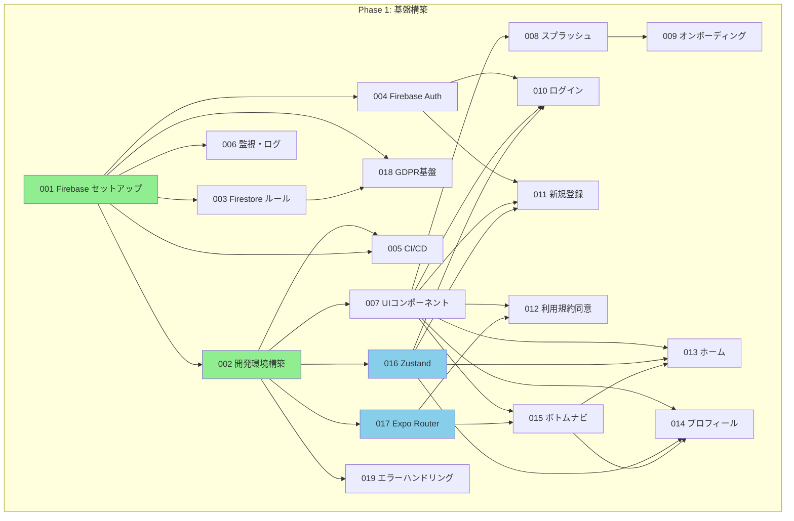
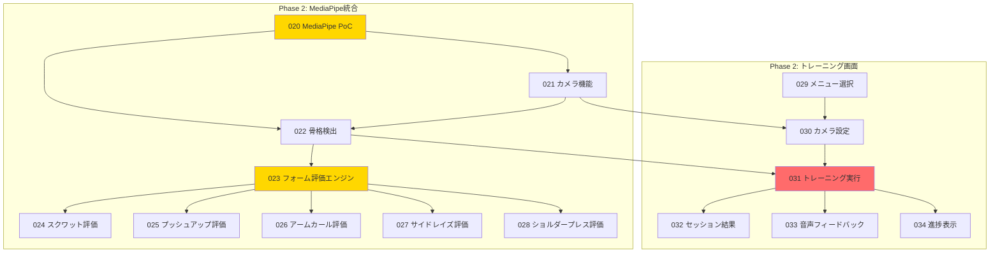
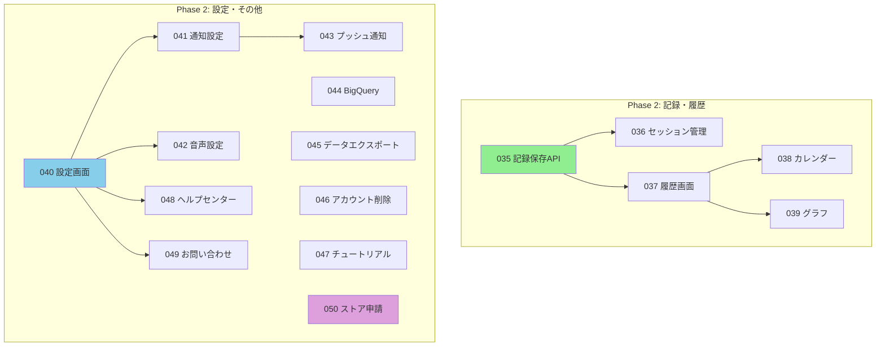
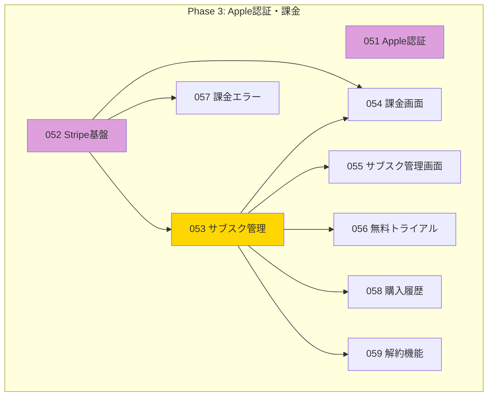
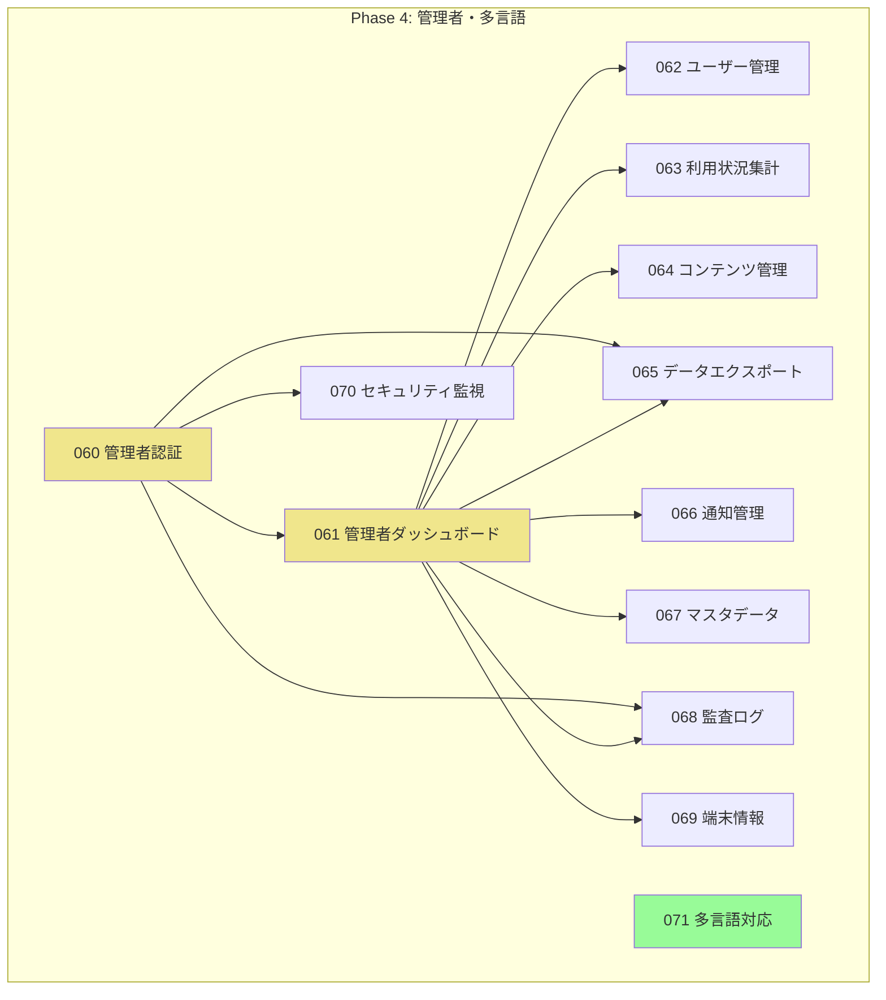
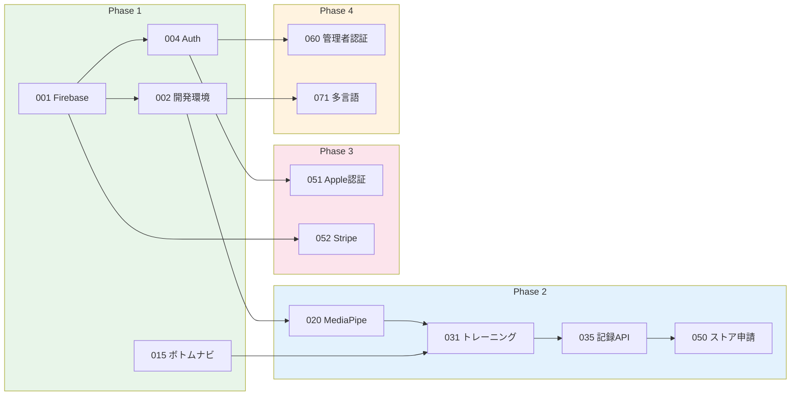

# Expo版 チケット全体管理

**バージョン**: 2.0.0
**最終更新日**: 2025年12月9日
**対象**: AIフィットネスアプリ（Expo版）開発チケット

---

## 1. プロジェクト概要

### このアプリについて

**AIフィットネスアプリ（Expo版）** は、スマートフォンのカメラを使ってトレーニングのフォーム（体の動かし方）をチェックするアプリです。

### 主な特徴

- カメラで体の動きをリアルタイムでチェック
- 音声で「もう少し深くしゃがんでみて」などのアドバイス
- トレーニングの記録を保存して、成長を確認できる
- 月額500円でプロのようなフォームチェックが受けられる

### Claude Codeでの並行開発について

このプロジェクトでは、複数のClaude Codeセッションで並行して開発を進めることができます。

**並行開発のメリット**:
- 依存関係がないチケットは同時に作業できる
- 開発スピードが上がる
- 待ち時間が減る

**並行開発で気をつけること**:
- 同じファイルを複数人で編集しない
- チケットの状態を必ず更新する
- 依存関係を確認してから着手する

---

## 2. Phase構成

開発は4つのPhaseに分かれています。各Phaseで作る機能が決まっています。

| Phase | 期間 | チケット番号 | 件数 | 目標 |
|-------|------|------------|------|------|
| **Phase 1** | 0-2ヶ月 | 001-019 | 19件 | 基盤構築（認証、画面、CI/CD） |
| **Phase 2** | 2-7ヶ月 | 020-050 | 31件 | 機能実装（トレーニング、履歴、設定） |
| **Phase 3** | 8ヶ月目以降 | 051-059 | 9件 | Apple認証・課金（Stripe） |
| **Phase 4** | 将来 | 060-071 | 12件 | 管理者・運用者・多言語 |
| **合計** | | | **71件** | |

### Phase 1: 基盤構築（0-2ヶ月）

アプリの土台を作るPhaseです。

- Firebaseの設定
- 開発環境の構築
- ログイン・登録画面
- 基本的な画面（ホーム、プロフィール）
- CI/CDパイプライン
- GDPR対応の基盤

### Phase 2: 機能実装（2-7ヶ月）

メインの機能を作るPhaseです。

- MediaPipeによるフォームチェック
- 5種目のトレーニング評価
- トレーニング記録・履歴
- カレンダー・グラフ表示
- 設定機能
- プッシュ通知

### Phase 3: Apple認証・課金（8ヶ月目以降）

収益化のための機能を作るPhaseです。

- Sign in with Apple
- Stripe決済
- サブスクリプション管理
- 無料トライアル

### Phase 4: 管理者・運用者・多言語（将来）

運用と拡大のための機能を作るPhaseです。

- 管理者ダッシュボード
- ユーザー管理
- 監査ログ
- 多言語対応（英語）

---

## 3. チケット一覧

### Phase 1: 基盤構築（001-019）

| ID | タイトル | 依存チケット | 状態 |
|----|---------|------------|------|
| 001 | Firebase プロジェクトセットアップ | - | 未着手 |
| 002 | 開発環境構築（Expo） | 001 | 未着手 |
| 003 | Firestore セキュリティルール実装 | 001 | 未着手 |
| 004 | Firebase Authentication設定（メール/Google） | 001 | 未着手 |
| 005 | CI/CDパイプライン構築 | 001, 002 | 未着手 |
| 006 | 監視・ログ基盤構築 | 001 | 未着手 |
| 007 | 基本UIコンポーネント作成 | 002 | 未着手 |
| 008 | スプラッシュ画面実装 | 002, 007 | 未着手 |
| 009 | オンボーディング画面実装 | 008 | 未着手 |
| 010 | ログイン画面実装 | 004, 007, 016 | 未着手 |
| 011 | 新規登録画面実装 | 004, 007, 016 | 未着手 |
| 012 | 利用規約同意画面実装 | 007, 017 | 未着手 |
| 013 | ホーム画面実装 | 007, 015, 016 | 未着手 |
| 014 | プロフィール画面実装 | 007, 015, 016 | 未着手 |
| 015 | ボトムナビゲーション実装 | 007, 017 | 未着手 |
| 016 | 状態管理基盤（Zustand） | 002 | 未着手 |
| 017 | ルーティング設定（Expo Router） | 002 | 未着手 |
| 018 | GDPR基盤実装（同意管理） | 001, 003 | 未着手 |
| 019 | エラーハンドリング基盤 | 002 | 未着手 |

### Phase 2: 機能実装（020-050）

| ID | タイトル | 依存チケット | 状態 |
|----|---------|------------|------|
| 020 | MediaPipe統合（技術検証PoC） | 002 | 未着手 |
| 021 | カメラ機能実装 | 002, 020 | 未着手 |
| 022 | 骨格検出基盤 | 020, 021 | 未着手 |
| 023 | フォーム評価エンジン | 022 | 未着手 |
| 024 | スクワット評価ロジック | 023 | 未着手 |
| 025 | プッシュアップ評価ロジック | 023 | 未着手 |
| 026 | アームカール評価ロジック | 023 | 未着手 |
| 027 | サイドレイズ評価ロジック | 023 | 未着手 |
| 028 | ショルダープレス評価ロジック | 023 | 未着手 |
| 029 | メニュー選択画面 | 015 | 未着手 |
| 030 | カメラ設定画面 | 021, 029 | 未着手 |
| 031 | トレーニング実行画面 | 022, 030 | 未着手 |
| 032 | セッション結果画面 | 031 | 未着手 |
| 033 | 音声フィードバック機能 | 031 | 未着手 |
| 034 | トレーニング進捗表示 | 031 | 未着手 |
| 035 | トレーニング記録保存API | 001, 003 | 未着手 |
| 036 | セッション管理 | 032, 035 | 未着手 |
| 037 | 履歴画面実装 | 015, 035 | 未着手 |
| 038 | カレンダー表示機能 | 037 | 未着手 |
| 039 | グラフ表示機能 | 037 | 未着手 |
| 040 | 設定画面実装 | 015 | 未着手 |
| 041 | 通知設定機能 | 040 | 未着手 |
| 042 | 音声設定機能 | 040 | 未着手 |
| 043 | プッシュ通知基盤 | 001, 041 | 未着手 |
| 044 | BigQueryパイプライン構築 | 001, 003 | 未着手 |
| 045 | データエクスポート機能 | 018, 035 | 未着手 |
| 046 | アカウント削除機能 | 018 | 未着手 |
| 047 | チュートリアル機能 | 013 | 未着手 |
| 048 | ヘルプセンター | 040 | 未着手 |
| 049 | お問い合わせフォーム | 040 | 未着手 |
| 050 | ストア申請準備 | 全Phase 2 | 未着手 |

### Phase 3: Apple認証・課金（051-059）

| ID | タイトル | 依存チケット | 状態 |
|----|---------|------------|------|
| 051 | Apple認証実装 | 004 | 未着手 |
| 052 | Stripe決済基盤 | 001 | 未着手 |
| 053 | サブスクリプション管理 | 052 | 未着手 |
| 054 | 課金画面実装 | 052, 053 | 未着手 |
| 055 | サブスクリプション管理画面 | 053 | 未着手 |
| 056 | 無料トライアル機能 | 053 | 未着手 |
| 057 | 課金エラーハンドリング | 052 | 未着手 |
| 058 | 購入履歴表示 | 053 | 未着手 |
| 059 | 解約機能 | 053 | 未着手 |

### Phase 4: 管理者・運用者・多言語（060-071）

| ID | タイトル | 依存チケット | 状態 |
|----|---------|------------|------|
| 060 | 管理者認証基盤 | 004 | 未着手 |
| 061 | 管理者ダッシュボード | 060 | 未着手 |
| 062 | ユーザーアカウント管理 | 060, 061 | 未着手 |
| 063 | 利用状況集計 | 061, 044 | 未着手 |
| 064 | コンテンツ管理 | 061 | 未着手 |
| 065 | データエクスポート（管理者） | 060, 061 | 未着手 |
| 066 | 通知管理 | 061, 043 | 未着手 |
| 067 | マスタデータ管理 | 061 | 未着手 |
| 068 | 監査ログ検索 | 060, 061 | 未着手 |
| 069 | 端末情報管理 | 061 | 未着手 |
| 070 | セキュリティ監視 | 060, 006 | 未着手 |
| 071 | 多言語対応基盤 | 002 | 未着手 |

---

## 4. 依存関係図（Mermaid形式）

矢印の向き（A --> B）は「Aが完了しないとBに着手できない」という意味です。

### Phase 1: 基盤構築の依存関係



### Phase 2: MediaPipe・トレーニング機能の依存関係



### Phase 2: 記録・設定機能の依存関係



### Phase 3: Apple認証・課金の依存関係



### Phase 4: 管理者・多言語の依存関係



### 全体の依存関係（簡略版）



---

## 5. 並行開発ガイド

### 並行作業の基本ルール

**やっていいこと**:
- 依存関係がないチケットを同時に進める
- 異なる画面の実装を同時に進める

**やってはいけないこと**:
- 同じファイルを複数人で編集する
- 依存チケットが完了していないのに着手する
- ステータスを更新せずに作業を進める

### Phase 1で並行作業できるチケット

001（Firebase）が完了すると、以下を並行して作業できます:

| グループ | チケット | 説明 |
|---------|---------|------|
| 認証系 | 003, 004 | Firestoreルール、Auth設定 |
| 監視系 | 006 | 監視・ログ基盤 |
| GDPR系 | 018 | 同意管理基盤 |

002（開発環境）が完了すると、以下を並行して作業できます:

| グループ | チケット | 説明 |
|---------|---------|------|
| 状態管理系 | 016, 017 | Zustand、Expo Router |
| UI系 | 007 | UIコンポーネント |
| 品質系 | 019 | エラーハンドリング |

### Phase 2で並行作業できるチケット

MediaPipe系（020-028）と画面系（029-034）は一部並行して作業可能:

| 並行グループA | 並行グループB |
|--------------|--------------|
| 020 MediaPipe PoC | 029 メニュー選択画面 |
| 024-028 評価ロジック | 037-039 履歴画面系 |
| 035 記録保存API | 040-042 設定画面系 |

### ファイル競合を避けるコツ

| チケット種別 | 主に触るファイル | 競合リスク |
|-------------|-----------------|-----------|
| 画面系 | `app/` 配下の画面ファイル | 低（画面ごとに独立） |
| API系 | `functions/src/` | 中（共通ユーティリティ注意） |
| 状態管理系 | `stores/` | 高（慎重に） |
| 設定系 | 設定ファイル全般 | 高（順番に作業推奨） |

---

## 6. チケットステータスの説明

| ステータス | 意味 | 色（図での表示） |
|-----------|------|-----------------|
| **未着手** | まだ作業を開始していない | 白 |
| **進行中** | 現在作業中 | 黄色 |
| **レビュー中** | 作業は完了し、レビュー待ち | 青 |
| **完了** | すべての作業が完了 | 緑 |
| **ブロック中** | 依存チケットが完了していない | 赤 |

### ステータス変更のタイミング

```
未着手 --> 進行中: 作業を開始したとき
進行中 --> レビュー中: 実装とテストが完了したとき
レビュー中 --> 完了: レビューが承認されたとき
進行中 --> ブロック中: 問題が発生したとき
ブロック中 --> 進行中: 問題が解決したとき
```

---

## 7. 進捗サマリー

### 現在の状況（2025年12月9日時点）

| Phase | 総数 | 完了 | 進行中 | 未着手 | 進捗率 |
|-------|------|------|--------|--------|--------|
| Phase 1 | 19 | 0 | 0 | 19 | 0% |
| Phase 2 | 31 | 0 | 0 | 31 | 0% |
| Phase 3 | 9 | 0 | 0 | 9 | 0% |
| Phase 4 | 12 | 0 | 0 | 12 | 0% |
| **合計** | **71** | **0** | **0** | **71** | **0%** |

### 次のマイルストーン

| マイルストーン | 目標日 | 関連チケット |
|--------------|--------|-------------|
| 開発環境完成 | - | 001, 002, 005 |
| 認証フロー完成 | - | 004, 010, 011, 012 |
| 基本画面完成 | - | 008, 009, 013, 014, 015 |
| Phase 1完了 | 2ヶ月後 | 001-019 |
| MediaPipe統合完了 | 3ヶ月後 | 020-028 |
| MVP完成 | 7ヶ月後 | 001-050 |

---

## 8. チケットファイルの場所

各チケットの詳細は以下のディレクトリにあります:

```
docs/expo/tickets/
├── 000-ticket-overview.md          # このファイル（全体管理）
├── 001-firebase-project-setup.md   # 各チケットの詳細
├── 002-expo-dev-environment.md
├── ...
└── 071-multilingual-support.md
```

---

## 9. 関連ドキュメント

| ドキュメント | パス | 説明 |
|-------------|------|------|
| 要件定義書 Part 1 | `docs/expo/specs/01_要件定義書_Expo版_v1_Part1.md` | 機能要件 |
| 要件定義書 Part 2 | `docs/expo/specs/02_要件定義書_Expo版_v1_Part2.md` | 非機能要件 |
| 要件定義書 Part 3 | `docs/expo/specs/03_要件定義書_Expo版_v1_Part3.md` | システムアーキテクチャ |
| 要件定義書 Part 4 | `docs/expo/specs/04_要件定義書_Expo版_v1_Part4.md` | 画面設計・フォーム評価 |
| 要件定義書 Part 5 | `docs/expo/specs/05_要件定義書_Expo版_v1_Part5.md` | DB・API・セキュリティ |
| 要件定義書 Part 6 | `docs/expo/specs/06_要件定義書_Expo版_v1_Part6.md` | 開発計画 |
| 画面遷移図 | `docs/expo/specs/07_画面遷移図_ワイヤーフレーム_v1_0.md` | UI/UX設計 |

---

## 変更履歴

| バージョン | 日付 | 変更内容 |
|-----------|------|----------|
| 1.0.0 | 2025年12月9日 | 初版作成（全71チケットの一覧と依存関係） |
| 2.0.0 | 2025年12月9日 | チケット構成を再整理。Phase 1-4のチケット番号と名称を更新。依存関係図を追加 |

---

**ドキュメント作成者**: AIフィットネスアプリ開発チーム
