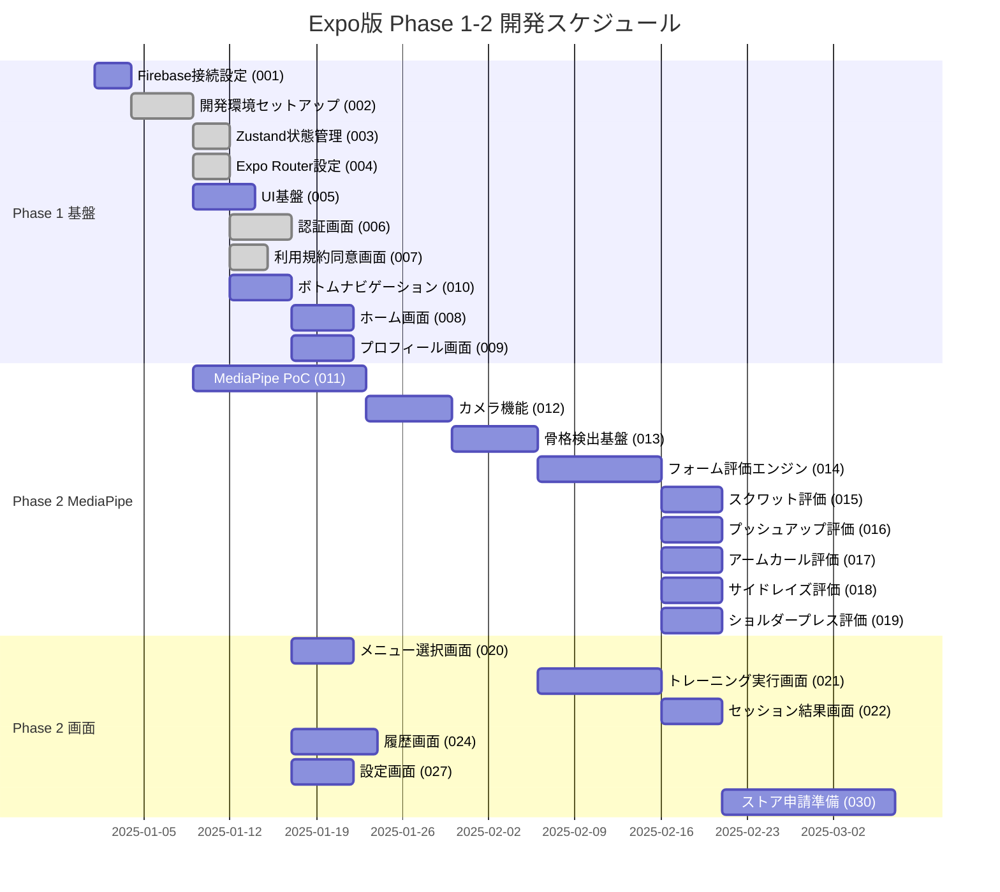
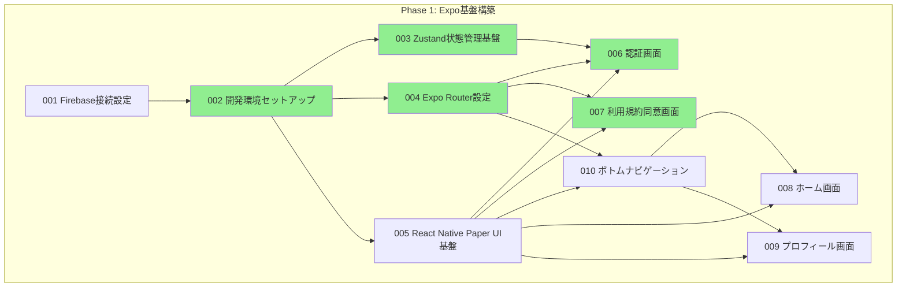
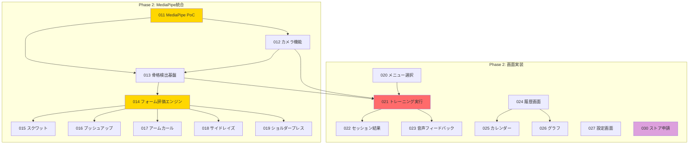

# Expo版 チケット全体管理

**バージョン**: 3.0.0
**作成日**: 2025年12月10日
**最終更新日**: 2025年12月10日
**対象**: AIフィットネスアプリ（Expo版）開発チケット

---

## 1. 概要

このドキュメントは、**AIフィットネスアプリ（Expo版）** の開発チケットを管理するファイルです。

Expo版では以下の技術を使用します:

- **状態管理**: Zustand
- **ルーティング**: Expo Router
- **姿勢検出**: MediaPipeネイティブモジュール（react-native-vision-camera）
- **UI**: React Native Paper（Material Design 3）

### Common（共通バックエンド）との関係

```
Expo版アプリ (React Native)
    |
    +---> Common (共通バックエンド)
              |
              +-- Firebase Cloud Functions
              +-- Firestore
              +-- BigQuery
```

Expo版は**フロントエンド**を担当し、バックエンドは **Common（共通バックエンド）** で管理されます。

---

## 2. Phase構成

Expo版の開発は4つのPhaseに分かれています。

| Phase | チケット範囲 | 件数 | 目標 |
|-------|------------|------|------|
| **Phase 1** | 001-010 | 10件 | Expo基盤構築 |
| **Phase 2** | 011-030 | 20件 | MediaPipe統合・画面実装 |
| **Phase 3** | 031-040 | 10件 | 課金フロントエンド |
| **Phase 4** | 041-050 | 10件 | 管理者フロントエンド |
| **合計** | | **50件** | |

### Phase 1: Expo基盤構築（0-2ヶ月）

アプリの土台を作るPhaseです。

- Firebase接続設定
- Expo開発環境セットアップ
- Zustand状態管理基盤
- Expo Router設定
- React Native Paper UI基盤
- 認証画面（ログイン・登録）
- 利用規約同意画面
- ホーム画面
- プロフィール画面
- ボトムナビゲーション

### Phase 2: MediaPipe統合・画面実装（2-7ヶ月）

メインの機能を作るPhaseです。

- MediaPipe PoC（技術検証）
- カメラ機能実装
- 骨格検出基盤
- フォーム評価エンジン
- 5種目の評価ロジック（スクワット、プッシュアップ、アームカール、サイドレイズ、ショルダープレス）
- メニュー選択画面
- トレーニング実行画面
- セッション結果画面
- 音声フィードバック機能
- 履歴画面・カレンダー・グラフ表示
- 設定画面・通知設定
- ヘルプセンター・ストア申請準備

### Phase 3: 課金フロントエンド（8ヶ月目以降）

収益化のための機能を作るPhaseです。

- Apple認証（Sign in with Apple）
- Stripe Payment Sheet実装
- 課金画面実装
- サブスクリプション管理画面
- 無料トライアル機能

### Phase 4: 管理者フロントエンド（将来）

運用と拡大のための機能を作るPhaseです。

- 管理者ダッシュボード
- ユーザー管理画面
- 多言語対応基盤

---

## 3. 全チケット一覧

### Phase 1: 基盤構築（001-010）

| ID | タイトル | 依存チケット | 状態 | 備考 |
|----|---------|------------|------|------|
| 001 | Firebase接続設定 | - | 未着手 | Common/001完了後に開始 |
| 002 | Expo開発環境セットアップ | 001 | **完了** | |
| 003 | Zustand状態管理基盤 | 002 | **完了** | |
| 004 | Expo Router設定 | 002 | **完了** | |
| 005 | React Native Paper UI基盤 | 002 | 未着手 | |
| 006 | 認証画面（ログイン・登録） | 003, 004, 005 | **完了** | Common/003完了後にテスト可能 |
| 007 | 利用規約同意画面 | 004, 005 | **完了** | |
| 008 | ホーム画面 | 005, 010 | 未着手 | |
| 009 | プロフィール画面 | 005, 010 | 未着手 | |
| 010 | ボトムナビゲーション | 004, 005 | 未着手 | |

### Phase 2: MediaPipe統合・画面実装（011-030）

| ID | タイトル | 依存チケット | 状態 | 備考 |
|----|---------|------------|------|------|
| 011 | MediaPipe PoC（技術検証） | 002 | 未着手 | Development Build必須 |
| 012 | カメラ機能実装 | 011 | 未着手 | react-native-vision-camera |
| 013 | 骨格検出基盤 | 011, 012 | 未着手 | |
| 014 | フォーム評価エンジン | 013 | 未着手 | |
| 015 | スクワット評価ロジック | 014 | 未着手 | |
| 016 | プッシュアップ評価ロジック | 014 | 未着手 | |
| 017 | アームカール評価ロジック | 014 | 未着手 | |
| 018 | サイドレイズ評価ロジック | 014 | 未着手 | |
| 019 | ショルダープレス評価ロジック | 014 | 未着手 | |
| 020 | メニュー選択画面 | 010 | 未着手 | |
| 021 | トレーニング実行画面 | 012, 013, 020 | 未着手 | |
| 022 | セッション結果画面 | 021 | 未着手 | |
| 023 | 音声フィードバック機能 | 021 | 未着手 | expo-speech |
| 024 | 履歴画面実装 | 010 | 未着手 | Common/011完了後に実装可能 |
| 025 | カレンダー表示機能 | 024 | 未着手 | react-native-calendars |
| 026 | グラフ表示機能 | 024 | 未着手 | react-native-chart-kit |
| 027 | 設定画面実装 | 010 | 未着手 | |
| 028 | 通知設定機能 | 027 | 未着手 | |
| 029 | ヘルプセンター | 027 | 未着手 | |
| 030 | ストア申請準備 | 全Phase 2 | 未着手 | スクリーンショット、説明文 |

### Phase 3: 課金フロントエンド（031-040）

| ID | タイトル | 依存チケット | 状態 | 備考 |
|----|---------|------------|------|------|
| 031 | Apple認証実装 | 006 | 未着手 | expo-apple-authentication |
| 032 | Stripe Payment Sheet実装 | 002 | 未着手 | Common/031完了後に実装可能 |
| 033 | 課金画面実装 | 032 | 未着手 | |
| 034 | サブスクリプション管理画面 | 032 | 未着手 | |
| 035 | 無料トライアル機能 | 032 | 未着手 | |
| 036 | 課金エラーハンドリング | 032 | 未着手 | |
| 037 | 購入履歴画面 | 032 | 未着手 | |
| 038 | 解約機能実装 | 034 | 未着手 | |
| 039 | 予備 | - | 未着手 | |
| 040 | 予備 | - | 未着手 | |

### Phase 4: 管理者フロントエンド（041-050）

| ID | タイトル | 依存チケット | 状態 | 備考 |
|----|---------|------------|------|------|
| 041 | 管理者ダッシュボード | 006 | 未着手 | Common/041完了後に実装可能 |
| 042 | ユーザー管理画面 | 041 | 未着手 | |
| 043 | 多言語対応基盤 | 002 | 未着手 | i18n |
| 044 | 予備 | - | 未着手 | |
| 045 | 予備 | - | 未着手 | |
| 046 | 予備 | - | 未着手 | |
| 047 | 予備 | - | 未着手 | |
| 048 | 予備 | - | 未着手 | |
| 049 | 予備 | - | 未着手 | |
| 050 | 予備 | - | 未着手 | |

---

## 4. Commonバックエンドとの依存関係

Expo版のチケットは、Common（共通バックエンド）のチケット完了に依存しています。
詳細は `docs/common/tickets/000-ticket-overview.md` の「フロントエンドチケットとの依存関係」セクションを参照してください。

### 主要な依存関係

| Expoチケット | 依存するCommonチケット | Common状態 | 説明 |
|-------------|---------------------|-----------|------|
| expo/001 Firebase接続設定 | common/001 Firebase環境確認 | ✅ 完了 | Firebase基盤完了後にフロントエンド接続設定が可能 |
| expo/006 認証画面 | common/002 Firestore Security Rules | 🔄 進行中 | Security Rules完了後に認証画面のテストが可能 |
| expo/006 認証画面 | common/003 Cloud Functions基盤 | ✅ 完了 | Functions基盤完了後に認証機能が動作 |
| expo/006 認証画面 | common/004 認証トリガー実装 | ✅ 完了 | 認証トリガー完了後にユーザー作成・削除が可能 |
| expo/007 利用規約同意画面 | common/006 GDPR同意管理API | ⏳ 未着手 | 同意管理API完了後に利用規約画面が実装可能 |
| expo/009 プロフィール画面 | common/007 ユーザーAPI | ⏳ 未着手 | ユーザーAPI完了後にプロフィール画面が実装可能 |
| expo/024 履歴画面実装 | common/011-014 セッションAPI群 | ⏳ 未着手 | セッションAPI完了後に履歴画面が実装可能 |
| expo/027 設定画面 | common/018 GDPR削除リクエストAPI | ⏳ 未着手 | 削除リクエストAPI完了後に削除機能が実装可能 |
| expo/027 設定画面 | common/020 GDPR同意追跡API | ⏳ 未着手 | 同意追跡API完了後に同意管理機能が実装可能 |
| expo/027 設定画面 | common/025 設定保存API | ⏳ 未着手 | 設定API完了後に設定保存機能が実装可能 |
| expo/028 通知設定機能 | common/022 プッシュ通知トリガー | ⏳ 未着手 | 通知トリガー完了後に通知機能が実装可能 |
| expo/028 通知設定機能 | common/023 プッシュ通知スケジューラ | ⏳ 未着手 | スケジューラ完了後に定期通知が可能 |
| expo/028 通知設定機能 | common/026 通知設定API | ⏳ 未着手 | 通知設定API完了後に通知設定画面が実装可能 |
| expo/029 ヘルプセンター | common/024 ユーザーフィードバックAPI | ⏳ 未着手 | フィードバックAPI完了後にフィードバック送信が可能 |
| expo/032 Stripe Payment Sheet | common/031 Stripe統合基盤 | ⏳ Phase 3 | Stripe Backend完了後にフロント実装が可能 |
| expo/033 課金画面 | common/032 サブスクリプション作成API | ⏳ Phase 3 | 作成API完了後に課金画面が実装可能 |
| expo/034 サブスクリプション管理 | common/033-034 サブスク確認・更新API | ⏳ Phase 3 | 確認・更新API完了後にサブスク管理画面が実装可能 |
| expo/035 無料トライアル機能 | common/036 無料トライアル管理API | ⏳ Phase 3 | トライアルAPI完了後にトライアル機能が実装可能 |
| expo/037 購入履歴画面 | common/039 課金履歴API | ⏳ Phase 3 | 履歴API完了後に購入履歴画面が実装可能 |
| expo/038 解約機能 | common/035 サブスクリプション解約API | ⏳ Phase 3 | 解約API完了後に解約機能が実装可能 |
| expo/041 管理者ダッシュボード | common/041 管理者認証API | ⏳ Phase 4 | 管理者認証API完了後にダッシュボード実装が可能 |
| expo/041 管理者ダッシュボード | common/045-047 統計・監視・ログAPI | ⏳ Phase 4 | 各API完了後にダッシュボード機能が実装可能 |
| expo/042 ユーザー管理画面 | common/042-044 ユーザー管理・検索・削除API | ⏳ Phase 4 | ユーザー管理API完了後にユーザー管理画面が実装可能 |
| expo/042 ユーザー管理画面 | common/048 データエクスポートAPI | ⏳ Phase 4 | エクスポートAPI完了後にデータエクスポート機能が実装可能 |

### 状態アイコン凡例

| アイコン | 意味 |
|---------|------|
| ✅ 完了 | Commonチケットが完了しており、Expo実装が着手可能 |
| 🔄 進行中 | Commonチケットが進行中、完了後にExpo実装が着手可能 |
| ⏳ 未着手 | Commonチケットが未着手、完了を待つ必要あり |
| ⏳ Phase 3 | Phase 3のため現時点では未着手 |
| ⏳ Phase 4 | Phase 4のため現時点では未着手 |

### 進捗同期ルール

1. **Commonチケット完了時**: Commonチケットが完了したら、依存するExpoチケットを「着手可能」に更新
2. **週次確認**: 毎週金曜日に依存関係の確認を実施
3. **ブロック報告**: Commonチケットの遅延によりExpoチケットがブロックされた場合は即座にチーム内で報告
4. **モック開発**: Commonチケット完了前でも、モックデータを使ってUI実装を先行可能（ただし結合テストはCommon完了後）

### 依存関係の注意事項

- Expo版のチケットに着手する前に、対応するCommonチケットが完了しているか確認してください
- CommonチケットがブロックされているとExpo版も進められない場合があります
- 画面のUI実装はCommonチケット完了前でも着手できますが、動作テストにはCommonが必要です
- 完全な依存関係マトリクスは `docs/common/tickets/000-ticket-overview.md` の「フロントエンドチケットとの依存関係」セクションを参照してください

---

## 5. 依存関係図（Mermaid Gantt）

### Phase 1-2の主要チケット依存関係



### Phase 1 依存関係詳細



### Phase 2 依存関係詳細



---

## 6. 進捗サマリー

### 現在の状況（2025年12月10日時点）

```
Phase 1: ######---- 60% (6/10完了)
Phase 2: ---------- 0% (0/20完了)
Phase 3: ---------- 0% (0/10完了)
Phase 4: ---------- 0% (0/10完了)
全体:    ##-------- 12% (6/50完了)
```

### Phase別進捗

| Phase | 総数 | 完了 | 進行中 | 未着手 | 進捗率 |
|-------|------|------|--------|--------|--------|
| Phase 1 | 10 | 6 | 0 | 4 | **60%** |
| Phase 2 | 20 | 0 | 0 | 20 | **0%** |
| Phase 3 | 10 | 0 | 0 | 10 | **0%** |
| Phase 4 | 10 | 0 | 0 | 10 | **0%** |
| **合計** | **50** | **6** | **0** | **44** | **12%** |

### 完了済みチケット

| ID | タイトル | 完了日 |
|----|---------|--------|
| 002 | Expo開発環境セットアップ | 2025-12-09 |
| 003 | Zustand状態管理基盤 | 2025-12-09 |
| 004 | Expo Router設定 | 2025-12-09 |
| 006 | 認証画面（ログイン・登録） | 2025-12-09 |
| 007 | 利用規約同意画面 | 2025-12-09 |
| - | expo_app作成 | 2025-12-09 |

### 次のマイルストーン

| マイルストーン | 目標日 | 完了条件 | 関連チケット |
|-------------|--------|---------|-----------|
| **M1: Phase 1完了** | 2ヶ月後 | 全10件完了 | 001-010 |
| **M2: MediaPipe PoC完了** | 3ヶ月後 | 姿勢検出動作確認 | 011-013 |
| **M3: 5種目実装完了** | 5ヶ月後 | 全評価ロジック実装 | 014-019 |
| **M4: MVP完成** | 7ヶ月後 | ストア申請準備完了 | 001-030 |
| **M5: 課金機能リリース** | 9ヶ月後 | Stripe課金稼働 | 031-038 |

---

## 7. Flutter版との比較

Expo版とFlutter版の技術的な違いを比較します。

| 項目 | Expo版 | Flutter版 |
|-----|--------|-----------|
| **フレームワーク** | React Native (Expo) | Flutter |
| **言語** | TypeScript | Dart |
| **状態管理** | Zustand | Riverpod |
| **ルーティング** | Expo Router | GoRouter |
| **姿勢検出** | MediaPipeネイティブモジュール | google_mlkit_pose_detection |
| **UI** | React Native Paper (Material Design 3) | Material 3 |
| **カメラ** | react-native-vision-camera | camera パッケージ |
| **バリデーション** | Zod | 手動実装 |

### Expo版のメリット

- **開発者の確保**: React/JavaScriptの開発者が多い
- **Webとの共通化**: Reactの知識でWeb版も作れる
- **エコシステム**: npmパッケージが豊富
- **学習コスト**: Web開発経験者なら習得が早い

### 共通のバックエンド

両バージョンとも、**Common（共通バックエンド）** を使用します:

- Firebase Cloud Functions
- Firestore
- BigQuery
- Firebase Auth

---

## 8. 並行開発ガイド

### 並行作業できるチケット

依存関係がないチケットは、同時に進める（並行作業）ことができます。

#### Phase 1で並行作業可能

チケット002（開発環境セットアップ）が完了すると、以下を並行できます:

| グループ | チケット | 説明 |
|---------|---------|------|
| 状態管理系 | 003, 004 | Zustand、Expo Router |
| UI系 | 005 | UIコンポーネント |
| MediaPipe準備 | 011 | MediaPipe PoC |

#### Phase 2で並行作業可能

| グループA（MediaPipe） | グループB（画面） | グループC（設定） |
|----------------------|------------------|------------------|
| 011-019（MediaPipe・評価ロジック） | 020-026（トレーニング・履歴画面） | 027-029（設定・ヘルプ） |

### ファイル競合を避けるコツ

| チケット種別 | 主に触るファイル | 競合リスク |
|-------------|-----------------|-----------|
| 画面系 | `app/` 配下の画面ファイル | 低（画面ごとに独立） |
| MediaPipe系 | `native-modules/` | 中（ネイティブコード注意） |
| 状態管理系 | `stores/` | 高（慎重に） |
| 設定系 | `app.json`, `package.json` | 高（順番に作業推奨） |

---

## 9. チケット完了のチェックリスト

チケットを完了とする前に、以下の項目をチェックしてください。

### 基本項目

- [ ] コード実装が完了した
- [ ] TypeScriptの型エラーがない
- [ ] ESLint / Prettier が通った
- [ ] ローカルでテストが成功した

### UI/UX項目

- [ ] デザインが仕様書と一致している
- [ ] アクセシビリティが考慮されている
- [ ] レスポンシブ対応ができている

### テスト項目

- [ ] ユニットテストを書いた
- [ ] エッジケースをテストした
- [ ] 実機でテストした

### ドキュメント

- [ ] JSDocで関数を説明している
- [ ] 複雑なロジックをコメントで説明している

---

## 10. 関連ドキュメント

### Expo版の仕様書

| ドキュメント | パス | 説明 |
|-------------|------|------|
| 技術スタック | `docs/expo/specs/01_技術スタック_v1_0.md` | 技術選定理由 |
| 開発計画 | `docs/expo/specs/02_開発計画_v1_0.md` | Phase構成とスケジュール |
| 画面遷移図 | `docs/common/specs/11_画面遷移図_ワイヤーフレーム_v1_0.md` | UI/UX設計（Expo/Flutter共通） |

### Common（共通バックエンド）との関連

| ドキュメント | パス | 説明 |
|-------------|------|------|
| Commonチケット | `docs/common/tickets/000-ticket-overview.md` | バックエンド全50チケット |
| Common仕様書 | `docs/common/specs/` | バックエンド仕様 |

### Flutter版との関連

| ドキュメント | パス | 説明 |
|-------------|------|------|
| Flutter仕様書 | `docs/flutter/specs/` | Flutter固有の仕様 |

---

## 11. 変更履歴

| バージョン | 日付 | 変更内容 |
|-----------|------|----------|
| 1.0.0 | 2025年12月9日 | 初版作成（全71チケットの一覧と依存関係） |
| 2.0.0 | 2025年12月9日 | チケット構成を再整理。Phase 1-4のチケット番号と名称を更新 |
| 3.0.0 | 2025年12月10日 | Common版と構造を統一。50チケットに再編成。依存関係をCommonチケットと連携。Flutter版との比較を追加 |

---

**ドキュメント作成者**: AIフィットネスアプリ開発チーム
**最終確認日**: 2025年12月10日
**対象バージョン**: Expo版 v1.0
