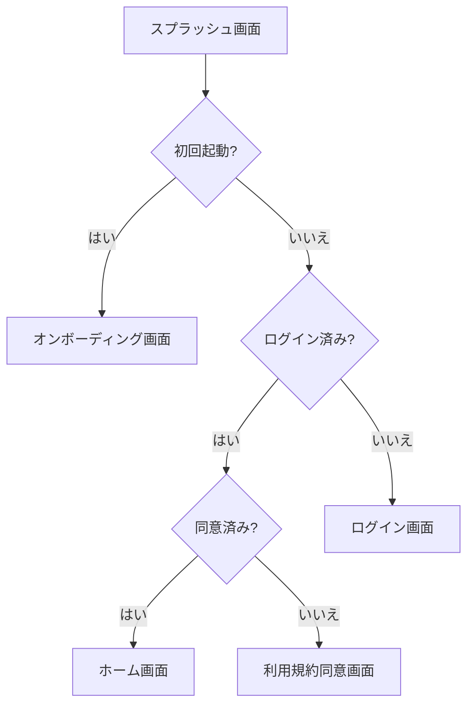

# 008 スプラッシュ画面実装

## 概要

アプリ起動時に最初に表示されるスプラッシュ画面を実装します。アプリロゴとローディングアニメーションを表示し、認証状態に応じて適切な画面へ遷移します。

## Phase

Phase 1（基盤構築）

## 依存チケット

- [002 Expo開発環境構築](./002-dev-environment-setup.md)
- [007 基本UIコンポーネント作成](./007-base-ui-components.md)

## 要件

### 画面要素

| 要素 | 内容 | 仕様 |
|-----|------|------|
| 背景色 | ブランドカラー（緑） | #4CAF50 |
| ロゴ | アプリアイコン画像 | 中央配置 |
| アプリ名 | テキスト表示 | 白文字、ロゴの下 |
| ローディング | アニメーション | ActivityIndicator |

### 表示時間

- 最短: 1秒（初期化処理完了まで）
- 最長: 3秒（タイムアウト）

### 遷移条件



### 判定に使用するデータ

| 判定項目 | データソース | 値 |
|---------|-------------|-----|
| 初回起動 | AsyncStorage | `hasSeenOnboarding` |
| ログイン状態 | Firebase Auth | `currentUser` |
| 同意状態 | Firestore | `users.tosAccepted`, `users.ppAccepted` |

## 受け入れ条件

- [ ] スプラッシュ画面が表示される
- [ ] アプリロゴが中央に表示される
- [ ] ローディングアニメーションが表示される
- [ ] 背景色がブランドカラー（緑）になっている
- [ ] 初回起動時にオンボーディング画面へ遷移する
- [ ] 未ログイン時にログイン画面へ遷移する
- [ ] ログイン済み・同意済み時にホーム画面へ遷移する
- [ ] ログイン済み・未同意時に利用規約同意画面へ遷移する
- [ ] 3秒以内に次の画面へ遷移する

## 参照ドキュメント

- [画面遷移図・ワイヤーフレーム](../specs/07_画面遷移図_ワイヤーフレーム_v1_0.md) - 3.1 スプラッシュ画面
- [要件定義書 Part 4（画面設計）](../specs/04_要件定義書_Expo版_v1_Part4.md) - 1.2 画面遷移図

## 技術詳細

### ワイヤーフレーム

```
+-------------------------------+
|                               |
|                               |
|                               |
|         [アプリロゴ]            |
|                               |
|       [アプリ名(仮称)]         |
|                               |
|                               |
|     ... (ローディング)        |
|                               |
|                               |
+-------------------------------+
```

### Expo Routerパス

`app/(splash)/index.tsx`

### 実装コード

```typescript
// app/(splash)/index.tsx
import { useEffect, useState } from 'react';
import { View, StyleSheet, Image } from 'react-native';
import { ActivityIndicator, Text } from 'react-native-paper';
import { router } from 'expo-router';
import AsyncStorage from '@react-native-async-storage/async-storage';
import auth from '@react-native-firebase/auth';
import firestore from '@react-native-firebase/firestore';

const ONBOARDING_KEY = 'hasSeenOnboarding';
const SPLASH_MIN_DURATION = 1000; // 最短表示時間

export default function SplashScreen() {
  const [isLoading, setIsLoading] = useState(true);

  useEffect(() => {
    const startTime = Date.now();

    const checkInitialRoute = async () => {
      try {
        // 1. 初回起動チェック
        const hasSeenOnboarding = await AsyncStorage.getItem(ONBOARDING_KEY);

        if (!hasSeenOnboarding) {
          await waitMinDuration(startTime);
          router.replace('/onboarding');
          return;
        }

        // 2. 認証状態チェック
        const currentUser = auth().currentUser;

        if (!currentUser) {
          await waitMinDuration(startTime);
          router.replace('/auth/login');
          return;
        }

        // 3. 同意状態チェック
        const userDoc = await firestore()
          .collection('users')
          .doc(currentUser.uid)
          .get();

        const userData = userDoc.data();
        const hasConsented = userData?.tosAccepted && userData?.ppAccepted;

        await waitMinDuration(startTime);

        if (!hasConsented) {
          router.replace('/auth/agreement');
        } else {
          router.replace('/(tabs)/home');
        }
      } catch (error) {
        console.error('Splash screen error:', error);
        // エラー時はログイン画面へ
        router.replace('/auth/login');
      } finally {
        setIsLoading(false);
      }
    };

    checkInitialRoute();
  }, []);

  return (
    <View style={styles.container}>
      <Image
        source={require('@/assets/images/logo.png')}
        style={styles.logo}
        resizeMode="contain"
      />
      <Text style={styles.appName}>AI Fitness</Text>
      <ActivityIndicator
        size="small"
        color="#FFFFFF"
        style={styles.loading}
      />
    </View>
  );
}

// 最短表示時間を確保
async function waitMinDuration(startTime: number) {
  const elapsed = Date.now() - startTime;
  if (elapsed < SPLASH_MIN_DURATION) {
    await new Promise(resolve =>
      setTimeout(resolve, SPLASH_MIN_DURATION - elapsed)
    );
  }
}

const styles = StyleSheet.create({
  container: {
    flex: 1,
    backgroundColor: '#4CAF50',
    justifyContent: 'center',
    alignItems: 'center',
  },
  logo: {
    width: 120,
    height: 120,
    marginBottom: 16,
  },
  appName: {
    fontSize: 28,
    fontWeight: 'bold',
    color: '#FFFFFF',
    marginBottom: 32,
  },
  loading: {
    marginTop: 20,
  },
});
```

### Expo Splash Screen設定

```json
// app.json
{
  "expo": {
    "splash": {
      "image": "./assets/images/splash.png",
      "resizeMode": "contain",
      "backgroundColor": "#4CAF50"
    }
  }
}
```

### ルートレイアウトでの認証監視

```typescript
// app/_layout.tsx
import { useEffect } from 'react';
import { Slot } from 'expo-router';
import { PaperProvider } from 'react-native-paper';
import { SafeAreaProvider } from 'react-native-safe-area-context';
import auth, { FirebaseAuthTypes } from '@react-native-firebase/auth';
import { useAuthStore } from '@/stores/auth';
import { theme } from '@/lib/theme';

export default function RootLayout() {
  const setUser = useAuthStore((state) => state.setUser);

  useEffect(() => {
    // 認証状態の監視
    const unsubscribe = auth().onAuthStateChanged(
      (user: FirebaseAuthTypes.User | null) => {
        setUser(user);
      }
    );

    return unsubscribe;
  }, [setUser]);

  return (
    <SafeAreaProvider>
      <PaperProvider theme={theme}>
        <Slot />
      </PaperProvider>
    </SafeAreaProvider>
  );
}
```

### Zustand認証ストア

```typescript
// stores/auth.ts
import { create } from 'zustand';
import { FirebaseAuthTypes } from '@react-native-firebase/auth';

interface AuthState {
  user: FirebaseAuthTypes.User | null;
  isLoading: boolean;
  setUser: (user: FirebaseAuthTypes.User | null) => void;
}

export const useAuthStore = create<AuthState>((set) => ({
  user: null,
  isLoading: true,
  setUser: (user) => set({ user, isLoading: false }),
}));
```

## 注意事項

- ネイティブスプラッシュ（app.jsonで設定）とReactスプラッシュを併用すること
- 認証状態チェック中のエラーは適切にハンドリングすること
- 最短表示時間を設けることで、画面のちらつきを防止すること
- タイムアウト処理を入れて、無限ローディングを防止すること

## 見積もり

- 想定工数: 3-4時間
- 難易度: 低

## 進捗

- [ ] 未着手
