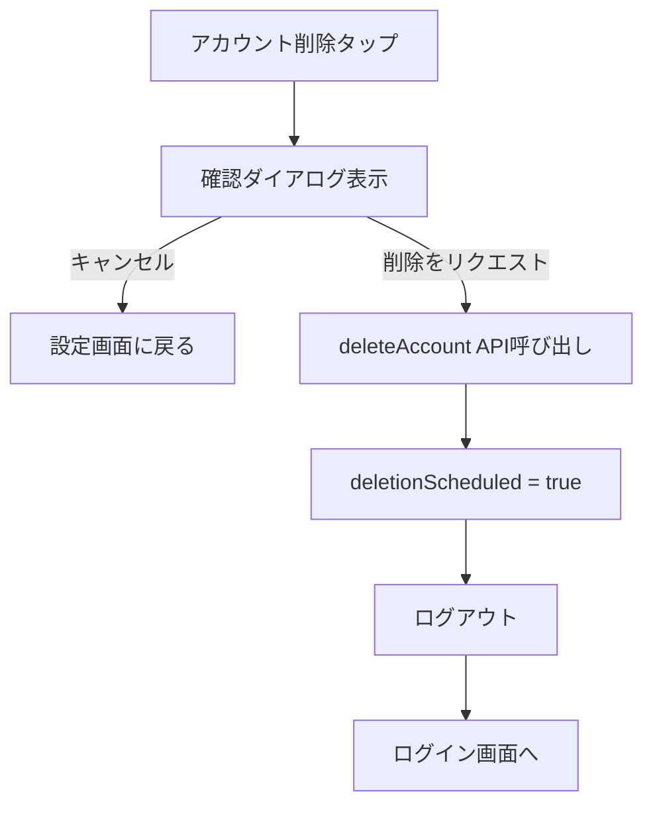

# 027 設定画面実装

## 概要

設定画面を実装します。音声フィードバック、通知設定、アカウント管理（サブスクリプション、利用規約、プライバシーポリシー、お問い合わせ、ログアウト、アカウント削除）、アプリ情報の表示を行います。

## Phase

Phase 2（MediaPipe統合・画面実装）

## プラットフォーム

expo（フロントエンド）

## 依存チケット

- expo/010: ボトムナビゲーション（設定タブの基盤）

## 要件

### 機能要件

- FR-011: 通知設定（リマインダー通知のON/OFF設定）
- FR-012: 音声設定（音声フィードバックのON/OFF設定）
- FR-014: プライバシー設定（データ削除、同意確認へのアクセス）
- FR-016: 設定管理機能（各種設定の一括管理）
- FR-021: サブスクリプション管理（課金画面への遷移）
- FR-025: データ削除権（アカウント削除機能）

### 非機能要件

- NFR-019: レスポンシブデザイン対応
- NFR-021: 操作性（3タップ以内で主要機能にアクセス可能）
- NFR-033: ナビゲーションバー（タブからのアクセス）

## 受け入れ条件（Todo）

- [x] 設定画面が表示される
- [x] トレーニングセクション
  - [x] 音声フィードバック ON/OFF スイッチが動作する
  - [x] 設定変更がローカルストレージに保存される
- [x] 通知セクション
  - [x] リマインダー通知 ON/OFF スイッチが動作する
  - [x] お知らせ通知 ON/OFF スイッチが動作する
  - [x] 通知設定画面への遷移リンクが動作する
- [x] アカウントセクション
  - [x] サブスクリプション管理への遷移が動作する
  - [x] 利用規約のモーダル/WebView表示が動作する
  - [x] プライバシーポリシーのモーダル/WebView表示が動作する
  - [x] お問い合わせ画面への遷移が動作する
  - [x] ログアウト機能が動作する（確認ダイアログ付き）
  - [x] アカウント削除機能が動作する（確認ダイアログ付き、30日猶予説明）
- [x] アプリ情報セクション
  - [x] アプリバージョンが正しく表示される
- [x] ダークモード対応
- [x] 削除予定ユーザーは編集系操作が無効化される

## 参照ドキュメント

- `docs/common/specs/02-1_機能要件_v1_0.md` - FR-011, FR-012, FR-014, FR-016, FR-021, FR-025
- `docs/common/specs/02-2_非機能要件_v1_0.md` - NFR-019, NFR-021, NFR-033
- `docs/common/specs/11_画面遷移図_ワイヤーフレーム_v1_0.md` - セクション3.13（設定画面）

## 技術詳細

### 画面構成

```
+-------------------------------+
| [<- プロフィール]  設定         |
|                               |
|  トレーニング                  |
|  ============================  |
|  音声フィードバック            |
|  [ON  /  OFF]                 |
|  ============================  |
|                               |
|  通知                         |
|  ============================  |
|  リマインダー通知              |
|  [ON  /  OFF]                 |
|                               |
|  お知らせ通知                  |
|  [ON  /  OFF]                 |
|                               |
|  [>] 通知の詳細設定            |
|  ============================  |
|                               |
|  アカウント                    |
|  ============================  |
|  [>] サブスクリプション管理     |
|  [>] 利用規約                  |
|  [>] プライバシーポリシー       |
|  [>] お問い合わせ              |
|  [>] ログアウト                |
|  [>] アカウント削除            |
|  ============================  |
|                               |
|  アプリ情報                    |
|  ============================  |
|  バージョン: 1.0.0             |
|  ============================  |
|                               |
+-------------------------------+
```

### 使用ライブラリ

- **React Native Paper**: List, Switch, Divider, Dialog
- **Expo Router**: 画面遷移
- **Zustand**: 設定状態管理
- **AsyncStorage**: ローカル設定永続化
- **expo-constants**: アプリバージョン取得
- **expo-linking**: 外部リンク（お問い合わせメール）

### 主要コンポーネント

#### ファイル配置

```
expo_app/
├── app/
│   └── settings/
│       └── index.tsx           # 設定画面
├── components/
│   └── settings/
│       ├── SettingsItem.tsx    # 設定項目コンポーネント
│       ├── SettingsSection.tsx # セクションコンポーネント
│       └── VoiceSettingsSection.tsx  # 音声設定セクション
└── store/
    └── settingsStore.ts        # 設定ストア
```

#### 設定ストア

```typescript
// store/settingsStore.ts
import { create } from 'zustand';
import { persist, createJSONStorage } from 'zustand/middleware';
import AsyncStorage from '@react-native-async-storage/async-storage';

interface SettingsState {
  // トレーニング設定
  voiceFeedbackEnabled: boolean;

  // 通知設定
  reminderNotificationEnabled: boolean;
  newsNotificationEnabled: boolean;

  // アクション
  setVoiceFeedback: (enabled: boolean) => void;
  setReminderNotification: (enabled: boolean) => void;
  setNewsNotification: (enabled: boolean) => void;
}

export const useSettingsStore = create<SettingsState>()(
  persist(
    (set) => ({
      voiceFeedbackEnabled: true,
      reminderNotificationEnabled: false,
      newsNotificationEnabled: true,

      setVoiceFeedback: (enabled) => set({ voiceFeedbackEnabled: enabled }),
      setReminderNotification: (enabled) => set({ reminderNotificationEnabled: enabled }),
      setNewsNotification: (enabled) => set({ newsNotificationEnabled: enabled }),
    }),
    {
      name: 'settings-storage',
      storage: createJSONStorage(() => AsyncStorage),
    }
  )
);
```

#### 設定画面

```typescript
// app/settings/index.tsx
import React, { useState, useCallback } from 'react';
import { View, ScrollView, StyleSheet, Alert, Linking } from 'react-native';
import {
  List,
  Switch,
  Divider,
  Text,
  Portal,
  Dialog,
  Button
} from 'react-native-paper';
import { router } from 'expo-router';
import Constants from 'expo-constants';
import { useSettingsStore } from '@/store/settingsStore';
import { useAuthStore } from '@/store/authStore';
import { signOut, deleteAccount } from '@/services/auth';

export default function SettingsScreen() {
  const [logoutDialogVisible, setLogoutDialogVisible] = useState(false);
  const [deleteDialogVisible, setDeleteDialogVisible] = useState(false);

  const { user, userData } = useAuthStore();
  const {
    voiceFeedbackEnabled,
    reminderNotificationEnabled,
    newsNotificationEnabled,
    setVoiceFeedback,
    setReminderNotification,
    setNewsNotification,
  } = useSettingsStore();

  const isDeletionScheduled = userData?.deletionScheduled === true;
  const appVersion = Constants.expoConfig?.version || '1.0.0';

  const handleLogout = useCallback(async () => {
    try {
      await signOut();
      setLogoutDialogVisible(false);
      router.replace('/auth/login');
    } catch (error) {
      Alert.alert('エラー', 'ログアウトに失敗しました');
    }
  }, []);

  const handleDeleteAccount = useCallback(async () => {
    try {
      await deleteAccount();
      setDeleteDialogVisible(false);
      router.replace('/auth/login');
    } catch (error) {
      Alert.alert('エラー', 'アカウント削除リクエストに失敗しました');
    }
  }, []);

  const handleContactPress = useCallback(() => {
    Linking.openURL('mailto:support@example.com?subject=お問い合わせ');
  }, []);

  return (
    <ScrollView style={styles.container}>
      {/* トレーニングセクション */}
      <List.Section>
        <List.Subheader>トレーニング</List.Subheader>
        <List.Item
          title="音声フィードバック"
          description="トレーニング中に音声でアドバイスを提供"
          left={(props) => <List.Icon {...props} icon="volume-high" />}
          right={() => (
            <Switch
              value={voiceFeedbackEnabled}
              onValueChange={setVoiceFeedback}
              disabled={isDeletionScheduled}
            />
          )}
        />
      </List.Section>

      <Divider />

      {/* 通知セクション */}
      <List.Section>
        <List.Subheader>通知</List.Subheader>
        <List.Item
          title="リマインダー通知"
          description="トレーニングの時間をお知らせ"
          left={(props) => <List.Icon {...props} icon="bell-ring" />}
          right={() => (
            <Switch
              value={reminderNotificationEnabled}
              onValueChange={setReminderNotification}
              disabled={isDeletionScheduled}
            />
          )}
        />
        <List.Item
          title="お知らせ通知"
          description="アプリからの重要なお知らせ"
          left={(props) => <List.Icon {...props} icon="bell" />}
          right={() => (
            <Switch
              value={newsNotificationEnabled}
              onValueChange={setNewsNotification}
              disabled={isDeletionScheduled}
            />
          )}
        />
        <List.Item
          title="通知の詳細設定"
          left={(props) => <List.Icon {...props} icon="cog" />}
          right={(props) => <List.Icon {...props} icon="chevron-right" />}
          onPress={() => router.push('/settings/notifications')}
        />
      </List.Section>

      <Divider />

      {/* アカウントセクション */}
      <List.Section>
        <List.Subheader>アカウント</List.Subheader>
        <List.Item
          title="サブスクリプション管理"
          left={(props) => <List.Icon {...props} icon="credit-card" />}
          right={(props) => <List.Icon {...props} icon="chevron-right" />}
          onPress={() => router.push('/subscription/manage')}
        />
        <List.Item
          title="利用規約"
          left={(props) => <List.Icon {...props} icon="file-document" />}
          right={(props) => <List.Icon {...props} icon="chevron-right" />}
          onPress={() => router.push('/legal/terms')}
        />
        <List.Item
          title="プライバシーポリシー"
          left={(props) => <List.Icon {...props} icon="shield-lock" />}
          right={(props) => <List.Icon {...props} icon="chevron-right" />}
          onPress={() => router.push('/legal/privacy')}
        />
        <List.Item
          title="お問い合わせ"
          left={(props) => <List.Icon {...props} icon="help-circle" />}
          right={(props) => <List.Icon {...props} icon="chevron-right" />}
          onPress={() => router.push('/help')}
        />
        <List.Item
          title="ログアウト"
          left={(props) => <List.Icon {...props} icon="logout" />}
          onPress={() => setLogoutDialogVisible(true)}
        />
        <List.Item
          title="アカウント削除"
          titleStyle={styles.deleteText}
          left={(props) => <List.Icon {...props} icon="delete" color="#F44336" />}
          onPress={() => setDeleteDialogVisible(true)}
        />
      </List.Section>

      <Divider />

      {/* アプリ情報セクション */}
      <List.Section>
        <List.Subheader>アプリ情報</List.Subheader>
        <List.Item
          title="バージョン"
          description={appVersion}
          left={(props) => <List.Icon {...props} icon="information" />}
        />
      </List.Section>

      {/* 削除予定の警告表示 */}
      {isDeletionScheduled && (
        <View style={styles.warningBanner}>
          <Text style={styles.warningText}>
            アカウント削除が予定されています。設定の変更はできません。
          </Text>
        </View>
      )}

      {/* ログアウト確認ダイアログ */}
      <Portal>
        <Dialog
          visible={logoutDialogVisible}
          onDismiss={() => setLogoutDialogVisible(false)}
        >
          <Dialog.Title>ログアウト</Dialog.Title>
          <Dialog.Content>
            <Text>ログアウトしますか？</Text>
          </Dialog.Content>
          <Dialog.Actions>
            <Button onPress={() => setLogoutDialogVisible(false)}>
              キャンセル
            </Button>
            <Button onPress={handleLogout}>ログアウト</Button>
          </Dialog.Actions>
        </Dialog>
      </Portal>

      {/* アカウント削除確認ダイアログ */}
      <Portal>
        <Dialog
          visible={deleteDialogVisible}
          onDismiss={() => setDeleteDialogVisible(false)}
        >
          <Dialog.Title>アカウント削除</Dialog.Title>
          <Dialog.Content>
            <Text style={styles.deleteDialogText}>
              アカウントを削除しますか？{'\n\n'}
              削除をリクエストすると、30日間の猶予期間の後に
              アカウントとすべてのデータが完全に削除されます。{'\n\n'}
              猶予期間中はいつでもキャンセルできます。
            </Text>
          </Dialog.Content>
          <Dialog.Actions>
            <Button onPress={() => setDeleteDialogVisible(false)}>
              キャンセル
            </Button>
            <Button
              textColor="#F44336"
              onPress={handleDeleteAccount}
            >
              削除をリクエスト
            </Button>
          </Dialog.Actions>
        </Dialog>
      </Portal>
    </ScrollView>
  );
}

const styles = StyleSheet.create({
  container: {
    flex: 1,
    backgroundColor: '#f5f5f5',
  },
  deleteText: {
    color: '#F44336',
  },
  deleteDialogText: {
    lineHeight: 22,
  },
  warningBanner: {
    backgroundColor: '#FFF3E0',
    padding: 16,
    margin: 16,
    borderRadius: 8,
    borderLeftWidth: 4,
    borderLeftColor: '#FF9800',
  },
  warningText: {
    color: '#E65100',
    fontSize: 14,
  },
});
```

#### 設定項目コンポーネント

```typescript
// components/settings/SettingsItem.tsx
import React from 'react';
import { List, Switch } from 'react-native-paper';

interface SettingsItemProps {
  title: string;
  description?: string;
  icon: string;
  type: 'switch' | 'link';
  value?: boolean;
  onValueChange?: (value: boolean) => void;
  onPress?: () => void;
  disabled?: boolean;
}

export function SettingsItem({
  title,
  description,
  icon,
  type,
  value,
  onValueChange,
  onPress,
  disabled = false,
}: SettingsItemProps) {
  if (type === 'switch') {
    return (
      <List.Item
        title={title}
        description={description}
        left={(props) => <List.Icon {...props} icon={icon} />}
        right={() => (
          <Switch
            value={value}
            onValueChange={onValueChange}
            disabled={disabled}
          />
        )}
        disabled={disabled}
      />
    );
  }

  return (
    <List.Item
      title={title}
      description={description}
      left={(props) => <List.Icon {...props} icon={icon} />}
      right={(props) => <List.Icon {...props} icon="chevron-right" />}
      onPress={onPress}
      disabled={disabled}
    />
  );
}
```

### 設定項目の初期値

| 設定項目 | 初期値 | 説明 |
|---------|-------|------|
| 音声フィードバック | ON | トレーニング中の音声案内 |
| リマインダー通知 | OFF | トレーニングの時間を通知 |
| お知らせ通知 | ON | アプリからのお知らせ |

### アカウント削除フロー



## テスト項目

### 単体テスト（Jest）

- [ ] 設定ストアの初期値が正しい
- [ ] 設定変更が正しく反映される
- [ ] 設定がAsyncStorageに永続化される
- [ ] SettingsItemコンポーネントが正しくレンダリングされる

### 統合テスト

- [ ] 設定画面が正しく表示される
- [ ] スイッチの切り替えが動作する
- [ ] ログアウトダイアログが表示される
- [ ] アカウント削除ダイアログが表示される
- [ ] 各リンクの遷移が正しく動作する

### 実機テスト

- [ ] iPhone（iOS）で正しく表示される
- [ ] Android端末で正しく表示される
- [ ] ダークモードで正しく表示される
- [ ] ログアウト後にログイン画面に遷移する
- [ ] アカウント削除リクエストが正しく送信される

## 見積もり

- 工数: 2日
- 難易度: 中（状態管理とAPI連携）

## 進捗

- [x] 実装完了（2025-12-11）

## 完了日

2025-12-11


## 備考

- expo/010（ボトムナビゲーション）の設定タブから遷移
- 通知の詳細設定はexpo/028で実装
- お問い合わせ・ヘルプセンターはexpo/029で実装
- サブスクリプション管理はPhase 3で実装予定
- 利用規約・プライバシーポリシーはWebViewまたはモーダルで表示
- アカウント削除は30日間の猶予期間があることを明示

## 実装済みファイル一覧

- `expo_app/app/(app)/(tabs)/settings.tsx` - 設定画面（更新）
- `expo_app/app/settings/_layout.tsx` - 設定関連画面レイアウト

## 変更履歴

| 日付 | 変更内容 |
|------|----------|
| 2025-12-11 | 初版作成 |
| 2025-12-11 | コード実装完了（設定画面、各種ナビゲーション追加） |
