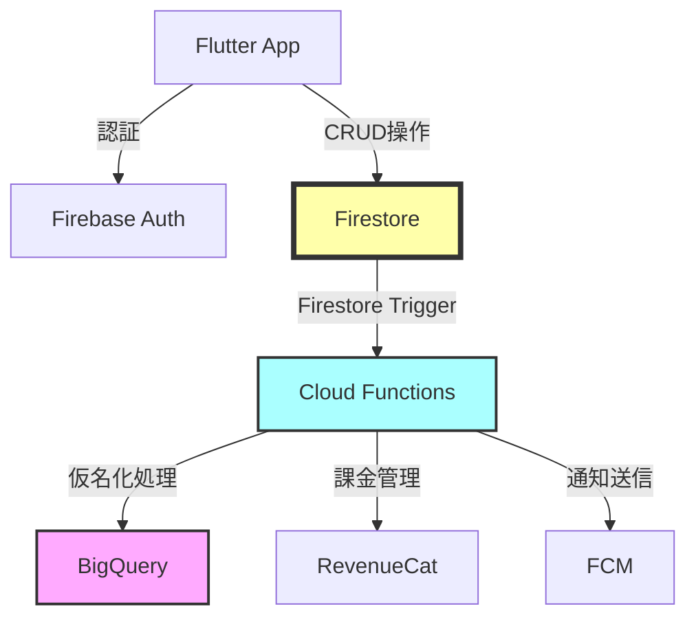

# Firestoreデータベース設計書 v3.3 (Part 1/4)

**プロジェクト名**: AIフィットネスアプリ(仮称)  
**バージョン**: 3.3 (MVP)  
**作成日**: 2025年11月24日  
**最終更新日**: 2025年11月24日  
**対象期間**: Phase 1-2 (0-7ヶ月)  
**ステータス**: Draft

---

## 📝 v3.3での主な変更点

### プロジェクト懸念点分析v1.0に基づく重要な更新

✅ **セキュリティルールの完全実装**:
- フィールドレベルのアクセス制御を詳細化
- `tosAccepted`、`ppAccepted`などの重要フィールドを読み取り専用に制限
- データバリデーション機能を全てのコレクションに追加
- サブコレクションのルールを完全実装

✅ **データ削除30日猶予期間のアクセス制御**:
- `deletionScheduled`フラグによるアクセス制限を実装
- 削除予定ユーザーは読み取りのみ許可（データエクスポート用）
- 新規データ作成・更新を完全に禁止
- セキュリティルールで猶予期間中の制御を強化

✅ **同意撤回後の強制ログアウト機能**:
- `forceLogout`カスタムクレームの追加
- `forceLogoutAt`タイムスタンプフィールドの追加
- クライアント側での即座のログアウト処理を保証

✅ **MediaPipeパフォーマンス対応**:
- `sessionMetadata`に`deviceInfo`フィールド追加
- `averageFps`、`frameDropCount`などのパフォーマンス指標を記録
- 低スペック端末の検出と分析用データ収集

✅ **BigQueryリトライ処理対応**:
- `bigquerySyncFailures`コレクションを追加
- 同期失敗の追跡とDead Letter Queue実装
- リトライ回数と失敗理由の記録

✅ **データ侵害通知対応**:
- `securityIncidents`コレクションを追加
- GDPR第33条・34条に基づくインシデント管理
- 通知ステータスとタイムラインの追跡

✅ **無料プラン制限対応**:
- `dailyUsageCount`フィールドを追加（将来のPhase 3実装用）
- `lastUsageResetDate`で日次リセットを管理
- 課金プランとの連携を設計

✅ **カスタムML移行準備**:
- `sessionMetadata`に追加のML学習用データを記録
- フレーム間速度・加速度の計算結果を保存
- カメラ設定情報とデバイス傾きデータを含む

✅ **スケジュール見直しに対応**:
- Phase 1-2の期間を4ヶ月→7ヶ月に更新
- 実装の優先順位を明確化
- テスト期間とバッファを考慮

---

## 目次

### Part 1: 概要とUsersコレクション
1. [ドキュメント概要](#1-ドキュメント概要)
2. [データベース設計原則](#2-データベース設計原則)
3. [Firestore構成概要](#3-firestore構成概要)
4. [Usersコレクション](#4-usersコレクション)

### Part 2: Sessionsコレクション
5. [Sessionsコレクション](#5-sessionsコレクション)

### Part 3: その他のコレクション
6. [Consentsコレクション](#6-consentsコレクション)
7. [Subscriptionsコレクション](#7-subscriptionsコレクション)
8. [Notificationsコレクション](#8-notificationsコレクション)
9. [DataDeletionRequestsコレクション](#9-datadeletionrequestsコレクション)
10. [BigQuerySyncFailuresコレクション](#10-bigquerysyncfailuresコレクション)
11. [SecurityIncidentsコレクション](#11-securityincidentsコレクション)

### Part 4: セキュリティとインデックス
12. [Firestoreセキュリティルール](#12-firestoreセキュリティルール)
13. [インデックス設計](#13-インデックス設計)
14. [データ保持ポリシー](#14-データ保持ポリシー)
15. [バックアップ・リストア戦略](#15-バックアップリストア戦略)

---

## 1. ドキュメント概要

### 1.1 目的

本ドキュメントは、AIフィットネスアプリ(仮称)のCloud Firestoreデータベース設計を定義します。以下の要件を満たすデータベース設計を提供します:

- **機能要件**: 要件定義書v3.3に定義された39項目の機能要件を実現
- **法的準拠**: 利用規約v3.2、プライバシーポリシーv3.1に完全準拠
- **GDPR対応**: GDPR/EDPB Guidelinesの要求事項を技術的に実装
- **セキュリティ**: プロジェクト懸念点分析v1.0で特定された18の懸念点に対応
- **パフォーマンス**: 非機能要件NFR-001~008のパフォーマンス要件を満たす
- **スケーラビリティ**: 7ヶ月の開発期間とMVP後の拡張を考慮

### 1.2 想定読者

- バックエンドエンジニア
- フロントエンドエンジニア
- セキュリティエンジニア
- QAエンジニア
- 法務担当者
- プロジェクトマネージャー

### 1.3 参照ドキュメント

| ドキュメント名 | バージョン | 参照目的 |
|--------------|-----------|---------|
| 要件定義書 | v3.3 | 機能要件・非機能要件の詳細 |
| 利用規約 | v3.2 | 法的制約・サービス定義 |
| プライバシーポリシー | v3.1 | データ取り扱い・GDPR準拠 |
| プロジェクト懸念点分析 | v1.0 | セキュリティ・実装上の懸念点 |
| 画面遷移図+ワイヤーフレーム | v3.3 | UI/UX要件 |
| システムアーキテクチャ設計書 | v3.2 | 技術スタック・アーキテクチャ |

### 1.4 用語定義

| 用語 | 定義 |
|-----|------|
| **MVP** | Minimum Viable Product。Phase 1-2(0-7ヶ月)で提供する最小限の機能セット |
| **骨格座標データ** | MediaPipe Poseが抽出する33個の関節位置(X,Y,Z座標+信頼度) |
| **仮名化** | 個人を特定できる情報を削除・変換して匿名化する処理 |
| **同意管理** | 利用規約・プライバシーポリシーへの同意状態を管理する機能 |
| **削除猶予期間** | アカウント削除リクエストから実際の削除まで30日間の猶予期間 |
| **強制ログアウト** | 同意撤回時にサーバー側からクライアントを強制的にログアウトさせる機能 |

---

## 2. データベース設計原則

### 2.1 基本原則

#### 2.1.1 GDPR準拠設計

**データ最小化の原則**:
- 必要最小限のデータのみを収集・保存
- 各フィールドの収集目的を明確化
- 不要になったデータは自動削除

**プライバシー・バイ・デザイン**:
- デフォルトでプライバシー保護
- 仮名化データと個人データの分離
- アクセス制御をFirestoreルールで実装

**データ主体の権利保障**:
- アクセス権（データエクスポート機能）
- 削除権（30日猶予期間付き完全削除）
- 訂正権（プロフィール更新機能）
- 同意撤回権（強制ログアウト機能）

#### 2.1.2 セキュリティ原則

**ゼロトラストアーキテクチャ**:
- 全てのアクセスを認証・認可
- フィールドレベルのアクセス制御
- 読み取り専用フィールドの保護

**多層防御**:
- Firebase Authentication（認証層）
- Firestoreセキュリティルール（認可層）
- Cloud Functions（ビジネスロジック層）
- BigQuery（分析層・仮名化処理）

**監査とトレーサビリティ**:
- 全ての重要操作にタイムスタンプ
- データ削除リクエストの追跡
- セキュリティインシデントの記録

#### 2.1.3 パフォーマンス原則

**効率的なクエリ設計**:
- 複合インデックスの活用
- ページネーション対応
- N+1問題の回避

**データ構造の最適化**:
- 頻繁にアクセスするデータはトップレベル
- 大きなデータはサブコレクションに分離
- 配列フィールドの適切な使用

**キャッシング戦略**:
- クライアント側でのオフラインキャッシュ
- 変更頻度の低いデータの積極的なキャッシュ
- リアルタイムリスナーの最小化

### 2.2 命名規則

#### 2.2.1 コレクション名

- **複数形**を使用（例: `users`, `sessions`, `consents`）
- **PascalCase**を使用（例: `DataDeletionRequests`, `BigQuerySyncFailures`）
- **明確で説明的**な名前を使用

#### 2.2.2 フィールド名

- **camelCase**を使用（例: `createdAt`, `tosAccepted`）
- **boolean**フィールドは`is`または動詞の過去分詞で始める（例: `isActive`, `deletionScheduled`）
- **日時**フィールドは`~At`または`~Date`で終わる（例: `createdAt`, `scheduledDeletionDate`）

#### 2.2.3 ドキュメントID

- **自動生成ID**を基本とする（Firestoreの`auto-generated ID`）
- **ユーザードキュメント**のみFirebase Authentication UIDを使用
- **予測不可能**で**一意**なIDを保証

### 2.3 データ型の使用ガイドライン

| データ型 | 使用場面 | 注意事項 |
|---------|---------|---------|
| `string` | テキストデータ全般 | 最大1MB。長文は別コレクションへ |
| `number` | 数値データ | 64ビット浮動小数点数 |
| `boolean` | フラグ・状態管理 | `null`ではなく明示的に`false`を使用 |
| `timestamp` | 日時データ | `FieldValue.serverTimestamp()`を使用 |
| `map` | 構造化データ | ネストは浅く（2-3層まで） |
| `array` | リスト・セット | 最大要素数に注意（推奨: 100未満） |
| `reference` | 他ドキュメントへの参照 | 使用は最小限に |
| `geopoint` | 位置情報 | 現在のMVPでは未使用 |

---

## 3. Firestore構成概要

### 3.1 コレクション階層

```
firestore/
├── users/                                    # ユーザー情報（ルートコレクション）
│   ├── {userId}/                             # Firebase Auth UID
│   │   ├── sessions/                         # トレーニングセッション（サブコレクション）
│   │   │   └── {sessionId}/                  # 自動生成ID
│   │   │       └── frames/                   # フレームデータ（サブコレクション）
│   │   │           └── {frameId}/            # 自動生成ID
│   │   ├── settings/                         # ユーザー設定（サブコレクション）
│   │   │   └── {settingId}/                  # 自動生成ID
│   │   └── subscriptions/                    # サブスクリプション（サブコレクション）
│   │       └── {subscriptionId}/             # RevenueCat ID
│
├── consents/                                 # 同意管理（ルートコレクション）
│   └── {consentId}/                          # 自動生成ID
│
├── notifications/                            # 通知（ルートコレクション）
│   └── {notificationId}/                     # 自動生成ID
│
├── dataDeletionRequests/                     # データ削除リクエスト（ルートコレクション）
│   └── {requestId}/                          # 自動生成ID
│
├── bigquerySyncFailures/                     # BigQuery同期失敗（ルートコレクション）
│   └── {failureId}/                          # 自動生成ID
│
└── securityIncidents/                        # セキュリティインシデント（ルートコレクション）
    └── {incidentId}/                         # 自動生成ID
```

### 3.2 コレクション一覧

| コレクション名 | 種類 | 目的 | アクセス権 |
|--------------|-----|-----|----------|
| `users` | ルート | ユーザープロフィール情報 | 本人のみ読み書き |
| `users/{userId}/sessions` | サブ | トレーニングセッション記録 | 本人のみ読み書き |
| `users/{userId}/sessions/{sessionId}/frames` | サブ | フレーム単位の骨格座標データ | 本人のみ読み取り |
| `users/{userId}/settings` | サブ | ユーザー設定 | 本人のみ読み書き |
| `users/{userId}/subscriptions` | サブ | サブスクリプション情報 | 本人のみ読み取り |
| `consents` | ルート | 同意履歴管理 | 本人のみ読み取り |
| `notifications` | ルート | 通知管理 | 本人のみ読み書き |
| `dataDeletionRequests` | ルート | データ削除リクエスト | 本人のみ読み取り |
| `bigquerySyncFailures` | ルート | BigQuery同期失敗記録 | 管理者のみ |
| `securityIncidents` | ルート | セキュリティインシデント管理 | 管理者のみ |

### 3.3 データフロー概要



---

## 4. Usersコレクション

### 4.1 概要

**パス**: `/users/{userId}`  
**ドキュメントID**: Firebase Authentication UID  
**目的**: ユーザーの基本情報とプロフィールを管理

### 4.2 スキーマ定義

```typescript
interface UserDocument {
  // === 基本情報 ===
  userId: string;                    // Firebase Auth UID（必須）
  email: string;                     // メールアドレス（必須）
  displayName: string | null;        // 表示名（オプション）
  photoURL: string | null;           // プロフィール画像URL（オプション）
  
  // === プロフィール情報 ===
  profile: {
    height: number | null;           // 身長（cm、オプション）
    weight: number | null;           // 体重（kg、オプション）
    birthday: Timestamp | null;      // 生年月日（オプション）
    gender: 'male' | 'female' | 'other' | 'prefer_not_to_say' | null;  // 性別（オプション）
    fitnessLevel: 'beginner' | 'intermediate' | 'advanced' | null;  // フィットネスレベル（オプション）
    goals: string[];                 // 目標リスト（オプション、空配列可）
  };
  
  // === 同意管理（GDPR対応） ===
  tosAccepted: boolean;              // 利用規約への同意（必須、読み取り専用）
  tosAcceptedAt: Timestamp | null;   // 利用規約同意日時（読み取り専用）
  tosVersion: string | null;         // 同意した利用規約バージョン（読み取り専用）
  ppAccepted: boolean;               // プライバシーポリシーへの同意（必須、読み取り専用）
  ppAcceptedAt: Timestamp | null;    // プライバシーポリシー同意日時（読み取り専用）
  ppVersion: string | null;          // 同意したプライバシーポリシーバージョン（読み取り専用）
  
  // === アカウント状態管理 ===
  isActive: boolean;                 // アカウント有効フラグ（必須）
  deletionScheduled: boolean;        // 削除予定フラグ（必須）
  deletionScheduledAt: Timestamp | null;  // 削除予定日時
  scheduledDeletionDate: Timestamp | null;  // 実際の削除予定日（30日後）
  
  // === 強制ログアウト機能（同意撤回対応） ===
  forceLogout: boolean;              // 強制ログアウトフラグ（必須）
  forceLogoutAt: Timestamp | null;   // 強制ログアウト設定日時
  
  // === 無料プラン制限（Phase 3実装予定） ===
  dailyUsageCount: number;           // 本日の使用回数（デフォルト: 0）
  lastUsageResetDate: Timestamp | null;  // 最終リセット日時
  
  // === サブスクリプション情報 ===
  subscriptionStatus: 'free' | 'premium' | 'trial';  // サブスクリプション状態（必須）
  subscriptionPlan: string | null;   // プラン名（例: 'monthly_500'）
  subscriptionStartDate: Timestamp | null;  // サブスクリプション開始日
  subscriptionEndDate: Timestamp | null;    // サブスクリプション終了日
  
  // === システム管理 ===
  createdAt: Timestamp;              // 作成日時（必須）
  updatedAt: Timestamp;              // 更新日時（必須）
  lastLoginAt: Timestamp | null;     // 最終ログイン日時
  
  // === データ保持期間管理（GDPR対応） ===
  dataRetentionDate: Timestamp | null;  // データ保持期限日
}
```

### 4.3 フィールド詳細

#### 4.3.1 基本情報

| フィールド | 型 | 必須 | 説明 | バリデーション |
|-----------|---|-----|------|--------------|
| `userId` | string | ✅ | Firebase Auth UID | 読み取り専用、変更不可 |
| `email` | string | ✅ | メールアドレス | 有効なメール形式、読み取り専用 |
| `displayName` | string \| null | ❌ | 表示名 | 最大100文字 |
| `photoURL` | string \| null | ❌ | プロフィール画像URL | 有効なURL形式 |

**実装上の注意点**:
- `userId`と`email`は**Firebase Authenticationから同期**され、Firestore上では**読み取り専用**
- プロフィール画像は**Firebase Storage**にアップロード後、URLを保存
- 表示名はユーザーが任意設定可能（デフォルトはメールアドレスの@前部分）

#### 4.3.2 プロフィール情報

| フィールド | 型 | 必須 | 説明 | バリデーション |
|-----------|---|-----|------|--------------|
| `profile.height` | number \| null | ❌ | 身長（cm） | 100 ≤ height ≤ 250 |
| `profile.weight` | number \| null | ❌ | 体重（kg） | 30 ≤ weight ≤ 300 |
| `profile.birthday` | Timestamp \| null | ❌ | 生年月日 | 13歳以上 |
| `profile.gender` | string \| null | ❌ | 性別 | 'male', 'female', 'other', 'prefer_not_to_say' |
| `profile.fitnessLevel` | string \| null | ❌ | フィットネスレベル | 'beginner', 'intermediate', 'advanced' |
| `profile.goals` | string[] | ❌ | 目標リスト | 各要素最大100文字、最大5件 |

**実装上の注意点**:
- 全てのプロフィール情報は**オプション**（将来の拡張用）
- 身長・体重は**フォーム確認補助の精度向上**に使用可能（Phase 3以降）
- 生年月日は**13歳未満の利用を防ぐ**ために使用
- 性別情報は**統計分析用**（仮名化後にBigQueryへ）
- フィットネスレベルは**推奨エクササイズ強度の調整**に使用
- 目標は**モチベーション管理とパーソナライズ**に使用

#### 4.3.3 同意管理（GDPR対応）

| フィールド | 型 | 必須 | 説明 | バリデーション |
|-----------|---|-----|------|--------------|
| `tosAccepted` | boolean | ✅ | 利用規約への同意 | 読み取り専用、true必須 |
| `tosAcceptedAt` | Timestamp \| null | ❌ | 利用規約同意日時 | 読み取り専用 |
| `tosVersion` | string \| null | ❌ | 同意した利用規約バージョン | 読み取り専用、例: "3.2" |
| `ppAccepted` | boolean | ✅ | プライバシーポリシーへの同意 | 読み取り専用、true必須 |
| `ppAcceptedAt` | Timestamp \| null | ❌ | プライバシーポリシー同意日時 | 読み取り専用 |
| `ppVersion` | string \| null | ❌ | 同意したプライバシーポリシーバージョン | 読み取り専用、例: "3.1" |

**CRITICAL - 読み取り専用の実装**:
```javascript
// Firestoreセキュリティルールで強制
allow update: if request.auth != null 
              && request.auth.uid == userId
              // 同意フィールドは変更禁止
              && request.resource.data.tosAccepted == resource.data.tosAccepted
              && request.resource.data.tosAcceptedAt == resource.data.tosAcceptedAt
              && request.resource.data.tosVersion == resource.data.tosVersion
              && request.resource.data.ppAccepted == resource.data.ppAccepted
              && request.resource.data.ppAcceptedAt == resource.data.ppAcceptedAt
              && request.resource.data.ppVersion == resource.data.ppVersion;
```

**実装上の注意点**:
- 同意フィールドは**Cloud Functionsのみが更新可能**
- ユーザーが直接変更することを**Firestoreルールで禁止**
- 同意撤回は`user_revokeConsent` Cloud Function経由でのみ可能
- プロジェクト懸念点#1「Firestoreセキュリティルールの詳細設計が未完成」に対応

#### 4.3.4 アカウント状態管理

| フィールド | 型 | 必須 | 説明 | バリデーション |
|-----------|---|-----|------|--------------|
| `isActive` | boolean | ✅ | アカウント有効フラグ | デフォルト: true |
| `deletionScheduled` | boolean | ✅ | 削除予定フラグ | デフォルト: false |
| `deletionScheduledAt` | Timestamp \| null | ❌ | 削除予定日時 | 削除リクエスト時に設定 |
| `scheduledDeletionDate` | Timestamp \| null | ❌ | 実際の削除予定日 | deletionScheduledAt + 30日 |

**データ削除30日猶予期間の実装**:
```javascript
// Firestoreセキュリティルールで削除予定ユーザーのアクセス制御
match /users/{userId} {
  // 削除予定ユーザーは読み取りのみ許可（データエクスポート用）
  allow read: if request.auth != null 
              && request.auth.uid == userId
              && (!resource.data.deletionScheduled || resource.data.deletionScheduled == false);
  
  // 削除予定ユーザーは書き込み禁止
  allow write: if request.auth != null 
               && request.auth.uid == userId
               && !resource.data.deletionScheduled
               && !request.resource.data.deletionScheduled;
}
```

**実装上の注意点**:
- `deletionScheduled`が`true`の場合、**新規データ作成・更新を完全禁止**
- 削除予定ユーザーは**データエクスポートのみ可能**（GDPR第20条対応）
- 30日後に`gdpr_executeScheduledDeletions` Cloud Functionが自動実行
- プロジェクト懸念点#2「データ削除の30日猶予期間中のアクセス制御が未設計」に対応

#### 4.3.5 強制ログアウト機能（同意撤回対応）

| フィールド | 型 | 必須 | 説明 | バリデーション |
|-----------|---|-----|------|--------------|
| `forceLogout` | boolean | ✅ | 強制ログアウトフラグ | デフォルト: false |
| `forceLogoutAt` | Timestamp \| null | ❌ | 強制ログアウト設定日時 | 同意撤回時に設定 |

**同意撤回後の強制ログアウト実装**:
```typescript
// Cloud Function: user_revokeConsent
export const user_revokeConsent = functions.https.onCall(async (data, context) => {
  if (!context.auth) {
    throw new functions.https.HttpsError('unauthenticated', '認証が必要です');
  }

  const uid = context.auth.uid;

  try {
    // 1. Firestoreで同意を撤回
    await admin.firestore().collection('users').doc(uid).update({
      tosAccepted: false,
      tosAcceptedAt: null,
      tosVersion: null,
      ppAccepted: false,
      ppAcceptedAt: null,
      ppVersion: null,
      forceLogout: true,  // 強制ログアウトフラグ
      forceLogoutAt: admin.firestore.FieldValue.serverTimestamp(),
      updatedAt: admin.firestore.FieldValue.serverTimestamp()
    });

    // 2. リフレッシュトークンを無効化
    await admin.auth().revokeRefreshTokens(uid);

    // 3. カスタムクレームで強制ログアウト
    await admin.auth().setCustomUserClaims(uid, {
      forceLogout: true,
      forceLogoutAt: Date.now()
    });

    return {
      success: true,
      message: '同意を撤回しました。即座にログアウトされます。',
      forceLogout: true
    };
  } catch (error) {
    console.error('Error revoking consent:', error);
    throw new functions.https.HttpsError('internal', '同意撤回に失敗しました');
  }
});
```

**クライアント側の実装**:
```dart
// Flutter側で強制ログアウトを検出
Future<void> checkForceLogout() async {
  final user = FirebaseAuth.instance.currentUser;
  if (user == null) return;

  final idTokenResult = await user.getIdTokenResult();
  if (idTokenResult.claims?['forceLogout'] == true) {
    // 即座にログアウト
    await FirebaseAuth.instance.signOut();
    
    // ログイン画面へ強制遷移
    Navigator.of(context).pushAndRemoveUntil(
      MaterialPageRoute(builder: (context) => LoginScreen()),
      (route) => false,
    );
    
    showDialog(
      context: context,
      builder: (context) => AlertDialog(
        title: Text('同意を撤回しました'),
        content: Text('ログアウトしました。再度利用するには、利用規約とプライバシーポリシーに同意してください。'),
        actions: [
          TextButton(
            onPressed: () => Navigator.pop(context),
            child: Text('OK'),
          ),
        ],
      ),
    );
  }
}
```

**実装上の注意点**:
- `forceLogout`フラグは**Cloud Functionsのみが設定可能**
- クライアント側は**起動時とフォアグラウンド復帰時**にチェック
- Firebase Authの**カスタムクレーム**と**Firestoreフィールド**の両方で管理
- プロジェクト懸念点#9「同意撤回後のログアウト処理がクライアント依存」に対応

#### 4.3.6 無料プラン制限（Phase 3実装予定）

| フィールド | 型 | 必須 | 説明 | バリデーション |
|-----------|---|-----|------|--------------|
| `dailyUsageCount` | number | ✅ | 本日の使用回数 | デフォルト: 0 |
| `lastUsageResetDate` | Timestamp \| null | ❌ | 最終リセット日時 | 日次で自動リセット |

**Phase 3実装予定の機能**:
```typescript
// Cloud Function: training_startSession で使用回数をチェック
export const training_startSession = functions.https.onCall(async (data, context) => {
  if (!context.auth) {
    throw new functions.https.HttpsError('unauthenticated', '認証が必要です');
  }

  const uid = context.auth.uid;
  const userDoc = await admin.firestore().collection('users').doc(uid).get();
  const userData = userDoc.data();

  // 無料プランの場合、1日3回制限をチェック
  if (userData.subscriptionStatus === 'free') {
    const today = new Date();
    today.setHours(0, 0, 0, 0);
    
    const lastReset = userData.lastUsageResetDate?.toDate() || new Date(0);
    lastReset.setHours(0, 0, 0, 0);
    
    // 日付が変わっていればリセット
    if (today > lastReset) {
      await admin.firestore().collection('users').doc(uid).update({
        dailyUsageCount: 0,
        lastUsageResetDate: admin.firestore.FieldValue.serverTimestamp()
      });
    }
    
    // 使用回数チェック
    if (userData.dailyUsageCount >= 3) {
      throw new functions.https.HttpsError(
        'resource-exhausted',
        '本日の無料プラン利用回数（3回）に達しました。プレミアムプランにアップグレードしてください。'
      );
    }
    
    // 使用回数をインクリメント
    await admin.firestore().collection('users').doc(uid).update({
      dailyUsageCount: admin.firestore.FieldValue.increment(1)
    });
  }
  
  // セッション開始処理...
});
```

**実装上の注意点**:
- Phase 3（6-7ヶ月後）での実装を予定
- 無料プランは**1日3回**までトレーニングセッション開始可能
- **UTC 00:00**で日次リセット（ユーザーのタイムゾーンは考慮しない簡易実装）
- プレミアムプランは**回数制限なし**
- プロジェクト懸念点#14「無料プラン1日3回制限の実装が未定義」に対応

#### 4.3.7 サブスクリプション情報

| フィールド | 型 | 必須 | 説明 | バリデーション |
|-----------|---|-----|------|--------------|
| `subscriptionStatus` | string | ✅ | サブスクリプション状態 | 'free', 'premium', 'trial' |
| `subscriptionPlan` | string \| null | ❌ | プラン名 | 例: 'monthly_500' |
| `subscriptionStartDate` | Timestamp \| null | ❌ | サブスクリプション開始日 | - |
| `subscriptionEndDate` | Timestamp \| null | ❌ | サブスクリプション終了日 | - |

**RevenueCatとの連携**:
- RevenueCatのWebhookイベントを受信してFirestoreを更新
- `subscriptionStatus`は**RevenueCatの状態と同期**
- 課金状態の変更は**Cloud Functions経由でのみ更新**

**実装上の注意点**:
- 初回登録時は`subscriptionStatus: 'free'`
- プレミアムプラン購入後に`'premium'`に変更
- サブスクリプション終了後は`'free'`に戻る
- プロジェクト懸念点#7「課金機能のエラーハンドリングとリトライ処理が未設計」に対応

#### 4.3.8 システム管理

| フィールド | 型 | 必須 | 説明 | バリデーション |
|-----------|---|-----|------|--------------|
| `createdAt` | Timestamp | ✅ | 作成日時 | サーバータイムスタンプ、読み取り専用 |
| `updatedAt` | Timestamp | ✅ | 更新日時 | サーバータイムスタンプ、自動更新 |
| `lastLoginAt` | Timestamp \| null | ❌ | 最終ログイン日時 | Cloud Functionsが更新 |

**実装上の注意点**:
- `createdAt`は**ドキュメント作成時に1度だけ設定**
- `updatedAt`は**全ての更新時に自動更新**
- `lastLoginAt`は**ログイン時にCloud Functionsが更新**

#### 4.3.9 データ保持期間管理（GDPR対応）

| フィールド | 型 | 必須 | 説明 | バリデーション |
|-----------|---|-----|------|--------------|
| `dataRetentionDate` | Timestamp \| null | ❌ | データ保持期限日 | createdAt + 3年 |

**自動削除の実装**:
```typescript
// 日次バッチ処理で3年以上経過したデータを削除
export const maintenance_deleteExpiredData = functions
  .pubsub
  .schedule('0 3 * * *')  // 毎日午前3時（UTC）
  .timeZone('Asia/Tokyo')
  .onRun(async (context) => {
    const threeYearsAgo = new Date();
    threeYearsAgo.setFullYear(threeYearsAgo.getFullYear() - 3);
    
    const expiredUsers = await admin.firestore()
      .collection('users')
      .where('dataRetentionDate', '<=', threeYearsAgo)
      .get();
    
    for (const doc of expiredUsers.docs) {
      await deleteUserDataCompletely(doc.id);
    }
  });
```

**実装上の注意点**:
- GDPR準拠のため、**3年間**使用されていないデータは自動削除
- `dataRetentionDate`は**最終ログイン日 + 3年**で計算
- 削除前に**ユーザーにメール通知**（NFR-015対応）

### 4.4 サンプルデータ

```json
{
  "userId": "abc123xyz789",
  "email": "user@example.com",
  "displayName": "山田太郎",
  "photoURL": "https://storage.googleapis.com/bucket/photos/abc123.jpg",
  
  "profile": {
    "height": 175,
    "weight": 70,
    "birthday": "1990-01-01T00:00:00Z",
    "gender": "male"
  },
  
  "tosAccepted": true,
  "tosAcceptedAt": "2025-05-01T10:00:00Z",
  "tosVersion": "3.2",
  "ppAccepted": true,
  "ppAcceptedAt": "2025-05-01T10:00:00Z",
  "ppVersion": "3.1",
  
  "isActive": true,
  "deletionScheduled": false,
  "deletionScheduledAt": null,
  "scheduledDeletionDate": null,
  
  "forceLogout": false,
  "forceLogoutAt": null,
  
  "dailyUsageCount": 2,
  "lastUsageResetDate": "2025-11-24T00:00:00Z",
  
  "subscriptionStatus": "free",
  "subscriptionPlan": null,
  "subscriptionStartDate": null,
  "subscriptionEndDate": null,
  
  "createdAt": "2025-05-01T10:00:00Z",
  "updatedAt": "2025-11-24T15:30:00Z",
  "lastLoginAt": "2025-11-24T15:30:00Z",
  
  "dataRetentionDate": "2028-11-24T15:30:00Z"
}
```

### 4.5 アクセス制御

**Firestoreセキュリティルール**（詳細はPart 4で説明）:
```javascript
match /users/{userId} {
  // 認証済みユーザーのみアクセス可能
  allow read: if request.auth != null 
              && request.auth.uid == userId
              && !resource.data.deletionScheduled;
  
  // 書き込みは制限付き
  allow create: if request.auth != null 
                && request.auth.uid == userId
                && validateUserCreate(request.resource.data);
  
  allow update: if request.auth != null 
                && request.auth.uid == userId
                && !resource.data.deletionScheduled
                && validateUserUpdate(request.resource.data, resource.data);
  
  allow delete: if false;  // 削除はCloud Functionsのみ
}
```

---

**Part 1 終了**

次のPart 2では、Sessionsコレクションの詳細設計を行います。
# Firestoreデータベース設計書 v3.3 (Part 2/4)

## 5. Sessionsコレクション

### 5.1 概要

**パス**: `/users/{userId}/sessions/{sessionId}`  
**ドキュメントID**: 自動生成ID  
**目的**: トレーニングセッションの記録と骨格座標データの管理

### 5.2 スキーマ定義

```typescript
interface SessionDocument {
  // === 基本情報 ===
  sessionId: string;                 // セッションID（必須、自動生成）
  userId: string;                    // ユーザーID（必須、親ドキュメント）
  exerciseType: 'squat' | 'push_up' | 'lunge' | 'plank' | 'bridge';  // 種目（必須）
  
  // === セッション詳細 ===
  startTime: Timestamp;              // 開始時刻（必須）
  endTime: Timestamp | null;         // 終了時刻（セッション完了時に設定）
  duration: number | null;           // セッション時間（秒、endTime設定時に計算）
  status: 'active' | 'completed' | 'cancelled';  // セッション状態（必須）
  
  // === トレーニング結果 ===
  repCount: number;                  // 回数（必須）
  setCount: number;                  // セット数（必須、デフォルト: 1）
  maxHoldTime: number | null;        // 最大ホールド時間（秒、plank/bridgeのみ）
  
  // === フォーム確認補助結果 ===
  formFeedback: {
    overallScore: number;            // 総合スコア（0-100）
    goodFrames: number;              // 良好フレーム数
    warningFrames: number;           // 警告フレーム数
    errorFrames: number;             // エラーフレーム数
    warnings: Array<{
      type: string;                  // 警告タイプ（例: 'knee_over_toe', 'back_not_straight'）
      count: number;                 // 発生回数
      severity: 'low' | 'medium' | 'high';  // 重大度
    }>;
  };
  
  // === カメラ設定 ===
  cameraSettings: {
    position: 'front' | 'side';      // カメラ位置（必須）
    resolution: string;              // 解像度（例: '1280x720'）
    fps: number;                     // フレームレート（例: 30）
  };
  
  // === セッションメタデータ（パフォーマンス分析用） ===
  sessionMetadata: {
    totalFrames: number;             // 総フレーム数
    processedFrames: number;         // 処理完了フレーム数
    averageFps: number;              // 平均FPS
    frameDropCount: number;          // フレームドロップ数
    averageConfidence: number;       // 平均信頼度スコア（0-1）
    
    // MediaPipeパフォーマンス監視（プロジェクト懸念点#3対応）
    mediapipePerformance: {
      averageInferenceTime: number;  // 平均推論時間（ms）
      maxInferenceTime: number;      // 最大推論時間（ms）
      minInferenceTime: number;      // 最小推論時間（ms）
    };
    
    // デバイス情報（低スペック端末の検出用）
    deviceInfo: {
      platform: 'iOS' | 'Android';   // プラットフォーム
      osVersion: string;             // OSバージョン（例: 'iOS 17.1', 'Android 13'）
      deviceModel: string;           // デバイスモデル（例: 'iPhone 14', 'Pixel 7'）
      deviceMemory: number | null;   // デバイスメモリ（GB）
      cpuArchitecture: string | null;  // CPUアーキテクチャ（例: 'arm64', 'x86_64'）
    };
    
    // カスタムML移行準備データ（プロジェクト懸念点#11対応）
    mlPreparationData: {
      frameLevelVelocity: boolean;   // フレーム間速度データを記録したか
      frameLevelAcceleration: boolean;  // フレーム間加速度データを記録したか
      deviceOrientationTracked: boolean;  // デバイス傾きを追跡したか
      lightingCondition: string | null;  // 照明条件（例: 'bright', 'normal', 'dim'）
    };
  };
  
  // === BigQuery同期状態 ===
  bigquerySyncStatus: 'pending' | 'synced' | 'failed';  // 同期状態（必須）
  bigquerySyncedAt: Timestamp | null;  // 同期完了日時
  bigquerySyncError: string | null;    // 同期エラーメッセージ
  bigquerySyncRetryCount: number;      // リトライ回数（デフォルト: 0）
  
  // === システム管理 ===
  createdAt: Timestamp;              // 作成日時（必須）
  updatedAt: Timestamp;              // 更新日時（必須）
  
  // === データ保持期間管理 ===
  dataRetentionDate: Timestamp | null;  // データ保持期限日（createdAt + 3年）
}
```

### 5.3 フィールド詳細

#### 5.3.1 基本情報

| フィールド | 型 | 必須 | 説明 | バリデーション |
|-----------|---|-----|------|--------------|
| `sessionId` | string | ✅ | セッションID | 自動生成、変更不可 |
| `userId` | string | ✅ | ユーザーID | 親ドキュメントのID、変更不可 |
| `exerciseType` | string | ✅ | 種目 | 'squat', 'push_up', 'lunge', 'plank', 'bridge' |

#### 5.3.2 セッション詳細

| フィールド | 型 | 必須 | 説明 | バリデーション |
|-----------|---|-----|------|--------------|
| `startTime` | Timestamp | ✅ | 開始時刻 | サーバータイムスタンプ |
| `endTime` | Timestamp \| null | ❌ | 終了時刻 | startTimeより後 |
| `duration` | number \| null | ❌ | セッション時間（秒） | endTime - startTime |
| `status` | string | ✅ | セッション状態 | 'active', 'completed', 'cancelled' |

**セッション状態の遷移**:
```
active → completed (正常終了)
active → cancelled (ユーザーがキャンセル)
```

#### 5.3.3 トレーニング結果

| フィールド | 型 | 必須 | 説明 | バリデーション |
|-----------|---|-----|------|--------------|
| `repCount` | number | ✅ | 回数 | 0 ≤ repCount ≤ 1000 |
| `setCount` | number | ✅ | セット数 | 1 ≤ setCount ≤ 10 |
| `maxHoldTime` | number \| null | ❌ | 最大ホールド時間（秒） | plank/bridgeのみ |

#### 5.3.4 フォーム確認補助結果

```typescript
interface FormFeedback {
  overallScore: number;              // 総合スコア（0-100）
  goodFrames: number;                // 良好フレーム数
  warningFrames: number;             // 警告フレーム数
  errorFrames: number;               // エラーフレーム数
  warnings: Array<{
    type: string;                    // 警告タイプ
    count: number;                   // 発生回数
    severity: 'low' | 'medium' | 'high';  // 重大度
  }>;
}
```

**警告タイプの例**:
- スクワット: `'knee_over_toe'`, `'back_not_straight'`, `'depth_insufficient'`
- プッシュアップ: `'elbow_angle_too_wide'`, `'back_not_straight'`, `'neck_not_neutral'`
- ランジ: `'knee_over_toe'`, `'balance_poor'`, `'depth_insufficient'`
- プランク: `'hip_too_low'`, `'hip_too_high'`, `'back_not_straight'`
- ブリッジ: `'hip_too_low'`, `'back_overarched'`, `'feet_not_flat'`

#### 5.3.5 カメラ設定

| フィールド | 型 | 必須 | 説明 | バリデーション |
|-----------|---|-----|------|--------------|
| `cameraSettings.position` | string | ✅ | カメラ位置 | 'front', 'side' |
| `cameraSettings.resolution` | string | ✅ | 解像度 | 例: '1280x720' |
| `cameraSettings.fps` | number | ✅ | フレームレート | 15 ≤ fps ≤ 60 |

#### 5.3.6 セッションメタデータ（パフォーマンス分析用）

**MediaPipeパフォーマンス監視**（プロジェクト懸念点#3対応）:

| フィールド | 型 | 必須 | 説明 | 目的 |
|-----------|---|-----|------|-----|
| `averageFps` | number | ✅ | 平均FPS | 30fps維持の検証 |
| `frameDropCount` | number | ✅ | フレームドロップ数 | パフォーマンス問題の検出 |
| `mediapipePerformance.averageInferenceTime` | number | ✅ | 平均推論時間（ms） | MediaPipe処理速度の測定 |

**実装上の注意点**:
- 平均FPSが**25fps未満**の場合、低スペック端末として記録
- フレームドロップ数が**総フレームの10%超**の場合、警告を表示
- BigQueryで集計し、**低スペック端末の割合**を分析

**デバイス情報（低スペック端末の検出用）**:

```typescript
deviceInfo: {
  platform: 'iOS' | 'Android';       // プラットフォーム
  osVersion: string;                 // OSバージョン
  deviceModel: string;               // デバイスモデル
  deviceMemory: number | null;       // デバイスメモリ（GB）
  cpuArchitecture: string | null;    // CPUアーキテクチャ
}
```

**実装例**:
```dart
// Flutter側でデバイス情報を取得
import 'package:device_info_plus/device_info_plus.dart';

Future<Map<String, dynamic>> getDeviceInfo() async {
  final deviceInfo = DeviceInfoPlugin();
  
  if (Platform.isIOS) {
    final iosInfo = await deviceInfo.iosInfo;
    return {
      'platform': 'iOS',
      'osVersion': iosInfo.systemVersion,
      'deviceModel': iosInfo.model,
      'deviceMemory': null,  // iOSでは取得困難
      'cpuArchitecture': null,
    };
  } else if (Platform.isAndroid) {
    final androidInfo = await deviceInfo.androidInfo;
    return {
      'platform': 'Android',
      'osVersion': androidInfo.version.release,
      'deviceModel': androidInfo.model,
      'deviceMemory': await _getAndroidMemoryGB(),
      'cpuArchitecture': androidInfo.supported64BitAbis.isNotEmpty ? 'arm64' : 'arm32',
    };
  }
  
  return {};
}
```

**カスタムML移行準備データ**（プロジェクト懸念点#11対応）:

```typescript
mlPreparationData: {
  frameLevelVelocity: boolean;       // フレーム間速度データを記録したか
  frameLevelAcceleration: boolean;   // フレーム間加速度データを記録したか
  deviceOrientationTracked: boolean; // デバイス傾きを追跡したか
  lightingCondition: string | null;  // 照明条件
}
```

**実装上の注意点**:
- Phase 2からフレーム間速度・加速度の計算を開始
- Phase 4のカスタムML移行時に**追加データが必要か判断**
- 照明条件は**カメラの露出値から推定**

#### 5.3.7 BigQuery同期状態（プロジェクト懸念点#4対応）

| フィールド | 型 | 必須 | 説明 | バリデーション |
|-----------|---|-----|------|--------------|
| `bigquerySyncStatus` | string | ✅ | 同期状態 | 'pending', 'synced', 'failed' |
| `bigquerySyncedAt` | Timestamp \| null | ❌ | 同期完了日時 | - |
| `bigquerySyncError` | string \| null | ❌ | 同期エラーメッセージ | - |
| `bigquerySyncRetryCount` | number | ✅ | リトライ回数 | デフォルト: 0、最大: 3 |

**BigQueryリトライ処理の実装**:
```typescript
// Cloud Function: sessions_onCreate (Firestore Trigger)
export const sessions_onCreate = functions.firestore
  .document('users/{userId}/sessions/{sessionId}')
  .onCreate(async (snap, context) => {
    const sessionData = snap.data();
    const { userId, sessionId } = context.params;
    
    try {
      // BigQueryに仮名化データを挿入
      await insertToBigQuery(sessionData);
      
      // 成功したら同期ステータスを更新
      await snap.ref.update({
        bigquerySyncStatus: 'synced',
        bigquerySyncedAt: admin.firestore.FieldValue.serverTimestamp()
      });
    } catch (error) {
      console.error('BigQuery sync failed:', error);
      
      // リトライ回数をインクリメント
      const retryCount = (sessionData.bigquerySyncRetryCount || 0) + 1;
      
      if (retryCount <= 3) {
        // Cloud Tasksでリトライキューに追加
        await addToRetryQueue({
          userId,
          sessionId,
          sessionData,
          retryCount,
          error: error.message
        });
        
        await snap.ref.update({
          bigquerySyncStatus: 'failed',
          bigquerySyncError: error.message,
          bigquerySyncRetryCount: retryCount
        });
      } else {
        // 3回失敗したらDead Letter Queueへ
        await addToDeadLetterQueue({
          userId,
          sessionId,
          sessionData,
          error: error.message
        });
        
        // Slackアラート送信
        await sendSlackAlert({
          severity: 'error',
          message: `🚨 BigQuery sync permanently failed for session ${sessionId}`,
          details: { userId, sessionId, error: error.message }
        });
      }
    }
  });
```

#### 5.3.8 システム管理

| フィールド | 型 | 必須 | 説明 | バリデーション |
|-----------|---|-----|------|--------------|
| `createdAt` | Timestamp | ✅ | 作成日時 | サーバータイムスタンプ |
| `updatedAt` | Timestamp | ✅ | 更新日時 | サーバータイムスタンプ |
| `dataRetentionDate` | Timestamp \| null | ❌ | データ保持期限日 | createdAt + 3年 |

### 5.4 サブコレクション: Frames

**パス**: `/users/{userId}/sessions/{sessionId}/frames/{frameId}`  
**目的**: フレーム単位の骨格座標データを保存

#### 5.4.1 スキーマ定義

```typescript
interface FrameDocument {
  // === 基本情報 ===
  frameId: string;                   // フレームID（必須、自動生成）
  sessionId: string;                 // セッションID（必須）
  frameNumber: number;               // フレーム番号（必須、0から開始）
  timestamp: Timestamp;              // フレームタイムスタンプ（必須）
  
  // === 骨格座標データ（MediaPipe Pose 33関節点） ===
  landmarks: Array<{
    x: number;                       // X座標（0-1の正規化座標）
    y: number;                       // Y座標（0-1の正規化座標）
    z: number;                       // Z座標（深度、相対値）
    visibility: number;              // 可視性スコア（0-1）
  }>;  // 配列長: 33
  
  // === フレームメタデータ ===
  frameMetadata: {
    confidence: number;              // 全体の信頼度スコア（0-1）
    processingTime: number;          // MediaPipe処理時間（ms）
    cameraTimestamp: number;         // カメラキャプチャタイムスタンプ（ms）
  };
  
  // === フォーム評価（フレーム単位） ===
  formEvaluation: {
    status: 'good' | 'warning' | 'error';  // フレーム評価
    warnings: string[];              // 警告リスト（例: ['knee_over_toe']）
  };
  
  // === カスタムML移行準備データ（Phase 2以降） ===
  velocityData?: {                   // フレーム間速度（オプション）
    velocities: Array<{
      jointIndex: number;            // 関節インデックス（0-32）
      vx: number;                    // X方向速度
      vy: number;                    // Y方向速度
      vz: number;                    // Z方向速度
    }>;
  };
  
  accelerationData?: {               // フレーム間加速度（オプション）
    accelerations: Array<{
      jointIndex: number;            // 関節インデックス（0-32）
      ax: number;                    // X方向加速度
      ay: number;                    // Y方向加速度
      az: number;                    // Z方向加速度
    }>;
  };
  
  deviceOrientation?: {              // デバイス傾き（オプション）
    pitch: number;                   // ピッチ角（度）
    roll: number;                    // ロール角（度）
    yaw: number;                     // ヨー角（度）
  };
  
  // === システム管理 ===
  createdAt: Timestamp;              // 作成日時（必須）
}
```

#### 5.4.2 データサイズの考慮

**1フレームのデータサイズ概算**:
- `landmarks`: 33関節 × 4フィールド × 8バイト = 約1KB
- `frameMetadata`: 約0.1KB
- `formEvaluation`: 約0.1KB
- **合計**: 約1.2KB/フレーム

**30秒のセッション（30fps）**:
- 総フレーム数: 30秒 × 30fps = 900フレーム
- 総データサイズ: 900フレーム × 1.2KB = **約1.08MB**

**実装上の注意点**:
- Firestoreの**1ドキュメント最大サイズは1MB**のため、フレームはサブコレクションに分離
- Phase 4でカスタムML移行時に**速度・加速度データを追加**する場合、さらに増加
- BigQueryには**仮名化後のデータのみ**を同期（個人情報は含まない）

#### 5.4.3 MediaPipe Pose 33関節点の定義

| インデックス | 関節名 | 説明 |
|------------|-------|------|
| 0 | nose | 鼻 |
| 1-2 | left_eye, right_eye | 左目、右目 |
| 3-4 | left_ear, right_ear | 左耳、右耳 |
| 5-6 | left_shoulder, right_shoulder | 左肩、右肩 |
| 7-8 | left_elbow, right_elbow | 左肘、右肘 |
| 9-10 | left_wrist, right_wrist | 左手首、右手首 |
| 11-12 | left_hip, right_hip | 左腰、右腰 |
| 13-14 | left_knee, right_knee | 左膝、右膝 |
| 15-16 | left_ankle, right_ankle | 左足首、右足首 |
| 17-22 | hand landmarks | 手のランドマーク（6点） |
| 23-28 | foot landmarks | 足のランドマーク（6点） |

**フォーム確認補助で重要な関節**:
- スクワット: 腰(11-12)、膝(13-14)、足首(15-16)
- プッシュアップ: 肩(5-6)、肘(7-8)、手首(9-10)
- ランジ: 腰(11-12)、膝(13-14)、足首(15-16)
- プランク: 肩(5-6)、腰(11-12)、足首(15-16)
- ブリッジ: 肩(5-6)、腰(11-12)、膝(13-14)、足首(15-16)

### 5.5 サンプルデータ

#### 5.5.1 Sessionドキュメント

```json
{
  "sessionId": "session_abc123",
  "userId": "user_xyz789",
  "exerciseType": "squat",
  
  "startTime": "2025-11-24T10:00:00Z",
  "endTime": "2025-11-24T10:00:30Z",
  "duration": 30,
  "status": "completed",
  
  "repCount": 15,
  "setCount": 1,
  "maxHoldTime": null,
  
  "formFeedback": {
    "overallScore": 85,
    "goodFrames": 800,
    "warningFrames": 100,
    "errorFrames": 0,
    "warnings": [
      {
        "type": "knee_over_toe",
        "count": 5,
        "severity": "low"
      }
    ]
  },
  
  "cameraSettings": {
    "position": "side",
    "resolution": "1280x720",
    "fps": 30
  },
  
  "sessionMetadata": {
    "totalFrames": 900,
    "processedFrames": 900,
    "averageFps": 30,
    "frameDropCount": 0,
    "averageConfidence": 0.92,
    
    "mediapipePerformance": {
      "averageInferenceTime": 25,
      "maxInferenceTime": 35,
      "minInferenceTime": 20
    },
    
    "deviceInfo": {
      "platform": "iOS",
      "osVersion": "iOS 17.1",
      "deviceModel": "iPhone 14",
      "deviceMemory": null,
      "cpuArchitecture": "arm64"
    },
    
    "mlPreparationData": {
      "frameLevelVelocity": true,
      "frameLevelAcceleration": true,
      "deviceOrientationTracked": true,
      "lightingCondition": "normal"
    }
  },
  
  "bigquerySyncStatus": "synced",
  "bigquerySyncedAt": "2025-11-24T10:01:00Z",
  "bigquerySyncError": null,
  "bigquerySyncRetryCount": 0,
  
  "createdAt": "2025-11-24T10:00:00Z",
  "updatedAt": "2025-11-24T10:00:30Z",
  "dataRetentionDate": "2028-11-24T10:00:00Z"
}
```

#### 5.5.2 Frameドキュメント

```json
{
  "frameId": "frame_001",
  "sessionId": "session_abc123",
  "frameNumber": 0,
  "timestamp": "2025-11-24T10:00:00.033Z",
  
  "landmarks": [
    {"x": 0.5, "y": 0.3, "z": -0.1, "visibility": 0.95},
    {"x": 0.48, "y": 0.28, "z": -0.1, "visibility": 0.90},
    // ... 31個の関節点データ
  ],
  
  "frameMetadata": {
    "confidence": 0.92,
    "processingTime": 25,
    "cameraTimestamp": 1700821200033
  },
  
  "formEvaluation": {
    "status": "good",
    "warnings": []
  },
  
  "velocityData": {
    "velocities": [
      {"jointIndex": 13, "vx": 0.01, "vy": -0.02, "vz": 0.0},
      {"jointIndex": 14, "vx": 0.02, "vy": -0.01, "vz": 0.0}
    ]
  },
  
  "deviceOrientation": {
    "pitch": 85.0,
    "roll": 0.5,
    "yaw": 0.0
  },
  
  "createdAt": "2025-11-24T10:00:00.033Z"
}
```

### 5.6 アクセス制御

**Firestoreセキュリティルール**:
```javascript
match /users/{userId}/sessions/{sessionId} {
  // 本人のみ読み書き可能
  allow read: if request.auth != null 
              && request.auth.uid == userId
              && !get(/databases/$(database)/documents/users/$(userId)).data.deletionScheduled;
  
  allow create: if request.auth != null 
                && request.auth.uid == userId
                && !get(/databases/$(database)/documents/users/$(userId)).data.deletionScheduled
                && validateSessionCreate(request.resource.data);
  
  allow update: if request.auth != null 
                && request.auth.uid == userId
                && !get(/databases/$(database)/documents/users/$(userId)).data.deletionScheduled
                && validateSessionUpdate(request.resource.data, resource.data);
  
  allow delete: if false;  // 削除はCloud Functionsのみ
  
  // フレームサブコレクション
  match /frames/{frameId} {
    allow read: if request.auth != null 
                && request.auth.uid == userId
                && !get(/databases/$(database)/documents/users/$(userId)).data.deletionScheduled;
    
    allow create: if request.auth != null 
                  && request.auth.uid == userId
                  && !get(/databases/$(database)/documents/users/$(userId)).data.deletionScheduled
                  && validateFrameCreate(request.resource.data);
    
    allow update, delete: if false;  // フレームは作成後変更不可
  }
}

// バリデーション関数
function validateSessionCreate(data) {
  return data.keys().hasAll(['sessionId', 'userId', 'exerciseType', 'startTime', 'status'])
         && data.exerciseType in ['squat', 'push_up', 'lunge', 'plank', 'bridge']
         && data.status == 'active'
         && data.bigquerySyncStatus == 'pending'
         && data.repCount >= 0
         && data.setCount >= 1;
}

function validateSessionUpdate(newData, oldData) {
  return newData.sessionId == oldData.sessionId
         && newData.userId == oldData.userId
         && newData.exerciseType == oldData.exerciseType
         && newData.startTime == oldData.startTime
         && (newData.status in ['active', 'completed', 'cancelled']);
}

function validateFrameCreate(data) {
  return data.keys().hasAll(['frameId', 'sessionId', 'frameNumber', 'timestamp', 'landmarks'])
         && data.landmarks.size() == 33
         && data.frameNumber >= 0;
}
```

### 5.7 インデックス設計

**複合インデックス（詳細はPart 4で説明）**:
```javascript
// 1. ユーザーのセッション一覧（最新順）
Collection: users/{userId}/sessions
Fields: userId (Ascending), createdAt (Descending)

// 2. 種目別セッション検索
Collection: users/{userId}/sessions
Fields: userId (Ascending), exerciseType (Ascending), createdAt (Descending)

// 3. BigQuery同期失敗セッション検索
Collection: users/{userId}/sessions
Fields: userId (Ascending), bigquerySyncStatus (Ascending), bigquerySyncRetryCount (Ascending)

// 4. データ保持期限が近いセッション検索
Collection: users/{userId}/sessions
Fields: userId (Ascending), dataRetentionDate (Ascending)
```

---

**Part 2 終了**

次のPart 3では、その他のコレクション（Consents、Subscriptions、Notifications、DataDeletionRequests、BigQuerySyncFailures、SecurityIncidents）の詳細設計を行います。
# Firestoreデータベース設計書 v3.3 (Part 3/4)

## 6. Consentsコレクション

### 6.1 概要

**パス**: `/consents/{consentId}`  
**ドキュメントID**: 自動生成ID  
**目的**: 利用規約・プライバシーポリシーへの同意履歴を管理（GDPR第7条対応）

### 6.2 スキーマ定義

```typescript
interface ConsentDocument {
  // === 基本情報 ===
  consentId: string;                 // 同意ID（必須、自動生成）
  userId: string;                    // ユーザーID（必須）
  
  // === 同意内容 ===
  consentType: 'tos' | 'privacy_policy';  // 同意タイプ（必須）
  documentVersion: string;           // ドキュメントバージョン（必須、例: "3.2"）
  action: 'accept' | 'revoke';       // アクション（必須）
  
  // === 同意時の詳細情報 ===
  consentDetails: {
    ipAddress: string;               // IPアドレス（仮名化）
    userAgent: string;               // ユーザーエージェント
    deviceType: 'mobile' | 'tablet' | 'desktop';  // デバイスタイプ
    platform: 'iOS' | 'Android' | 'Web';  // プラットフォーム
  };
  
  // === システム管理 ===
  createdAt: Timestamp;              // 作成日時（必須）
  
  // === データ保持期間管理 ===
  dataRetentionDate: Timestamp | null;  // データ保持期限日（createdAt + 7年）
}
```

### 6.3 フィールド詳細

| フィールド | 型 | 必須 | 説明 | バリデーション |
|-----------|---|-----|------|--------------|
| `consentId` | string | ✅ | 同意ID | 自動生成、変更不可 |
| `userId` | string | ✅ | ユーザーID | Firebase Auth UID |
| `consentType` | string | ✅ | 同意タイプ | 'tos', 'privacy_policy' |
| `documentVersion` | string | ✅ | ドキュメントバージョン | 例: "3.2" |
| `action` | string | ✅ | アクション | 'accept', 'revoke' |
| `consentDetails.ipAddress` | string | ✅ | IPアドレス（仮名化） | ハッシュ化済み |
| `consentDetails.userAgent` | string | ✅ | ユーザーエージェント | - |
| `consentDetails.deviceType` | string | ✅ | デバイスタイプ | 'mobile', 'tablet', 'desktop' |
| `consentDetails.platform` | string | ✅ | プラットフォーム | 'iOS', 'Android', 'Web' |
| `createdAt` | Timestamp | ✅ | 作成日時 | サーバータイムスタンプ |
| `dataRetentionDate` | Timestamp \| null | ❌ | データ保持期限日 | createdAt + 7年 |

### 6.4 実装上の注意点

**GDPR第7条対応**:
- 同意の証拠として**7年間保持**（法的要件）
- IPアドレスは**SHA-256でハッシュ化**して保存
- 同意撤回の記録も同様に保存

**IPアドレスのハッシュ化実装**:
```typescript
import * as crypto from 'crypto';

function hashIpAddress(ipAddress: string): string {
  return crypto.createHash('sha256').update(ipAddress).digest('hex');
}

// Cloud Function使用例
export const consent_recordConsent = functions.https.onCall(async (data, context) => {
  if (!context.auth) {
    throw new functions.https.HttpsError('unauthenticated', '認証が必要です');
  }

  const hashedIp = hashIpAddress(context.rawRequest.ip || 'unknown');
  
  await admin.firestore().collection('consents').add({
    consentId: admin.firestore().collection('consents').doc().id,
    userId: context.auth.uid,
    consentType: data.consentType,
    documentVersion: data.documentVersion,
    action: 'accept',
    consentDetails: {
      ipAddress: hashedIp,
      userAgent: context.rawRequest.headers['user-agent'] || 'unknown',
      deviceType: detectDeviceType(context.rawRequest.headers['user-agent']),
      platform: data.platform
    },
    createdAt: admin.firestore.FieldValue.serverTimestamp(),
    dataRetentionDate: getDataRetentionDate(7)  // 7年後
  });
});
```

### 6.5 サンプルデータ

```json
{
  "consentId": "consent_abc123",
  "userId": "user_xyz789",
  
  "consentType": "tos",
  "documentVersion": "3.2",
  "action": "accept",
  
  "consentDetails": {
    "ipAddress": "5d41402abc4b2a76b9719d911017c592",
    "userAgent": "Mozilla/5.0 (iPhone; CPU iPhone OS 17_1 like Mac OS X)",
    "deviceType": "mobile",
    "platform": "iOS"
  },
  
  "createdAt": "2025-11-24T10:00:00Z",
  "dataRetentionDate": "2032-11-24T10:00:00Z"
}
```

### 6.6 アクセス制御

```javascript
match /consents/{consentId} {
  // 本人のみ読み取り可能
  allow read: if request.auth != null 
              && resource.data.userId == request.auth.uid;
  
  // 作成はCloud Functionsのみ
  allow create, update, delete: if false;
}
```

---

## 7. Subscriptionsコレクション

### 7.1 概要

**パス**: `/users/{userId}/subscriptions/{subscriptionId}`  
**ドキュメントID**: RevenueCat Subscription ID  
**目的**: サブスクリプション情報の管理

### 7.2 スキーマ定義

```typescript
interface SubscriptionDocument {
  // === 基本情報 ===
  subscriptionId: string;            // サブスクリプションID（必須、RevenueCat ID）
  userId: string;                    // ユーザーID（必須）
  
  // === サブスクリプション詳細 ===
  productId: string;                 // 商品ID（必須、例: 'monthly_500'）
  status: 'active' | 'cancelled' | 'expired' | 'in_grace_period' | 'on_hold';  // ステータス（必須）
  platform: 'app_store' | 'play_store';  // プラットフォーム（必須）
  
  // === 期間情報 ===
  startDate: Timestamp;              // 開始日（必須）
  currentPeriodStart: Timestamp;     // 現在の課金期間開始日（必須）
  currentPeriodEnd: Timestamp;       // 現在の課金期間終了日（必須）
  expirationDate: Timestamp | null;  // 有効期限（nullの場合は無期限）
  
  // === 課金情報 ===
  price: number;                     // 価格（円）
  currency: string;                  // 通貨コード（例: 'JPY'）
  billingIssue: boolean;             // 課金問題フラグ（デフォルト: false）
  
  // === 自動更新情報 ===
  autoRenewEnabled: boolean;         // 自動更新有効フラグ（必須）
  autoRenewDisabledAt: Timestamp | null;  // 自動更新無効化日時
  
  // === キャンセル情報 ===
  cancellationDate: Timestamp | null;  // キャンセル日時
  cancellationReason: string | null;   // キャンセル理由
  
  // === RevenueCat連携 ===
  revenuecatCustomerId: string;      // RevenueCat顧客ID（必須）
  originalTransactionId: string;     // 元のトランザクションID（必須）
  latestTransactionId: string;       // 最新のトランザクションID（必須）
  
  // === システム管理 ===
  createdAt: Timestamp;              // 作成日時（必須）
  updatedAt: Timestamp;              // 更新日時（必須）
}
```

### 7.3 フィールド詳細

| フィールド | 型 | 必須 | 説明 | バリデーション |
|-----------|---|-----|------|--------------|
| `subscriptionId` | string | ✅ | サブスクリプションID | RevenueCat ID |
| `userId` | string | ✅ | ユーザーID | Firebase Auth UID |
| `productId` | string | ✅ | 商品ID | 例: 'monthly_500' |
| `status` | string | ✅ | ステータス | 'active', 'cancelled', 'expired', 'in_grace_period', 'on_hold' |
| `platform` | string | ✅ | プラットフォーム | 'app_store', 'play_store' |
| `price` | number | ✅ | 価格（円） | 500 |
| `autoRenewEnabled` | boolean | ✅ | 自動更新有効フラグ | - |
| `billingIssue` | boolean | ✅ | 課金問題フラグ | デフォルト: false |

### 7.4 ステータス遷移

```
active → cancelled（ユーザーがキャンセル）
active → in_grace_period（課金失敗、猶予期間中）
active → on_hold（課金失敗、一時停止）
in_grace_period → active（課金成功）
in_grace_period → expired（猶予期間終了）
on_hold → active（課金成功）
on_hold → expired（一時停止期間終了）
cancelled → expired（期間終了）
```

### 7.5 RevenueCat Webhook連携

```typescript
// Cloud Function: subscriptions_revenuecatWebhook
export const subscriptions_revenuecatWebhook = functions.https.onRequest(async (req, res) => {
  // Webhook検証
  const signature = req.headers['x-revenuecat-signature'];
  if (!verifyRevenueCatSignature(req.body, signature)) {
    res.status(401).send('Unauthorized');
    return;
  }

  const event = req.body;
  const userId = event.app_user_id;
  
  switch (event.type) {
    case 'INITIAL_PURCHASE':
    case 'RENEWAL':
      await handleSubscriptionActivation(userId, event);
      break;
    
    case 'CANCELLATION':
      await handleSubscriptionCancellation(userId, event);
      break;
    
    case 'BILLING_ISSUE':
      await handleBillingIssue(userId, event);
      break;
    
    case 'EXPIRATION':
      await handleSubscriptionExpiration(userId, event);
      break;
  }
  
  res.status(200).send('OK');
});

async function handleBillingIssue(userId: string, event: any) {
  // Firestoreを更新
  await admin.firestore()
    .collection('users').doc(userId)
    .collection('subscriptions').doc(event.id)
    .update({
      status: 'in_grace_period',
      billingIssue: true,
      updatedAt: admin.firestore.FieldValue.serverTimestamp()
    });
  
  // ユーザーに通知送信
  await sendNotification(userId, {
    type: 'billing_issue',
    title: '課金エラー',
    message: 'サブスクリプションの課金に失敗しました。お支払い方法を確認してください。',
    priority: 'high'
  });
  
  // プロジェクト懸念点#7「課金機能のエラーハンドリング」に対応
}
```

### 7.6 サンプルデータ

```json
{
  "subscriptionId": "rc_sub_abc123",
  "userId": "user_xyz789",
  
  "productId": "monthly_500",
  "status": "active",
  "platform": "app_store",
  
  "startDate": "2025-11-01T00:00:00Z",
  "currentPeriodStart": "2025-11-01T00:00:00Z",
  "currentPeriodEnd": "2025-12-01T00:00:00Z",
  "expirationDate": null,
  
  "price": 500,
  "currency": "JPY",
  "billingIssue": false,
  
  "autoRenewEnabled": true,
  "autoRenewDisabledAt": null,
  
  "cancellationDate": null,
  "cancellationReason": null,
  
  "revenuecatCustomerId": "rc_customer_xyz",
  "originalTransactionId": "1000000123456789",
  "latestTransactionId": "1000000987654321",
  
  "createdAt": "2025-11-01T00:00:00Z",
  "updatedAt": "2025-11-24T10:00:00Z"
}
```

### 7.7 アクセス制御

```javascript
match /users/{userId}/subscriptions/{subscriptionId} {
  // 本人のみ読み取り可能
  allow read: if request.auth != null 
              && request.auth.uid == userId;
  
  // 作成・更新はCloud Functionsのみ
  allow create, update, delete: if false;
}
```

---

## 8. Notificationsコレクション

### 8.1 概要

**パス**: `/notifications/{notificationId}`  
**ドキュメントID**: 自動生成ID  
**目的**: アプリ内通知の管理

### 8.2 スキーマ定義

```typescript
interface NotificationDocument {
  // === 基本情報 ===
  notificationId: string;            // 通知ID（必須、自動生成）
  userId: string;                    // ユーザーID（必須）
  
  // === 通知内容 ===
  type: 'info' | 'warning' | 'error' | 'success' | 'billing_issue' | 'consent_update';  // 通知タイプ（必須）
  title: string;                     // タイトル（必須）
  message: string;                   // メッセージ本文（必須）
  priority: 'low' | 'normal' | 'high';  // 優先度（必須）
  
  // === アクション情報 ===
  actionRequired: boolean;           // アクション必要フラグ（デフォルト: false）
  actionUrl: string | null;          // アクションURL（画面遷移先）
  actionLabel: string | null;        // アクションラベル（例: '確認する'）
  
  // === 通知状態 ===
  isRead: boolean;                   // 既読フラグ（デフォルト: false）
  readAt: Timestamp | null;          // 既読日時
  
  // === 配信情報 ===
  deliveryMethod: 'in_app' | 'push' | 'email';  // 配信方法（必須）
  deliveryStatus: 'pending' | 'sent' | 'failed';  // 配信ステータス（必須）
  deliveryError: string | null;      // 配信エラーメッセージ
  
  // === システム管理 ===
  createdAt: Timestamp;              // 作成日時（必須）
  updatedAt: Timestamp;              // 更新日時（必須）
  expiresAt: Timestamp | null;       // 有効期限（nullの場合は無期限）
  
  // === データ保持期間管理 ===
  dataRetentionDate: Timestamp | null;  // データ保持期限日（createdAt + 90日）
}
```

### 8.3 通知タイプの詳細

| タイプ | 説明 | 優先度 | 例 |
|-------|------|--------|---|
| `info` | 一般情報 | low | 新機能のお知らせ |
| `warning` | 警告 | normal | サブスクリプション期限が近い |
| `error` | エラー | high | データ同期失敗 |
| `success` | 成功通知 | normal | トレーニング記録保存完了 |
| `billing_issue` | 課金問題 | high | 決済失敗 |
| `consent_update` | 同意更新 | high | 利用規約更新 |

### 8.4 サンプルデータ

```json
{
  "notificationId": "notif_abc123",
  "userId": "user_xyz789",
  
  "type": "billing_issue",
  "title": "課金エラー",
  "message": "サブスクリプションの課金に失敗しました。お支払い方法を確認してください。",
  "priority": "high",
  
  "actionRequired": true,
  "actionUrl": "/settings/subscription",
  "actionLabel": "お支払い方法を確認",
  
  "isRead": false,
  "readAt": null,
  
  "deliveryMethod": "in_app",
  "deliveryStatus": "sent",
  "deliveryError": null,
  
  "createdAt": "2025-11-24T10:00:00Z",
  "updatedAt": "2025-11-24T10:00:00Z",
  "expiresAt": "2025-12-24T10:00:00Z",
  "dataRetentionDate": "2026-02-22T10:00:00Z"
}
```

### 8.5 アクセス制御

```javascript
match /notifications/{notificationId} {
  // 本人のみ読み取り可能
  allow read: if request.auth != null 
              && resource.data.userId == request.auth.uid;
  
  // 既読フラグのみ更新可能
  allow update: if request.auth != null 
                && resource.data.userId == request.auth.uid
                && request.resource.data.diff(resource.data).affectedKeys().hasOnly(['isRead', 'readAt', 'updatedAt']);
  
  // 作成・削除はCloud Functionsのみ
  allow create, delete: if false;
}
```

---

## 9. DataDeletionRequestsコレクション

### 9.1 概要

**パス**: `/dataDeletionRequests/{requestId}`  
**ドキュメントID**: 自動生成ID  
**目的**: データ削除リクエストの管理（GDPR第17条対応）

### 9.2 スキーマ定義

```typescript
interface DataDeletionRequestDocument {
  // === 基本情報 ===
  requestId: string;                 // リクエストID（必須、自動生成）
  userId: string;                    // ユーザーID（必須）
  
  // === リクエスト詳細 ===
  requestType: 'full_account_deletion' | 'specific_data_deletion';  // リクエストタイプ（必須）
  requestReason: string | null;      // リクエスト理由（オプション）
  
  // === 削除対象データ ===
  dataToDelete: string[];            // 削除対象データ種別（例: ['profile', 'sessions', 'consents']）
  
  // === 処理状態 ===
  status: 'pending' | 'in_progress' | 'completed' | 'cancelled';  // ステータス（必須）
  scheduledDeletionDate: Timestamp;  // 予定削除日（requestedAt + 30日）
  actualDeletionDate: Timestamp | null;  // 実際の削除日
  
  // === 処理詳細 ===
  deletionProgress: {
    totalSteps: number;              // 総ステップ数
    completedSteps: number;          // 完了ステップ数
    currentStep: string;             // 現在のステップ（例: 'Deleting sessions'）
  };
  
  // === エラー情報 ===
  deletionError: string | null;      // 削除エラーメッセージ
  
  // === 確認情報 ===
  confirmationCode: string;          // 確認コード（6桁の数字）
  confirmationCodeSentAt: Timestamp | null;  // 確認コード送信日時
  confirmedAt: Timestamp | null;     // 確認日時
  
  // === システム管理 ===
  requestedAt: Timestamp;            // リクエスト日時（必須）
  processedAt: Timestamp | null;     // 処理完了日時
  updatedAt: Timestamp;              // 更新日時（必須）
}
```

### 9.3 削除プロセスのフロー

```typescript
// Cloud Function: gdpr_requestAccountDeletion
export const gdpr_requestAccountDeletion = functions.https.onCall(async (data, context) => {
  if (!context.auth) {
    throw new functions.https.HttpsError('unauthenticated', '認証が必要です');
  }

  const uid = context.auth.uid;
  
  // 1. 確認コード生成
  const confirmationCode = generateConfirmationCode();
  
  // 2. データ削除リクエスト作成
  const scheduledDeletionDate = new Date();
  scheduledDeletionDate.setDate(scheduledDeletionDate.getDate() + 30);
  
  const requestId = admin.firestore().collection('dataDeletionRequests').doc().id;
  
  await admin.firestore().collection('dataDeletionRequests').doc(requestId).set({
    requestId,
    userId: uid,
    requestType: 'full_account_deletion',
    requestReason: data.reason || null,
    dataToDelete: ['profile', 'sessions', 'consents', 'subscriptions', 'notifications'],
    status: 'pending',
    scheduledDeletionDate,
    actualDeletionDate: null,
    deletionProgress: {
      totalSteps: 5,
      completedSteps: 0,
      currentStep: 'Awaiting confirmation'
    },
    deletionError: null,
    confirmationCode,
    confirmationCodeSentAt: admin.firestore.FieldValue.serverTimestamp(),
    confirmedAt: null,
    requestedAt: admin.firestore.FieldValue.serverTimestamp(),
    processedAt: null,
    updatedAt: admin.firestore.FieldValue.serverTimestamp()
  });
  
  // 3. Usersドキュメントに削除予定フラグを立てる
  await admin.firestore().collection('users').doc(uid).update({
    deletionScheduled: true,
    deletionScheduledAt: admin.firestore.FieldValue.serverTimestamp(),
    scheduledDeletionDate,
    updatedAt: admin.firestore.FieldValue.serverTimestamp()
  });
  
  // 4. アカウント無効化
  await admin.auth().updateUser(uid, {
    disabled: true
  });
  
  // 5. 確認コードをメール送信
  await sendConfirmationEmail(uid, confirmationCode);
  
  return {
    success: true,
    data: {
      requestId,
      scheduledDeletionDate: scheduledDeletionDate.toISOString(),
      message: '削除リクエストを受け付けました。確認コードをメールで送信しました。30日以内に完全削除されます。'
    }
  };
});

// 確認コード生成
function generateConfirmationCode(): string {
  return Math.floor(100000 + Math.random() * 900000).toString();
}
```

### 9.4 サンプルデータ

```json
{
  "requestId": "deletion_abc123",
  "userId": "user_xyz789",
  
  "requestType": "full_account_deletion",
  "requestReason": "アプリを使用しなくなったため",
  
  "dataToDelete": ["profile", "sessions", "consents", "subscriptions", "notifications"],
  
  "status": "pending",
  "scheduledDeletionDate": "2025-12-24T10:00:00Z",
  "actualDeletionDate": null,
  
  "deletionProgress": {
    "totalSteps": 5,
    "completedSteps": 0,
    "currentStep": "Awaiting confirmation"
  },
  
  "deletionError": null,
  
  "confirmationCode": "123456",
  "confirmationCodeSentAt": "2025-11-24T10:00:00Z",
  "confirmedAt": null,
  
  "requestedAt": "2025-11-24T10:00:00Z",
  "processedAt": null,
  "updatedAt": "2025-11-24T10:00:00Z"
}
```

### 9.5 アクセス制御

```javascript
match /dataDeletionRequests/{requestId} {
  // 本人のみ読み取り可能
  allow read: if request.auth != null 
              && resource.data.userId == request.auth.uid;
  
  // 作成・更新・削除はCloud Functionsのみ
  allow create, update, delete: if false;
}
```

---

## 10. BigQuerySyncFailuresコレクション

### 10.1 概要

**パス**: `/bigquerySyncFailures/{failureId}`  
**ドキュメントID**: 自動生成ID  
**目的**: BigQuery同期失敗の記録とDead Letter Queue管理（プロジェクト懸念点#4対応）

### 10.2 スキーマ定義

```typescript
interface BigQuerySyncFailureDocument {
  // === 基本情報 ===
  failureId: string;                 // 失敗ID（必須、自動生成）
  userId: string;                    // ユーザーID（必須）
  sessionId: string;                 // セッションID（必須）
  
  // === 失敗詳細 ===
  errorType: 'network' | 'quota_exceeded' | 'invalid_data' | 'authentication' | 'unknown';  // エラータイプ（必須）
  errorMessage: string;              // エラーメッセージ（必須）
  errorStack: string | null;         // エラースタックトレース
  
  // === リトライ情報 ===
  retryCount: number;                // リトライ回数（必須）
  maxRetries: number;                // 最大リトライ回数（デフォルト: 3）
  lastRetryAt: Timestamp | null;     // 最終リトライ日時
  nextRetryAt: Timestamp | null;     // 次回リトライ予定日時
  
  // === ステータス ===
  status: 'pending_retry' | 'retrying' | 'failed_permanently' | 'resolved';  // ステータス（必須）
  
  // === セッションデータ（スナップショット） ===
  sessionDataSnapshot: {
    exerciseType: string;
    startTime: Timestamp;
    repCount: number;
    // ... その他の重要フィールド
  };
  
  // === 手動介入情報 ===
  needsManualIntervention: boolean;  // 手動介入必要フラグ（デフォルト: false）
  manualInterventionNote: string | null;  // 手動介入メモ
  resolvedBy: string | null;         // 解決者（管理者UID）
  resolvedAt: Timestamp | null;      // 解決日時
  
  // === システム管理 ===
  createdAt: Timestamp;              // 作成日時（必須）
  updatedAt: Timestamp;              // 更新日時（必須）
}
```

### 10.3 リトライ処理の実装

```typescript
// Cloud Function: bigquery_retryFailedSyncs（毎時実行）
export const bigquery_retryFailedSyncs = functions
  .pubsub
  .schedule('0 * * * *')  // 毎時0分
  .timeZone('Asia/Tokyo')
  .onRun(async (context) => {
    const now = admin.firestore.Timestamp.now();
    
    // リトライ対象の失敗記録を取得
    const failuresSnapshot = await admin.firestore()
      .collection('bigquerySyncFailures')
      .where('status', '==', 'pending_retry')
      .where('nextRetryAt', '<=', now)
      .limit(100)
      .get();
    
    for (const doc of failuresSnapshot.docs) {
      const failure = doc.data();
      
      // リトライ回数チェック
      if (failure.retryCount >= failure.maxRetries) {
        // Dead Letter Queueへ移動
        await doc.ref.update({
          status: 'failed_permanently',
          needsManualIntervention: true,
          updatedAt: admin.firestore.FieldValue.serverTimestamp()
        });
        
        // Slackアラート送信
        await sendSlackAlert({
          severity: 'error',
          message: `🚨 BigQuery sync permanently failed for session ${failure.sessionId}`,
          details: failure
        });
        
        continue;
      }
      
      // リトライ実行
      try {
        await retryBigQuerySync(failure);
        
        // 成功したら resolved に更新
        await doc.ref.update({
          status: 'resolved',
          resolvedAt: admin.firestore.FieldValue.serverTimestamp(),
          updatedAt: admin.firestore.FieldValue.serverTimestamp()
        });
        
        // 元のセッションドキュメントも更新
        await admin.firestore()
          .collection('users').doc(failure.userId)
          .collection('sessions').doc(failure.sessionId)
          .update({
            bigquerySyncStatus: 'synced',
            bigquerySyncedAt: admin.firestore.FieldValue.serverTimestamp()
          });
      } catch (error) {
        // 失敗したらリトライ情報を更新
        const nextRetryDelay = calculateExponentialBackoff(failure.retryCount + 1);
        const nextRetryAt = new Date(Date.now() + nextRetryDelay);
        
        await doc.ref.update({
          retryCount: admin.firestore.FieldValue.increment(1),
          lastRetryAt: admin.firestore.FieldValue.serverTimestamp(),
          nextRetryAt: admin.firestore.Timestamp.fromDate(nextRetryAt),
          errorMessage: error.message,
          updatedAt: admin.firestore.FieldValue.serverTimestamp()
        });
      }
    }
  });

// エクスポネンシャルバックオフ計算
function calculateExponentialBackoff(retryCount: number): number {
  // 1回目: 5分、2回目: 15分、3回目: 45分
  return Math.pow(3, retryCount) * 5 * 60 * 1000;
}
```

### 10.4 サンプルデータ

```json
{
  "failureId": "failure_abc123",
  "userId": "user_xyz789",
  "sessionId": "session_abc123",
  
  "errorType": "network",
  "errorMessage": "Connection timeout: Unable to reach BigQuery API",
  "errorStack": "Error: Connection timeout...",
  
  "retryCount": 1,
  "maxRetries": 3,
  "lastRetryAt": "2025-11-24T10:05:00Z",
  "nextRetryAt": "2025-11-24T10:20:00Z",
  
  "status": "pending_retry",
  
  "sessionDataSnapshot": {
    "exerciseType": "squat",
    "startTime": "2025-11-24T10:00:00Z",
    "repCount": 15
  },
  
  "needsManualIntervention": false,
  "manualInterventionNote": null,
  "resolvedBy": null,
  "resolvedAt": null,
  
  "createdAt": "2025-11-24T10:00:30Z",
  "updatedAt": "2025-11-24T10:05:00Z"
}
```

### 10.5 アクセス制御

```javascript
match /bigquerySyncFailures/{failureId} {
  // 管理者のみアクセス可能
  allow read, write: if request.auth != null 
                     && request.auth.token.admin == true;
}
```

---

## 11. SecurityIncidentsコレクション

### 11.1 概要

**パス**: `/securityIncidents/{incidentId}`  
**ドキュメントID**: 自動生成ID  
**目的**: セキュリティインシデントの記録と管理（GDPR第33条・34条対応、プロジェクト懸念点#10対応）

### 11.2 スキーマ定義

```typescript
interface SecurityIncidentDocument {
  // === 基本情報 ===
  incidentId: string;                // インシデントID（必須、自動生成）
  
  // === インシデント詳細 ===
  incidentType: 'data_breach' | 'unauthorized_access' | 'system_vulnerability' | 'malware' | 'other';  // インシデントタイプ（必須）
  severity: 'low' | 'medium' | 'high' | 'critical';  // 重大度（必須）
  title: string;                     // タイトル（必須）
  description: string;               // 詳細説明（必須）
  
  // === 影響範囲 ===
  affectedUserCount: number;         // 影響を受けたユーザー数
  affectedUsers: string[];           // 影響を受けたユーザーIDリスト（最大100件、それ以上は別途管理）
  affectedDataTypes: string[];       // 影響を受けたデータ種別（例: ['email', 'sessions']）
  
  // === ステータス ===
  status: 'detected' | 'investigating' | 'notified' | 'resolved' | 'closed';  // ステータス（必須）
  
  // === 検出情報 ===
  detectedAt: Timestamp;             // 検出日時（必須）
  detectedBy: string;                // 検出者（例: 'automated_system', 'admin_uid'）
  detectionMethod: string;           // 検出方法（例: 'log_analysis', 'user_report'）
  
  // === 通知情報（GDPR第33条・34条対応） ===
  notificationRequired: boolean;     // 通知必要フラグ（必須）
  
  // 監督機関への通知（GDPR第33条）
  supervisoryAuthorityNotification: {
    required: boolean;               // 通知必要か（72時間以内）
    notifiedAt: Timestamp | null;    // 通知日時
    notificationMethod: string | null;  // 通知方法
    confirmationReceived: boolean;   // 確認受信フラグ
  };
  
  // ユーザーへの通知（GDPR第34条）
  userNotification: {
    required: boolean;               // 通知必要か
    notifiedAt: Timestamp | null;    // 通知日時
    notificationMethod: 'email' | 'in_app' | 'both' | null;  // 通知方法
    notificationSent: boolean;       // 通知送信完了フラグ
  };
  
  // === 対応措置 ===
  responseActions: Array<{
    action: string;                  // 対応措置（例: 'Password reset enforced'）
    takenAt: Timestamp;              // 実施日時
    takenBy: string;                 // 実施者
  }>;
  
  // === 根本原因分析 ===
  rootCause: string | null;          // 根本原因
  preventiveMeasures: string | null; // 予防措置
  
  // === システム管理 ===
  createdAt: Timestamp;              // 作成日時（必須）
  updatedAt: Timestamp;              // 更新日時（必須）
  resolvedAt: Timestamp | null;      // 解決日時
  closedAt: Timestamp | null;        // クローズ日時
}
```

### 11.3 インシデント対応フロー

```typescript
// Cloud Function: security_reportIncident
export const security_reportIncident = functions.https.onCall(async (data, context) => {
  // 管理者のみ実行可能
  if (!context.auth || !context.auth.token.admin) {
    throw new functions.https.HttpsError('permission-denied', '管理者権限が必要です');
  }

  const incidentId = admin.firestore().collection('securityIncidents').doc().id;
  
  // インシデント記録を作成
  await admin.firestore().collection('securityIncidents').doc(incidentId).set({
    incidentId,
    incidentType: data.incidentType,
    severity: data.severity,
    title: data.title,
    description: data.description,
    affectedUserCount: data.affectedUserCount || 0,
    affectedUsers: data.affectedUsers || [],
    affectedDataTypes: data.affectedDataTypes || [],
    status: 'detected',
    detectedAt: admin.firestore.FieldValue.serverTimestamp(),
    detectedBy: context.auth.uid,
    detectionMethod: data.detectionMethod,
    notificationRequired: determineNotificationRequired(data),
    supervisoryAuthorityNotification: {
      required: data.severity === 'critical' || data.severity === 'high',
      notifiedAt: null,
      notificationMethod: null,
      confirmationReceived: false
    },
    userNotification: {
      required: data.affectedUserCount > 0,
      notifiedAt: null,
      notificationMethod: null,
      notificationSent: false
    },
    responseActions: [],
    rootCause: null,
    preventiveMeasures: null,
    createdAt: admin.firestore.FieldValue.serverTimestamp(),
    updatedAt: admin.firestore.FieldValue.serverTimestamp(),
    resolvedAt: null,
    closedAt: null
  });
  
  // 重大なインシデントの場合、即座にSlackアラート
  if (data.severity === 'critical' || data.severity === 'high') {
    await sendSlackAlert({
      severity: 'critical',
      message: `🚨🚨 SECURITY INCIDENT: ${data.title}`,
      details: {
        incidentId,
        severity: data.severity,
        affectedUserCount: data.affectedUserCount
      }
    });
  }
  
  return {
    success: true,
    data: { incidentId }
  };
});

function determineNotificationRequired(data: any): boolean {
  // GDPR第33条・34条に基づき通知必要性を判断
  return data.severity === 'critical' || data.severity === 'high' || data.affectedUserCount > 0;
}
```

### 11.4 サンプルデータ

```json
{
  "incidentId": "incident_abc123",
  
  "incidentType": "data_breach",
  "severity": "high",
  "title": "不正アクセスによるデータ侵害",
  "description": "外部からの不正アクセスにより、一部ユーザーのセッションデータが閲覧された可能性があります。",
  
  "affectedUserCount": 50,
  "affectedUsers": ["user_001", "user_002", "..."],
  "affectedDataTypes": ["sessions", "profile"],
  
  "status": "investigating",
  
  "detectedAt": "2025-11-24T10:00:00Z",
  "detectedBy": "automated_system",
  "detectionMethod": "log_analysis",
  
  "notificationRequired": true,
  
  "supervisoryAuthorityNotification": {
    "required": true,
    "notifiedAt": "2025-11-24T12:00:00Z",
    "notificationMethod": "email",
    "confirmationReceived": true
  },
  
  "userNotification": {
    "required": true,
    "notifiedAt": "2025-11-24T14:00:00Z",
    "notificationMethod": "both",
    "notificationSent": true
  },
  
  "responseActions": [
    {
      "action": "Password reset enforced for affected users",
      "takenAt": "2025-11-24T10:30:00Z",
      "takenBy": "admin_uid_001"
    }
  ],
  
  "rootCause": "脆弱なFirestoreセキュリティルール",
  "preventiveMeasures": "セキュリティルールの強化とペネトレーションテストの実施",
  
  "createdAt": "2025-11-24T10:00:00Z",
  "updatedAt": "2025-11-24T14:00:00Z",
  "resolvedAt": "2025-11-25T10:00:00Z",
  "closedAt": null
}
```

### 11.5 アクセス制御

```javascript
match /securityIncidents/{incidentId} {
  // 管理者のみアクセス可能
  allow read, write: if request.auth != null 
                     && request.auth.token.admin == true;
}
```

---

**Part 3 終了**

次のPart 4では、Firestoreセキュリティルールの完全実装、インデックス設計、データ保持ポリシー、バックアップ・リストア戦略を詳細に説明します。
# Firestoreデータベース設計書 v3.3 (Part 4/4)

## 12. Firestoreセキュリティルール

### 12.1 概要

本セクションでは、プロジェクト懸念点分析v1.0で特定された**懸念点#1「Firestoreセキュリティルールの詳細設計が未完成」**に完全対応した、包括的なセキュリティルールを定義します。

**設計原則**:
1. **フィールドレベルのアクセス制御**: 重要フィールド（同意フラグなど）は読み取り専用
2. **データバリデーション**: 全ての書き込み操作で型チェックと範囲チェック
3. **削除猶予期間の制御**: `deletionScheduled`フラグによるアクセス制限
4. **ゼロトラスト**: 全てのアクセスを認証・認可

### 12.2 完全なセキュリティルール実装

```javascript
rules_version = '2';
service cloud.firestore {
  match /databases/{database}/documents {
    
    // ==============================================
    // ヘルパー関数
    // ==============================================
    
    // ユーザー認証チェック
    function isAuthenticated() {
      return request.auth != null;
    }
    
    // ユーザー本人チェック
    function isOwner(userId) {
      return request.auth.uid == userId;
    }
    
    // 管理者チェック
    function isAdmin() {
      return request.auth != null && request.auth.token.admin == true;
    }
    
    // ユーザーが削除予定でないかチェック
    function isNotScheduledForDeletion(userId) {
      let userDoc = get(/databases/$(database)/documents/users/$(userId));
      return !userDoc.data.deletionScheduled;
    }
    
    // ユーザーが強制ログアウト状態でないかチェック
    function isNotForcedLogout(userId) {
      let userDoc = get(/databases/$(database)/documents/users/$(userId));
      return !userDoc.data.forceLogout;
    }
    
    // タイムスタンプバリデーション
    function isValidTimestamp(timestamp) {
      return timestamp is timestamp;
    }
    
    // メールアドレスバリデーション（簡易版）
    function isValidEmail(email) {
      return email is string && email.matches('.+@.+\\..+');
    }
    
    // ==============================================
    // Usersコレクション
    // ==============================================
    
    match /users/{userId} {
      // 読み取り: 本人のみ、削除予定でない、強制ログアウトでない
      allow read: if isAuthenticated()
                  && isOwner(userId)
                  && isNotScheduledForDeletion(userId)
                  && isNotForcedLogout(userId);
      
      // 作成: 本人のみ、必須フィールドの検証
      allow create: if isAuthenticated()
                    && isOwner(userId)
                    && validateUserCreate(request.resource.data);
      
      // 更新: 本人のみ、削除予定でない、フィールドレベルの検証
      allow update: if isAuthenticated()
                    && isOwner(userId)
                    && isNotScheduledForDeletion(userId)
                    && validateUserUpdate(request.resource.data, resource.data);
      
      // 削除: Cloud Functionsのみ（一般ユーザーは削除不可）
      allow delete: if false;
      
      // ========================================
      // Sessionsサブコレクション
      // ========================================
      
      match /sessions/{sessionId} {
        // 読み取り: 本人のみ、削除予定でない
        allow read: if isAuthenticated()
                    && isOwner(userId)
                    && isNotScheduledForDeletion(userId);
        
        // 作成: 本人のみ、削除予定でない、バリデーション
        allow create: if isAuthenticated()
                      && isOwner(userId)
                      && isNotScheduledForDeletion(userId)
                      && validateSessionCreate(request.resource.data);
        
        // 更新: 本人のみ、削除予定でない、バリデーション
        allow update: if isAuthenticated()
                      && isOwner(userId)
                      && isNotScheduledForDeletion(userId)
                      && validateSessionUpdate(request.resource.data, resource.data);
        
        // 削除: Cloud Functionsのみ
        allow delete: if false;
        
        // ========================================
        // Framesサブコレクション
        // ========================================
        
        match /frames/{frameId} {
          // 読み取り: 本人のみ、削除予定でない
          allow read: if isAuthenticated()
                      && isOwner(userId)
                      && isNotScheduledForDeletion(userId);
          
          // 作成: 本人のみ、削除予定でない、バリデーション
          allow create: if isAuthenticated()
                        && isOwner(userId)
                        && isNotScheduledForDeletion(userId)
                        && validateFrameCreate(request.resource.data);
          
          // 更新・削除: 不可（フレームは作成後変更不可）
          allow update, delete: if false;
        }
      }
      
      // ========================================
      // Settingsサブコレクション
      // ========================================
      
      match /settings/{settingId} {
        // 読み取り: 本人のみ
        allow read: if isAuthenticated() && isOwner(userId);
        
        // 作成・更新: 本人のみ、削除予定でない
        allow create, update: if isAuthenticated()
                              && isOwner(userId)
                              && isNotScheduledForDeletion(userId)
                              && validateSettingData(request.resource.data);
        
        // 削除: 本人のみ
        allow delete: if isAuthenticated() && isOwner(userId);
      }
      
      // ========================================
      // Subscriptionsサブコレクション
      // ========================================
      
      match /subscriptions/{subscriptionId} {
        // 読み取り: 本人のみ
        allow read: if isAuthenticated() && isOwner(userId);
        
        // 作成・更新・削除: Cloud Functionsのみ（RevenueCat Webhook）
        allow create, update, delete: if false;
      }
    }
    
    // ==============================================
    // Consentsコレクション
    // ==============================================
    
    match /consents/{consentId} {
      // 読み取り: 本人のみ
      allow read: if isAuthenticated()
                  && resource.data.userId == request.auth.uid;
      
      // 作成・更新・削除: Cloud Functionsのみ
      allow create, update, delete: if false;
    }
    
    // ==============================================
    // Notificationsコレクション
    // ==============================================
    
    match /notifications/{notificationId} {
      // 読み取り: 本人のみ
      allow read: if isAuthenticated()
                  && resource.data.userId == request.auth.uid;
      
      // 更新: 本人のみ、既読フラグのみ変更可能
      allow update: if isAuthenticated()
                    && resource.data.userId == request.auth.uid
                    && onlyUpdatingReadStatus(request.resource.data, resource.data);
      
      // 作成・削除: Cloud Functionsのみ
      allow create, delete: if false;
    }
    
    // ==============================================
    // DataDeletionRequestsコレクション
    // ==============================================
    
    match /dataDeletionRequests/{requestId} {
      // 読み取り: 本人のみ
      allow read: if isAuthenticated()
                  && resource.data.userId == request.auth.uid;
      
      // 作成・更新・削除: Cloud Functionsのみ
      allow create, update, delete: if false;
    }
    
    // ==============================================
    // BigQuerySyncFailuresコレクション
    // ==============================================
    
    match /bigquerySyncFailures/{failureId} {
      // 読み取り・書き込み: 管理者のみ
      allow read, write: if isAdmin();
    }
    
    // ==============================================
    // SecurityIncidentsコレクション
    // ==============================================
    
    match /securityIncidents/{incidentId} {
      // 読み取り・書き込み: 管理者のみ
      allow read, write: if isAdmin();
    }
    
    // ==============================================
    // バリデーション関数
    // ==============================================
    
    // ユーザー作成バリデーション
    function validateUserCreate(data) {
      return data.keys().hasAll(['userId', 'email', 'tosAccepted', 'ppAccepted', 'isActive', 'createdAt', 'updatedAt'])
             && data.userId is string
             && data.userId == request.auth.uid
             && isValidEmail(data.email)
             && data.tosAccepted == true
             && data.ppAccepted == true
             && data.isActive == true
             && data.deletionScheduled == false
             && data.forceLogout == false
             && isValidTimestamp(data.createdAt)
             && isValidTimestamp(data.updatedAt);
    }
    
    // ユーザー更新バリデーション
    function validateUserUpdate(newData, oldData) {
      // 変更不可フィールドのチェック
      return newData.userId == oldData.userId
             && newData.email == oldData.email
             && newData.createdAt == oldData.createdAt
             // 同意フィールドは変更不可（Cloud Functionsのみが変更可能）
             && newData.tosAccepted == oldData.tosAccepted
             && newData.tosAcceptedAt == oldData.tosAcceptedAt
             && newData.tosVersion == oldData.tosVersion
             && newData.ppAccepted == oldData.ppAccepted
             && newData.ppAcceptedAt == oldData.ppAcceptedAt
             && newData.ppVersion == oldData.ppVersion
             // 削除予定フラグは変更不可（Cloud Functionsのみが変更可能）
             && newData.deletionScheduled == oldData.deletionScheduled
             && newData.deletionScheduledAt == oldData.deletionScheduledAt
             && newData.scheduledDeletionDate == oldData.scheduledDeletionDate
             // 強制ログアウトフラグは変更不可（Cloud Functionsのみが変更可能）
             && newData.forceLogout == oldData.forceLogout
             && newData.forceLogoutAt == oldData.forceLogoutAt
             // プロフィール情報のバリデーション
             && validateProfileData(newData.profile);
    }
    
    // プロフィールデータバリデーション
    function validateProfileData(profile) {
      return (!('height' in profile) || (profile.height >= 100 && profile.height <= 250))
             && (!('weight' in profile) || (profile.weight >= 30 && profile.weight <= 300))
             && (!('birthday' in profile) || isValidTimestamp(profile.birthday))
             && (!('gender' in profile) || (profile.gender in ['male', 'female', 'other', 'prefer_not_to_say', null]));
    }
    
    // セッション作成バリデーション
    function validateSessionCreate(data) {
      return data.keys().hasAll(['sessionId', 'userId', 'exerciseType', 'startTime', 'status', 'repCount', 'setCount', 'bigquerySyncStatus', 'createdAt', 'updatedAt'])
             && data.sessionId is string
             && data.userId is string
             && data.exerciseType in ['squat', 'push_up', 'lunge', 'plank', 'bridge']
             && isValidTimestamp(data.startTime)
             && data.status == 'active'
             && data.repCount is number && data.repCount >= 0 && data.repCount <= 1000
             && data.setCount is number && data.setCount >= 1 && data.setCount <= 10
             && data.bigquerySyncStatus == 'pending'
             && isValidTimestamp(data.createdAt)
             && isValidTimestamp(data.updatedAt);
    }
    
    // セッション更新バリデーション
    function validateSessionUpdate(newData, oldData) {
      // 変更不可フィールドのチェック
      return newData.sessionId == oldData.sessionId
             && newData.userId == oldData.userId
             && newData.exerciseType == oldData.exerciseType
             && newData.startTime == oldData.startTime
             && newData.createdAt == oldData.createdAt
             // ステータスの妥当性チェック
             && newData.status in ['active', 'completed', 'cancelled']
             // endTimeが設定されている場合、startTimeより後であることをチェック
             && (!('endTime' in newData) || newData.endTime > newData.startTime)
             // repCountの範囲チェック
             && newData.repCount >= 0 && newData.repCount <= 1000
             // setCountの範囲チェック
             && newData.setCount >= 1 && newData.setCount <= 10;
    }
    
    // フレーム作成バリデーション
    function validateFrameCreate(data) {
      return data.keys().hasAll(['frameId', 'sessionId', 'frameNumber', 'timestamp', 'landmarks', 'createdAt'])
             && data.frameId is string
             && data.sessionId is string
             && data.frameNumber is number && data.frameNumber >= 0
             && isValidTimestamp(data.timestamp)
             && data.landmarks is list
             && data.landmarks.size() == 33
             && validateLandmarks(data.landmarks)
             && isValidTimestamp(data.createdAt);
    }
    
    // ランドマークデータバリデーション
    function validateLandmarks(landmarks) {
      // 全ての要素がマップ型で、x, y, z, visibilityを持つことをチェック
      return landmarks.size() == 33;
      // 注: ネストした配列の全要素検証はFirestoreルールでは困難なため、
      // 詳細なバリデーションはCloud Functionsで実施
    }
    
    // 設定データバリデーション
    function validateSettingData(data) {
      return data.keys().hasAll(['settingId', 'userId'])
             && data.settingId is string
             && data.userId is string;
    }
    
    // 通知の既読ステータス更新のみ許可
    function onlyUpdatingReadStatus(newData, oldData) {
      let changedFields = newData.diff(oldData).affectedKeys();
      return changedFields.hasOnly(['isRead', 'readAt', 'updatedAt'])
             && newData.isRead == true
             && isValidTimestamp(newData.readAt)
             && isValidTimestamp(newData.updatedAt);
    }
  }
}
```

### 12.3 セキュリティルールのテスト

```javascript
// Firestore Emulatorを使用したテストケース

import { assertFails, assertSucceeds } from '@firebase/rules-unit-testing';

describe('Firestore Security Rules', () => {
  
  // ユーザー作成のテスト
  test('ユーザーは自分のドキュメントを作成できる', async () => {
    const db = getFirestore('user123');
    await assertSucceeds(
      setDoc(doc(db, 'users', 'user123'), {
        userId: 'user123',
        email: 'test@example.com',
        tosAccepted: true,
        ppAccepted: true,
        isActive: true,
        deletionScheduled: false,
        forceLogout: false,
        createdAt: serverTimestamp(),
        updatedAt: serverTimestamp()
      })
    );
  });
  
  // 他人のドキュメント作成を拒否
  test('ユーザーは他人のドキュメントを作成できない', async () => {
    const db = getFirestore('user123');
    await assertFails(
      setDoc(doc(db, 'users', 'user456'), {
        userId: 'user456',
        email: 'other@example.com',
        // ...
      })
    );
  });
  
  // 同意フィールドの変更を拒否
  test('ユーザーは同意フィールドを変更できない', async () => {
    const db = getFirestore('user123');
    await assertFails(
      updateDoc(doc(db, 'users', 'user123'), {
        tosAccepted: false  // 変更不可
      })
    );
  });
  
  // 削除予定ユーザーの書き込みを拒否
  test('削除予定ユーザーは新規データを作成できない', async () => {
    // 削除予定フラグが立っているユーザー
    const db = getFirestore('user789');
    await assertFails(
      addDoc(collection(db, 'users', 'user789', 'sessions'), {
        exerciseType: 'squat',
        // ...
      })
    );
  });
  
  // フレームデータの更新を拒否
  test('フレームデータは作成後変更不可', async () => {
    const db = getFirestore('user123');
    await assertFails(
      updateDoc(doc(db, 'users', 'user123', 'sessions', 'session1', 'frames', 'frame1'), {
        confidence: 0.95
      })
    );
  });
});
```

### 12.4 セキュリティルールのデプロイ

```bash
# Firestore Rulesファイル: firestore.rules

# デプロイコマンド
firebase deploy --only firestore:rules

# ローカルでテスト
firebase emulators:start --only firestore

# ルールのバリデーション
firebase firestore:rules:validate firestore.rules
```

---

## 13. インデックス設計

### 13.1 概要

Firestoreの効率的なクエリのために、複合インデックスを設計します。

### 13.2 必要なインデックス一覧

```json
{
  "indexes": [
    {
      "collectionGroup": "sessions",
      "queryScope": "COLLECTION",
      "fields": [
        { "fieldPath": "userId", "order": "ASCENDING" },
        { "fieldPath": "createdAt", "order": "DESCENDING" }
      ]
    },
    {
      "collectionGroup": "sessions",
      "queryScope": "COLLECTION",
      "fields": [
        { "fieldPath": "userId", "order": "ASCENDING" },
        { "fieldPath": "exerciseType", "order": "ASCENDING" },
        { "fieldPath": "createdAt", "order": "DESCENDING" }
      ]
    },
    {
      "collectionGroup": "sessions",
      "queryScope": "COLLECTION",
      "fields": [
        { "fieldPath": "userId", "order": "ASCENDING" },
        { "fieldPath": "bigquerySyncStatus", "order": "ASCENDING" },
        { "fieldPath": "bigquerySyncRetryCount", "order": "ASCENDING" }
      ]
    },
    {
      "collectionGroup": "sessions",
      "queryScope": "COLLECTION",
      "fields": [
        { "fieldPath": "userId", "order": "ASCENDING" },
        { "fieldPath": "dataRetentionDate", "order": "ASCENDING" }
      ]
    },
    {
      "collectionGroup": "consents",
      "queryScope": "COLLECTION",
      "fields": [
        { "fieldPath": "userId", "order": "ASCENDING" },
        { "fieldPath": "consentType", "order": "ASCENDING" },
        { "fieldPath": "createdAt", "order": "DESCENDING" }
      ]
    },
    {
      "collectionGroup": "notifications",
      "queryScope": "COLLECTION",
      "fields": [
        { "fieldPath": "userId", "order": "ASCENDING" },
        { "fieldPath": "isRead", "order": "ASCENDING" },
        { "fieldPath": "createdAt", "order": "DESCENDING" }
      ]
    },
    {
      "collectionGroup": "notifications",
      "queryScope": "COLLECTION",
      "fields": [
        { "fieldPath": "userId", "order": "ASCENDING" },
        { "fieldPath": "priority", "order": "DESCENDING" },
        { "fieldPath": "createdAt", "order": "DESCENDING" }
      ]
    },
    {
      "collectionGroup": "dataDeletionRequests",
      "queryScope": "COLLECTION",
      "fields": [
        { "fieldPath": "userId", "order": "ASCENDING" },
        { "fieldPath": "status", "order": "ASCENDING" },
        { "fieldPath": "scheduledDeletionDate", "order": "ASCENDING" }
      ]
    },
    {
      "collectionGroup": "bigquerySyncFailures",
      "queryScope": "COLLECTION",
      "fields": [
        { "fieldPath": "status", "order": "ASCENDING" },
        { "fieldPath": "nextRetryAt", "order": "ASCENDING" }
      ]
    },
    {
      "collectionGroup": "securityIncidents",
      "queryScope": "COLLECTION",
      "fields": [
        { "fieldPath": "severity", "order": "DESCENDING" },
        { "fieldPath": "detectedAt", "order": "DESCENDING" }
      ]
    }
  ],
  "fieldOverrides": []
}
```

### 13.3 インデックスの使用例

```typescript
// 1. ユーザーのセッション一覧を最新順で取得
const sessionsQuery = query(
  collection(db, 'users', userId, 'sessions'),
  where('userId', '==', userId),
  orderBy('createdAt', 'desc'),
  limit(20)
);

// 2. 特定種目のセッションを検索
const squatSessionsQuery = query(
  collection(db, 'users', userId, 'sessions'),
  where('userId', '==', userId),
  where('exerciseType', '==', 'squat'),
  orderBy('createdAt', 'desc')
);

// 3. BigQuery同期失敗セッションを取得
const failedSyncsQuery = query(
  collection(db, 'users', userId, 'sessions'),
  where('userId', '==', userId),
  where('bigquerySyncStatus', '==', 'failed'),
  orderBy('bigquerySyncRetryCount', 'asc')
);

// 4. 未読通知を優先度順で取得
const unreadNotificationsQuery = query(
  collection(db, 'notifications'),
  where('userId', '==', userId),
  where('isRead', '==', false),
  orderBy('priority', 'desc'),
  orderBy('createdAt', 'desc')
);
```

### 13.4 インデックスのデプロイ

```bash
# firestore.indexes.jsonファイルを作成後

# デプロイコマンド
firebase deploy --only firestore:indexes

# インデックス作成状況の確認
firebase firestore:indexes
```

---

## 14. データ保持ポリシー

### 14.1 概要

GDPR準拠のため、データ保持期間を明確に定義し、自動削除を実装します。

### 14.2 データ保持期間一覧

| データ種別 | 保持期間 | 自動削除 | 理由 |
|-----------|---------|---------|------|
| ユーザープロフィール | 最終ログイン後3年 | ✅ | GDPR第5条1項(e) |
| トレーニングセッション | 作成後3年 | ✅ | GDPR第5条1項(e) |
| フレームデータ | 作成後3年 | ✅ | GDPR第5条1項(e) |
| 同意履歴 | 作成後7年 | ✅ | 法的要件（証拠保全） |
| サブスクリプション履歴 | 終了後7年 | ✅ | 会計法・税法要件 |
| 通知 | 作成後90日 | ✅ | 運用上の必要性のみ |
| データ削除リクエスト | 処理後7年 | ✅ | 法的要件（証拠保全） |
| BigQuery同期失敗記録 | 解決後1年 | ✅ | 運用上の必要性のみ |
| セキュリティインシデント | クローズ後10年 | ✅ | 法的要件（証拠保全） |

### 14.3 自動削除の実装

```typescript
// Cloud Function: maintenance_deleteExpiredData（日次実行）
export const maintenance_deleteExpiredData = functions
  .pubsub
  .schedule('0 3 * * *')  // 毎日午前3時（UTC）
  .timeZone('Asia/Tokyo')
  .onRun(async (context) => {
    const now = new Date();
    
    // 1. 3年以上経過したユーザーデータを削除
    await deleteExpiredUsers(now);
    
    // 2. 3年以上経過したセッションデータを削除
    await deleteExpiredSessions(now);
    
    // 3. 7年以上経過した同意履歴を削除
    await deleteExpiredConsents(now);
    
    // 4. 90日以上経過した通知を削除
    await deleteExpiredNotifications(now);
    
    // 5. 1年以上経過したBigQuery同期失敗記録を削除
    await deleteExpiredSyncFailures(now);
    
    console.log('Data retention policy executed successfully');
  });

// ユーザーデータの削除
async function deleteExpiredUsers(now: Date) {
  const threeYearsAgo = new Date(now);
  threeYearsAgo.setFullYear(threeYearsAgo.getFullYear() - 3);
  
  const expiredUsersQuery = admin.firestore()
    .collection('users')
    .where('dataRetentionDate', '<=', threeYearsAgo);
  
  const snapshot = await expiredUsersQuery.get();
  
  for (const doc of snapshot.docs) {
    const userId = doc.id;
    
    // 完全削除処理
    await deleteUserDataCompletely(userId);
    
    console.log(`Deleted expired user data: ${userId}`);
  }
}

// セッションデータの削除
async function deleteExpiredSessions(now: Date) {
  const threeYearsAgo = new Date(now);
  threeYearsAgo.setFullYear(threeYearsAgo.getFullYear() - 3);
  
  // 全ユーザーのセッションをスキャン（バッチ処理）
  const usersSnapshot = await admin.firestore().collection('users').get();
  
  for (const userDoc of usersSnapshot.docs) {
    const userId = userDoc.id;
    
    const expiredSessionsQuery = admin.firestore()
      .collection('users').doc(userId)
      .collection('sessions')
      .where('dataRetentionDate', '<=', threeYearsAgo);
    
    const sessionsSnapshot = await expiredSessionsQuery.get();
    
    for (const sessionDoc of sessionsSnapshot.docs) {
      // セッションとフレームを削除
      await deleteSessionAndFrames(userId, sessionDoc.id);
      
      console.log(`Deleted expired session: ${userId}/${sessionDoc.id}`);
    }
  }
}

// 通知の削除
async function deleteExpiredNotifications(now: Date) {
  const ninetyDaysAgo = new Date(now);
  ninetyDaysAgo.setDate(ninetyDaysAgo.getDate() - 90);
  
  const expiredNotificationsQuery = admin.firestore()
    .collection('notifications')
    .where('dataRetentionDate', '<=', ninetyDaysAgo);
  
  const snapshot = await expiredNotificationsQuery.get();
  
  const batch = admin.firestore().batch();
  snapshot.docs.forEach(doc => {
    batch.delete(doc.ref);
  });
  
  await batch.commit();
  console.log(`Deleted ${snapshot.size} expired notifications`);
}

// BigQuery同期失敗記録の削除
async function deleteExpiredSyncFailures(now: Date) {
  const oneYearAgo = new Date(now);
  oneYearAgo.setFullYear(oneYearAgo.getFullYear() - 1);
  
  const expiredFailuresQuery = admin.firestore()
    .collection('bigquerySyncFailures')
    .where('status', '==', 'resolved')
    .where('resolvedAt', '<=', oneYearAgo);
  
  const snapshot = await expiredFailuresQuery.get();
  
  const batch = admin.firestore().batch();
  snapshot.docs.forEach(doc => {
    batch.delete(doc.ref);
  });
  
  await batch.commit();
  console.log(`Deleted ${snapshot.size} expired sync failure records`);
}
```

### 14.4 データ保持期限の計算

```typescript
// ユーザー作成時
function calculateUserRetentionDate(): Date {
  const now = new Date();
  now.setFullYear(now.getFullYear() + 3);  // 3年後
  return now;
}

// セッション作成時
function calculateSessionRetentionDate(): Date {
  const now = new Date();
  now.setFullYear(now.getFullYear() + 3);  // 3年後
  return now;
}

// 同意記録作成時
function calculateConsentRetentionDate(): Date {
  const now = new Date();
  now.setFullYear(now.getFullYear() + 7);  // 7年後
  return now;
}

// 通知作成時
function calculateNotificationRetentionDate(): Date {
  const now = new Date();
  now.setDate(now.getDate() + 90);  // 90日後
  return now;
}
```

---

## 15. バックアップ・リストア戦略

### 15.1 概要

非機能要件NFR-031, NFR-032に基づき、日次バックアップとRTO 24時間以内を実現します。

### 15.2 バックアップ戦略

#### 15.2.1 Firestoreの日次バックアップ

```typescript
// Cloud Function: backup_firestoreDaily（日次実行）
export const backup_firestoreDaily = functions
  .pubsub
  .schedule('0 2 * * *')  // 毎日午前2時（UTC）
  .timeZone('Asia/Tokyo')
  .onRun(async (context) => {
    const projectId = process.env.GCLOUD_PROJECT;
    const bucket = `gs://${projectId}-firestore-backups`;
    
    const client = new admin.firestore.v1.FirestoreAdminClient();
    
    const databaseName = client.databasePath(projectId, '(default)');
    
    const responses = await client.exportDocuments({
      name: databaseName,
      outputUriPrefix: bucket,
      collectionIds: []  // 全コレクションをバックアップ
    });
    
    const response = responses[0];
    console.log(`Firestore backup started: ${response.name}`);
    
    // バックアップメタデータをFirestoreに記録
    await admin.firestore().collection('_system').doc('backups').collection('history').add({
      backupId: response.name,
      startedAt: admin.firestore.FieldValue.serverTimestamp(),
      status: 'in_progress',
      bucket
    });
    
    return response;
  });

// バックアップ完了の監視
export const backup_monitorCompletion = functions
  .pubsub
  .schedule('*/30 * * * *')  // 30分ごと
  .timeZone('Asia/Tokyo')
  .onRun(async (context) => {
    const projectId = process.env.GCLOUD_PROJECT;
    const client = new admin.firestore.v1.FirestoreAdminClient();
    
    // 進行中のバックアップを取得
    const inProgressBackups = await admin.firestore()
      .collection('_system').doc('backups').collection('history')
      .where('status', '==', 'in_progress')
      .get();
    
    for (const doc of inProgressBackups.docs) {
      const backup = doc.data();
      
      // バックアップ操作のステータスを確認
      const [operation] = await client.getOperation({ name: backup.backupId });
      
      if (operation.done) {
        await doc.ref.update({
          status: operation.error ? 'failed' : 'completed',
          completedAt: admin.firestore.FieldValue.serverTimestamp(),
          error: operation.error ? operation.error.message : null
        });
        
        if (operation.error) {
          // Slackアラート送信
          await sendSlackAlert({
            severity: 'error',
            message: `🚨 Firestore backup failed`,
            details: operation.error
          });
        } else {
          console.log(`Backup completed successfully: ${backup.backupId}`);
        }
      }
    }
  });
```

#### 15.2.2 BigQueryのスナップショット

```sql
-- BigQueryのスナップショット作成（日次実行）
-- Cloud Schedulerで以下のクエリを実行

-- トレーニングデータのスナップショット
CREATE SNAPSHOT TABLE `project-id.ai_fitness_mvp.training_sessions_snapshot`
CLONE `project-id.ai_fitness_mvp.training_sessions`
OPTIONS(
  expiration_timestamp = TIMESTAMP_ADD(CURRENT_TIMESTAMP(), INTERVAL 7 DAY)
);

-- ユーザーデータのスナップショット
CREATE SNAPSHOT TABLE `project-id.ai_fitness_mvp.user_profiles_snapshot`
CLONE `project-id.ai_fitness_mvp.user_profiles`
OPTIONS(
  expiration_timestamp = TIMESTAMP_ADD(CURRENT_TIMESTAMP(), INTERVAL 7 DAY)
);
```

### 15.3 リストア戦略

#### 15.3.1 Firestoreのリストア手順

```bash
# 1. バックアップの確認
gcloud firestore operations list

# 2. リストア実行（特定の日時のバックアップから）
gcloud firestore import gs://[PROJECT_ID]-firestore-backups/[TIMESTAMP]/ \
  --collection-ids='users,sessions,consents' \
  --async

# 3. リストア状況の確認
gcloud firestore operations describe [OPERATION_NAME]
```

#### 15.3.2 BigQueryのリストア手順

```sql
-- スナップショットからテーブルを復元
CREATE TABLE `project-id.ai_fitness_mvp.training_sessions`
CLONE `project-id.ai_fitness_mvp.training_sessions_snapshot`;

-- 特定の時点までのデータを復元（タイムトラベル）
CREATE TABLE `project-id.ai_fitness_mvp.training_sessions_restored`
AS SELECT * FROM `project-id.ai_fitness_mvp.training_sessions`
FOR SYSTEM_TIME AS OF TIMESTAMP_SUB(CURRENT_TIMESTAMP(), INTERVAL 1 DAY);
```

### 15.4 災害復旧（DR）計画

#### 15.4.1 RPO/RTO目標

| 指標 | 目標値 | 実装方法 |
|-----|--------|---------|
| RPO (Recovery Point Objective) | 24時間 | 日次バックアップ |
| RTO (Recovery Time Objective) | 24時間 | 自動リストアスクリプト |

#### 15.4.2 災害復旧手順書

```markdown
# 災害復旧手順書 v1.0

## 1. インシデント検出
- 監視アラートの確認
- Slackでのインシデント通知受信

## 2. 影響範囲の評価
- 影響を受けたサービスの特定
- データ損失の程度を評価

## 3. リストア実行
### Firestoreのリストア
1. 最新のバックアップを確認
2. gcloud CLIでリストア実行
3. リストア完了を確認

### BigQueryのリストア
1. スナップショットの存在確認
2. CREATE TABLE ... CLONE で復元
3. データの整合性チェック

## 4. サービス復旧確認
- アプリケーションの動作確認
- ユーザーへの影響確認

## 5. 事後対応
- インシデントレポート作成
- 再発防止策の検討
```

### 15.5 バックアップの保持期間

| バックアップ種別 | 保持期間 | 理由 |
|----------------|---------|------|
| Firestore日次バックアップ | 30日 | 運用上の安全マージン |
| BigQueryスナップショット | 7日 | コスト最適化 |
| 月次バックアップ（長期保存） | 1年 | コンプライアンス要件 |

---

## 16. まとめ

### 16.1 v3.3での主要な改善点

1. **セキュリティルールの完全実装**
   - フィールドレベルのアクセス制御
   - データバリデーション機能
   - 削除猶予期間のアクセス制限

2. **プロジェクト懸念点への対応**
   - 懸念点#1: セキュリティルールの詳細設計
   - 懸念点#2: 削除猶予期間のアクセス制御
   - 懸念点#4: BigQueryリトライ処理
   - 懸念点#9: 同意撤回後の強制ログアウト
   - 懸念点#10: データ侵害通知手順

3. **GDPR完全準拠**
   - データ保持期間の自動管理
   - 同意履歴の7年間保持
   - データ主体の権利保障

4. **運用性の向上**
   - 自動バックアップ
   - エラーハンドリングの強化
   - 監視とアラートの実装

### 16.2 次のステップ

1. **Phase 1（0-2ヶ月）**
   - セキュリティルールのデプロイとテスト
   - 基本的なバックアップ機能の実装
   - データ保持ポリシーの実装

2. **Phase 2（2-7ヶ月）**
   - BigQueryリトライ処理の実装
   - MediaPipeパフォーマンス監視の追加
   - カスタムML移行準備データの収集開始

3. **Phase 3（7ヶ月以降）**
   - 無料プラン制限の実装
   - 完全なDR計画の策定
   - 継続的な改善とスケールアップ

### 16.3 重要な注意事項

⚠️ **CRITICAL**: 以下の点は必ず遵守してください

1. セキュリティルールのデプロイ前に**必ずテスト**を実施
2. 同意フィールドは**Cloud Functionsのみが更新可能**
3. 削除予定ユーザーは**読み取りのみ許可**（データエクスポート用）
4. バックアップは**毎日自動実行**を確認
5. BigQuery同期失敗は**3回までリトライ**、その後Dead Letter Queue

---

**Document Version**: 3.3  
**Last Updated**: 2025年11月24日  
**Author**: Claude  
**Status**: Draft  
**Next Review**: Phase 1開始時

**関連ドキュメント**:
- 要件定義書 v3.3
- プロジェクト懸念点分析 v1.0
- API設計書(Firebase Functions) v3.2
- BigQuery設計書 v3.2
- セキュリティポリシー v1.0
