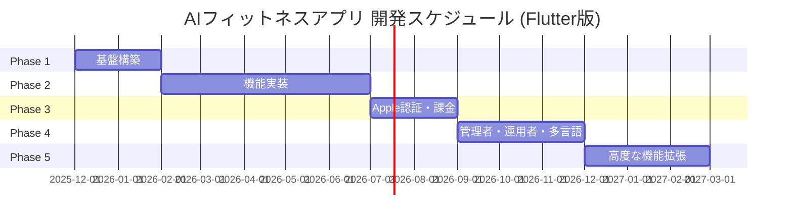

# 開発計画 v1.0 (Flutter版)

**プロジェクト名**: AIフィットネスアプリ（Flutter版）
**バージョン**: 1.0.0
**作成日**: 2025年12月10日
**最終更新日**: 2025年12月10日
**対象読者**: 開発チーム、プロジェクトマネージャー、ステークホルダー

---

## 目次

1. [開発フェーズ概要](#1-開発フェーズ概要)
2. [Phase 1: 基盤構築（0-2ヶ月）](#2-phase-1-基盤構築0-2ヶ月)
3. [Phase 2: 機能実装（2-7ヶ月）](#3-phase-2-機能実装2-7ヶ月)
4. [Phase 3: Apple認証・課金機能（8ヶ月目以降）](#4-phase-3-apple認証課金機能8ヶ月目以降)
5. [Phase 4: 管理者・運用者・多言語（将来）](#5-phase-4-管理者運用者多言語将来)
6. [Phase 5: 高度な機能拡張（将来）](#6-phase-5-高度な機能拡張将来)
7. [開発スケジュール](#7-開発スケジュール)
8. [マイルストーン](#8-マイルストーン)
9. [リスクとバッファ](#9-リスクとバッファ)
10. [現在の実装状況](#10-現在の実装状況)
11. [変更履歴](#11-変更履歴)

---

## 1. 開発フェーズ概要

### 1.1 フェーズ構成



### 1.2 各フェーズの目標

| フェーズ | 期間 | 目標 | 主要成果物 |
|---------|------|------|-----------|
| **Phase 1** | 0-2ヶ月 | セキュリティとデータ保護を最優先した基盤構築 | Firebase環境、認証基盤、セキュリティルール |
| **Phase 2** | 2-7ヶ月 | MVP完成、リリース可能な製品 | ML Kit統合、5種目実装、ストア申請 |
| **Phase 3** | 8ヶ月目以降 | 収益化の実現 | Apple認証、Stripe課金 |
| **Phase 4** | 将来 | 運用効率化、グローバル展開準備 | 管理者ダッシュボード、英語対応 |
| **Phase 5** | 将来 | AI高度化、ソーシャル機能 | カスタムMLモデル、友達機能 |

---

## 2. Phase 1: 基盤構築（0-2ヶ月）

### 2.1 概要

| 項目 | 内容 |
|-----|------|
| **期間** | 2ヶ月 |
| **目標** | セキュリティとデータ保護を最優先した基盤構築、課金導線を見越した設計 |
| **チーム** | バックエンドエンジニア2名、フロントエンドエンジニア2名、QA1名 |

### 2.2 主要タスク

| タスク | 担当 | 期間 | 優先度 | 詳細 |
|--------|------|------|--------|------|
| Firebase プロジェクト作成 | バックエンド | 3日 | 最高 | 本番・開発環境の構築 |
| 開発環境セットアップ | 全員 | 5日 | 最高 | Flutter SDK、Git、CI/CD環境 |
| Firestore セキュリティルール実装 | バックエンド | 5日 | 最高 | フィールドレベルの制御 |
| Firebase Authentication 設定 | バックエンド | 3日 | 最高 | メール/Google認証 |
| CI/CD パイプライン構築 | バックエンド | 5日 | 高 | GitHub Actions |
| 基本UI実装 | フロントエンド | 10日 | 高 | ログイン、登録、ホーム画面 |
| 監視・ログ基盤構築 | バックエンド | 3日 | 高 | Cloud Logging、Sentry |

### 2.3 タスク詳細（Flutter固有の実装内容）

#### 2.3.1 Firebase プロジェクト作成

**目標**: 本番環境と開発環境を分離して作成

**手順**:
1. Firebaseコンソールでプロジェクト作成
   - 本番: `ai-fitness-app-prod`
   - 開発: `ai-fitness-app-dev`（現在: `tokyo-list-478804-e5`）
2. iOS/Androidアプリを登録
3. Firestoreを有効化（リージョン: asia-northeast1）
4. Firebase Storageを有効化
5. BigQueryエクスポートを設定

**FlutterFire CLIを使用した設定**:

```bash
# FlutterFire CLIをインストール
dart pub global activate flutterfire_cli

# 設定ファイルを生成（自動でfirebase_options.dartが作られる）
flutterfire configure --project=tokyo-list-478804-e5
```

**成果物**:
- `lib/firebase_options.dart`（自動生成）
- `firebase.json`
- `.firebaserc`

#### 2.3.2 開発環境セットアップ

**目標**: チーム全員が開発できる環境を整備

**セットアップ内容**:
- Flutter SDK 3.10+
- Dart SDK 3.10+
- Xcode 15.x（iOS開発者・macOSのみ）
- Android Studio 2024.x（Android開発者）
- VS Code + 推奨拡張機能

**推奨VS Code拡張機能**:
- Dart（公式）
- Flutter（公式）
- Flutter Riverpod Snippets
- Error Lens

**Flutter固有のセットアップ**:

```bash
# 環境確認
flutter doctor

# 依存関係インストール
flutter pub get

# コード生成（Freezed/Riverpod）
dart run build_runner build
```

#### 2.3.3 Firestore セキュリティルール実装

**目標**: フィールドレベルでのアクセス制御を実装

**主要ルール**（共通仕様・Expo版と同じ）:

```javascript
rules_version = '2';
service cloud.firestore {
  match /databases/{database}/documents {
    // ヘルパー関数
    function isAuthenticated() {
      return request.auth != null;
    }

    function isOwner(userId) {
      return isAuthenticated() && request.auth.uid == userId;
    }

    function isNotDeleted(userId) {
      return !get(/databases/$(database)/documents/users/$(userId)).data.deletionScheduled;
    }

    // ユーザーコレクション
    match /users/{userId} {
      allow read: if isOwner(userId);
      allow create: if isOwner(userId);
      allow update: if isOwner(userId)
        && !request.resource.data.diff(resource.data).affectedKeys()
           .hasAny(['tosAccepted', 'ppAccepted', 'deletionScheduled']);
      allow delete: if false; // 削除は管理者のみ
    }

    // セッションコレクション
    match /sessions/{sessionId} {
      allow read: if isAuthenticated() && resource.data.userId == request.auth.uid;
      allow create: if isAuthenticated()
        && request.resource.data.userId == request.auth.uid
        && isNotDeleted(request.auth.uid);
      allow update, delete: if false; // セッションは不変
    }
  }
}
```

**テスト**:
- Firestoreエミュレータでテスト
- `@firebase/rules-unit-testing` を使用

#### 2.3.4 Firebase Authentication 設定

**認証方式**:
- メール/パスワード認証
- Googleログイン
- （Phase 3でApple認証を追加）

**Flutter固有の実装**:

```dart
import 'package:firebase_auth/firebase_auth.dart';
import 'package:google_sign_in/google_sign_in.dart';

// メール/パスワードログイン
Future<UserCredential> login(String email, String password) async {
  return await FirebaseAuth.instance.signInWithEmailAndPassword(
    email: email,
    password: password,
  );
}

// 新規登録
Future<UserCredential> register(String email, String password) async {
  return await FirebaseAuth.instance.createUserWithEmailAndPassword(
    email: email,
    password: password,
  );
}

// Googleログイン
Future<UserCredential?> signInWithGoogle() async {
  final googleUser = await GoogleSignIn().signIn();
  if (googleUser == null) return null;

  final googleAuth = await googleUser.authentication;
  final credential = GoogleAuthProvider.credential(
    accessToken: googleAuth.accessToken,
    idToken: googleAuth.idToken,
  );

  return await FirebaseAuth.instance.signInWithCredential(credential);
}
```

#### 2.3.5 CI/CD パイプライン構築

**目標**: 自動テスト・デプロイの仕組みを構築

**GitHub Actions ワークフロー**:

```yaml
name: CI/CD (Flutter)

on:
  push:
    branches: [main, develop]
  pull_request:
    branches: [main, develop]

jobs:
  test:
    runs-on: ubuntu-latest
    steps:
      - uses: actions/checkout@v4
      - uses: subosito/flutter-action@v2
        with:
          flutter-version: '3.10.0'
      - run: flutter pub get
      - run: flutter analyze
      - run: flutter test

  deploy-dev:
    needs: test
    if: github.ref == 'refs/heads/develop'
    runs-on: ubuntu-latest
    steps:
      - uses: actions/checkout@v4
      - uses: actions/setup-node@v4
      - run: npm ci
        working-directory: ./functions
      - run: npx firebase deploy --only functions,firestore:rules --project dev
```

#### 2.3.6 基本UI実装（Riverpod + GoRouter）

**実装画面**:
1. スプラッシュ画面
2. オンボーディング画面（3画面）
3. ログイン画面
4. 新規登録画面（2ステップ）
5. 利用規約同意画面
6. ホーム画面

**Flutter固有の状態管理（Riverpod）**:

```dart
import 'package:flutter_riverpod/flutter_riverpod.dart';
import 'package:firebase_auth/firebase_auth.dart';

// 認証状態を監視するProvider
final authStateProvider = StreamProvider<User?>((ref) {
  return FirebaseAuth.instance.authStateChanges();
});

// 認証操作を行うProvider
final authServiceProvider = Provider<AuthService>((ref) {
  return AuthService();
});

class AuthService {
  final _auth = FirebaseAuth.instance;

  Future<void> signIn(String email, String password) async {
    await _auth.signInWithEmailAndPassword(email: email, password: password);
  }

  Future<void> signOut() async {
    await _auth.signOut();
  }
}
```

**Flutter固有のルーティング（GoRouter）**:

```dart
import 'package:go_router/go_router.dart';
import 'package:flutter_riverpod/flutter_riverpod.dart';

final appRouterProvider = Provider<GoRouter>((ref) {
  final authState = ref.watch(authStateProvider);

  return GoRouter(
    initialLocation: '/',
    redirect: (context, state) {
      final isLoggedIn = authState.value != null;
      final isAuthRoute = state.matchedLocation.startsWith('/auth');

      if (!isLoggedIn && !isAuthRoute) {
        return '/auth/login';
      }
      if (isLoggedIn && isAuthRoute) {
        return '/home';
      }
      return null;
    },
    routes: [
      GoRoute(
        path: '/',
        builder: (context, state) => const SplashScreen(),
      ),
      GoRoute(
        path: '/auth/login',
        builder: (context, state) => const LoginScreen(),
      ),
      GoRoute(
        path: '/auth/register',
        builder: (context, state) => const RegisterScreen(),
      ),
      GoRoute(
        path: '/home',
        builder: (context, state) => const HomeScreen(),
      ),
    ],
  );
});
```

**コード生成（Freezed）**:

```dart
import 'package:freezed_annotation/freezed_annotation.dart';

part 'user_model.freezed.dart';

@freezed
class UserModel with _$UserModel {
  const factory UserModel({
    required String uid,
    required String email,
    String? displayName,
    @Default(false) bool tosAccepted,
    @Default(false) bool ppAccepted,
    @Default(false) bool deletionScheduled,
  }) = _UserModel;
}
```

コード生成を実行:

```bash
dart run build_runner build
```

#### 2.3.7 監視・ログ基盤構築

**監視ツール**:

| ツール | 用途 | 設定内容 |
|-------|------|---------|
| **Cloud Logging** | サーバーログ | Cloud Functionsのログ収集 |
| **Sentry** | エラートラッキング | クライアントエラーの自動収集 |
| **Firebase Crashlytics** | クラッシュレポート | アプリクラッシュの収集 |

**Sentry設定（Flutter）**:

```dart
import 'package:sentry_flutter/sentry_flutter.dart';

Future<void> main() async {
  await SentryFlutter.init(
    (options) {
      options.dsn = 'YOUR_SENTRY_DSN';
      options.environment = kDebugMode ? 'development' : 'production';
    },
    appRunner: () => runApp(const MyApp()),
  );
}
```

### 2.4 成果物

1. **Firebase環境**: 本番・開発環境の構築完了
2. **セキュリティルール**: Firestoreセキュリティルール完全実装
3. **認証基盤**: メール/Google認証の実装
4. **基本API**: ユーザー情報取得・更新API
5. **GDPR対応基盤**: 同意管理、データ削除の仕組み
6. **CI/CDパイプライン**: 自動テスト・デプロイ
7. **監視基盤**: ログ・エラートラッキング

### 2.5 リスクバッファ

**期間**: 2週間

**想定リスク**:
- Firebase設定の不具合
- チーム内のスキルギャップ
- ライブラリの互換性問題

---

## 3. Phase 2: 機能実装（2-7ヶ月）

### 3.1 概要

| 項目 | 内容 |
|-----|------|
| **期間** | 5ヶ月 |
| **目標** | MVP（最小限の製品）完成とパフォーマンス最適化 |
| **チーム** | 同上 |

### 3.2 主要タスク

| タスク | 担当 | 期間 | 優先度 | 備考 |
|--------|------|------|--------|------|
| google_mlkit_pose_detection統合 | フロントエンド | 2週間 | 最高 | パッケージ追加のみ |
| 5種目のフォーム確認補助機能 | フロントエンド | 4週間 | 最高 | 種目別アルゴリズム |
| トレーニング記録管理 | バックエンド | 2週間 | 最高 | Firestore保存 |
| 履歴・カレンダー表示 | フロントエンド | 2週間 | 高 | fl_chart |
| グラフ・統計表示 | フロントエンド | 2週間 | 高 | fl_chart |
| BigQuery パイプライン構築 | バックエンド | 2週間 | 高 | 分析基盤 |
| 音声ガイダンス実装 | フロントエンド | 1週間 | 中 | flutter_tts |
| プッシュ通知実装 | バックエンド | 1週間 | 中 | Firebase Messaging |
| ストア申請準備 | 全員 | 2週間 | 高 | スクリーンショット、説明文 |

### 3.3 タスク詳細（Flutter固有）

#### 3.3.1 google_mlkit_pose_detection統合

**目標**: カメラで姿勢を検出する仕組みを実装

**Expo版との違い**:

| 項目 | Flutter版 | Expo版 |
|-----|----------|--------|
| **パッケージ** | google_mlkit_pose_detection | MediaPipeネイティブモジュール |
| **セットアップ難易度** | 簡単（pubspec.yamlに追加） | 複雑（Swift/Kotlinでネイティブモジュール作成） |
| **ベース技術** | ML Kit（MediaPipeベース） | MediaPipe直接使用 |
| **検出精度** | 同等 | 同等 |
| **パフォーマンス目標** | 30fps以上 | 30fps以上 |

**手順**:

1. **パッケージ追加**（すでに追加済み）
   ```yaml
   dependencies:
     google_mlkit_pose_detection: ^0.11.0+1
     camera: ^0.10.5+9
   ```

2. **カメラ権限の設定**

   iOS (`ios/Runner/Info.plist`):
   ```xml
   <key>NSCameraUsageDescription</key>
   <string>トレーニング中のフォームをチェックするためにカメラを使用します</string>
   ```

   Android (`android/app/src/main/AndroidManifest.xml`):
   ```xml
   <uses-permission android:name="android.permission.CAMERA" />
   ```

3. **リアルタイム姿勢検出の実装**

```dart
import 'package:camera/camera.dart';
import 'package:google_mlkit_pose_detection/google_mlkit_pose_detection.dart';

class PoseDetectionService {
  final PoseDetector _poseDetector = PoseDetector(
    options: PoseDetectorOptions(
      mode: PoseDetectionMode.stream,
      model: PoseDetectionModel.base,
    ),
  );

  bool _isDetecting = false;

  /// カメラ画像から姿勢を検出
  Future<List<Pose>> detectPose(CameraImage image) async {
    // 処理中なら次のフレームをスキップ
    if (_isDetecting) return [];
    _isDetecting = true;

    try {
      final inputImage = _convertCameraImage(image);
      if (inputImage == null) return [];

      return await _poseDetector.processImage(inputImage);
    } finally {
      _isDetecting = false;
    }
  }

  InputImage? _convertCameraImage(CameraImage image) {
    final bytes = image.planes.first.bytes;
    return InputImage.fromBytes(
      bytes: bytes,
      inputImageData: InputImageData(
        size: Size(image.width.toDouble(), image.height.toDouble()),
        imageRotation: InputImageRotation.rotation0deg,
        inputImageFormat: InputImageFormat.bgra8888,
        planeData: [
          InputImagePlaneMetadata(
            bytesPerRow: image.planes.first.bytesPerRow,
            height: image.height,
            width: image.width,
          ),
        ],
      ),
    );
  }

  void dispose() {
    _poseDetector.close();
  }
}
```

**性能目標**:
- 通常デバイス: 30fps以上
- 低スペックデバイス: 15fps以上

**代替手段（ML Kit失敗時）**:
- TensorFlow Lite
- クラウドAPI（最終手段）

#### 3.3.2 5種目のフォーム確認補助機能

**実装する種目**:

| 種目 | 推奨向き | 評価ポイント |
|-----|---------|------------|
| スクワット | 横向き | 膝角度90-110度、膝がつま先より前に出ない |
| プッシュアップ | 横向き | 体が一直線、肘角度約90度 |
| アームカール | 正面 | 肘角度30-160度、肘を体の横で固定 |
| サイドレイズ | 正面 | 腕挙上角度70-90度、左右対称 |
| ショルダープレス | 正面 | 肘角度90度から伸ばす、垂直軌道 |

**評価アルゴリズム例（スクワット）**:

```dart
import 'dart:math';
import 'package:google_mlkit_pose_detection/google_mlkit_pose_detection.dart';

class SquatEvaluator {
  EvaluationResult evaluate(Pose pose) {
    final leftHip = pose.landmarks[PoseLandmarkType.leftHip];
    final leftKnee = pose.landmarks[PoseLandmarkType.leftKnee];
    final leftAnkle = pose.landmarks[PoseLandmarkType.leftAnkle];
    final leftToe = pose.landmarks[PoseLandmarkType.leftFootIndex];

    if (leftHip == null || leftKnee == null || leftAnkle == null) {
      return EvaluationResult(score: 0, feedback: '体全体をカメラに映してください');
    }

    // 膝の角度を計算
    final kneeAngle = _calculateAngle(
      leftHip.x, leftHip.y,
      leftKnee.x, leftKnee.y,
      leftAnkle.x, leftAnkle.y,
    );

    // 膝がつま先より前に出ているかチェック
    final isKneeBehindToe = leftToe == null || leftKnee.x <= leftToe.x;

    // スコア計算
    var score = 100;

    if (kneeAngle < 90) score -= 10;
    if (kneeAngle > 110) score -= 5;
    if (!isKneeBehindToe) score -= 20;

    return EvaluationResult(
      score: max(0, score),
      feedback: _generateFeedback(kneeAngle, isKneeBehindToe),
    );
  }

  String _generateFeedback(double kneeAngle, bool isKneeBehindToe) {
    if (!isKneeBehindToe) {
      return '参考: 膝がつま先より前に出ています';
    }
    if (kneeAngle < 90) {
      return '参考: 膝をもう少し曲げましょう';
    }
    if (kneeAngle > 110) {
      return '参考: もう少し深くしゃがみましょう';
    }
    return '参考: 良いフォームです';
  }

  double _calculateAngle(
    double x1, double y1,
    double x2, double y2,
    double x3, double y3,
  ) {
    final radians = (atan2(y3 - y2, x3 - x2) - atan2(y1 - y2, x1 - x2)).abs();
    var degrees = radians * 180 / pi;
    if (degrees > 180) degrees = 360 - degrees;
    return degrees;
  }
}

class EvaluationResult {
  final int score;
  final String feedback;

  EvaluationResult({required this.score, required this.feedback});
}
```

#### 3.3.3 トレーニング記録管理

**Firestoreスキーマ**（Freezedで型安全に）:

```dart
import 'package:freezed_annotation/freezed_annotation.dart';
import 'package:cloud_firestore/cloud_firestore.dart';

part 'session_model.freezed.dart';

@freezed
class Session with _$Session {
  const factory Session({
    required String id,
    required String userId,
    required String exerciseType,
    required DateTime startTime,
    required DateTime endTime,
    required int targetReps,
    required int actualReps,
    required int score,
    required List<PoseFrame> poseData,
    String? notes,
    required DateTime createdAt,
  }) = _Session;
}

@freezed
class PoseFrame with _$PoseFrame {
  const factory PoseFrame({
    required int timestamp,
    required List<List<double>> landmarks,
  }) = _PoseFrame;
}
```

**保存処理**:

```dart
import 'package:cloud_firestore/cloud_firestore.dart';

class SessionRepository {
  final _firestore = FirebaseFirestore.instance;

  Future<String> saveSession(Session session) async {
    final docRef = await _firestore.collection('sessions').add({
      'userId': session.userId,
      'exerciseType': session.exerciseType,
      'startTime': session.startTime,
      'endTime': session.endTime,
      'targetReps': session.targetReps,
      'actualReps': session.actualReps,
      'score': session.score,
      'poseData': session.poseData.map((p) => {
        'timestamp': p.timestamp,
        'landmarks': p.landmarks,
      }).toList(),
      'notes': session.notes,
      'createdAt': FieldValue.serverTimestamp(),
    });

    return docRef.id;
  }
}
```

#### 3.3.4 履歴・カレンダー表示

**table_calendarパッケージの使用**:

```dart
import 'package:table_calendar/table_calendar.dart';

class CalendarScreen extends ConsumerWidget {
  @override
  Widget build(BuildContext context, WidgetRef ref) {
    final sessions = ref.watch(sessionsProvider);

    return TableCalendar(
      focusedDay: DateTime.now(),
      firstDay: DateTime(2024, 1, 1),
      lastDay: DateTime(2030, 12, 31),
      eventLoader: (day) {
        // その日のセッションを返す
        return sessions.where((s) =>
          s.startTime.year == day.year &&
          s.startTime.month == day.month &&
          s.startTime.day == day.day
        ).toList();
      },
      onDaySelected: (selectedDay, focusedDay) {
        // 日付選択時の処理
      },
    );
  }
}
```

#### 3.3.5 グラフ・統計表示

**fl_chartパッケージの使用**:

```dart
import 'package:fl_chart/fl_chart.dart';

class WeeklyChart extends StatelessWidget {
  final List<int> weeklyMinutes;

  const WeeklyChart({required this.weeklyMinutes});

  @override
  Widget build(BuildContext context) {
    return LineChart(
      LineChartData(
        gridData: FlGridData(show: true),
        titlesData: FlTitlesData(
          bottomTitles: AxisTitles(
            sideTitles: SideTitles(
              showTitles: true,
              getTitlesWidget: (value, meta) {
                const days = ['月', '火', '水', '木', '金', '土', '日'];
                return Text(days[value.toInt()]);
              },
            ),
          ),
        ),
        lineBarsData: [
          LineChartBarData(
            spots: weeklyMinutes.asMap().entries.map((e) =>
              FlSpot(e.key.toDouble(), e.value.toDouble())
            ).toList(),
            isCurved: true,
            color: Colors.green,
            barWidth: 3,
          ),
        ],
      ),
    );
  }
}
```

#### 3.3.6 BigQuery パイプライン構築

**データフロー**（共通仕様・Expo版と同じ）:

```
Firestore -> Cloud Function -> BigQuery
```

**Cloud Function実装**:

```typescript
import { onDocumentCreated } from 'firebase-functions/v2/firestore';
import { BigQuery } from '@google-cloud/bigquery';

export const syncToBigQuery = onDocumentCreated('sessions/{sessionId}', async (event) => {
  const session = event.data?.data();
  if (!session) return;

  const bigquery = new BigQuery();
  const dataset = bigquery.dataset('fitness_data');
  const table = dataset.table('sessions');

  await table.insert([
    {
      session_id: event.params.sessionId,
      user_id: session.userId,
      exercise_type: session.exerciseType,
      score: session.score,
      created_at: session.createdAt,
    },
  ]);

  console.log('BigQueryに同期完了');
});
```

#### 3.3.7 音声ガイダンス実装

**flutter_ttsパッケージの使用**:

```dart
import 'package:flutter_tts/flutter_tts.dart';

class VoiceGuidanceService {
  final FlutterTts _tts = FlutterTts();

  Future<void> init() async {
    await _tts.setLanguage('ja-JP');
    await _tts.setSpeechRate(0.9);
    await _tts.setVolume(1.0);
  }

  Future<void> speak(String message) async {
    await _tts.speak('参考: $message');
  }

  Future<void> stop() async {
    await _tts.stop();
  }
}
```

#### 3.3.8 オフライン対応

**Firestore Offline Persistence**:

Flutterでは、Firestoreのオフラインキャッシュがデフォルトで有効です。追加の設定は不要です。

```dart
// オフライン時もデータを読み取れる
final sessions = await FirebaseFirestore.instance
    .collection('sessions')
    .where('userId', isEqualTo: userId)
    .get();
```

**shared_preferencesでローカル設定保存**:

```dart
import 'package:shared_preferences/shared_preferences.dart';

class LocalSettingsService {
  Future<void> saveVoiceEnabled(bool enabled) async {
    final prefs = await SharedPreferences.getInstance();
    await prefs.setBool('voice_enabled', enabled);
  }

  Future<bool> getVoiceEnabled() async {
    final prefs = await SharedPreferences.getInstance();
    return prefs.getBool('voice_enabled') ?? true;
  }
}
```

**ネットワーク状態監視**:

```dart
import 'package:connectivity_plus/connectivity_plus.dart';

class ConnectivityService {
  Stream<bool> get isConnected {
    return Connectivity().onConnectivityChanged.map((result) {
      return result.first != ConnectivityResult.none;
    });
  }
}
```

#### 3.3.9 ストア申請準備

**必要な素材**:

1. **アプリアイコン**
   - iOS: 1024x1024px
   - Android: 512x512px

2. **スクリーンショット**
   - iPhone 6.7インチ: 5枚以上
   - Android: 5枚以上

3. **説明文**
   - タイトル（30文字以内）
   - 短い説明（80文字以内）
   - 詳細説明（4000文字以内）

4. **プライバシーポリシーURL**
   - Webサイトに公開

5. **利用規約URL**
   - Webサイトに公開

**App Store Connect設定**:
- 年齢制限: 4+（全年齢）
- カテゴリ: ヘルスケア/フィットネス
- 価格: 無料（アプリ内課金あり）

**Google Play Console設定**:
- コンテンツレーティング: 全年齢
- カテゴリ: 健康&フィットネス
- 価格: 無料（アプリ内課金あり）

### 3.4 KPI（目標指標）

| 指標 | 目標値 | 説明 |
|-----|--------|------|
| DAU | 100人 | 1日あたりのアクティブユーザー数 |
| 7日後リテンション | 30% | 1週間後も使い続ける人の割合 |
| ML Kit FPS | 30fps以上 | 姿勢検出の処理速度 |
| BigQuery同期成功率 | 99.9%以上 | データ同期の成功率 |

### 3.5 成果物

1. **リリース可能なMVPアプリ**
2. **App Store / Google Play 申請**
3. **パフォーマンステストレポート**
4. **セキュリティ診断レポート**
5. **ユーザーマニュアル**

### 3.6 リスクバッファ

**期間**: 3週間

**想定リスク**:
- ML Kit統合の難航
- パフォーマンス最適化の困難
- ストア審査の遅延

---

## 4. Phase 3: Apple認証・課金機能（8ヶ月目以降）

### 4.1 概要

| 項目 | 内容 |
|-----|------|
| **期間** | 8ヶ月目以降（Phase 2完了後） |
| **目標** | 収益化の実現（Apple認証と課金機能の同時実装） |

**重要**: App Storeの審査要件として、ソーシャルログインを提供する場合はApple認証も必須となるため、課金機能とApple認証を同時に実装します。

### 4.2 予定している機能

| 機能 | 説明 | 優先度 |
|-----|------|--------|
| Apple認証（Sign in with Apple） | iOS向け認証強化 | 高 |
| 課金機能（Stripe） | サブスクリプション課金の実装 | 高 |
| 複数プラン | 無料プラン、プレミアムプラン | 高 |
| 課金管理画面 | サブスクリプションの確認・解約 | 高 |

### 4.3 決済サービスの方針

| サービス | 役割 | 理由 |
|---------|------|------|
| **Stripe（メイン）** | 主要な決済手段 | Web版との統一、柔軟な価格設定、日本での豊富な実績 |
| **RevenueCat（代替）** | バックアップ | Stripe導入に問題が生じた場合の代替手段 |

**Stripe選定理由**:
- **Web版との統一が容易**: 将来Webアプリを作る場合も同じシステムを使える
- **柔軟な価格設定**: 月額、年額、従量課金など様々な料金プランに対応
- **日本での豊富な実績**: 日本円決済、日本のクレジットカードに対応
- **ドキュメントが充実**: 日本語ドキュメントあり
- **開発者フレンドリー**: APIが使いやすく、テスト環境も充実

### 4.4 タスク詳細

#### 4.4.1 Apple認証（Sign in with Apple）

**実装**:

```dart
import 'package:sign_in_with_apple/sign_in_with_apple.dart';
import 'package:firebase_auth/firebase_auth.dart';

Future<UserCredential?> signInWithApple() async {
  try {
    final credential = await SignInWithApple.getAppleIDCredential(
      scopes: [
        AppleIDAuthorizationScopes.email,
        AppleIDAuthorizationScopes.fullName,
      ],
    );

    final oauthCredential = OAuthProvider('apple.com').credential(
      idToken: credential.identityToken,
      accessToken: credential.authorizationCode,
    );

    return await FirebaseAuth.instance.signInWithCredential(oauthCredential);
  } catch (e) {
    print('Apple認証エラー: $e');
    return null;
  }
}
```

#### 4.4.2 課金機能（Stripe）

**flutter_stripeパッケージの使用**:

```dart
import 'package:flutter_stripe/flutter_stripe.dart';
import 'package:cloud_functions/cloud_functions.dart';

class PaymentService {
  Future<void> initStripe() async {
    Stripe.publishableKey = 'pk_test_xxxxx';
  }

  Future<void> purchaseSubscription() async {
    try {
      // 1. Cloud Functionからclient secretを取得
      final result = await FirebaseFunctions.instance
          .httpsCallable('createSubscription')
          .call({'priceId': 'price_premium_monthly'});

      final clientSecret = result.data['clientSecret'] as String;

      // 2. Payment Sheetを初期化
      await Stripe.instance.initPaymentSheet(
        paymentSheetParameters: SetupPaymentSheetParameters(
          paymentIntentClientSecret: clientSecret,
          merchantDisplayName: 'AIフィットネスアプリ',
        ),
      );

      // 3. Payment Sheetを表示
      await Stripe.instance.presentPaymentSheet();

      print('課金成功');
    } on StripeException catch (e) {
      print('課金エラー: ${e.error.localizedMessage}');
    }
  }
}
```

**Cloud Function（サブスクリプション作成）**:

```typescript
import { onCall } from 'firebase-functions/v2/https';
import Stripe from 'stripe';

const stripe = new Stripe(process.env.STRIPE_SECRET_KEY!);

export const createSubscription = onCall(async (request) => {
  if (!request.auth) {
    throw new Error('認証が必要です');
  }

  const { priceId } = request.data;

  // Stripeカスタマーを作成または取得
  const customer = await stripe.customers.create({
    email: request.auth.token.email,
    metadata: {
      firebaseUID: request.auth.uid,
    },
  });

  // サブスクリプションを作成
  const subscription = await stripe.subscriptions.create({
    customer: customer.id,
    items: [{ price: priceId }],
    payment_behavior: 'default_incomplete',
    expand: ['latest_invoice.payment_intent'],
  });

  const invoice = subscription.latest_invoice as Stripe.Invoice;
  const paymentIntent = invoice.payment_intent as Stripe.PaymentIntent;

  return {
    subscriptionId: subscription.id,
    clientSecret: paymentIntent.client_secret,
  };
});
```

#### 4.4.3 課金管理画面

**サブスクリプション確認**:

```dart
import 'package:flutter_riverpod/flutter_riverpod.dart';

final subscriptionProvider = FutureProvider<Subscription?>((ref) async {
  final result = await FirebaseFunctions.instance
      .httpsCallable('getSubscription')
      .call();

  if (result.data == null) return null;

  return Subscription(
    plan: result.data['plan'],
    status: result.data['status'],
    nextBillingDate: DateTime.parse(result.data['nextBillingDate']),
  );
});

class SubscriptionScreen extends ConsumerWidget {
  @override
  Widget build(BuildContext context, WidgetRef ref) {
    final subscription = ref.watch(subscriptionProvider);

    return subscription.when(
      data: (sub) {
        if (sub == null) {
          return const FreeUserView();
        }
        return Column(
          children: [
            Text('現在のプラン: ${sub.plan}'),
            Text('次回更新日: ${sub.nextBillingDate}'),
            ElevatedButton(
              onPressed: () => _cancelSubscription(context),
              child: const Text('サブスクリプションをキャンセル'),
            ),
          ],
        );
      },
      loading: () => const CircularProgressIndicator(),
      error: (e, _) => Text('エラー: $e'),
    );
  }
}
```

### 4.5 KPI（目標指標）

| 指標 | 目標値 | 説明 |
|-----|--------|------|
| 課金転換率 | 5% | 無料トライアルから有料に切り替える人の割合 |
| ARPU | 300円 | ユーザーあたりの平均収益 |
| MRR | 30,000円 | 月間経常収益 |

---

## 5. Phase 4: 管理者・運用者・多言語（将来）

### 5.1 概要

| 項目 | 内容 |
|-----|------|
| **期間** | Phase 3完了後（将来） |
| **目標** | 管理者・運用者向け機能とグローバル展開の基盤構築 |

### 5.2 予定している機能

| 機能 | 説明 | 優先度 |
|-----|------|--------|
| 管理者ダッシュボード | ユーザー統計、利用状況の可視化 | 高 |
| 運用監視ツール | エラー監視、パフォーマンス監視 | 高 |
| ユーザーサポート機能 | 問い合わせ管理、FAQ管理 | 中 |
| コンテンツ管理 | トレーニングコンテンツの追加・編集 | 中 |
| 追加種目 | 10種目以上に拡大 | 中 |
| 多言語対応 | 英語対応 | 中 |

### 5.3 移行条件

Phase 4への移行には以下の条件を満たす必要があります：

1. Phase 3での収益化成功
2. 一定数のアクティブユーザー獲得（目安: DAU 500以上）
3. ユーザーフィードバックの収集と分析

---

## 6. Phase 5: 高度な機能拡張（将来）

### 6.1 概要

| 項目 | 内容 |
|-----|------|
| **期間** | Phase 4完了後（将来） |
| **目標** | 高度なAI機能とソーシャル機能の実装 |

### 6.2 予定している機能

| 機能 | 説明 | 優先度 |
|-----|------|--------|
| カスタムMLモデル | ML Kitからの移行 | 高 |
| AIコーチング | より高度なパーソナライズ | 中 |
| ソーシャル機能 | 友達機能、リーダーボード | 中 |

### 6.3 移行条件

カスタムMLモデルへの移行には以下の条件を満たす必要があります：

1. 10,000セッション以上のデータ蓄積
2. 専任MLエンジニアの確保
3. Phase 3-4での収益化成功

---

## 7. 開発スケジュール

### 7.1 全体スケジュール

```
Phase 1: 基盤構築（0-2ヶ月）
  +-- Week 1-2: Firebase環境構築
  +-- Week 3-4: 認証実装
  +-- Week 5-6: セキュリティルール実装
  +-- Week 7-8: 基本UI実装

Phase 2: 機能実装（2-7ヶ月）
  +-- Month 3-4: ML Kit統合
  +-- Month 4-5: 5種目実装
  +-- Month 5-6: 履歴・グラフ実装
  +-- Month 6-7: テスト・ストア申請

Phase 3: Apple認証・課金（8ヶ月目以降）
  +-- Month 8-9: Apple認証・Stripe実装
  +-- Month 9-10: 課金管理画面実装

Phase 4: 管理者・運用者・多言語（将来）
  +-- TBD

Phase 5: 高度な機能拡張（将来）
  +-- TBD
```

### 7.2 週次スケジュール例（Phase 1）

| 週 | タスク | 担当 |
|----|--------|------|
| Week 1 | Firebase環境構築、開発環境セットアップ | 全員 |
| Week 2 | Firestoreセキュリティルール設計 | バックエンド |
| Week 3 | Firebase Authentication設定 | バックエンド |
| Week 4 | ログイン画面実装 | フロントエンド |
| Week 5 | 新規登録画面実装 | フロントエンド |
| Week 6 | 利用規約同意画面実装 | フロントエンド |
| Week 7 | ホーム画面実装 | フロントエンド |
| Week 8 | CI/CD構築、監視基盤構築 | バックエンド |

---

## 8. マイルストーン

### 8.1 主要マイルストーン

| マイルストーン | 予定日 | 内容 | 達成条件 |
|-------------|--------|------|---------|
| **M1: 基盤完成** | 2ヶ月後 | Phase 1完了 | 認証・セキュリティルール完成 |
| **M2: ML Kit統合** | 3ヶ月後 | 姿勢検出機能実装 | 30fps達成 |
| **M3: MVP完成** | 5ヶ月後 | 5種目実装完了 | 全機能動作 |
| **M4: 内部テスト開始** | 5ヶ月後 | QAテスト開始 | テストケース作成完了 |
| **M5: ベータリリース** | 6ヶ月後 | 限定公開 | 50人のテストユーザー |
| **M6: 正式リリース** | 7ヶ月後 | App Store / Google Play 公開 | 審査通過 |
| **M7: 課金機能リリース** | 9ヶ月後 | Stripe課金開始 | 課金システム稼働 |

### 8.2 マイルストーン達成のチェックリスト

**M1: 基盤完成**
- [x] Firebase環境構築完了
- [ ] Firestoreセキュリティルール実装完了
- [x] Firebase Authentication設定完了
- [x] 基本UI実装完了
- [ ] CI/CDパイプライン構築完了

**M2: ML Kit統合**
- [ ] google_mlkit_pose_detection統合完了
- [ ] 30fps達成
- [ ] 姿勢検出精度検証完了

**M3: MVP完成**
- [ ] 5種目すべての実装完了
- [ ] フォーム評価アルゴリズム実装完了
- [ ] トレーニング記録機能実装完了
- [ ] 履歴・グラフ機能実装完了

**M6: 正式リリース**
- [ ] App Store審査通過
- [ ] Google Play審査通過
- [ ] プライバシーポリシー公開
- [ ] 利用規約公開
- [ ] ユーザーマニュアル作成

---

## 9. リスクとバッファ

### 9.1 主要リスク

| リスク | 影響度 | 発生確率 | 対策 |
|--------|--------|---------|------|
| ML Kitが動かない | 致命的 | 低 | google_mlkit_pose_detectionはパッケージなので導入が容易。問題時はTensorFlow Liteを検討 |
| 開発期間の超過 | 高 | 高 | バッファ期間を設ける（Phase 1: 2週間、Phase 2: 3週間） |
| パフォーマンス低下 | 中 | 中 | プロファイリングで早期発見、最適化 |
| ライブラリの互換性問題 | 中 | 中 | 事前に全ライブラリの動作確認。analyzer_pluginなどの依存関係に注意 |
| ストア審査の遅延 | 中 | 中 | 早めの申請、審査ガイドラインの遵守 |
| チームメンバーの離脱 | 高 | 低 | ドキュメント整備、コードレビューの徹底 |

### 9.2 バッファ期間

| フェーズ | バッファ期間 | 理由 |
|---------|------------|------|
| Phase 1 | 2週間 | Firebase設定の不具合、スキルギャップ |
| Phase 2 | 3週間 | ML Kit統合の難航、パフォーマンス最適化 |
| Phase 3 | 2週間 | 課金システムの動作確認、審査対応 |

---

## 10. 現在の実装状況

### 10.1 実装状況（2025年12月時点）

| カテゴリ | 状況 | 詳細 |
|---------|------|------|
| **Firebase基盤** | 完了 | プロジェクトセットアップ、エミュレータ設定 |
| **認証機能** | 完了 | メール/パスワード認証、Google認証 |
| **セキュリティルール** | 進行中 | 基本ルール実装済み、詳細ルール作業中 |
| **Cloud Functions** | 完了 | Auth triggers、API基盤、ミドルウェア |
| **Flutter UI** | 完了 | ログイン、登録、ホーム画面 |
| **状態管理** | 完了 | Riverpod、GoRouter |
| **ML Kit統合** | 未着手 | パッケージは`pubspec.yaml`に追加済み（Phase 2で実装予定） |
| **課金機能** | 未着手 | Phase 3で実装予定（Stripeメイン、RevenueCat代替） |
| **BigQueryパイプライン** | 未着手 | Phase 2で実装予定 |

### 10.2 進捗率

```
Phase 1 進捗: ########-- 80%
Phase 2 進捗: ---------- 0%
全体進捗:     ####------ 40%
```

### 10.3 残タスク（Phase 1）

1. Firestoreセキュリティルールの完全実装
2. 追加APIエンドポイントの実装
3. セキュリティレビュー
4. CI/CDパイプライン構築

### 10.4 次のマイルストーン

| マイルストーン | 予定日 | 内容 |
|-------------|--------|------|
| Phase 1完了 | 2ヶ月後 | 基盤構築完了 |
| ML Kit統合完了 | 3ヶ月後 | 姿勢検出機能実装 |
| 内部テスト開始 | 5ヶ月後 | QAテスト開始 |
| ベータリリース | 6ヶ月後 | 限定公開 |
| 正式リリース | 7ヶ月後 | App Store / Google Play 公開 |

### 10.5 Flutter版の特徴（Expo版との比較）

| 項目 | Flutter版 | Expo版 |
|-----|----------|--------|
| **姿勢検出** | google_mlkit_pose_detection（パッケージ追加のみ） | MediaPipeネイティブモジュール作成が必要 |
| **状態管理** | Riverpod（型安全、コード生成） | Zustand（軽量、シンプル） |
| **ルーティング** | GoRouter（宣言的、型安全） | Expo Router（ファイルベース） |
| **コード生成** | build_runner + Freezed | 不要 |
| **セットアップ難易度** | 中（Dart習得必要） | 低（React経験者は参入しやすい） |
| **パフォーマンス** | ネイティブに近い | JavaScript Bridge経由 |

---

## 11. 変更履歴

| バージョン | 日付 | 変更内容 | 担当者 |
|-----------|------|---------|--------|
| 1.0.0 | 2025年12月10日 | 初版作成 | Documentation Engineer |

---

**Document Version**: v1.0.0
**Last Updated**: 2025年12月10日
**Author**: AIフィットネスアプリ開発チーム

---

**以上**
