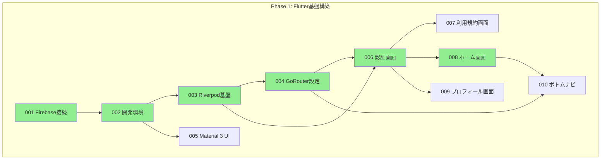
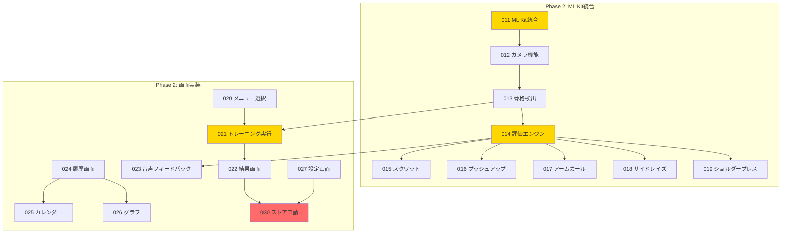
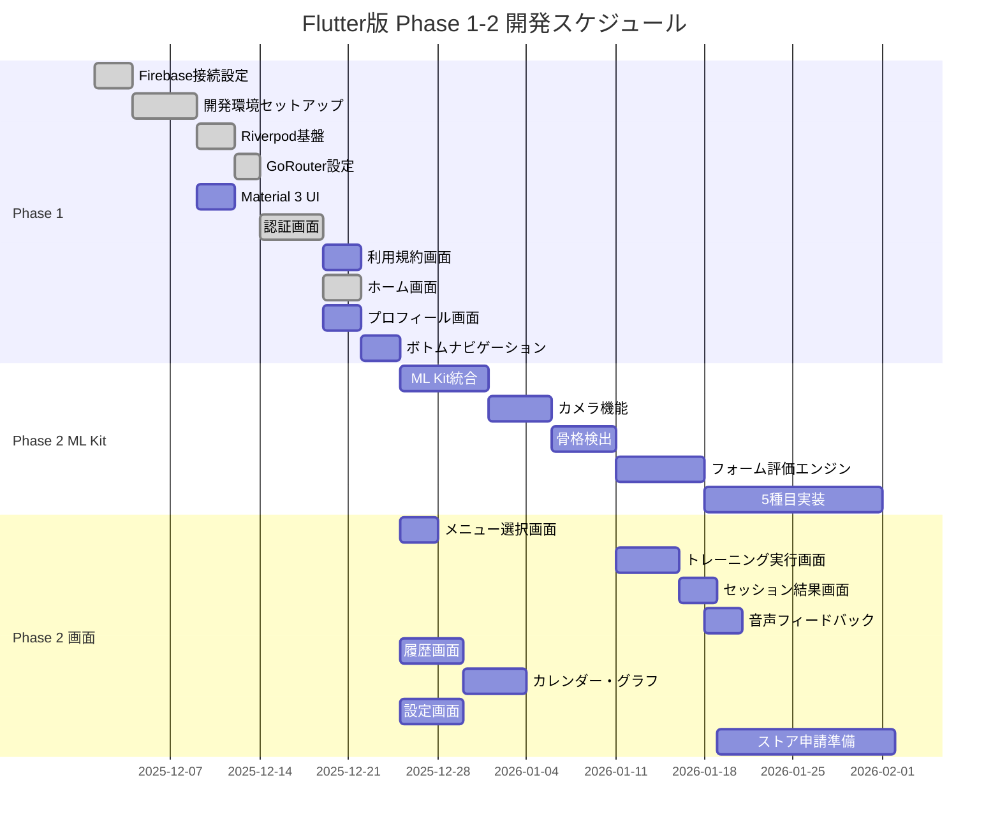

# Flutter版 チケット全体管理

**バージョン**: 1.0.0
**作成日**: 2025年12月10日
**対象**: AIフィットネスアプリ Flutter版開発チケット

---

## 1. 概要

このドキュメントは、**AIフィットネスアプリのFlutter版** の開発チケットを管理するファイルです。

Flutter版は、Dart言語とFlutterフレームワークを使用したネイティブアプリ実装です。以下のFlutter固有技術を使用します:

- **Riverpod**: 状態管理（型安全、コード生成対応）
- **GoRouter**: ルーティング（宣言的、型安全）
- **google_mlkit_pose_detection**: 姿勢検出（ML Kit）
- **Material 3**: UIフレームワーク（Flutter組み込み）
- **Freezed**: 不変データクラス生成

### Common（共通バックエンド）との関係

```
Flutter版アプリ (Dart/Flutter)
       │
       ▼
Common (共通バックエンド)
       ├── Firebase Cloud Functions
       ├── Firestore
       └── BigQuery
```

Flutter版アプリは、Common（共通バックエンド）のAPIを呼び出してデータの保存・取得を行います。

---

## 2. Phase構成

Flutter版の開発は4つのPhaseに分かれています。

| Phase | チケット範囲 | 件数 | 目標 |
|-------|------------|------|------|
| **Phase 1** | 001-010 | 10件 | Flutter基盤構築 |
| **Phase 2** | 011-030 | 20件 | ML Kit統合・画面実装 |
| **Phase 3** | 031-040 | 10件 | 課金フロントエンド |
| **Phase 4** | 041-050 | 10件 | 管理者フロントエンド |
| **合計** | | **50件** | |

### Phase 1: Flutter基盤構築（0-2ヶ月）

アプリの土台を作るPhaseです。

- Firebase接続設定（FlutterFire CLI）
- 開発環境セットアップ
- Riverpod状態管理基盤
- GoRouterルーティング設定
- Material 3 UIテーマ設定
- 認証画面（ログイン・登録）
- 利用規約同意画面
- ホーム画面・ボトムナビゲーション

### Phase 2: ML Kit統合・画面実装（2-7ヶ月）

アプリのメイン機能を実装するPhaseです。

- google_mlkit_pose_detectionによる姿勢検出
- カメラ機能・骨格検出
- フォーム評価エンジン（5種目）
- トレーニング実行・結果画面
- 履歴・カレンダー・グラフ表示
- 音声フィードバック（flutter_tts）
- 設定・ヘルプセンター
- ストア申請準備

### Phase 3: 課金フロントエンド（8ヶ月目以降）

収益化のためのフロントエンド機能を実装するPhaseです。

- Apple認証（sign_in_with_apple）
- Stripe Payment Sheet（flutter_stripe）
- サブスクリプション管理画面
- 無料トライアル機能

### Phase 4: 管理者フロントエンド（将来）

運用チームと管理者向けのフロントエンド機能を作るPhaseです。

- 管理者ダッシュボード
- ユーザー管理画面
- 多言語対応基盤

---

## 3. チケット一覧

### Phase 1: Flutter基盤構築（001-010）

| ID | タイトル | 依存チケット | 状態 | 使用パッケージ |
|----|---------|------------|------|--------------|
| 001 | Firebase接続設定（FlutterFire CLI） | - | 完了 | firebase_core, flutterfire_cli |
| 002 | Flutter開発環境セットアップ | 001 | 完了 | flutter_lints |
| 003 | Riverpod状態管理基盤 | 002 | 完了 | flutter_riverpod |
| 004 | GoRouter設定 | 003 | 完了 | go_router |
| 005 | Material 3 UI基盤 | 002 | 未着手 | flutter/material |
| 006 | 認証画面（ログイン・登録） | 003, 004 | 完了 | firebase_auth, google_sign_in |
| 007 | 利用規約同意画面 | 006 | 未着手 | - |
| 008 | ホーム画面 | 006 | 完了 | - |
| 009 | プロフィール画面 | 006 | 未着手 | - |
| 010 | ボトムナビゲーション | 004, 008 | 未着手 | - |

### Phase 2: ML Kit統合・画面実装（011-030）

| ID | タイトル | 依存チケット | 状態 | 使用パッケージ |
|----|---------|------------|------|--------------|
| 011 | ML Kit統合（google_mlkit_pose_detection） | 010 | 未着手 | google_mlkit_pose_detection |
| 012 | カメラ機能実装 | 011 | 未着手 | camera, permission_handler |
| 013 | 骨格検出基盤 | 012 | 未着手 | image |
| 014 | フォーム評価エンジン | 013 | 未着手 | - |
| 015 | スクワット評価ロジック | 014 | 未着手 | - |
| 016 | プッシュアップ評価ロジック | 014 | 未着手 | - |
| 017 | アームカール評価ロジック | 014 | 未着手 | - |
| 018 | サイドレイズ評価ロジック | 014 | 未着手 | - |
| 019 | ショルダープレス評価ロジック | 014 | 未着手 | - |
| 020 | メニュー選択画面 | 010 | 未着手 | - |
| 021 | トレーニング実行画面 | 013, 020 | 未着手 | - |
| 022 | セッション結果画面 | 021 | 未着手 | - |
| 023 | 音声フィードバック機能 | 014 | 未着手 | flutter_tts |
| 024 | 履歴画面実装 | 010 | 未着手 | - |
| 025 | カレンダー表示機能 | 024 | 未着手 | table_calendar |
| 026 | グラフ表示機能 | 024 | 未着手 | fl_chart |
| 027 | 設定画面実装 | 010 | 未着手 | shared_preferences |
| 028 | 通知設定機能 | 027 | 未着手 | firebase_messaging |
| 029 | ヘルプセンター | 027 | 未着手 | url_launcher |
| 030 | ストア申請準備 | 022, 027 | 未着手 | - |

### Phase 3: 課金フロントエンド（031-040）

| ID | タイトル | 依存チケット | 状態 | 使用パッケージ |
|----|---------|------------|------|--------------|
| 031 | Apple認証実装 | 030 | 未着手 | sign_in_with_apple |
| 032 | Stripe Payment Sheet実装 | 030, common/031 | 未着手 | flutter_stripe |
| 033 | 課金画面実装 | 032 | 未着手 | - |
| 034 | サブスクリプション管理画面 | 033 | 未着手 | - |
| 035 | 無料トライアル機能 | 033 | 未着手 | - |
| 036 | 課金履歴画面 | 033 | 未着手 | - |
| 037 | 予備 | - | - | - |
| 038 | 予備 | - | - | - |
| 039 | 予備 | - | - | - |
| 040 | 予備 | - | - | - |

### Phase 4: 管理者フロントエンド（041-050）

| ID | タイトル | 依存チケット | 状態 | 使用パッケージ |
|----|---------|------------|------|--------------|
| 041 | 管理者ダッシュボード | 030, common/041 | 未着手 | fl_chart |
| 042 | ユーザー管理画面 | 041 | 未着手 | - |
| 043 | 多言語対応基盤 | 030 | 未着手 | intl, flutter_localizations |
| 044 | 予備 | - | - | - |
| 045 | 予備 | - | - | - |
| 046 | 予備 | - | - | - |
| 047 | 予備 | - | - | - |
| 048 | 予備 | - | - | - |
| 049 | 予備 | - | - | - |
| 050 | 予備 | - | - | - |

---

## 4. Commonバックエンドとの依存関係

Flutter版のチケットは、Common（共通バックエンド）のチケット完了に依存しています。
詳細は `docs/common/tickets/000-ticket-overview.md` の「フロントエンドチケットとの依存関係」セクションを参照してください。

### 主要な依存関係

| Flutterチケット | 依存するCommonチケット | Common状態 | 説明 |
|----------------|---------------------|-----------|------|
| flutter/001 Firebase接続設定 | common/001 Firebase環境確認 | ✅ 完了 | Firebase基盤完了後にフロントエンド接続設定が可能 |
| flutter/006 認証画面 | common/002 Firestore Security Rules | 🔄 進行中 | Security Rules完了後に認証画面のテストが可能 |
| flutter/006 認証画面 | common/003 Cloud Functions基盤 | ✅ 完了 | Functions基盤完了後に認証機能が動作 |
| flutter/006 認証画面 | common/004 認証トリガー実装 | ✅ 完了 | 認証トリガー完了後にユーザー作成・削除が可能 |
| flutter/007 利用規約同意画面 | common/006 GDPR同意管理API | ⏳ 未着手 | 同意管理API完了後に利用規約画面が実装可能 |
| flutter/009 プロフィール画面 | common/007 ユーザーAPI | ⏳ 未着手 | ユーザーAPI完了後にプロフィール画面が実装可能 |
| flutter/024 履歴画面実装 | common/011-014 セッションAPI群 | ⏳ 未着手 | セッションAPI完了後に履歴画面が実装可能 |
| flutter/027 設定画面 | common/018 GDPR削除リクエストAPI | ⏳ 未着手 | 削除リクエストAPI完了後に削除機能が実装可能 |
| flutter/027 設定画面 | common/020 GDPR同意追跡API | ⏳ 未着手 | 同意追跡API完了後に同意管理機能が実装可能 |
| flutter/027 設定画面 | common/025 設定保存API | ⏳ 未着手 | 設定API完了後に設定保存機能が実装可能 |
| flutter/028 通知設定機能 | common/022 プッシュ通知トリガー | ⏳ 未着手 | 通知トリガー完了後に通知機能が実装可能 |
| flutter/028 通知設定機能 | common/023 プッシュ通知スケジューラ | ⏳ 未着手 | スケジューラ完了後に定期通知が可能 |
| flutter/028 通知設定機能 | common/026 通知設定API | ⏳ 未着手 | 通知設定API完了後に通知設定画面が実装可能 |
| flutter/029 ヘルプセンター | common/024 ユーザーフィードバックAPI | ⏳ 未着手 | フィードバックAPI完了後にフィードバック送信が可能 |
| flutter/032 Stripe Payment Sheet | common/031 Stripe統合基盤 | ⏳ Phase 3 | Stripe Backend完了後にフロント実装が可能 |
| flutter/033 課金画面 | common/032 サブスクリプション作成API | ⏳ Phase 3 | 作成API完了後に課金画面が実装可能 |
| flutter/034 サブスクリプション管理 | common/033-034 サブスク確認・更新API | ⏳ Phase 3 | 確認・更新API完了後にサブスク管理画面が実装可能 |
| flutter/035 無料トライアル機能 | common/036 無料トライアル管理API | ⏳ Phase 3 | トライアルAPI完了後にトライアル機能が実装可能 |
| flutter/036 課金履歴画面 | common/039 課金履歴API | ⏳ Phase 3 | 履歴API完了後に課金履歴画面が実装可能 |
| flutter/041 管理者ダッシュボード | common/041 管理者認証API | ⏳ Phase 4 | 管理者認証API完了後にダッシュボード実装が可能 |
| flutter/041 管理者ダッシュボード | common/045-047 統計・監視・ログAPI | ⏳ Phase 4 | 各API完了後にダッシュボード機能が実装可能 |
| flutter/042 ユーザー管理画面 | common/042-044 ユーザー管理・検索・削除API | ⏳ Phase 4 | ユーザー管理API完了後にユーザー管理画面が実装可能 |
| flutter/042 ユーザー管理画面 | common/048 データエクスポートAPI | ⏳ Phase 4 | エクスポートAPI完了後にデータエクスポート機能が実装可能 |

### 状態アイコン凡例

| アイコン | 意味 |
|---------|------|
| ✅ 完了 | Commonチケットが完了しており、Flutter実装が着手可能 |
| 🔄 進行中 | Commonチケットが進行中、完了後にFlutter実装が着手可能 |
| ⏳ 未着手 | Commonチケットが未着手、完了を待つ必要あり |
| ⏳ Phase 3 | Phase 3のため現時点では未着手 |
| ⏳ Phase 4 | Phase 4のため現時点では未着手 |

### 進捗同期ルール

1. **Commonチケット完了時**: Commonチケットが完了したら、依存するFlutterチケットを「着手可能」に更新
2. **週次確認**: 毎週金曜日に依存関係の確認を実施
3. **ブロック報告**: Commonチケットの遅延によりFlutterチケットがブロックされた場合は即座にチーム内で報告
4. **モック開発**: Commonチケット完了前でも、モックデータを使ってUI実装を先行可能（ただし結合テストはCommon完了後）

### 依存関係のルール

**着手する条件**: チケットに着手するには、**すべての依存チケットが完了** している必要があります。

例: flutter/024（履歴画面）に着手するには:
- common/011（セッション保存API）が完了
- common/012（セッション取得API）が完了
- common/013（履歴一覧API）が完了
- flutter/010（ボトムナビゲーション）が完了

の4つすべてが完了している必要があります。

### 依存関係の注意事項

- Flutter版のチケットに着手する前に、対応するCommonチケットが完了しているか確認してください
- CommonチケットがブロックされているとFlutter版も進められない場合があります
- 画面のUI実装はCommonチケット完了前でも着手できますが、動作テストにはCommonが必要です
- 完全な依存関係マトリクスは `docs/common/tickets/000-ticket-overview.md` の「フロントエンドチケットとの依存関係」セクションを参照してください

---

## 5. 依存関係図

### Phase 1: 基盤構築の依存関係



### Phase 2: ML Kit統合・画面実装



### Phase 1-2 全体Ganttチャート



---

## 6. 進捗サマリー

### 現在の状況（2025年12月10日時点）

| Phase | 総数 | 完了 | 進行中 | レビュー中 | 未着手 | 進捗率 |
|-------|------|------|--------|-----------|--------|--------|
| Phase 1 | 10 | 6 | 0 | 0 | 4 | **60%** |
| Phase 2 | 20 | 0 | 0 | 0 | 20 | **0%** |
| Phase 3 | 10 | 0 | 0 | 0 | 10 | **0%** |
| Phase 4 | 10 | 0 | 0 | 0 | 10 | **0%** |
| **合計** | **50** | **6** | **0** | **0** | **44** | **12%** |

### 進捗バー

```
Phase 1: ##########------ 60% (6/10完了)
Phase 2: ---------------- 0% (0/20完了)
Phase 3: ---------------- 0% (0/10完了)
Phase 4: ---------------- 0% (0/10完了)
全体:    ##-------------- 12% (6/50完了)
```

### 次のマイルストーン

| マイルストーン | 目標日 | 完了条件 | 関連チケット |
|-------------|--------|---------|-----------|
| **M1: Phase 1 完了** | 2ヶ月後 | 全10件完了・マージ | 001-010 |
| **M2: ML Kit統合完了** | 3ヶ月後 | 姿勢検出30fps達成 | 011-013 |
| **M3: 5種目実装完了** | 4ヶ月後 | 評価アルゴリズム完成 | 014-019 |
| **M4: MVP完成** | 5ヶ月後 | 全画面実装完了 | 020-029 |
| **M5: ストア申請** | 6ヶ月後 | App Store/Google Play申請 | 030 |
| **M6: 課金機能完了** | 9ヶ月後 | Stripe課金稼働 | 031-036 |

---

## 7. Expo版との比較

Flutter版とExpo版の主要な違いを示します。

| 項目 | Flutter版 | Expo版 |
|-----|-----------|--------|
| **言語** | Dart | TypeScript/JavaScript |
| **状態管理** | Riverpod（コード生成） | Zustand |
| **ルーティング** | GoRouter（型安全） | Expo Router（ファイルベース） |
| **姿勢検出** | google_mlkit_pose_detection | MediaPipeネイティブモジュール |
| **UI** | Material 3（Flutter組み込み） | React Native Paper |
| **コード生成** | build_runner + Freezed | 不要 |
| **セットアップ難易度** | 中（Dart習得必要） | 低（React経験者は参入しやすい） |
| **パフォーマンス** | ネイティブに近い | JavaScript Bridge経由 |

### パッケージ対応表

| 機能 | Flutter版パッケージ | Expo版パッケージ |
|-----|-------------------|-----------------|
| 状態管理 | flutter_riverpod | zustand |
| ルーティング | go_router | expo-router |
| 姿勢検出 | google_mlkit_pose_detection | expo-camera + MediaPipe |
| カメラ | camera | expo-camera |
| 音声合成 | flutter_tts | expo-speech |
| カレンダー | table_calendar | react-native-calendars |
| グラフ | fl_chart | react-native-chart-kit / victory-native |
| PDF生成 | pdf | react-native-pdf-lib |
| 課金 | flutter_stripe | @stripe/stripe-react-native |
| Apple認証 | sign_in_with_apple | expo-apple-authentication |
| 権限管理 | permission_handler | expo-permissions |
| ローカルストレージ | shared_preferences | @react-native-async-storage/async-storage |

---

## 8. 開発コマンド一覧

### Flutter開発コマンド

```bash
# 依存関係インストール
flutter pub get

# 静的解析
flutter analyze

# アプリ実行
flutter run

# テスト実行
flutter test

# 特定ディレクトリのテスト
flutter test test/screens/auth/

# コード生成（Freezed/Riverpod）
dart run build_runner build

# コード生成（監視モード）
dart run build_runner watch

# iOSビルド
flutter build ios

# Androidビルド
flutter build apk
```

### Firebase操作コマンド

```bash
# エミュレータ起動
firebase emulators:start

# デプロイ（全体）
firebase deploy

# Functionsのみデプロイ
firebase deploy --only functions

# Firestoreルールのみデプロイ
firebase deploy --only firestore:rules
```

---

## 9. チケットファイルの場所

各チケットの詳細は以下のディレクトリにあります:

```
docs/flutter/tickets/
├── 000-ticket-overview.md      # このファイル（全体管理）
├── 001-firebase-connection.md
├── 002-dev-environment-setup.md
├── 003-riverpod-setup.md
├── 004-gorouter-setup.md
├── ...
└── 050-reserved.md
```

---

## 10. 関連ドキュメント

### Flutter版の仕様書

| ドキュメント | パス | 説明 |
|-------------|------|------|
| 技術スタック | `docs/flutter/specs/01_技術スタック_v1_0.md` | Flutter固有の技術構成 |
| 開発計画 | `docs/flutter/specs/02_開発計画_v1_0.md` | Phase 1-5の開発計画 |

### Common（共通バックエンド）の仕様書

| ドキュメント | パス | 説明 |
|-------------|------|------|
| プロジェクト概要 | `docs/common/specs/01_プロジェクト概要_v1_0.md` | 全体像 |
| 機能要件 | `docs/common/specs/02-1_機能要件_v1_0.md` | FR-001～FR-043 |
| 非機能要件 | `docs/common/specs/02-2_非機能要件_v1_0.md` | NFR-001～NFR-037 |
| Firestore設計 | `docs/common/specs/03_Firestoreデータベース設計書_v1_0.md` | DB構造 |
| API設計 | `docs/common/specs/04_API設計書_Firebase_Functions_v1_0.md` | API仕様 |
| BigQuery設計 | `docs/common/specs/05_BigQuery設計書_v1_0.md` | 分析基盤 |
| フォーム評価ロジック | `docs/common/specs/06_フォーム評価ロジック_v1_0.md` | 種目別アルゴリズム |
| Commonチケット | `docs/common/tickets/000-ticket-overview.md` | Commonの全50チケット |

### Expo版との関連

| ドキュメント | パス | 説明 |
|-------------|------|------|
| Expoチケット | `docs/expo/tickets/000-ticket-overview.md` | Expo版の全チケット |
| Expo仕様書 | `docs/expo/specs/` | Expo固有の仕様 |

---

## 11. チケット完了のチェックリスト

チケットを完了とする前に、必ず以下の項目をチェックしてください。

### 基本項目

- [ ] コード実装が完了した
- [ ] ユニットテスト・ウィジェットテストを書いた
- [ ] `flutter analyze` が通った
- [ ] `flutter test` が全て成功した
- [ ] コード生成が必要な場合、`build_runner build` を実行した

### コード品質

- [ ] Widgetは小さく分割されている
- [ ] StateNotifier内で状態変更が完結している
- [ ] エラーハンドリングがある
- [ ] constコンストラクタを使用している

### ドキュメント

- [ ] DartDocで関数・クラスを説明している
- [ ] 複雑なロジックをコメントで説明している
- [ ] チケットの完了内容をまとめた

### PR・マージ

- [ ] GitHubでPRを出した
- [ ] PRの説明文に「closes #XXX」を入れた
- [ ] レビューがOKになった
- [ ] mainブランチにマージした

### チケット管理

- [ ] ステータスを「完了」に更新した
- [ ] 完了日を記録した
- [ ] 次のチケット担当者に連絡した

---

## 12. トラブル時のQ&A

### Q: Commonチケットがまだ完了していないのに、Flutterチケットに着手できますか?

**A**: 推奨しません。ブロック状態になる可能性があります。

ただし、以下のような場合は着手してもいいです:
- CommonチケットのAPI仕様は分かっている
- モックデータを使って先に画面だけ作る
- 1-2週間以内にCommonチケットが完了する見込み

### Q: google_mlkit_pose_detectionが動かない場合は?

**A**: 以下の手順で対応してください:

1. `flutter clean` を実行
2. `flutter pub get` を再実行
3. iOS: `pod install --repo-update` を実行
4. Android: `minSdkVersion 21` 以上を確認
5. それでも動かない場合は、TensorFlow Liteを検討

### Q: build_runnerが遅い・エラーになる場合は?

**A**: 以下を試してください:

```bash
# キャッシュを削除して再生成
dart run build_runner clean
dart run build_runner build --delete-conflicting-outputs
```

### Q: チケットを分割したい場合は?

**A**: 以下の手順で対応してください:

1. ドキュメント管理者に相談
2. 既存チケットを「サブタスク A」「サブタスク B」に分割
3. 元のチケット番号は保持（例: 011-A, 011-B）
4. チケット一覧を更新

---

## 13. 変更履歴

| バージョン | 日付 | 変更内容 |
|-----------|------|----------|
| 1.0.0 | 2025年12月10日 | 初版作成（Phase 1-4の50チケット、依存関係、Expo比較） |

---

**ドキュメント作成者**: AIフィットネスアプリ開発チーム
**最終確認日**: 2025年12月10日
**対象バージョン**: Flutter版 v1.0
